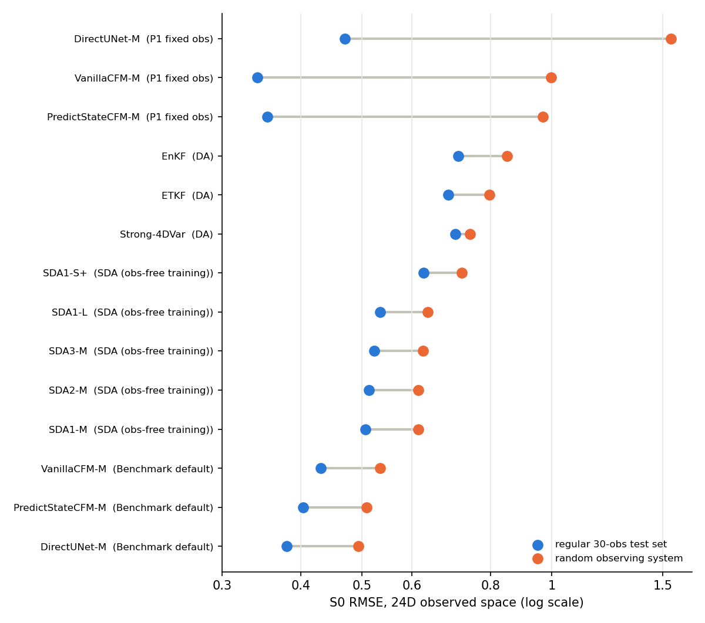

# L96 benchmark under the benchmark default -- regular and random observing systems

Two-scale L96, 24D observed space (8 slow + 16 fast), 200 shared test windows, S0 (true parameters) and S1 (biased DA parameters / corrupted forcing). Every cell is the mean over the 200 windows of the per-window RMSE (physical units); `±` is the sd across training seeds where a row has several.

## Protocol

- **Training (benchmark default, `config/l96_benchmark_default.yaml`)**: P1 recipe (monai, `normalize`, cosine annealing, 400 epochs, lr 1e-3, clip 10, batch 16) with a random observing system redrawn every batch with fresh noise -- 10-300 stratified obs times (step 0 always observed), 4-16 observed fast channels per window (subset per obs time), slow channels always. Validation windows re-observed once with a fixed seed from the same distribution (checkpoint = `stage1_best` by that val loss). 3 seeds.
- **P1 fixed obs**: the P1 checkpoints -- regular 30-obs grid, noise frozen per window across epochs.
- **Flow sampling (VanillaCFM, PredictStateCFM)**: 30 members, 20 early-fine Euler steps tau_k = 1-(1-k/20)^0.5 (the models' default grid since 2026-09-24; earlier renders of this report used 10 uniform steps, `ens30_no10`). See `docs/results/l96_cfm_tau_consistency_l96b.md`.
- **SDA**: the P1 checkpoints unchanged -- the prior and its validation loss never see observations, so the obs protocol does not apply to training. Guided sampling: 30 members, 10 steps, guidance weight 20 (tuned on the regular grid), r_var 0.5, with the NaN-channel guidance fix (#244).
- **DA**: ETKF / EnKF (30 members, inflation S0 1.5 / S1 2.0), Strong-4DVar; per-window `fast_weights` in the forward model; DA window 500.
- **Regular test set**: the P1 cache, 30 regular obs times, all 24 channels.
- **Random test set** (canonical, `l96_testset_rlayout_n10-100_k4-16_w200_d1.pt`, sha256 `48688eebf8f4...`): the same 200 windows re-observed with the exact layouts the DA baselines assimilated (`eval_da_random_layout_l96.py`): n_obs uniform in 10-100 at stratified times with step 0 observed and at least one obs per DA window, 4-16 observed fast channels per window. Truth, forcings and parameters are bitwise the P1 cache's.
- **Consistency**: before rendering, every learned result was checked to name its test set and to carry that set's truth window for window, and both DA runs to match the canonical layouts (`scripts/check_l96_testset_consistency.py`). All passed.
- **Metrics**: flows are scored on the 30-member ensemble mean (RMSE) plus ensemble CRPS and spread/RMSE; DirectUNet is a single pass; DA stores no members, so it has no CRPS.

## Findings

1. **Learned schemes under the benchmark default beat every DA baseline on S0, on both test sets**: DirectUNet-M 0.380 vs ETKF 0.685 (regular), 0.493 vs Strong-4DVar 0.742 (random).
2. **Model error (S1)**: every learned scheme is flat (S1/S0 0.98-1.00), while the DA baselines degrade 2.04-2.16x -- their forward model carries the bias.
3. **Family ranking under the benchmark default**: DirectUNet-M 0.380 ± 0.004 < PredictStateCFM-M 0.403 ± 0.005 < VanillaCFM-M 0.430 ± 0.006 (regular S0; the same order on the random set). The P1 ranking, where the flows led, does not survive fair training: P1's DirectUNet was overfitting frozen per-window obs noise.
4. **P1 fixed-obs checkpoints do not transfer**: best on the regular grid for the flows, but DirectUNet-M x3.3, PredictStateCFM-M x2.7, VanillaCFM-M x2.9 on the random set, against x1.24-1.30 for the benchmark-default models.
5. **SDA needs no retraining to be robust** (random/regular ~1.2): best on the random set SDA1-M 0.614, between the benchmark-default models and DA on RMSE, far ahead of DA under model error, and M is the right size (L is no better).
6. **DA is the least sensitive to the observing system** (random/regular ETKF 1.16, EnKF 1.19, Strong-4DVar 1.06): its weakness is model error, not the observing system.

## RMSE

| group | scheme | seeds | regular S0 | regular S1 | random S0 | random S1 | random/regular (S0) | S1/S0 (regular) |
|---|---|---|---|---|---|---|---|---|
| DA | ETKF | — | 0.685 | 1.479 | 0.796 | 1.417 | 1.16 | 2.16 |
| DA | EnKF | — | 0.711 | 1.514 | 0.850 | 1.428 | 1.19 | 2.13 |
| DA | Strong-4DVar | — | 0.703 | 1.436 | 0.742 | 1.444 | 1.06 | 2.04 |
| Benchmark default | DirectUNet-M | 3 | 0.380 ± 0.004 | 0.379 ± 0.004 | 0.493 ± 0.002 | 0.490 ± 0.003 | 1.30 | 1.00 |
| Benchmark default | PredictStateCFM-M | 3 | 0.403 ± 0.005 | 0.400 ± 0.006 | 0.509 ± 0.006 | 0.513 ± 0.005 | 1.26 | 0.99 |
| Benchmark default | VanillaCFM-M | 3 | 0.430 ± 0.006 | 0.427 ± 0.005 | 0.535 ± 0.001 | 0.544 ± 0.003 | 1.24 | 0.99 |
| P1 fixed obs | DirectUNet-M | 1 | 0.470 | 0.471 | 1.547 | 1.513 | 3.29 | 1.00 |
| P1 fixed obs | PredictStateCFM-M | 1 | 0.354 | 0.350 | 0.968 | 0.949 | 2.74 | 0.99 |
| P1 fixed obs | VanillaCFM-M | 1 | 0.341 | 0.336 | 0.998 | 0.986 | 2.92 | 0.98 |
| SDA (obs-free training) | SDA1-S+ | 1 | 0.626 | 0.625 | 0.720 | 0.725 | 1.15 | 1.00 |
| SDA (obs-free training) | SDA1-M | 1 | 0.506 | 0.505 | 0.614 | 0.625 | 1.21 | 1.00 |
| SDA (obs-free training) | SDA1-L | 1 | 0.534 | 0.533 | 0.636 | 0.648 | 1.19 | 1.00 |
| SDA (obs-free training) | SDA2-M | 1 | 0.513 | 0.513 | 0.615 | 0.624 | 1.20 | 1.00 |
| SDA (obs-free training) | SDA3-M | 1 | 0.523 | 0.523 | 0.625 | 0.634 | 1.19 | 1.00 |

## Probabilistic scores (flows and SDA, S0)

| group | scheme | CRPS regular | CRPS random | spread/RMSE regular | spread/RMSE random |
|---|---|---|---|---|---|
| Benchmark default | PredictStateCFM-M | 0.183 ± 0.002 | 0.228 ± 0.003 | 0.696 | 0.677 |
| Benchmark default | VanillaCFM-M | 0.196 ± 0.005 | 0.239 ± 0.000 | 0.790 | 0.751 |
| P1 fixed obs | PredictStateCFM-M | 0.166 | 0.550 | 0.487 | 0.303 |
| P1 fixed obs | VanillaCFM-M | 0.153 | 0.578 | 0.614 | 0.312 |
| SDA (obs-free training) | SDA1-S+ | 0.318 | 0.369 | 0.520 | 0.456 |
| SDA (obs-free training) | SDA1-M | 0.258 | 0.315 | 0.416 | 0.385 |
| SDA (obs-free training) | SDA1-L | 0.273 | 0.327 | 0.399 | 0.384 |
| SDA (obs-free training) | SDA2-M | 0.242 | 0.290 | 0.550 | 0.519 |
| SDA (obs-free training) | SDA3-M | 0.251 | 0.298 | 0.532 | 0.510 |

## Deterministic variance ratio (S0, predicted/true variance)

| group | scheme | regular | random |
|---|---|---|---|
| Benchmark default | DirectUNet-M | 0.950 | 0.879 |
| P1 fixed obs | DirectUNet-M | 0.978 | 0.820 |

## Caveats

- P1 and SDA rows are single runs; benchmark-default rows are 3 seeds.
- The SDA guidance weight (20) was tuned on the regular grid, not re-tuned for the random set.
- The random test set is one draw of one observing-system distribution (10-100 obs, 4-16 fast channels); rankings between learned families depend on the regime (on a sparser 30-obs / 8-fast set VanillaCFM-M led DirectUNet-M).
- DA rows reuse existing runs on the identical inputs: regular S0 ETKF/EnKF at inflation 1.5, regular S1 and Strong-4DVar from the corrected inflation-2.0 run; random-set rows from the random-layout DA runs (#243).
