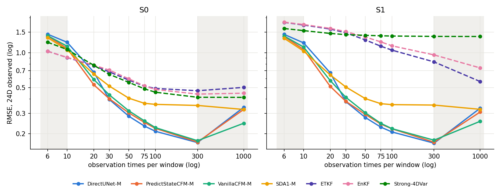
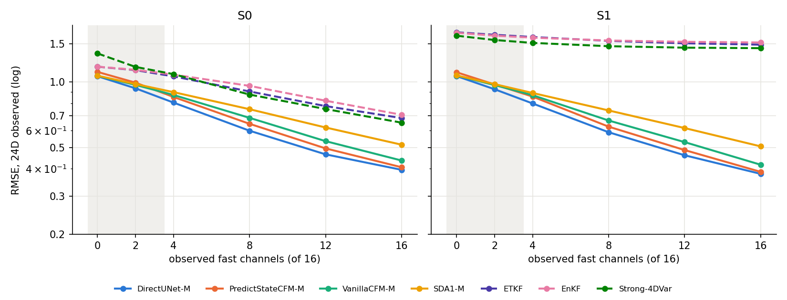

# L96 benchmark -- extended results (training budget, observing-system dependence, SDA, hybrid)

Follow-up to `l96_benchmark_default.md`, same inputs: the 200 P1 test windows on the regular 30-obs set and on the canonical random observing system (the exact obs the DA baselines assimilated). S0 = true parameters, S1 = biased DA model / corrupted forcing. Every learned result passed the test-set consistency check (dataset + truth window for window); DA runs matched the canonical layouts.

**Protocol changes since the benchmark-default report**: DA CRPS on the *analysis* ensemble (the old `_ESAccumulator` scored the forecast ensemble); SDA guidance weight 25 (validation-tuned; P1 used 20); SDA3 retrained with its bias conditioning actually active (SDA3-fix); a DirectUNet -> SDA hybrid tuned on validation windows; 1200-epoch arms of the benchmark default.

**Flow sampler grid**: every VanillaCFM / PredictStateCFM number here was sampled on the *uniform* Euler grid (10 steps), i.e. before #253 made the early-fine grid the default; the run scripts pin `--step-power 1` to reproduce them. #253 reports ~2-4% better CRPS with the new default, so the flow rows are, if anything, slightly pessimistic. SDA and the hybrid use the SDA sampler and are unaffected.

## Findings

1. **Best scheme: the DirectUNet-M -> SDA2-M hybrid** (validation-selected tau0 0.1, gw 2), with the 1200-epoch DirectUNet-M as its mean: regular S0 0.310, random S0 0.382, CRPS 0.144 / 0.174 -- best RMSE and CRPS on both test sets (400-epoch mean: 0.329 / 0.406). A better mean carries straight through the SDA correction. Best DA on regular S0: ETKF 0.687.
2. **The 400-epoch budget of the benchmark default is too short.** At 1200 epochs every family gains 9-19% (regular S0: DirectUNet 0.380 -> 0.340, PredictStateCFM 0.409 -> 0.345, VanillaCFM 0.434 -> 0.354), and the family gaps largely close; ~85% of the 3000-window DirectUNet gain is training length, not data.
3. **Observation-count crossover at S0**: DA (ETKF) is best at <= 10 obs per window; from ~20 obs every learned scheme beats every DA baseline, and the gap grows with density. Under model error (S1) the learned schemes win at every density. PredictStateCFM / SDA are best when sparse, DirectUNet when dense; SDA and DirectUNet are complementary, which is why the hybrid works.
4. **Fast channels**: no crossover -- learned beat DA at every k, including slow-only (k 0, below training range). The learned slow-variable error is flat (~0.2-0.3); all the k-dependence is in the fast variables. Under model error, more fast obs make DA's *slow* variables worse (biased slow-fast coupling).
5. **Beyond the training range**: learned models are weak at 6 obs and degrade with 1000 obs (DirectUNet 0.17 -> 0.34 from 300 to 1000); VanillaCFM degrades least. Noise shifts are handled gracefully.
6. **SDA3 conditioning was inert by construction** (training DA params equalled the true ones); with the bias active (SDA3-fix) it is still no better than SDA1/SDA2 -- conditioning is inert. SDA2 is the better hybrid prior.
7. **Marginal value of observations**: the Strong-4D-Var collapse under model error survives the fast_weights fix (6.4-7.0x); the filters' 1.9x does not (1.1x at the original setting, 1.6-1.7x at the benchmark inflation).

## 1. Main table

Per-window RMSE on the 24D observed space, **mean ± sd across the 200 windows** (seeds pooled per window). `seeds` = finished seeds / planned. Deterministic schemes have no CRPS.

| group | scheme | seeds | regular S0 | regular S1 | random S0 | random S1 | random/regular S0 | seed sd (reg S0) |
|---|---|---|---|---|---|---|---|---|
| DA | ETKF | — | 0.687 ± 0.131 | 1.478 ± 0.240 | 0.798 ± 0.220 | 1.418 ± 0.307 | 1.16 | — |
| DA | EnKF | — | 0.711 ± 0.130 | 1.514 ± 0.247 | 0.850 ± 0.227 | 1.428 ± 0.282 | 1.20 | — |
| DA | Strong-4DVar | — | 0.703 ± 0.199 | 1.436 ± 0.232 | 0.742 ± 0.310 | 1.444 ± 0.246 | 1.06 | — |
| Benchmark default, 400 ep | DirectUNet-M | 3/3 | 0.380 ± 0.064 | 0.379 ± 0.064 | 0.493 ± 0.314 | 0.490 ± 0.271 | 1.30 | 0.004 |
| Benchmark default, 400 ep | PredictStateCFM-M | 3/3 | 0.409 ± 0.082 | 0.406 ± 0.080 | 0.520 ± 0.275 | 0.526 ± 0.250 | 1.27 | 0.007 |
| Benchmark default, 400 ep | VanillaCFM-M | 3/3 | 0.434 ± 0.074 | 0.431 ± 0.072 | 0.543 ± 0.289 | 0.553 ± 0.263 | 1.25 | 0.006 |
| Benchmark default, 1200 ep | DirectUNet-M | 3/3 | 0.340 ± 0.062 | 0.339 ± 0.063 | 0.450 ± 0.315 | 0.444 ± 0.269 | 1.32 | 0.002 |
| Benchmark default, 1200 ep | PredictStateCFM-M | 3/3 | 0.345 ± 0.079 | 0.342 ± 0.080 | 0.452 ± 0.264 | 0.456 ± 0.238 | 1.31 | 0.002 |
| Benchmark default, 1200 ep | VanillaCFM-M | 3/3 | 0.354 ± 0.080 | 0.352 ± 0.080 | 0.471 ± 0.285 | 0.477 ± 0.257 | 1.33 | 0.002 |
| Benchmark default, 3000 windows | DirectUNet-M | 1/1 | 0.334 ± 0.061 | 0.334 ± 0.061 | 0.447 ± 0.316 | 0.440 ± 0.270 | 1.34 | — |
| SDA, gw 25 | SDA1-M | 3/3 | 0.501 ± 0.083 | 0.500 ± 0.083 | 0.612 ± 0.233 | 0.624 ± 0.229 | 1.22 | 0.001 |
| SDA, gw 25 | SDA2-M | 3/3 | 0.500 ± 0.086 | 0.500 ± 0.086 | 0.605 ± 0.230 | 0.616 ± 0.224 | 1.21 | 0.004 |
| SDA, gw 25 | SDA3-fix-M | 3/3 | 0.501 ± 0.083 | 0.501 ± 0.083 | 0.610 ± 0.234 | 0.620 ± 0.229 | 1.22 | 0.012 |
| SDA, gw 20 | SDA1-S+ | 1/1 | 0.626 ± 0.113 | 0.625 ± 0.112 | 0.720 ± 0.257 | 0.725 ± 0.241 | 1.15 | — |
| SDA, gw 20 | SDA1-L | 1/1 | 0.534 ± 0.095 | 0.533 ± 0.095 | 0.636 ± 0.233 | 0.648 ± 0.230 | 1.19 | — |
| Hybrid (tau0 0.1, gw 2) | DirectUNet-M(400 ep) -> SDA2-M | 3/3 | 0.329 ± 0.063 | 0.327 ± 0.063 | 0.406 ± 0.224 | 0.411 ± 0.207 | 1.23 | 0.002 |
| Hybrid (tau0 0.1, gw 2) | DirectUNet-M(400 ep) -> SDA1-M | 3/3 | 0.333 ± 0.063 | 0.331 ± 0.063 | 0.422 ± 0.251 | 0.423 ± 0.225 | 1.27 | 0.002 |
| Hybrid (tau0 0.1, gw 2) | DirectUNet-M(1200 ep) -> SDA2-M | 3/3 | 0.310 ± 0.059 | 0.308 ± 0.061 | 0.382 ± 0.218 | 0.384 ± 0.197 | 1.23 | 0.000 |
| P1 fixed obs (reference) | DirectUNet-M | 1/1 | 0.470 ± 0.073 | 0.471 ± 0.072 | 1.547 ± 0.254 | 1.513 ± 0.244 | 3.29 | — |
| P1 fixed obs (reference) | PredictStateCFM-M | 1/1 | 0.358 ± 0.072 | 0.355 ± 0.074 | 0.998 ± 0.324 | 0.977 ± 0.290 | 2.78 | — |
| P1 fixed obs (reference) | VanillaCFM-M | 1/1 | 0.344 ± 0.073 | 0.339 ± 0.072 | 1.028 ± 0.339 | 1.016 ± 0.311 | 2.98 | — |

### CRPS / spread-over-RMSE (S0; S1 in parentheses)

| group | scheme | CRPS regular | CRPS random | spread/RMSE regular | spread/RMSE random |
|---|---|---|---|---|---|
| DA | ETKF | 0.331 (0.854) | 0.396 (0.786) | 0.98 (0.37) | 0.96 (0.58) |
| DA | EnKF | 0.336 (0.906) | 0.421 (0.798) | 0.97 (0.33) | 1.08 (0.54) |
| Benchmark default, 400 ep | PredictStateCFM-M | 0.191 (0.189) | 0.243 (0.247) | 0.53 (0.54) | 0.52 (0.50) |
| Benchmark default, 400 ep | VanillaCFM-M | 0.201 (0.200) | 0.251 (0.257) | 0.62 (0.62) | 0.59 (0.57) |
| Benchmark default, 1200 ep | PredictStateCFM-M | 0.157 (0.156) | 0.208 (0.212) | 0.46 (0.46) | 0.45 (0.43) |
| Benchmark default, 1200 ep | VanillaCFM-M | 0.158 (0.157) | 0.218 (0.222) | 0.53 (0.54) | 0.50 (0.48) |
| SDA, gw 25 | SDA1-M | 0.255 (0.254) | 0.312 (0.320) | 0.42 (0.43) | 0.39 (0.37) |
| SDA, gw 25 | SDA2-M | 0.239 (0.239) | 0.287 (0.291) | 0.54 (0.55) | 0.51 (0.51) |
| SDA, gw 25 | SDA3-fix-M | 0.249 (0.249) | 0.303 (0.309) | 0.46 (0.46) | 0.42 (0.41) |
| SDA, gw 20 | SDA1-S+ | 0.318 (0.317) | 0.369 (0.371) | 0.52 (0.52) | 0.46 (0.45) |
| SDA, gw 20 | SDA1-L | 0.273 (0.273) | 0.327 (0.335) | 0.40 (0.40) | 0.38 (0.37) |
| Hybrid (tau0 0.1, gw 2) | DirectUNet-M(400 ep) -> SDA2-M | 0.153 (0.152) | 0.184 (0.187) | 0.54 (0.54) | 0.50 (0.48) |
| Hybrid (tau0 0.1, gw 2) | DirectUNet-M(400 ep) -> SDA1-M | 0.157 (0.156) | 0.207 (0.206) | 0.53 (0.53) | 0.44 (0.43) |
| Hybrid (tau0 0.1, gw 2) | DirectUNet-M(1200 ep) -> SDA2-M | 0.144 (0.143) | 0.174 (0.174) | 0.56 (0.57) | 0.51 (0.50) |
| P1 fixed obs (reference) | PredictStateCFM-M | 0.173 (0.173) | 0.581 (0.565) | 0.40 (0.40) | 0.25 (0.24) |
| P1 fixed obs (reference) | VanillaCFM-M | 0.157 (0.155) | 0.612 (0.604) | 0.53 (0.54) | 0.26 (0.26) |

## 2. Training budget (DirectUNet-M, seed 1)

Steps per epoch = windows / 16. At equal gradient steps the 1000 x 1200 and 3000 x 400 runs are at the same point of their cosine schedules, so their curves compare step for step.

| run | gradient steps | regular S0 | random S0 | final val_loss | val_loss @ 25k / 50k steps |
|---|---|---|---|---|---|
| 1000 windows x 400 ep | 25,000 | 0.383 | 0.495 | 0.0454 | — / — |
| 1000 windows x 1200 ep | 75,000 | 0.342 | 0.452 | 0.0374 | 0.0510 / 0.0424 |
| 3000 windows x 400 ep | 75,000 | 0.334 | 0.447 | 0.0359 | 0.0500 / 0.0397 |

## 3. Performance vs number of observation times per window

Identical obs for every scheme: the #243 factorial layouts (20 windows x 3 draws; learned = 3-seed mean, SDA1-M seed 1 at gw 25) and the out-of-range probes (`*`: 6, 300, 1000 obs; learned seed 1). All 16 observed fast channels. Shaded: outside the training range (10-300).

**S0** (k = 16)

| x | DirectUNet-M | PredictStateCFM-M | VanillaCFM-M | SDA1-M | ETKF | EnKF | Strong-4DVar |
|---|---|---|---|---|---|---|---|
| 6* | 1.442 | 1.411 | 1.423 | 1.348 | 1.029 | 1.028 | 1.230 |
| 10 | 1.228 | 1.099 | 1.155 | 1.054 | 0.908 | 0.910 | 1.064 |
| 20 | 0.681 | 0.528 | 0.593 | 0.655 | 0.773 | 0.780 | 0.779 |
| 30 | 0.396 | 0.406 | 0.436 | 0.516 | 0.683 | 0.708 | 0.651 |
| 50 | 0.284 | 0.308 | 0.316 | 0.405 | 0.580 | 0.595 | 0.555 |
| 75 | 0.234 | 0.254 | 0.258 | 0.366 | 0.515 | 0.518 | 0.488 |
| 100 | 0.210 | 0.226 | 0.225 | 0.359 | 0.492 | 0.482 | 0.456 |
| 300* | 0.168 | 0.173 | 0.173 | 0.351 | 0.470 | 0.440 | 0.413 |
| 1000* | 0.339 | 0.318 | 0.246 | 0.324 | 0.502 | 0.448 | 0.412 |

**S1** (k = 16)

| x | DirectUNet-M | PredictStateCFM-M | VanillaCFM-M | SDA1-M | ETKF | EnKF | Strong-4DVar |
|---|---|---|---|---|---|---|---|
| 6* | 1.438 | 1.399 | 1.416 | 1.331 | 1.824 | 1.832 | 1.614 |
| 10 | 1.214 | 1.077 | 1.139 | 1.031 | 1.729 | 1.745 | 1.548 |
| 20 | 0.670 | 0.511 | 0.582 | 0.643 | 1.597 | 1.618 | 1.464 |
| 30 | 0.379 | 0.387 | 0.417 | 0.507 | 1.484 | 1.518 | 1.430 |
| 50 | 0.276 | 0.299 | 0.304 | 0.402 | 1.287 | 1.363 | 1.410 |
| 75 | 0.228 | 0.246 | 0.246 | 0.364 | 1.136 | 1.238 | 1.397 |
| 100 | 0.208 | 0.224 | 0.221 | 0.357 | 1.052 | 1.145 | 1.391 |
| 300* | 0.166 | 0.172 | 0.174 | 0.354 | 0.833 | 0.956 | 1.380 |
| 1000* | 0.332 | 0.302 | 0.255 | 0.325 | 0.564 | 0.739 | 1.378 |

Averaged over k in {4, 8, 12, 16} (factorial only):

**S0**

| x | DirectUNet-M | PredictStateCFM-M | VanillaCFM-M | SDA1-M | ETKF | EnKF | Strong-4DVar |
|---|---|---|---|---|---|---|---|
| 10 | 1.299 | 1.207 | 1.255 | 1.130 | 1.010 | 1.014 | 1.200 |
| 20 | 0.825 | 0.718 | 0.773 | 0.806 | 0.910 | 0.941 | 0.974 |
| 30 | 0.566 | 0.600 | 0.632 | 0.696 | 0.856 | 0.892 | 0.841 |
| 50 | 0.426 | 0.481 | 0.505 | 0.582 | 0.784 | 0.830 | 0.696 |
| 75 | 0.339 | 0.391 | 0.411 | 0.507 | 0.726 | 0.790 | 0.615 |
| 100 | 0.295 | 0.342 | 0.359 | 0.468 | 0.698 | 0.786 | 0.561 |

**S1**

| x | DirectUNet-M | PredictStateCFM-M | VanillaCFM-M | SDA1-M | ETKF | EnKF | Strong-4DVar |
|---|---|---|---|---|---|---|---|
| 10 | 1.288 | 1.192 | 1.243 | 1.116 | 1.708 | 1.720 | 1.578 |
| 20 | 0.821 | 0.710 | 0.767 | 0.799 | 1.600 | 1.614 | 1.500 |
| 30 | 0.557 | 0.589 | 0.621 | 0.688 | 1.535 | 1.549 | 1.460 |
| 50 | 0.414 | 0.465 | 0.490 | 0.576 | 1.411 | 1.430 | 1.428 |
| 75 | 0.331 | 0.379 | 0.398 | 0.502 | 1.304 | 1.315 | 1.410 |
| 100 | 0.288 | 0.335 | 0.350 | 0.464 | 1.246 | 1.247 | 1.400 |

## 4. Performance vs number of observed fast channels

30 obs per window; k = 0 and 2 are probes (`*`, below the training minimum of 4, learned seed 1).

**S0** (30 obs)

| x | DirectUNet-M | PredictStateCFM-M | VanillaCFM-M | SDA1-M | ETKF | EnKF | Strong-4DVar |
|---|---|---|---|---|---|---|---|
| 0* | 1.063 | 1.113 | 1.066 | 1.069 | 1.175 | 1.176 | 1.353 |
| 2* | 0.935 | 0.993 | 0.970 | 0.978 | 1.134 | 1.137 | 1.173 |
| 4 | 0.805 | 0.854 | 0.872 | 0.899 | 1.061 | 1.081 | 1.087 |
| 8 | 0.598 | 0.643 | 0.685 | 0.750 | 0.905 | 0.960 | 0.876 |
| 12 | 0.466 | 0.496 | 0.536 | 0.619 | 0.776 | 0.821 | 0.752 |
| 16 | 0.396 | 0.406 | 0.436 | 0.516 | 0.683 | 0.708 | 0.651 |

**S1** (30 obs)

| x | DirectUNet-M | PredictStateCFM-M | VanillaCFM-M | SDA1-M | ETKF | EnKF | Strong-4DVar |
|---|---|---|---|---|---|---|---|
| 0* | 1.065 | 1.108 | 1.070 | 1.072 | 1.690 | 1.682 | 1.631 |
| 2* | 0.926 | 0.974 | 0.969 | 0.978 | 1.647 | 1.632 | 1.559 |
| 4 | 0.797 | 0.857 | 0.870 | 0.891 | 1.609 | 1.597 | 1.511 |
| 8 | 0.588 | 0.624 | 0.666 | 0.741 | 1.544 | 1.550 | 1.460 |
| 12 | 0.461 | 0.487 | 0.530 | 0.615 | 1.505 | 1.529 | 1.438 |
| 16 | 0.379 | 0.387 | 0.417 | 0.507 | 1.484 | 1.518 | 1.430 |

### Canonical random test set, windows binned by their own obs count / fast channels

Learned: benchmark default 400 ep, 3-seed mean; SDA1-M gw 25, 3 seeds; hybrid DirectUNet-M(400) -> SDA2-M.

**S0, by n_obs**

| n_obs | windows | DirectUNet-M | PredictStateCFM-M | VanillaCFM-M | SDA1-M | Hybrid DU->SDA2 | ETKF | EnKF | Strong-4DVar |
|---|---|---|---|---|---|---|---|---|---|
| 10-24 | 30 | 1.104 | 0.994 | 1.052 | 0.989 | 0.792 | 1.032 | 1.051 | 1.178 |
| 25-39 | 29 | 0.558 | 0.598 | 0.625 | 0.695 | 0.480 | 0.874 | 0.893 | 0.845 |
| 40-54 | 33 | 0.433 | 0.490 | 0.510 | 0.586 | 0.382 | 0.791 | 0.841 | 0.734 |
| 55-69 | 33 | 0.360 | 0.413 | 0.425 | 0.516 | 0.316 | 0.733 | 0.781 | 0.637 |
| 70-84 | 36 | 0.331 | 0.381 | 0.394 | 0.497 | 0.293 | 0.726 | 0.802 | 0.599 |
| 85-100 | 39 | 0.288 | 0.343 | 0.357 | 0.470 | 0.255 | 0.690 | 0.775 | 0.561 |

**S0, by k**

| k | windows | DirectUNet-M | PredictStateCFM-M | VanillaCFM-M | SDA1-M | Hybrid DU->SDA2 | ETKF | EnKF | Strong-4DVar |
|---|---|---|---|---|---|---|---|---|---|
| 4-6 | 53 | 0.621 | 0.670 | 0.702 | 0.759 | 0.529 | 0.977 | 1.045 | 0.889 |
| 7-9 | 36 | 0.499 | 0.538 | 0.561 | 0.629 | 0.415 | 0.832 | 0.928 | 0.745 |
| 10-12 | 50 | 0.490 | 0.507 | 0.533 | 0.611 | 0.395 | 0.785 | 0.835 | 0.740 |
| 13-16 | 61 | 0.381 | 0.390 | 0.404 | 0.475 | 0.303 | 0.634 | 0.648 | 0.615 |

**S1, by n_obs**

| n_obs | windows | DirectUNet-M | PredictStateCFM-M | VanillaCFM-M | SDA1-M | Hybrid DU->SDA2 | ETKF | EnKF | Strong-4DVar |
|---|---|---|---|---|---|---|---|---|---|
| 10-24 | 27 | 0.994 | 0.900 | 0.956 | 0.929 | 0.730 | 1.651 | 1.661 | 1.547 |
| 25-39 | 33 | 0.578 | 0.633 | 0.665 | 0.740 | 0.506 | 1.563 | 1.569 | 1.483 |
| 40-54 | 33 | 0.457 | 0.514 | 0.538 | 0.613 | 0.400 | 1.412 | 1.425 | 1.406 |
| 55-69 | 35 | 0.401 | 0.462 | 0.483 | 0.571 | 0.354 | 1.389 | 1.407 | 1.447 |
| 70-84 | 38 | 0.331 | 0.386 | 0.403 | 0.501 | 0.291 | 1.312 | 1.315 | 1.412 |
| 85-100 | 34 | 0.305 | 0.359 | 0.377 | 0.472 | 0.271 | 1.248 | 1.255 | 1.394 |

**S1, by k**

| k | windows | DirectUNet-M | PredictStateCFM-M | VanillaCFM-M | SDA1-M | Hybrid DU->SDA2 | ETKF | EnKF | Strong-4DVar |
|---|---|---|---|---|---|---|---|---|---|
| 4-6 | 63 | 0.643 | 0.705 | 0.740 | 0.805 | 0.559 | 1.627 | 1.568 | 1.545 |
| 7-9 | 46 | 0.508 | 0.545 | 0.580 | 0.644 | 0.415 | 1.402 | 1.403 | 1.402 |
| 10-12 | 32 | 0.382 | 0.412 | 0.435 | 0.518 | 0.320 | 1.304 | 1.354 | 1.406 |
| 13-16 | 59 | 0.371 | 0.382 | 0.395 | 0.472 | 0.301 | 1.270 | 1.338 | 1.389 |

## 5. Out-of-range probes

Training range: n_obs 10-300, k 4-16, R 0.5. 20 windows x 3 draws; learned seed 1, SDA1-M gw 25; DA told the true R. Reference in-range cell: 30 obs, k 16.

| probe | DirectUNet-M | PredictStateCFM-M | VanillaCFM-M | SDA1-M | ETKF | Strong-4DVar |
|---|---|---|---|---|---|---|
| 6 obs | 1.44 / 1.44 | 1.41 / 1.40 | 1.42 / 1.42 | 1.35 / 1.33 | 1.03 / 1.82 | 1.23 / 1.61 |
| slow-only (k 0) | 1.06 / 1.06 | 1.11 / 1.11 | 1.07 / 1.07 | 1.07 / 1.07 | 1.18 / 1.69 | 1.35 / 1.63 |
| k 2 | 0.94 / 0.93 | 0.99 / 0.97 | 0.97 / 0.97 | 0.98 / 0.98 | 1.13 / 1.65 | 1.17 / 1.56 |
| 300 obs | 0.17 / 0.17 | 0.17 / 0.17 | 0.17 / 0.17 | 0.35 / 0.35 | 0.47 / 0.83 | 0.41 / 1.38 |
| 1000 obs | 0.34 / 0.33 | 0.32 / 0.30 | 0.25 / 0.26 | 0.32 / 0.33 | 0.50 / 0.56 | 0.41 / 1.38 |
| noise R 0.25 | 0.36 / 0.35 | 0.37 / 0.36 | 0.41 / 0.39 | 0.46 / 0.45 | 0.59 / 1.48 | 0.58 / 1.42 |
| noise R 1.0 | 0.48 / 0.47 | 0.46 / 0.44 | 0.49 / 0.47 | 0.60 / 0.60 | 0.84 / 1.50 | 0.74 / 1.45 |

Cells are S0 / S1 RMSE.

## 6. Evaluation-time settings tuned on validation windows

50 validation windows per case with seeds disjoint from train/val/test (`scripts/make_l96_validation_sets.py`), regular and random-layout versions. Mean of S0 and S1 RMSE.

**SDA guidance weight** (P1 used 20)

| regime | model | gw 10 | gw 15 | gw 20 | gw 25 | gw 30 | gw 40 |
|---|---|---|---|---|---|---|---|
| regular | B4_sda1_monaiM_l96 | 0.708 | 0.558 | 0.521 | 0.514 | 0.521 | 0.557 |
| regular | A3_sda2_monaiM_l96 | 0.663 | 0.565 | 0.530 | 0.519 | 0.521 | 0.546 |
| regular | A3_sda3_monaiM_l96 | 0.683 | 0.577 | 0.539 | 0.527 | 0.528 | 0.549 |
| rlayout | B4_sda1_monaiM_l96 | 0.771 | 0.658 | 0.628 | 0.621 | 0.627 | 0.656 |
| rlayout | A3_sda2_monaiM_l96 | 0.735 | 0.654 | 0.627 | 0.619 | 0.621 | 0.641 |
| rlayout | A3_sda3_monaiM_l96 | 0.753 | 0.666 | 0.637 | 0.628 | 0.629 | 0.647 |

**DirectUNet-M -> SDA hybrid** (rows tau0, columns guidance weight); `DU alone` for reference

regular: DirectUNet-M(400 ep) alone 0.393

| prior | tau0 | gw 0.5 | gw 1 | gw 2 | gw 5 | gw 10 | gw 20 |
|---|---|---|---|---|---|---|---|
| B4_sda1_monaiM_l96 | 0.1 | 0.355 | 0.348 | 0.343 | — | — | — |
| B4_sda1_monaiM_l96 | 0.2 | 0.352 | 0.348 | 0.347 | — | — | — |
| B4_sda1_monaiM_l96 | 0.3 | 0.356 | 0.353 | 0.353 | 0.368 | 0.372 | 0.386 |
| B4_sda1_monaiM_l96 | 0.5 | — | — | 0.363 | 0.370 | 0.375 | 0.386 |
| B4_sda1_monaiM_l96 | 0.7 | — | — | 0.372 | 0.375 | 0.379 | 0.391 |
| A3_sda2_monaiM_l96 | 0.1 | 0.346 | 0.341 | 0.338 | — | — | — |
| A3_sda2_monaiM_l96 | 0.2 | 0.346 | 0.343 | 0.343 | — | — | — |
| A3_sda2_monaiM_l96 | 0.3 | 0.351 | 0.349 | 0.349 | 0.363 | 0.367 | 0.381 |
| A3_sda2_monaiM_l96 | 0.5 | — | — | 0.361 | 0.367 | 0.371 | 0.384 |
| A3_sda2_monaiM_l96 | 0.7 | — | — | 0.371 | 0.374 | 0.377 | 0.390 |

With the 1200-epoch DirectUNet-M (alone 0.352), SDA2-M prior. **tau0 0.05 is not a warm start**: the sampler snaps tau0 to its 10-step grid with `round(tau0 * N_outer)`, and 0.5 rounds to 0, so that row is plain SDA from noise at a far-too-low guidance weight (the tuned SDA weight is 25).

| tau0 | gw 1 | gw 2 | gw 5 |
|---|---|---|---|
| 0.05 | 1.629 | 1.475 | 1.033 |
| 0.1 | 0.315 | 0.317 | 0.349 |
| 0.2 | 0.315 | 0.318 | 0.345 |

rlayout: DirectUNet-M(400 ep) alone 0.507

| prior | tau0 | gw 0.5 | gw 1 | gw 2 | gw 5 | gw 10 | gw 20 |
|---|---|---|---|---|---|---|---|
| B4_sda1_monaiM_l96 | 0.1 | 0.441 | 0.433 | 0.425 | — | — | — |
| B4_sda1_monaiM_l96 | 0.2 | 0.440 | 0.435 | 0.432 | — | — | — |
| B4_sda1_monaiM_l96 | 0.3 | 0.447 | 0.444 | 0.443 | 0.460 | 0.474 | 0.487 |
| B4_sda1_monaiM_l96 | 0.5 | — | — | 0.461 | 0.470 | 0.483 | 0.497 |
| B4_sda1_monaiM_l96 | 0.7 | — | — | 0.478 | 0.481 | 0.490 | 0.505 |
| A3_sda2_monaiM_l96 | 0.1 | 0.422 | 0.416 | 0.413 | — | — | — |
| A3_sda2_monaiM_l96 | 0.2 | 0.427 | 0.423 | 0.423 | — | — | — |
| A3_sda2_monaiM_l96 | 0.3 | 0.437 | 0.435 | 0.435 | 0.453 | 0.465 | 0.478 |
| A3_sda2_monaiM_l96 | 0.5 | — | — | 0.457 | 0.467 | 0.477 | 0.491 |
| A3_sda2_monaiM_l96 | 0.7 | — | — | 0.476 | 0.479 | 0.487 | 0.502 |

With the 1200-epoch DirectUNet-M (alone 0.459), SDA2-M prior. **tau0 0.05 is not a warm start**: the sampler snaps tau0 to its 10-step grid with `round(tau0 * N_outer)`, and 0.5 rounds to 0, so that row is plain SDA from noise at a far-too-low guidance weight (the tuned SDA weight is 25).

| tau0 | gw 1 | gw 2 | gw 5 |
|---|---|---|---|
| 0.05 | 1.628 | 1.476 | 1.061 |
| 0.1 | 0.384 | 0.384 | 0.418 |
| 0.2 | 0.388 | 0.390 | 0.422 |

**Flow calibration** (benchmark default seed 1; S0 RMSE / CRPS / spread-over-RMSE)

| regime | model | 10 steps | 20 steps | 50 steps | sigma 0.75 | sigma 1.0 |
|---|---|---|---|---|---|---|
| regular | L96B_vanillacfm_monaiM_seed1 | 0.433 / 0.202 / 0.63 | 0.430 / 0.199 / 0.75 | 0.431 / 0.199 / 0.82 | 0.539 / 0.277 / 0.78 | 0.995 / 0.593 / 0.59 |
| regular | L96B_predictstatecfm_monaiM_seed1 | 0.400 / 0.187 / 0.55 | 0.401 / 0.185 / 0.64 | 0.404 / 0.186 / 0.70 | 0.532 / 0.270 / 0.88 | 0.621 / 0.340 / 1.33 |
| rlayout | L96B_vanillacfm_monaiM_seed1 | 0.550 / 0.253 / 0.59 | 0.543 / 0.244 / 0.70 | 0.541 / 0.242 / 0.78 | 0.679 / 0.350 / 0.69 | 1.050 / 0.623 / 0.56 |
| rlayout | L96B_predictstatecfm_monaiM_seed1 | 0.510 / 0.238 / 0.52 | 0.504 / 0.230 / 0.62 | 0.503 / 0.227 / 0.69 | 0.612 / 0.298 / 0.92 | 0.737 / 0.384 / 1.19 |

## 7. Marginal value of observations for DA (15 -> 30 regular obs per window)

The P1 paper's headline (6.2x for Strong-4D-Var vs 1.9x for filters) came from a run whose DA model never received the per-window `fast_weights`. Rerun with them: on the original data configuration at the original inflation (only change), and on the benchmark data at the per-case inflation. Ratio = S0 gain / S1 gain (recomputed from the RMSEs; the paper rounds its Strong-4D-Var ratio to 6.2x from the rounded percentages).

| scheme | setting | S0 15 -> 30 | S1 15 -> 30 | ratio |
|---|---|---|---|---|
| Strong-4DVar | paper (no fast_weights) | 0.970 -> 0.779 (19.7%) | 1.475 -> 1.428 (3.2%) | 6.1x |
| Strong-4DVar | original data + fast_weights, inflation 2.0 | 0.930 -> 0.738 (20.6%) | 1.479 -> 1.431 (3.2%) | 6.4x |
| Strong-4DVar | benchmark data + fast_weights, inflation S0 1.5 / S1 2.0 | 0.917 -> 0.703 (23.3%) | 1.486 -> 1.436 (3.4%) | 7.0x |
| ETKF | paper (no fast_weights) | 1.097 -> 0.881 (19.7%) | 1.637 -> 1.468 (10.3%) | 1.9x |
| ETKF | original data + fast_weights, inflation 2.0 | 0.943 -> 0.831 (11.9%) | 1.653 -> 1.471 (11.0%) | 1.1x |
| ETKF | benchmark data + fast_weights, inflation S0 1.5 / S1 2.0 | 0.834 -> 0.685 (17.9%) | 1.660 -> 1.479 (10.9%) | 1.6x |
| EnKF | paper (no fast_weights) | 1.093 -> 0.905 (17.2%) | 1.650 -> 1.502 (9.0%) | 1.9x |
| EnKF | original data + fast_weights, inflation 2.0 | 0.950 -> 0.849 (10.6%) | 1.673 -> 1.508 (9.9%) | 1.1x |
| EnKF | benchmark data + fast_weights, inflation S0 1.5 / S1 2.0 | 0.852 -> 0.711 (16.6%) | 1.679 -> 1.514 (9.8%) | 1.7x |

## Caveats

- Single-seed rows: P1 references, SDA1-S+/L, the 3000-window run, all probes and the factorial SDA columns.
- The hybrid's 400-epoch mean was tuned and evaluated with the 400-epoch DirectUNet; the 1200-epoch-mean hybrid uses the same validation-selected setting (re-checked on validation, section 6).
- Probes and factorial cells use 20 windows x 3 draws, not the 200-window test sets.
- Flow calibration was only probed (sampling-time settings); the benchmark keeps 10 integration steps.
