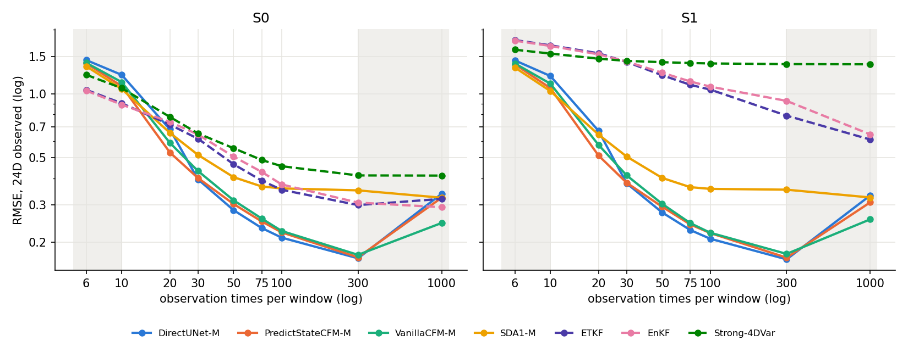
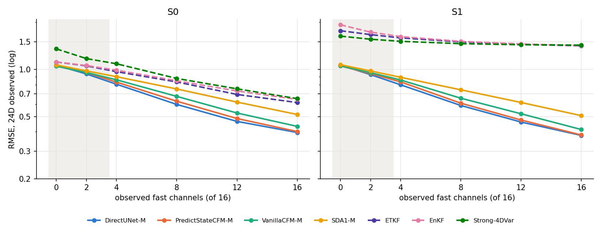

# L96 benchmark -- extended results (training budget, observing-system dependence, SDA, hybrid)

The current L96 benchmark (it supersedes the frozen 400-epoch snapshot `l96_benchmark_default.old.md`, whose protocol and rows it carries at the current settings): the 200 P1 test windows on the regular 30-obs set and on the canonical random observing system (the exact obs the DA baselines assimilated). S0 = true parameters, S1 = biased DA model / corrupted forcing. Every learned result passed the test-set consistency check (dataset + truth window for window); DA runs matched the canonical layouts.

**DA inflation (2026-09-28)**: every ETKF / EnKF row uses the per-method defaults retuned on the validation windows after the ETKF square-root fix (#291, #295): ETKF S0 1.15 / S1 2.5, EnKF S0 1.2 / S1 3.0 (`docs/results/l96_da_inflation_post291.md`); the old rows (S0 1.5 / S1 2.0, ETKF before #291) remain only in the marginal-value comparison (section 7). Strong-4DVar has no inflation and is unchanged.

**Protocol changes since the benchmark-default report** (`l96_benchmark_default.old.md`): DA CRPS on the *analysis* ensemble (the old `_ESAccumulator` scored the forecast ensemble); SDA guidance weight 25 (validation-tuned; P1 used 20); SDA3 retrained with its bias conditioning actually active (SDA3-fix); a DirectUNet -> SDA hybrid tuned on validation windows; 1200-epoch arms (the benchmark default since 2026-09-26; the 400-epoch rows are the earlier recipe, kept for the training-budget comparison).

**Flow sampler**: every VanillaCFM / PredictStateCFM row, curve and probe is scored with the benchmark protocol of #257 -- 30 members x 20 early-fine Euler steps (`tau_k = 1 - (1 - k/20)^0.5`, `ens30_no20`); the report refuses to render a flow result recorded with any other sampling. Only the calibration study (section 6) varies the sampler, on the uniform grid, by design. SDA and the hybrid use the SDA sampler (10 guided steps). The `PredictStateCFM-M x3` row averages the velocities of three trained networks (`models/cfm_blend.py`), so it costs 3x a single-model row.

**SDA conditioning at S1**: the params-conditioned priors (SDA2, SDA3-fix, alone and as hybrid priors) are conditioned on the *biased DA-model* params (`*_da`, +10%) and the corrupted forcing -- the same model the DA baselines assimilate with. Results before 2026-09-25 fed them the TRUE params at S1 (the eval collate read the plain keys, which hold the truth in S1 windows); every affected run was re-evaluated.

**SDA training budget (2026-09-30)**: SDA1/SDA2/SDA3-fix-M are now trained at both budgets. The `SDA, 1200 ep` and `Hybrid, 1200-ep SDA prior` rows are budget-matched with the 1200-epoch DirectUNet/CFM rows (configs `*_ep1200_l96`, identical to the 400-epoch ones apart from the epoch count); the validation re-tune at 1200 epochs kept the guidance weight at 25 and the hybrid at tau0 0.1 / gw 2. The SDA1-M columns of the observation-count / fast-channel / probe tables are the 1200-epoch prior as well. The `SDA, 400 ep`, `SDA, gw 20` (S+/L) and `Hybrid, 400-ep SDA prior` rows and the section-6 sweeps use the 400-epoch priors.

## Protocol

- **Training (benchmark default, `config/l96_benchmark_default.yaml`)**: monai backbone, `normalize`, cosine annealing, lr 1e-3, clip 10, batch 16, 1200 epochs (since 2026-09-26; the `400 ep` rows are the earlier budget), 3 seeds; a random observing system redrawn every batch with fresh noise -- 10-300 stratified obs times (step 0 always observed), 4-16 observed fast channels per window (subset per obs time), slow channels always. Validation windows re-observed once with a fixed seed from the same distribution (checkpoint = `stage1_best` by that val loss).
- **P1 fixed obs (reference)**: the P1 checkpoints -- regular 30-obs grid, noise frozen per window across epochs.
- **SDA**: the prior and its validation loss never see observations, so the observing-system protocol does not apply to training. Guided sampling: 30 members, 10 steps, r_var 0.5, the NaN-channel guidance fix (#244), guidance weight 25 (validation-tuned) unless the group says otherwise.
- **DA**: ETKF / EnKF / ETKS (30 members), Strong-4DVar; per-window `fast_weights` in the forward model; DA window 500; inflation as stated above and per row.
- **Regular test set**: the P1 cache, 30 regular obs times, all 24 channels.
- **Random test set** (canonical, `l96_testset_rlayout_n10-100_k4-16_w200_d1.pt`, sha256 `48688eebf8f4...`): the same 200 windows re-observed with the exact layouts the DA baselines assimilated (`eval_da_random_layout_l96.py`): n_obs uniform in 10-100 at stratified times with step 0 observed and at least one obs per DA window, 4-16 observed fast channels per window. Truth, forcings and parameters are bitwise the P1 cache's.
- **Consistency**: before rendering, every learned result is checked to name its test set and to carry that set's truth window for window, and every DA run to match the canonical layouts (`scripts/check_l96_testset_consistency.py`); the report refuses to render on any mismatch.
- **Metrics**: flows and SDA are scored on the 30-member ensemble mean (RMSE) plus ensemble CRPS and spread/RMSE; DA on the analysis mean plus analysis-ensemble CRPS and spread; DirectUNet is a single pass (no CRPS; its smoothing is the variance ratio of section 1).

## Findings

1. **Best scheme: the DirectUNet-M(1200 ep) -> SDA3-fix-M(1200 ep) hybrid** (tau0 0.1, gw 2, re-validated with the 1200-epoch priors; the SDA3-fix prior is also the better one on the validation windows): regular S0 / S1 0.293 / 0.289, random S0 / S1 0.367 / 0.367 -- flat under model error. The SDA2-M prior is marginally better at S0 (0.288 / 0.357) but degrades at S1 (0.314 / 0.386): it was trained with DA params equal to the true ones, so the +10% S1 parameter bias leaks into the posterior. Best DA on regular S0: ETKS 0.497.
2. **400 epochs was too short; the benchmark default is now 1200 epochs** (2026-09-26). At 1200 epochs every family gains 9-19% (regular S0: DirectUNet 0.380 -> 0.340, PredictStateCFM 0.403 -> 0.341, VanillaCFM 0.430 -> 0.351), and the family gaps largely close; ~85% of the 3000-window DirectUNet gain is training length, not data.
3. **Observation-count crossover at S0**: DA (ETKF / EnKF) is best at <= 10 obs per window; from ~20 obs DirectUNet and the CFMs beat every DA baseline, and the gap grows with density. SDA1-M at 1200 epochs stays ahead of the retuned ETKF at every density from ~20 obs (all 16 fast channels: 0.329 vs 0.353 at 100 obs, 0.296 vs 0.299 at 300); the 400-epoch prior did not (0.359 at 100, 0.351 at 300). Under model error (S1) the learned schemes win at every density. PredictStateCFM / SDA are best when sparse, DirectUNet when dense; SDA and DirectUNet are complementary, which is why the hybrid works.
3b. **The shared S1 inflation over-inflates dense-time, sparse-channel cells**: at S1 with 4 observed fast channels the filters get *worse* beyond ~50 obs per window (ETKF 1.57 -> 2.31, EnKF 1.74 -> 3.15 from 50 to 100 obs); with 8-16 channels they improve monotonically. Inflation is applied at every analysis, so it compounds on the poorly observed fast directions; the canonical random distribution it was tuned on (`docs/results/l96_da_inflation_post291.md`) averages this away. The k-averaged S1 table inherits it.
4. **Fast channels**: no crossover -- learned beat DA at every k, including slow-only (k 0, below training range). The learned slow-variable error is flat (~0.2-0.3); all the k-dependence is in the fast variables. Under model error, more fast obs make DA's *slow* variables worse (biased slow-fast coupling).
5. **Beyond the training range**: learned models are weak at 6 obs and the amortised ones degrade with 1000 obs (DirectUNet 0.17 -> 0.34 from 300 to 1000); VanillaCFM degrades least, and SDA1-M (1200 ep), whose likelihood is explicit, keeps improving (0.30 -> 0.25). Noise shifts are handled gracefully.
6. **Params conditioning matters once it is tested.** P1's SDA3 was inert by construction (training DA params equalled the true ones), and every S1 evaluation before 2026-09-25 fed the conditioned priors the TRUE params. With the biased DA params at S1, SDA2-M degrades (0.453 -> 0.465 regular) while SDA3-fix-M, trained on noisy DA params, does not (0.455 -> 0.455). Alone the gap is within seed noise; as the hybrid prior it decides robustness to model error (finding 1).
7. **Marginal value of observations**: the Strong-4D-Var collapse under model error survives the fast_weights fix (6.4-7.0x); the filters keep most of the value of observations: 1.1x at the original setting, 1.6-1.7x at the old benchmark inflation, 1.8-1.9x at the current one (ETKF 1.15 / 2.5, EnKF 1.2 / 3.0).
8. **Flow ensembles**: averaging the velocities of the three 1200-epoch PredictStateCFM-M seeds (equal weights, one shared trajectory) gives regular / random S0 0.327 / 0.429 vs 0.341 / 0.443 for a single network, with unchanged calibration -- at 3x the parameters and sampling cost. tau-varying weights (a PredictStateCFM -> VanillaCFM hand-over, or random schedules) add nothing over equal weights (`docs/results/l96_cfm_velocity_ensembles.md`).
9. **DA ensemble size (sensitivity)**: the 30-member DA rows are sampling-limited at S0. With 100 members (inflation re-selected on the validation windows, S0 1.05 / S1 2.5) the ETKS reaches regular / random S0 0.393 / 0.463 vs 0.497 / 0.572 at 30 members, but S1 barely moves (1.338 / 1.335 vs 1.338 / 1.347): more members fix the sampling error, not the model error. The benchmark keeps 30 members (the learned ensembles' size); these rows bound what a larger ensemble buys.
10. **Weak-constraint 4D-Var**: a model-error control per time step (whitened, scale q tuned per case on the validation windows, LBFGS 40 iterations) leaves S0 level with Strong-4D-Var (0.695 vs 0.703, q 0.03) and cuts S1 by 26% (1.064 vs 1.436, q 0.3): representing model error converts part of the hard constraint's misspecification. At S1 it is the best DA row, ahead of the ETKS (1.338), and still 3.2x the best learned scheme's RMSE. Regular grid only (`docs/results/l96_weak4dvar.md`).

## 1. Main table

Per-window RMSE on the 24D observed space, **mean ± sd across the 200 windows** (seeds pooled per window). `seeds` = finished seeds / planned. Deterministic schemes have no CRPS.

| group | scheme | seeds | regular S0 | regular S1 | random S0 | random S1 | random/regular S0 | seed sd (reg S0) |
|---|---|---|---|---|---|---|---|---|
| DA | ETKF | — | 0.610 ± 0.148 | 1.409 ± 0.230 | 0.679 ± 0.243 | 1.407 ± 0.308 | 1.11 | — |
| DA | EnKF | — | 0.641 ± 0.143 | 1.416 ± 0.229 | 0.706 ± 0.236 | 1.484 ± 0.370 | 1.10 | — |
| DA | Strong-4DVar | — | 0.703 ± 0.199 | 1.436 ± 0.232 | 0.742 ± 0.310 | 1.444 ± 0.246 | 1.06 | — |
| DA | Weak-4DVar (model-error scale q S0 0.03 / S1 0.3) | — | 0.695 ± 0.191 | 1.064 ± 0.182 | — | — | — | — |
| DA | ETKS | — | 0.497 ± 0.164 | 1.338 ± 0.224 | 0.572 ± 0.258 | 1.347 ± 0.298 | 1.15 | — |
| DA | ETKF, pre-#295 inflation S0 1.5 / S1 2.0 (same run as the next row) | — | 0.707 ± 0.134 | 1.479 ± 0.240 | 0.863 ± 0.221 | 1.376 ± 0.289 | 1.22 | — |
| DA | ETKS, inflation S0 1.5 / S1 2.0 | — | 0.582 ± 0.123 | 1.400 ± 0.230 | 0.770 ± 0.253 | 1.282 ± 0.295 | 1.32 | — |
| DA | ETKF, inflation S0 1.1 / S1 2.5 (same run as the next row) | — | 0.625 ± 0.173 | 1.410 ± 0.230 | 0.662 ± 0.257 | 1.406 ± 0.307 | 1.06 | — |
| DA | ETKS, inflation S0 1.1 / S1 2.5 (ETKS validation selection) | — | 0.514 ± 0.186 | 1.338 ± 0.223 | 0.566 ± 0.277 | 1.349 ± 0.299 | 1.10 | — |
| DA | ETKF, 100 members, inflation S0 1.05 / S1 2.5 (filter pass of the next row) | — | 0.534 ± 0.119 | 1.410 ± 0.228 | 0.595 ± 0.243 | 1.428 ± 0.331 | 1.11 | — |
| DA | ETKS, 100 members, inflation S0 1.05 / S1 2.5 (ensemble-size sensitivity) | — | 0.393 ± 0.106 | 1.338 ± 0.221 | 0.463 ± 0.237 | 1.335 ± 0.297 | 1.18 | — |
| Benchmark recipe, 400 ep | DirectUNet-M | 3/3 | 0.380 ± 0.064 | 0.379 ± 0.064 | 0.493 ± 0.314 | 0.490 ± 0.271 | 1.30 | 0.004 |
| Benchmark recipe, 400 ep | PredictStateCFM-M | 3/3 | 0.403 ± 0.079 | 0.400 ± 0.079 | 0.509 ± 0.270 | 0.513 ± 0.243 | 1.26 | 0.005 |
| Benchmark recipe, 400 ep | VanillaCFM-M | 3/3 | 0.430 ± 0.072 | 0.427 ± 0.070 | 0.535 ± 0.282 | 0.544 ± 0.256 | 1.24 | 0.006 |
| Benchmark default (1200 ep) | DirectUNet-M | 3/3 | 0.340 ± 0.062 | 0.339 ± 0.063 | 0.450 ± 0.315 | 0.444 ± 0.269 | 1.32 | 0.002 |
| Benchmark default (1200 ep) | PredictStateCFM-M | 3/3 | 0.341 ± 0.078 | 0.338 ± 0.079 | 0.443 ± 0.260 | 0.447 ± 0.233 | 1.30 | 0.001 |
| Benchmark default (1200 ep) | VanillaCFM-M | 3/3 | 0.351 ± 0.079 | 0.349 ± 0.080 | 0.462 ± 0.277 | 0.468 ± 0.250 | 1.32 | 0.001 |
| Benchmark recipe, 400 ep, 3000 windows | DirectUNet-M | 1/1 | 0.334 ± 0.061 | 0.334 ± 0.061 | 0.447 ± 0.316 | 0.440 ± 0.270 | 1.34 | — |
| Flow ensemble, 1200 ep (3 networks) | PredictStateCFM-M x3 | 1/1 | 0.327 ± 0.077 | 0.323 ± 0.078 | 0.429 ± 0.259 | 0.432 ± 0.232 | 1.31 | — |
| SDA, 400 ep, gw 25 | SDA1-M | 3/3 | 0.501 ± 0.083 | 0.500 ± 0.083 | 0.612 ± 0.233 | 0.624 ± 0.229 | 1.22 | 0.001 |
| SDA, 400 ep, gw 25 | SDA2-M | 3/3 | 0.500 ± 0.086 | 0.509 ± 0.089 | 0.605 ± 0.230 | 0.627 ± 0.226 | 1.21 | 0.004 |
| SDA, 400 ep, gw 25 | SDA3-fix-M | 3/3 | 0.501 ± 0.083 | 0.501 ± 0.084 | 0.610 ± 0.234 | 0.619 ± 0.228 | 1.22 | 0.012 |
| SDA, 1200 ep, gw 25 | SDA1-M | 3/3 | 0.464 ± 0.083 | 0.462 ± 0.081 | 0.572 ± 0.230 | 0.585 ± 0.228 | 1.23 | 0.018 |
| SDA, 1200 ep, gw 25 | SDA2-M | 3/3 | 0.453 ± 0.085 | 0.465 ± 0.088 | 0.550 ± 0.220 | 0.575 ± 0.218 | 1.21 | 0.013 |
| SDA, 1200 ep, gw 25 | SDA3-fix-M | 3/3 | 0.455 ± 0.081 | 0.455 ± 0.079 | 0.562 ± 0.228 | 0.573 ± 0.221 | 1.23 | 0.008 |
| SDA, gw 20 | SDA1-S+ | 1/1 | 0.626 ± 0.113 | 0.625 ± 0.112 | 0.720 ± 0.257 | 0.725 ± 0.241 | 1.15 | — |
| SDA, gw 20 | SDA1-L | 1/1 | 0.534 ± 0.095 | 0.533 ± 0.095 | 0.636 ± 0.233 | 0.648 ± 0.230 | 1.19 | — |
| Hybrid, 400-ep SDA prior (tau0 0.1, gw 2) | DirectUNet-M(400 ep) -> SDA2-M | 3/3 | 0.329 ± 0.063 | 0.351 ± 0.069 | 0.406 ± 0.224 | 0.434 ± 0.207 | 1.23 | 0.002 |
| Hybrid, 400-ep SDA prior (tau0 0.1, gw 2) | DirectUNet-M(400 ep) -> SDA1-M | 3/3 | 0.333 ± 0.063 | 0.331 ± 0.063 | 0.422 ± 0.251 | 0.423 ± 0.225 | 1.27 | 0.002 |
| Hybrid, 400-ep SDA prior (tau0 0.1, gw 2) | DirectUNet-M(1200 ep) -> SDA2-M | 3/3 | 0.310 ± 0.059 | 0.333 ± 0.066 | 0.382 ± 0.218 | 0.408 ± 0.196 | 1.23 | 0.000 |
| Hybrid, 400-ep SDA prior (tau0 0.1, gw 2) | DirectUNet-M(1200 ep) -> SDA3-fix-M | 3/3 | 0.312 ± 0.060 | 0.307 ± 0.061 | 0.388 ± 0.225 | 0.385 ± 0.203 | 1.24 | 0.000 |
| Hybrid, 1200-ep SDA prior (tau0 0.1, gw 2) | DirectUNet-M(1200 ep) -> SDA2-M | 3/3 | 0.288 ± 0.060 | 0.314 ± 0.064 | 0.357 ± 0.208 | 0.386 ± 0.191 | 1.24 | 0.000 |
| Hybrid, 1200-ep SDA prior (tau0 0.1, gw 2) | DirectUNet-M(1200 ep) -> SDA3-fix-M | 3/3 | 0.293 ± 0.060 | 0.289 ± 0.060 | 0.367 ± 0.221 | 0.367 ± 0.201 | 1.25 | 0.000 |
| P1 fixed obs (reference) | DirectUNet-M | 1/1 | 0.470 ± 0.073 | 0.471 ± 0.072 | 1.547 ± 0.254 | 1.513 ± 0.244 | 3.29 | — |
| P1 fixed obs (reference) | PredictStateCFM-M | 1/1 | 0.354 ± 0.072 | 0.350 ± 0.073 | 0.968 ± 0.323 | 0.949 ± 0.288 | 2.74 | — |
| P1 fixed obs (reference) | VanillaCFM-M | 1/1 | 0.341 ± 0.073 | 0.336 ± 0.073 | 0.998 ± 0.339 | 0.986 ± 0.308 | 2.92 | — |

### CRPS / spread-over-RMSE (S0; S1 in parentheses)

spread/RMSE = window-mean spread / window-mean RMSE. It is biased low against the pooled spread/skill `sqrt(E var / E err²)` (the spread is averaged as a standard deviation per time step, the RMSE as the root of a time-mean, so the numerator loses more to Jensen's inequality), and values below 1 do not by themselves mean under-dispersion; pooled values and a proper score are in `docs/results/l96_p1_fm_score.md`.

| group | scheme | CRPS regular | CRPS random | spread/RMSE regular | spread/RMSE random |
|---|---|---|---|---|---|
| DA | ETKF | 0.270 (0.758) | 0.306 (0.786) | 0.61 (0.61) | 0.72 (0.93) |
| DA | EnKF | 0.287 (0.763) | 0.320 (0.837) | 0.65 (0.74) | 0.76 (1.05) |
| DA | ETKS | 0.238 (0.771) | 0.269 (0.744) | 0.41 (0.34) | 0.54 (0.53) |
| DA | ETKF, pre-#295 inflation S0 1.5 / S1 2.0 (same run as the next row) | 0.343 (0.855) | 0.441 (0.765) | 1.00 (0.37) | 1.13 (0.65) |
| DA | ETKS, inflation S0 1.5 / S1 2.0 | 0.293 (0.851) | 0.385 (0.724) | 0.71 (0.24) | 0.81 (0.41) |
| DA | ETKF, inflation S0 1.1 / S1 2.5 (same run as the next row) | 0.283 (0.759) | 0.293 (0.786) | 0.51 (0.61) | 0.62 (0.93) |
| DA | ETKS, inflation S0 1.1 / S1 2.5 (ETKS validation selection) | 0.252 (0.771) | 0.264 (0.745) | 0.33 (0.34) | 0.44 (0.53) |
| DA | ETKS, 100 members, inflation S0 1.05 / S1 2.5 (ensemble-size sensitivity) | 0.179 (0.769) | 0.206 (0.733) | 0.46 (0.36) | 0.51 (0.58) |
| Benchmark recipe, 400 ep | PredictStateCFM-M | 0.183 (0.182) | 0.228 (0.230) | 0.70 (0.70) | 0.68 (0.65) |
| Benchmark recipe, 400 ep | VanillaCFM-M | 0.196 (0.196) | 0.239 (0.244) | 0.79 (0.80) | 0.75 (0.73) |
| Benchmark default (1200 ep) | PredictStateCFM-M | 0.150 (0.148) | 0.194 (0.196) | 0.63 (0.63) | 0.64 (0.61) |
| Benchmark default (1200 ep) | VanillaCFM-M | 0.152 (0.151) | 0.202 (0.205) | 0.71 (0.72) | 0.68 (0.66) |
| Flow ensemble, 1200 ep (3 networks) | PredictStateCFM-M x3 | 0.142 (0.141) | 0.186 (0.189) | 0.63 (0.63) | 0.63 (0.60) |
| SDA, 400 ep, gw 25 | SDA1-M | 0.255 (0.254) | 0.312 (0.320) | 0.42 (0.43) | 0.39 (0.37) |
| SDA, 400 ep, gw 25 | SDA2-M | 0.239 (0.240) | 0.287 (0.292) | 0.54 (0.65) | 0.51 (0.59) |
| SDA, 400 ep, gw 25 | SDA3-fix-M | 0.249 (0.247) | 0.303 (0.305) | 0.46 (0.48) | 0.42 (0.43) |
| SDA, 1200 ep, gw 25 | SDA1-M | 0.235 (0.234) | 0.294 (0.302) | 0.41 (0.42) | 0.37 (0.36) |
| SDA, 1200 ep, gw 25 | SDA2-M | 0.213 (0.218) | 0.258 (0.266) | 0.55 (0.66) | 0.52 (0.60) |
| SDA, 1200 ep, gw 25 | SDA3-fix-M | 0.223 (0.223) | 0.278 (0.282) | 0.46 (0.47) | 0.42 (0.42) |
| SDA, gw 20 | SDA1-S+ | 0.318 (0.317) | 0.369 (0.371) | 0.52 (0.52) | 0.46 (0.45) |
| SDA, gw 20 | SDA1-L | 0.273 (0.273) | 0.327 (0.335) | 0.40 (0.40) | 0.38 (0.37) |
| Hybrid, 400-ep SDA prior (tau0 0.1, gw 2) | DirectUNet-M(400 ep) -> SDA2-M | 0.153 (0.171) | 0.184 (0.202) | 0.54 (0.57) | 0.50 (0.52) |
| Hybrid, 400-ep SDA prior (tau0 0.1, gw 2) | DirectUNet-M(400 ep) -> SDA1-M | 0.157 (0.156) | 0.207 (0.206) | 0.53 (0.53) | 0.44 (0.43) |
| Hybrid, 400-ep SDA prior (tau0 0.1, gw 2) | DirectUNet-M(1200 ep) -> SDA2-M | 0.144 (0.163) | 0.174 (0.191) | 0.56 (0.59) | 0.51 (0.54) |
| Hybrid, 400-ep SDA prior (tau0 0.1, gw 2) | DirectUNet-M(1200 ep) -> SDA3-fix-M | 0.147 (0.144) | 0.184 (0.180) | 0.53 (0.55) | 0.46 (0.47) |
| Hybrid, 1200-ep SDA prior (tau0 0.1, gw 2) | DirectUNet-M(1200 ep) -> SDA2-M | 0.133 (0.154) | 0.162 (0.182) | 0.47 (0.49) | 0.44 (0.46) |
| Hybrid, 1200-ep SDA prior (tau0 0.1, gw 2) | DirectUNet-M(1200 ep) -> SDA3-fix-M | 0.137 (0.136) | 0.175 (0.173) | 0.46 (0.47) | 0.40 (0.40) |
| P1 fixed obs (reference) | PredictStateCFM-M | 0.166 (0.165) | 0.550 (0.534) | 0.49 (0.49) | 0.30 (0.30) |
| P1 fixed obs (reference) | VanillaCFM-M | 0.153 (0.151) | 0.578 (0.570) | 0.61 (0.62) | 0.31 (0.31) |

### Deterministic variance ratio (S0, predicted / true temporal variance, mean over seeds)

1.0 = the estimate keeps the truth's variability; below 1 it is smoothed towards the posterior mean.

| group | scheme | regular | random |
|---|---|---|---|
| Benchmark recipe, 400 ep | DirectUNet-M | 0.950 | 0.879 |
| Benchmark default (1200 ep) | DirectUNet-M | 0.969 | 0.900 |
| Benchmark recipe, 400 ep, 3000 windows | DirectUNet-M | 0.972 | 0.899 |
| P1 fixed obs (reference) | DirectUNet-M | 0.978 | 0.820 |

## 2. Training budget (DirectUNet-M, seed 1)

Steps per epoch = windows / 16. At equal gradient steps the 1000 x 1200 and 3000 x 400 runs are at the same point of their cosine schedules, so their curves compare step for step.

| run | gradient steps | regular S0 | random S0 | final val_loss | val_loss @ 25k / 50k steps |
|---|---|---|---|---|---|
| 1000 windows x 400 ep | 25,000 | 0.383 | 0.495 | 0.0454 | — / — |
| 1000 windows x 1200 ep | 75,000 | 0.342 | 0.452 | 0.0374 | 0.0510 / 0.0424 |
| 3000 windows x 400 ep | 75,000 | 0.334 | 0.447 | 0.0359 | 0.0500 / 0.0397 |

## 3. Performance vs number of observation times per window

Identical obs for every scheme: the #243 factorial layouts (20 windows x 3 draws; learned = 3-seed mean, SDA1-M at 1200 epochs, seed 1, gw 25) and the out-of-range probes (`*`: 6, 300, 1000 obs; learned seed 1). All 16 observed fast channels. Shaded: outside the training range (10-300).

**S0** (k = 16)

| x | DirectUNet-M | PredictStateCFM-M | VanillaCFM-M | SDA1-M | ETKF | EnKF | Strong-4DVar |
|---|---|---|---|---|---|---|---|
| 6* | 1.442 | 1.392 | 1.400 | 1.276 | 1.045 | 1.035 | 1.230 |
| 10 | 1.228 | 1.087 | 1.136 | 0.955 | 0.903 | 0.890 | 1.064 |
| 20 | 0.681 | 0.530 | 0.588 | 0.587 | 0.716 | 0.737 | 0.779 |
| 30 | 0.396 | 0.401 | 0.433 | 0.462 | 0.614 | 0.644 | 0.651 |
| 50 | 0.284 | 0.303 | 0.315 | 0.366 | 0.467 | 0.507 | 0.555 |
| 75 | 0.234 | 0.251 | 0.259 | 0.338 | 0.390 | 0.429 | 0.488 |
| 100 | 0.210 | 0.223 | 0.226 | 0.329 | 0.353 | 0.374 | 0.456 |
| 300* | 0.168 | 0.170 | 0.175 | 0.296 | 0.299 | 0.308 | 0.413 |
| 1000* | 0.339 | 0.324 | 0.247 | 0.246 | 0.320 | 0.293 | 0.412 |

**S1** (k = 16)

| x | DirectUNet-M | PredictStateCFM-M | VanillaCFM-M | SDA1-M | ETKF | EnKF | Strong-4DVar |
|---|---|---|---|---|---|---|---|
| 6* | 1.438 | 1.378 | 1.390 | 1.253 | 1.791 | 1.780 | 1.614 |
| 10 | 1.214 | 1.064 | 1.117 | 0.932 | 1.692 | 1.681 | 1.548 |
| 20 | 0.670 | 0.513 | 0.575 | 0.578 | 1.553 | 1.535 | 1.464 |
| 30 | 0.379 | 0.381 | 0.413 | 0.456 | 1.413 | 1.419 | 1.430 |
| 50 | 0.276 | 0.294 | 0.303 | 0.367 | 1.224 | 1.257 | 1.410 |
| 75 | 0.228 | 0.243 | 0.246 | 0.335 | 1.103 | 1.144 | 1.397 |
| 100 | 0.208 | 0.221 | 0.222 | 0.327 | 1.047 | 1.081 | 1.391 |
| 300* | 0.166 | 0.169 | 0.176 | 0.295 | 0.790 | 0.927 | 1.380 |
| 1000* | 0.332 | 0.309 | 0.257 | 0.251 | 0.609 | 0.644 | 1.378 |

Averaged over k in {4, 8, 12, 16} (factorial only):

**S0**

| x | DirectUNet-M | PredictStateCFM-M | VanillaCFM-M | SDA1-M | ETKF | EnKF | Strong-4DVar |
|---|---|---|---|---|---|---|---|
| 10 | 1.299 | 1.193 | 1.235 | 1.048 | 1.003 | 0.994 | 1.200 |
| 20 | 0.825 | 0.714 | 0.765 | 0.758 | 0.864 | 0.883 | 0.974 |
| 30 | 0.566 | 0.586 | 0.623 | 0.652 | 0.776 | 0.802 | 0.841 |
| 50 | 0.426 | 0.468 | 0.497 | 0.540 | 0.661 | 0.698 | 0.696 |
| 75 | 0.339 | 0.381 | 0.405 | 0.466 | 0.584 | 0.624 | 0.615 |
| 100 | 0.295 | 0.334 | 0.354 | 0.427 | 0.533 | 0.572 | 0.561 |

**S1**

| x | DirectUNet-M | PredictStateCFM-M | VanillaCFM-M | SDA1-M | ETKF | EnKF | Strong-4DVar |
|---|---|---|---|---|---|---|---|
| 10 | 1.288 | 1.178 | 1.221 | 1.035 | 1.677 | 1.669 | 1.578 |
| 20 | 0.821 | 0.705 | 0.759 | 0.756 | 1.582 | 1.575 | 1.500 |
| 30 | 0.557 | 0.574 | 0.611 | 0.650 | 1.487 | 1.501 | 1.460 |
| 50 | 0.414 | 0.452 | 0.481 | 0.537 | 1.352 | 1.425 | 1.428 |
| 75 | 0.331 | 0.370 | 0.392 | 0.465 | 1.354 | 1.515 | 1.410 |
| 100 | 0.288 | 0.328 | 0.346 | 0.426 | 1.453 | 1.712 | 1.400 |

## 4. Performance vs number of observed fast channels

30 obs per window; k = 0 and 2 are probes (`*`, below the training minimum of 4, learned seed 1).

**S0** (30 obs)

| x | DirectUNet-M | PredictStateCFM-M | VanillaCFM-M | SDA1-M | ETKF | EnKF | Strong-4DVar |
|---|---|---|---|---|---|---|---|
| 0* | 1.063 | 1.057 | 1.048 | 1.073 | 1.115 | 1.116 | 1.353 |
| 2* | 0.935 | 0.954 | 0.955 | 0.969 | 1.054 | 1.059 | 1.173 |
| 4 | 0.805 | 0.830 | 0.858 | 0.875 | 0.967 | 0.989 | 1.087 |
| 8 | 0.598 | 0.627 | 0.673 | 0.708 | 0.832 | 0.846 | 0.876 |
| 12 | 0.466 | 0.486 | 0.527 | 0.563 | 0.692 | 0.729 | 0.752 |
| 16 | 0.396 | 0.401 | 0.433 | 0.462 | 0.614 | 0.644 | 0.651 |

**S1** (30 obs)

| x | DirectUNet-M | PredictStateCFM-M | VanillaCFM-M | SDA1-M | ETKF | EnKF | Strong-4DVar |
|---|---|---|---|---|---|---|---|
| 0* | 1.065 | 1.053 | 1.053 | 1.081 | 1.766 | 1.927 | 1.631 |
| 2* | 0.926 | 0.941 | 0.953 | 0.975 | 1.668 | 1.731 | 1.559 |
| 4 | 0.797 | 0.832 | 0.856 | 0.876 | 1.589 | 1.620 | 1.511 |
| 8 | 0.588 | 0.609 | 0.655 | 0.703 | 1.498 | 1.510 | 1.460 |
| 12 | 0.461 | 0.475 | 0.521 | 0.564 | 1.445 | 1.454 | 1.438 |
| 16 | 0.379 | 0.381 | 0.413 | 0.456 | 1.413 | 1.419 | 1.430 |

### Canonical random test set, windows binned by their own obs count / fast channels

Learned: 400-epoch benchmark recipe, 3-seed mean; SDA1-M (1200 ep) gw 25, 3 seeds; hybrid DirectUNet-M(1200) -> SDA3-fix-M(1200) (the best scheme, 3 seeds).

**S0, by n_obs**

| n_obs | windows | DirectUNet-M | PredictStateCFM-M | VanillaCFM-M | SDA1-M | Hybrid DU1200->SDA3-fix | ETKF | EnKF | Strong-4DVar |
|---|---|---|---|---|---|---|---|---|---|
| 10-24 | 30 | 1.104 | 0.980 | 1.032 | 0.932 | 0.759 | 0.997 | 1.003 | 1.178 |
| 25-39 | 29 | 0.558 | 0.583 | 0.614 | 0.657 | 0.430 | 0.789 | 0.793 | 0.845 |
| 40-54 | 33 | 0.433 | 0.476 | 0.503 | 0.547 | 0.339 | 0.697 | 0.719 | 0.734 |
| 55-69 | 33 | 0.360 | 0.403 | 0.418 | 0.482 | 0.274 | 0.575 | 0.619 | 0.637 |
| 70-84 | 36 | 0.331 | 0.372 | 0.389 | 0.459 | 0.260 | 0.572 | 0.610 | 0.599 |
| 85-100 | 39 | 0.288 | 0.335 | 0.352 | 0.433 | 0.221 | 0.522 | 0.564 | 0.561 |

**S0, by k**

| k | windows | DirectUNet-M | PredictStateCFM-M | VanillaCFM-M | SDA1-M | Hybrid DU1200->SDA3-fix | ETKF | EnKF | Strong-4DVar |
|---|---|---|---|---|---|---|---|---|---|
| 4-6 | 53 | 0.621 | 0.653 | 0.690 | 0.724 | 0.483 | 0.849 | 0.881 | 0.889 |
| 7-9 | 36 | 0.499 | 0.526 | 0.551 | 0.583 | 0.376 | 0.692 | 0.730 | 0.745 |
| 10-12 | 50 | 0.490 | 0.497 | 0.524 | 0.568 | 0.356 | 0.682 | 0.691 | 0.740 |
| 13-16 | 61 | 0.381 | 0.383 | 0.400 | 0.437 | 0.270 | 0.521 | 0.552 | 0.615 |

**S1, by n_obs**

| n_obs | windows | DirectUNet-M | PredictStateCFM-M | VanillaCFM-M | SDA1-M | Hybrid DU1200->SDA3-fix | ETKF | EnKF | Strong-4DVar |
|---|---|---|---|---|---|---|---|---|---|
| 10-24 | 27 | 0.994 | 0.891 | 0.945 | 0.882 | 0.688 | 1.632 | 1.624 | 1.547 |
| 25-39 | 33 | 0.578 | 0.614 | 0.653 | 0.704 | 0.450 | 1.511 | 1.531 | 1.483 |
| 40-54 | 33 | 0.457 | 0.498 | 0.527 | 0.574 | 0.354 | 1.347 | 1.410 | 1.406 |
| 55-69 | 35 | 0.401 | 0.448 | 0.473 | 0.533 | 0.307 | 1.352 | 1.444 | 1.447 |
| 70-84 | 38 | 0.331 | 0.376 | 0.396 | 0.464 | 0.252 | 1.308 | 1.415 | 1.412 |
| 85-100 | 34 | 0.305 | 0.351 | 0.372 | 0.436 | 0.237 | 1.352 | 1.516 | 1.394 |

**S1, by k**

| k | windows | DirectUNet-M | PredictStateCFM-M | VanillaCFM-M | SDA1-M | Hybrid DU1200->SDA3-fix | ETKF | EnKF | Strong-4DVar |
|---|---|---|---|---|---|---|---|---|---|
| 4-6 | 63 | 0.643 | 0.682 | 0.722 | 0.768 | 0.505 | 1.646 | 1.807 | 1.545 |
| 7-9 | 46 | 0.508 | 0.533 | 0.571 | 0.600 | 0.369 | 1.390 | 1.446 | 1.402 |
| 10-12 | 32 | 0.382 | 0.406 | 0.431 | 0.480 | 0.282 | 1.279 | 1.314 | 1.406 |
| 13-16 | 59 | 0.371 | 0.377 | 0.392 | 0.437 | 0.266 | 1.234 | 1.260 | 1.389 |

## 5. Out-of-range probes

Training range: n_obs 10-300, k 4-16, R 0.5. 20 windows x 3 draws; learned seed 1, SDA1-M (1200 ep) gw 25; DA told the true R. Reference in-range cell: 30 obs, k 16.

| probe | DirectUNet-M | PredictStateCFM-M | VanillaCFM-M | SDA1-M | ETKF | Strong-4DVar |
|---|---|---|---|---|---|---|
| 6 obs | 1.44 / 1.44 | 1.39 / 1.38 | 1.40 / 1.39 | 1.28 / 1.25 | 1.04 / 1.79 | 1.23 / 1.61 |
| slow-only (k 0) | 1.06 / 1.06 | 1.06 / 1.05 | 1.05 / 1.05 | 1.07 / 1.08 | 1.11 / 1.77 | 1.35 / 1.63 |
| k 2 | 0.94 / 0.93 | 0.95 / 0.94 | 0.96 / 0.95 | 0.97 / 0.98 | 1.05 / 1.67 | 1.17 / 1.56 |
| 300 obs | 0.17 / 0.17 | 0.17 / 0.17 | 0.17 / 0.18 | 0.30 / 0.29 | 0.30 / 0.79 | 0.41 / 1.38 |
| 1000 obs | 0.34 / 0.33 | 0.32 / 0.31 | 0.25 / 0.26 | 0.25 / 0.25 | 0.32 / 0.61 | 0.41 / 1.38 |
| noise R 0.25 | 0.36 / 0.35 | 0.37 / 0.35 | 0.41 / 0.39 | 0.40 / 0.40 | 0.54 / 1.40 | 0.58 / 1.42 |
| noise R 1.0 | 0.48 / 0.47 | 0.45 / 0.43 | 0.48 / 0.47 | 0.56 / 0.56 | 0.71 / 1.46 | 0.74 / 1.45 |

Cells are S0 / S1 RMSE.

## 6. Evaluation-time settings tuned on validation windows

50 validation windows per case with seeds disjoint from train/val/test (`scripts/make_l96_validation_sets.py`), regular and random-layout versions. Mean of S0 and S1 RMSE.

**SDA guidance weight** (P1 used 20)

| regime | model | gw 10 | gw 15 | gw 20 | gw 25 | gw 30 | gw 40 |
|---|---|---|---|---|---|---|---|
| regular | B4_sda1_monaiM_l96 | 0.708 | 0.558 | 0.521 | 0.514 | 0.521 | 0.557 |
| regular | A3_sda2_monaiM_l96 | 0.671 | 0.571 | 0.535 | 0.524 | 0.526 | 0.550 |
| regular | A3_sda3fix_monaiM_l96_seed1 | 0.696 | 0.559 | 0.518 | 0.507 | 0.512 | 0.545 |
| rlayout | B4_sda1_monaiM_l96 | 0.771 | 0.658 | 0.628 | 0.621 | 0.627 | 0.656 |
| rlayout | A3_sda2_monaiM_l96 | 0.744 | 0.661 | 0.633 | 0.625 | 0.626 | 0.645 |
| rlayout | A3_sda3fix_monaiM_l96_seed1 | 0.754 | 0.649 | 0.619 | 0.612 | 0.616 | 0.643 |

**DirectUNet-M -> SDA hybrid** (rows tau0, columns guidance weight); `DU alone` for reference

regular: DirectUNet-M(400 ep) alone 0.393

| prior | tau0 | gw 0.5 | gw 1 | gw 2 | gw 5 | gw 10 | gw 20 |
|---|---|---|---|---|---|---|---|
| B4_sda1_monaiM_l96 | 0.1 | 0.355 | 0.348 | 0.343 | — | — | — |
| B4_sda1_monaiM_l96 | 0.2 | 0.352 | 0.348 | 0.347 | — | — | — |
| B4_sda1_monaiM_l96 | 0.3 | 0.356 | 0.353 | 0.353 | 0.368 | 0.372 | 0.386 |
| B4_sda1_monaiM_l96 | 0.5 | — | — | 0.363 | 0.370 | 0.375 | 0.386 |
| B4_sda1_monaiM_l96 | 0.7 | — | — | 0.372 | 0.375 | 0.379 | 0.391 |
| A3_sda2_monaiM_l96 | 0.1 | 0.358 | 0.353 | 0.350 | — | — | — |
| A3_sda2_monaiM_l96 | 0.2 | 0.356 | 0.353 | 0.352 | — | — | — |
| A3_sda2_monaiM_l96 | 0.3 | 0.358 | 0.355 | 0.355 | 0.368 | 0.372 | 0.385 |
| A3_sda2_monaiM_l96 | 0.5 | — | — | 0.363 | 0.369 | 0.373 | 0.385 |
| A3_sda2_monaiM_l96 | 0.7 | — | — | 0.372 | 0.374 | 0.378 | 0.390 |

With the 1200-epoch DirectUNet-M (alone 0.352), SDA2-M / SDA3-fix-M priors. **tau0 0.05 is not a warm start**: the sampler snaps tau0 to its 10-step grid with `round(tau0 * N_outer)`, and 0.5 rounds to 0, so that row is plain SDA from noise at a far-too-low guidance weight (the tuned SDA weight is 25).

| prior | tau0 | gw 1 | gw 2 | gw 5 |
|---|---|---|---|---|
| A3_sda2_monaiM_l96 | 0.05 | 1.636 | 1.486 | 1.048 |
| A3_sda2_monaiM_l96 | 0.1 | 0.329 | 0.329 | 0.358 |
| A3_sda2_monaiM_l96 | 0.2 | 0.326 | 0.328 | 0.354 |
| A3_sda3fix_monaiM_l96_seed1 | 0.05 | 1.660 | 1.544 | 1.160 |
| A3_sda3fix_monaiM_l96_seed1 | 0.1 | 0.318 | 0.318 | 0.348 |
| A3_sda3fix_monaiM_l96_seed1 | 0.2 | 0.317 | 0.319 | 0.344 |

rlayout: DirectUNet-M(400 ep) alone 0.507

| prior | tau0 | gw 0.5 | gw 1 | gw 2 | gw 5 | gw 10 | gw 20 |
|---|---|---|---|---|---|---|---|
| B4_sda1_monaiM_l96 | 0.1 | 0.441 | 0.433 | 0.425 | — | — | — |
| B4_sda1_monaiM_l96 | 0.2 | 0.440 | 0.435 | 0.432 | — | — | — |
| B4_sda1_monaiM_l96 | 0.3 | 0.447 | 0.444 | 0.443 | 0.460 | 0.474 | 0.487 |
| B4_sda1_monaiM_l96 | 0.5 | — | — | 0.461 | 0.470 | 0.483 | 0.497 |
| B4_sda1_monaiM_l96 | 0.7 | — | — | 0.478 | 0.481 | 0.490 | 0.505 |
| A3_sda2_monaiM_l96 | 0.1 | 0.435 | 0.429 | 0.424 | — | — | — |
| A3_sda2_monaiM_l96 | 0.2 | 0.438 | 0.434 | 0.432 | — | — | — |
| A3_sda2_monaiM_l96 | 0.3 | 0.444 | 0.442 | 0.441 | 0.458 | 0.469 | 0.482 |
| A3_sda2_monaiM_l96 | 0.5 | — | — | 0.459 | 0.468 | 0.479 | 0.493 |
| A3_sda2_monaiM_l96 | 0.7 | — | — | 0.476 | 0.480 | 0.488 | 0.502 |

With the 1200-epoch DirectUNet-M (alone 0.459), SDA2-M / SDA3-fix-M priors. **tau0 0.05 is not a warm start**: the sampler snaps tau0 to its 10-step grid with `round(tau0 * N_outer)`, and 0.5 rounds to 0, so that row is plain SDA from noise at a far-too-low guidance weight (the tuned SDA weight is 25).

| prior | tau0 | gw 1 | gw 2 | gw 5 |
|---|---|---|---|---|
| A3_sda2_monaiM_l96 | 0.05 | 1.635 | 1.487 | 1.074 |
| A3_sda2_monaiM_l96 | 0.1 | 0.398 | 0.396 | 0.426 |
| A3_sda2_monaiM_l96 | 0.2 | 0.399 | 0.400 | 0.428 |
| A3_sda3fix_monaiM_l96_seed1 | 0.05 | 1.658 | 1.541 | 1.166 |
| A3_sda3fix_monaiM_l96_seed1 | 0.1 | 0.387 | 0.385 | 0.415 |
| A3_sda3fix_monaiM_l96_seed1 | 0.2 | 0.391 | 0.392 | 0.421 |

**Flow calibration** (400-epoch benchmark recipe, seed 1; S0 RMSE / CRPS / spread-over-RMSE)

| regime | model | 10 steps | 20 steps | 50 steps | sigma 0.75 | sigma 1.0 |
|---|---|---|---|---|---|---|
| regular | L96B_vanillacfm_monaiM_seed1 | 0.433 / 0.202 / 0.63 | 0.430 / 0.199 / 0.75 | 0.431 / 0.199 / 0.82 | 0.539 / 0.277 / 0.78 | 0.995 / 0.593 / 0.59 |
| regular | L96B_predictstatecfm_monaiM_seed1 | 0.400 / 0.187 / 0.55 | 0.401 / 0.185 / 0.64 | 0.404 / 0.186 / 0.70 | 0.532 / 0.270 / 0.88 | 0.621 / 0.340 / 1.33 |
| rlayout | L96B_vanillacfm_monaiM_seed1 | 0.550 / 0.253 / 0.59 | 0.543 / 0.244 / 0.70 | 0.541 / 0.242 / 0.78 | 0.679 / 0.350 / 0.69 | 1.050 / 0.623 / 0.56 |
| rlayout | L96B_predictstatecfm_monaiM_seed1 | 0.510 / 0.238 / 0.52 | 0.504 / 0.230 / 0.62 | 0.503 / 0.227 / 0.69 | 0.612 / 0.298 / 0.92 | 0.737 / 0.384 / 1.19 |

## 7. Marginal value of observations for DA (15 -> 30 regular obs per window)

The P1 paper's headline (6.2x for Strong-4D-Var vs 1.9x for filters) came from a run whose DA model never received the per-window `fast_weights`. Rerun with them: on the original data configuration at the original inflation (only change), and on the benchmark data at the per-case inflation. Ratio = S0 gain / S1 gain (recomputed from the RMSEs; the paper rounds its Strong-4D-Var ratio to 6.2x from the rounded percentages).

| scheme | setting | S0 15 -> 30 | S1 15 -> 30 | ratio |
|---|---|---|---|---|
| Strong-4DVar | paper (no fast_weights) | 0.970 -> 0.779 (19.7%) | 1.475 -> 1.428 (3.2%) | 6.1x |
| Strong-4DVar | original data + fast_weights, inflation 2.0 | 0.930 -> 0.738 (20.6%) | 1.479 -> 1.431 (3.2%) | 6.4x |
| Strong-4DVar | benchmark data + fast_weights, inflation S0 1.5 / S1 2.0 (ETKF before #291) | 0.917 -> 0.703 (23.3%) | 1.486 -> 1.436 (3.4%) | 7.0x |
| ETKF | paper (no fast_weights) | 1.097 -> 0.881 (19.7%) | 1.637 -> 1.468 (10.3%) | 1.9x |
| ETKF | original data + fast_weights, inflation 2.0 | 0.943 -> 0.831 (11.9%) | 1.653 -> 1.471 (11.0%) | 1.1x |
| ETKF | benchmark data + fast_weights, inflation S0 1.5 / S1 2.0 (ETKF before #291) | 0.834 -> 0.685 (17.9%) | 1.660 -> 1.479 (10.9%) | 1.6x |
| ETKF | benchmark data, current inflation (ETKF 1.15 / 2.5, EnKF 1.2 / 3.0) | 0.816 -> 0.610 (25.2%) | 1.623 -> 1.409 (13.2%) | 1.9x |
| EnKF | paper (no fast_weights) | 1.093 -> 0.905 (17.2%) | 1.650 -> 1.502 (9.0%) | 1.9x |
| EnKF | original data + fast_weights, inflation 2.0 | 0.950 -> 0.849 (10.6%) | 1.673 -> 1.508 (9.9%) | 1.1x |
| EnKF | benchmark data + fast_weights, inflation S0 1.5 / S1 2.0 (ETKF before #291) | 0.852 -> 0.711 (16.6%) | 1.679 -> 1.514 (9.8%) | 1.7x |
| EnKF | benchmark data, current inflation (ETKF 1.15 / 2.5, EnKF 1.2 / 3.0) | 0.817 -> 0.641 (21.5%) | 1.610 -> 1.416 (12.1%) | 1.8x |

## Per-window RMSE / EV / CRPS summary (current benchmark)

Common to `l96_benchmark_extended.md` and `p1_l96_benchmark.md`, and generated from the `benchmark_extended` inputs by `reports/l96/per_window_summary.py`. The DA rows use the #295 inflation (#298), the ETKS is the #299 row, and DirectUNet / CFM / the SDA priors are at 1200 epochs (SDA retrained in #307; the hybrid uses the 1200-epoch SDA3-fix prior, seed 1). The hybrid is shown for reference.

Per window, on the 24 observed channels of the 200 P1 test windows: **RMSE** is the per-channel RMSE over time; **EV** is per-channel 1 - SSE/SST over time, with SST about the window's own mean, so it is lower than the pooled EV of the benchmark JSONs; **CRPS** is taken on the analysis ensemble (DA) or the members (flows, SDA). Each is averaged over channels. Seeds are averaged per window; cells are mean ± sd over the 200 windows. Per column, the best value is in **bold** and the second best in *italics*. Deterministic schemes have no CRPS. The random-layout Strong-4DVar trajectories were not kept, so that cell has no EV.

**RMSE** (lower is better)

| family | scheme | seeds | regular S0 | regular S1 | random S0 | random S1 |
|---|---|---|---|---|---|---|
| DA | ETKF (inflation 1.15 / 2.5) | — | 0.610 ± 0.148 | 1.409 ± 0.230 | 0.679 ± 0.243 | 1.407 ± 0.308 |
| DA | EnKF (inflation 1.2 / 3.0) | — | 0.641 ± 0.143 | 1.416 ± 0.229 | 0.706 ± 0.236 | 1.484 ± 0.370 |
| DA | ETKS (inflation 1.15 / 2.5) | — | 0.497 ± 0.164 | 1.338 ± 0.224 | 0.572 ± 0.258 | 1.347 ± 0.298 |
| DA | Strong-4DVar | — | 0.703 ± 0.199 | 1.436 ± 0.232 | 0.742 ± 0.310 | 1.444 ± 0.246 |
| SDA (gw 25, 1200 ep) | SDA1-M | 3 | 0.464 ± 0.083 | 0.462 ± 0.081 | 0.572 ± 0.230 | 0.585 ± 0.228 |
| SDA (gw 25, 1200 ep) | SDA2-M | 3 | 0.453 ± 0.085 | 0.465 ± 0.088 | 0.550 ± 0.220 | 0.575 ± 0.218 |
| SDA (gw 25, 1200 ep) | SDA3-fix-M | 3 | 0.455 ± 0.081 | 0.455 ± 0.079 | 0.562 ± 0.228 | 0.573 ± 0.221 |
| DirectUNet (1200 ep) | DirectUNet-M | 3 | *0.340* ± 0.062 | 0.339 ± 0.063 | 0.450 ± 0.315 | *0.444* ± 0.269 |
| CFM (1200 ep) | PredictStateCFM-M | 3 | 0.341 ± 0.078 | *0.338* ± 0.079 | *0.443* ± 0.260 | 0.447 ± 0.233 |
| CFM (1200 ep) | VanillaCFM-M | 3 | 0.351 ± 0.079 | 0.349 ± 0.080 | 0.462 ± 0.277 | 0.468 ± 0.250 |
| *reference* | *Hybrid DirectUNet-M(1200 ep) -> SDA3-fix-M(1200 ep)* | 3 | **0.293** ± 0.060 | **0.289** ± 0.060 | **0.367** ± 0.221 | **0.367** ± 0.201 |

**EV** (higher is better)

| family | scheme | seeds | regular S0 | regular S1 | random S0 | random S1 |
|---|---|---|---|---|---|---|
| DA | ETKF (inflation 1.15 / 2.5) | — | 0.821 ± 0.067 | 0.265 ± 0.076 | 0.766 ± 0.143 | 0.152 ± 0.303 |
| DA | EnKF (inflation 1.2 / 3.0) | — | 0.802 ± 0.070 | 0.258 ± 0.076 | 0.754 ± 0.135 | 0.028 ± 0.564 |
| DA | ETKS (inflation 1.15 / 2.5) | — | 0.872 ± 0.077 | 0.350 ± 0.084 | 0.818 ± 0.143 | 0.222 ± 0.259 |
| DA | Strong-4DVar | — | 0.745 ± 0.124 | 0.229 ± 0.072 | — | — |
| SDA (gw 25, 1200 ep) | SDA1-M | 3 | 0.908 ± 0.013 | 0.908 ± 0.012 | 0.842 ± 0.114 | 0.833 ± 0.115 |
| SDA (gw 25, 1200 ep) | SDA2-M | 3 | 0.912 ± 0.013 | 0.906 ± 0.013 | 0.853 ± 0.104 | 0.839 ± 0.105 |
| SDA (gw 25, 1200 ep) | SDA3-fix-M | 3 | 0.911 ± 0.013 | 0.911 ± 0.011 | 0.847 ± 0.111 | 0.839 ± 0.109 |
| DirectUNet (1200 ep) | DirectUNet-M | 3 | *0.950* ± 0.011 | *0.950* ± 0.011 | 0.889 ± 0.142 | *0.892* ± 0.124 |
| CFM (1200 ep) | PredictStateCFM-M | 3 | 0.947 ± 0.016 | 0.947 ± 0.016 | *0.890* ± 0.116 | 0.889 ± 0.108 |
| CFM (1200 ep) | VanillaCFM-M | 3 | 0.944 ± 0.016 | 0.944 ± 0.016 | 0.882 ± 0.123 | 0.879 ± 0.116 |
| *reference* | *Hybrid DirectUNet-M(1200 ep) -> SDA3-fix-M(1200 ep)* | 3 | **0.961** ± 0.011 | **0.961** ± 0.011 | **0.921** ± 0.092 | **0.922** ± 0.087 |

**CRPS** (lower is better)

| family | scheme | seeds | regular S0 | regular S1 | random S0 | random S1 |
|---|---|---|---|---|---|---|
| DA | ETKF (inflation 1.15 / 2.5) | — | 0.270 ± 0.071 | 0.758 ± 0.132 | 0.306 ± 0.111 | 0.786 ± 0.173 |
| DA | EnKF (inflation 1.2 / 3.0) | — | 0.287 ± 0.069 | 0.763 ± 0.124 | 0.320 ± 0.109 | 0.837 ± 0.186 |
| DA | ETKS (inflation 1.15 / 2.5) | — | 0.238 ± 0.085 | 0.771 ± 0.142 | 0.269 ± 0.122 | 0.744 ± 0.179 |
| DA | Strong-4DVar | — | — | — | — | — |
| SDA (gw 25, 1200 ep) | SDA1-M | 3 | 0.235 ± 0.037 | 0.234 ± 0.035 | 0.294 ± 0.107 | 0.302 ± 0.107 |
| SDA (gw 25, 1200 ep) | SDA2-M | 3 | 0.213 ± 0.031 | 0.218 ± 0.032 | 0.258 ± 0.080 | 0.266 ± 0.076 |
| SDA (gw 25, 1200 ep) | SDA3-fix-M | 3 | 0.223 ± 0.033 | 0.223 ± 0.032 | 0.278 ± 0.098 | 0.282 ± 0.092 |
| DirectUNet (1200 ep) | DirectUNet-M | 3 | — | — | — | — |
| CFM (1200 ep) | PredictStateCFM-M | 3 | *0.150* ± 0.033 | *0.148* ± 0.034 | *0.194* ± 0.115 | *0.196* ± 0.102 |
| CFM (1200 ep) | VanillaCFM-M | 3 | 0.152 ± 0.033 | 0.151 ± 0.034 | 0.202 ± 0.129 | 0.205 ± 0.115 |
| *reference* | *Hybrid DirectUNet-M(1200 ep) -> SDA3-fix-M(1200 ep)* | 3 | **0.137** ± 0.026 | **0.136** ± 0.026 | **0.175** ± 0.112 | **0.173** ± 0.098 |

## Caveats

- Single-seed rows: P1 references, SDA1-S+/L, the 3000-window run, all probes and the factorial SDA columns.
- The SDA1-M columns of the observation-count, fast-channel and probe tables are the 1200-epoch prior (seed 1 on the factorial and probe cells, 3 seeds on the binned random set); the section-6 tuning sweeps are the 400-epoch priors.
- The hybrid's 400-epoch mean was tuned and evaluated with the 400-epoch DirectUNet; the 1200-epoch-mean hybrid uses the same validation-selected setting (re-checked on validation, section 6).
- Probes and factorial cells use 20 windows x 3 draws, not the 200-window test sets.
- Flow calibration was only probed (sampling-time settings, on the uniform grid); the benchmark flows use the #257 sampler (20 early-fine steps).
