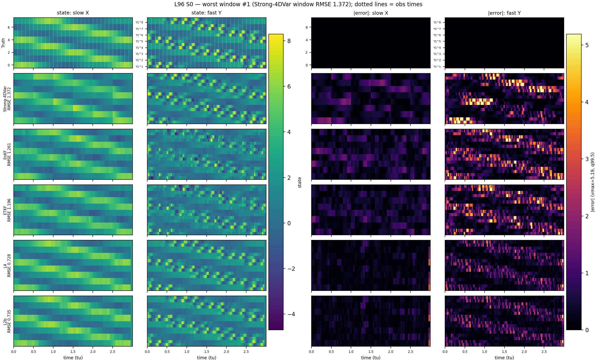
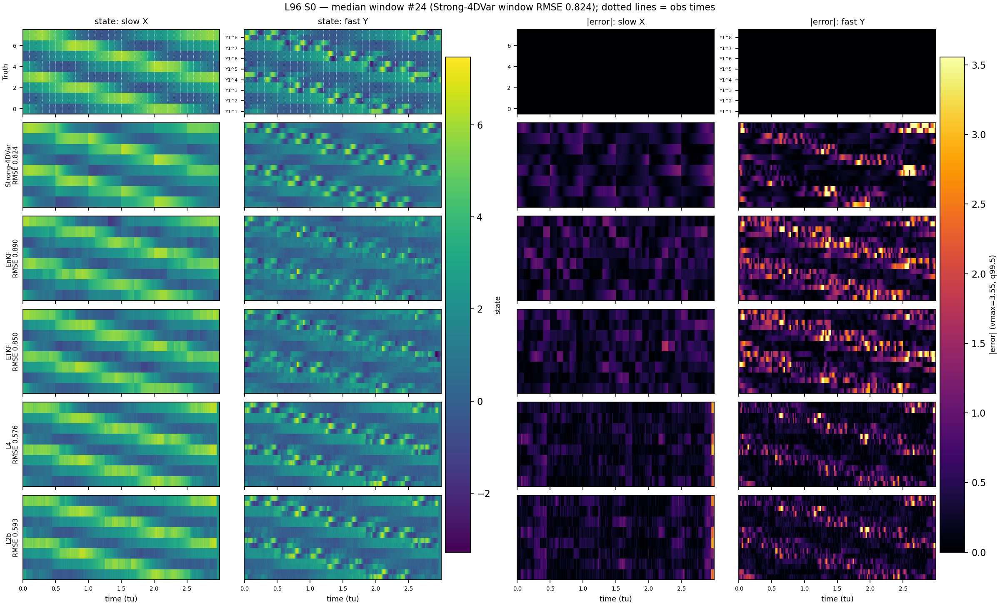
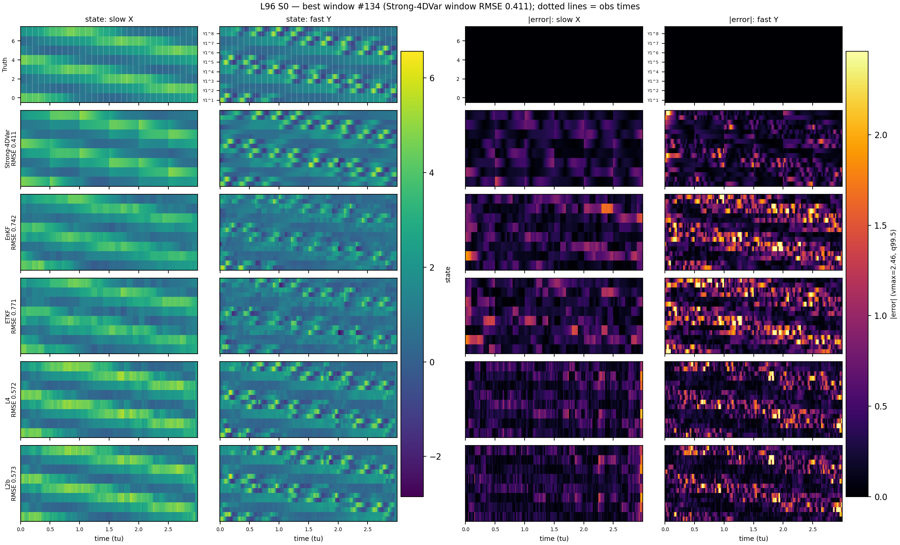
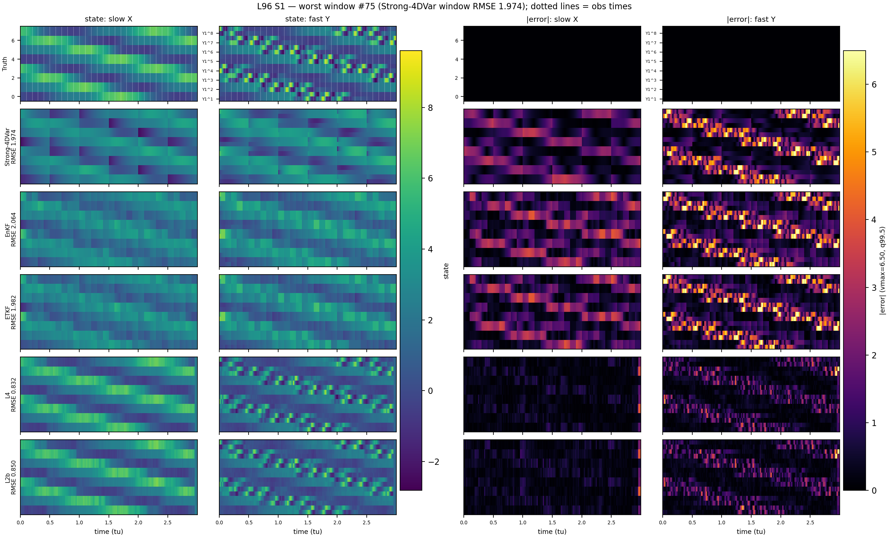
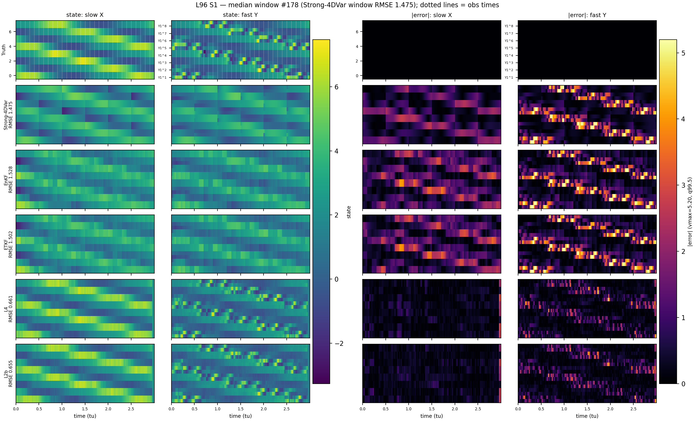
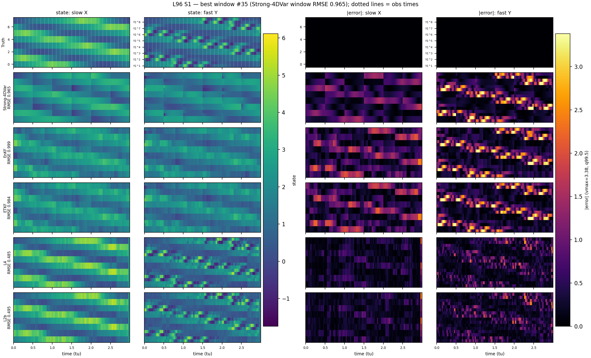

# L96 Consolidated Benchmark — DA baselines vs neural models

Setup: two-scale L96, Obs30 (`obs_interval=100`, `obs_j=2` → 24D observed space), dws=500, 200 shared cached test windows; S1 = ±20% params + ±10% bias (DA forward model uses biased `*_da`).

RMSE/EV are recomputed from the stored trajectory arrays via `evaluation/estimate_metrics.py`; ES for DA ensemble methods (EnKF/ETKF) and L3 (ens30×10) are proper ensemble scores (N=30, MAE − 0.5·pairwise spread) read from cached run outputs; ES for deterministic methods is the N=1 per-dim MAE proxy. **bold** marks the best value per column.

## Benchmarked schemes

| ID | Type | Description |
|---|---|---|
| Strong-4DVar | Variational | Strong-constraint 4D-Var over the dws=500 window (`B_var=2.0`, `R_var=0.5`, `max_iter=10`, `lr=0.2`, autodiff minimization); assimilates the full window trajectory. |
| EnKF | Ensemble KF | Stochastic ensemble Kalman filter, `N_ens=30`, inflation=2.0, no localization; sequential observation updates. |
| ETKF | Ensemble KF | Deterministic ensemble square-root filter, `N_ens=30`, inflation=2.0, no localization. |
| L1b | Neural (DirectUNet) | Single-pass regression obs → state, hidden [64,128,256]; obs-only conditioning; 200 epochs. |
| L2b | Neural (CFM, τ=0) | Conditional flow matching trained at τ=0 only; sampled with a single Euler step (deterministic, conditional-mean-like); hidden [64,128,256]; 400 epochs. |
| L3 | Neural (CFM, multi-τ) | Standard multi-τ CFM training; evaluated as a 30-member ensemble with 10 Euler steps (`ens30×10`, N=30, deterministic τ-schedule 0→1, fresh x₀ per member); hidden [64,128,256]; 400 epochs. |
| L4 | Neural (DirectUNet) | As L1b with small backbone [32,64,128]. |
| L5 | Neural (CFM, τ=0) | As L2b with small backbone [32,64,128]. |
| L6 | Neural (CFM, τ=0) | As L2b plus corrupted-forcing conditioning (`cond_extra_dim=1`); tests the robustness value of forcing input. |

Shared setup: all L-series neural models are trained and evaluated on the identical DA-parity benchmark (all-5 params ±20% randomized per window; S1 adds a ±10% bias; models operate in the 24D observed subspace with obs-only inputs unless noted). DA baselines receive the same per-window parameters as the truth generation (S0) or their biased `*_da` counterparts (S1), which is what makes the DA-vs-neural comparison apples-to-apples.

## RMSE (pooled, lower is better)

### RMSE by variable group

| Method | S0 all | S0 slow | S0 fast | S1 all | S1 slow | S1 fast | S1/S0 |
|---|---|---|---|---|---|---|---|
| ETKF | 0.8889 | 0.4789 | 1.0939 | 1.4961 | 1.2468 | 1.6208 | 1.683 |
| EnKF | 0.9124 | 0.4969 | 1.1202 | 1.5297 | 1.2567 | 1.6662 | 1.677 |
| Strong-4DVar | 0.8253 | 0.4716 | 1.0022 | 1.4566 | 1.0792 | 1.6453 | 1.765 |
| L1b | 0.6221 | 0.4019 | 0.7321 | 0.6256 | 0.4006 | 0.7381 | 1.006 |
| L2b | 0.6330 | 0.4188 | 0.7401 | 0.6336 | 0.4154 | 0.7426 | 1.001 |
| L3 | **0.5645** | **0.3325** | **0.6804** | **0.5668** | **0.3347** | **0.6829** | 1.004 |
| L4 | 0.6189 | 0.4037 | 0.7265 | 0.6211 | 0.4024 | 0.7304 | 1.004 |
| L5 | 0.6603 | 0.4858 | 0.7476 | 0.6604 | 0.4831 | 0.7490 | 1.000 |
| L6 | 0.6390 | 0.4136 | 0.7517 | 0.6381 | 0.4097 | 0.7523 | 0.999 |

Note on conventions: the DA metric cache stores the **mean of per-window RMSEs** (evaluation/run_l96.py), while this table uses the **pooled** convention (`sqrt(mean sq err)` over all windows/timesteps) for every method — the same convention as the neural evaluation. Pooled RMSE is ≤ mean-of-window RMSE, so DA values here are slightly lower (more favorable) than in the legacy cache; both orderings agree.

## Explained Variance (higher is better)

### EV by variable group

| Method | S0 all | S0 slow | S0 fast | S1 all | S1 slow | S1 fast |
|---|---|---|---|---|---|---|
| ETKF | 0.6918 | 0.9385 | 0.5684 | 0.2204 | 0.5722 | 0.0445 |
| EnKF | 0.6763 | 0.9338 | 0.5475 | 0.1832 | 0.5655 | -0.0079 |
| Strong-4DVar | 0.7386 | 0.9403 | 0.6377 | 0.2399 | 0.6795 | 0.0200 |
| L1b | 0.8567 | 0.9567 | 0.8067 | 0.8538 | 0.9558 | 0.8028 |
| L2b | 0.8527 | 0.9530 | 0.8025 | 0.8510 | 0.9525 | 0.8003 |
| L3 | **0.8787** | **0.9703** | **0.8330** | **0.8770** | **0.9691** | **0.8310** |
| L4 | 0.8586 | 0.9563 | 0.8097 | 0.8564 | 0.9554 | 0.8068 |
| L5 | 0.8445 | 0.9364 | 0.7985 | 0.8430 | 0.9354 | 0.7969 |
| L6 | 0.8489 | 0.9541 | 0.7963 | 0.8480 | 0.9538 | 0.7951 |

## Energy Score (lower is better)

### ES by variable group

| Method | S0 all | S0 slow | S0 fast | S1 all | S1 slow | S1 fast |
|---|---|---|---|---|---|---|
| ETKF | 0.4545 | 0.2873 | 0.5381 | 0.8466 | 0.7637 | 0.8881 |
| EnKF | 0.4592 | 0.2915 | 0.5430 | 0.8931 | 0.7947 | 0.9423 |
| Strong-4DVar | 0.4909* | 0.3569* | 0.5579* | 0.9817* | 0.8169* | 1.0640* |
| L1b | 0.3914* | 0.2704* | 0.4520* | 0.3949* | 0.2702* | 0.4572* |
| L2b | 0.4056* | 0.2867* | 0.4650* | 0.4069* | 0.2850* | 0.4679* |
| L3 | **0.2649** | **0.1749** | **0.3099** | **0.2671** | **0.1773** | **0.3120** |
| L4 | 0.3915* | 0.2726* | 0.4509* | 0.3940* | 0.2725* | 0.4548* |
| L5 | 0.4321* | 0.3525* | 0.4720* | 0.4329* | 0.3507* | 0.4740* |
| L6 | 0.4068* | 0.2814* | 0.4695* | 0.4071* | 0.2803* | 0.4706* |

`*` = ES from a one-member ensemble (N=1, deterministic; ES = per-dim MAE). Unmarked = proper ensemble ES (N=30, MAE − 0.5·pairwise spread). EnKF/ETKF ES are read from the bug-fixed DA cache; L3 ES from the ens30×10 run; Strong-4DVar and other neural models are deterministic (N=1).

## Consistency checks

- DA cached metrics vs recomputed-from-npz (42 values): max |Δ| = 2.12e-04 → PASS
- Neural stored truth vs dataset true_state[:, obs_var_indices]: max |Δ| = 0.00e+00 → PASS

## Reconstruction examples (Hovmöller)

Windows ranked by per-window pooled 24D RMSE of Strong-4DVar (best DA scheme); each figure shows rows = Truth/methods and columns = state / |error| maps for the slow X (8D) and fast Y (16D) blocks. State colors share one scale per figure; error maps share one scale across all rows/methods (99.5th-percentile cap, noted on the colorbar). Dotted vertical lines on the truth row mark observation times.

| Case | Rank | Window | 4DVar win-RMSE | Strong-4DVar | EnKF | ETKF | L4 | L2b |
|---|---|---|---|---|---|---|---|---|
| S0 | worst | 1 | 1.372 | 1.372 | 1.261 | 1.196 | 0.728 | 0.735 |
| S0 | median | 24 | 0.824 | 0.824 | 0.890 | 0.850 | 0.576 | 0.593 |
| S0 | best | 134 | 0.411 | 0.411 | 0.742 | 0.771 | 0.572 | 0.573 |
| S1 | worst | 75 | 1.974 | 1.974 | 2.064 | 1.982 | 0.832 | 0.850 |
| S1 | median | 178 | 1.475 | 1.475 | 1.528 | 1.502 | 0.661 | 0.655 |
| S1 | best | 35 | 0.965 | 0.965 | 0.999 | 0.984 | 0.485 | 0.495 |

