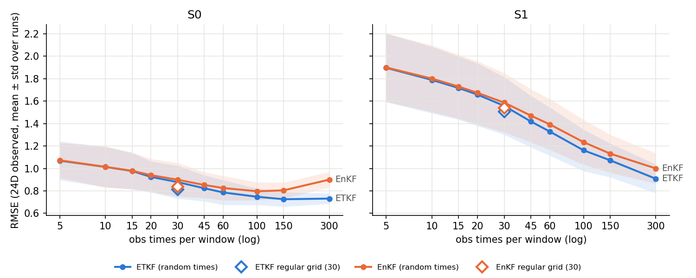

# L96 ETKF/EnKF vs number of observation times per window

10 windows of the P1 200-window test set (indices [0, 20, 40, 60, 80, 100, 120, 140, 160, 180]), 5 independent obs-time/noise draws per window per n_obs; obs times = step 0 plus n_obs-1 distinct steps drawn uniformly over the 3000-step window, all 24 observed channels at each time, R_var=0.5. P1 DA settings: 30 members, inflation 2.0. Metrics follow the P1 benchmark (group `all_obs`, physical units, mean ± std across runs). `reg30` = the cached regular 30-time obs of the same windows (one run per window), the direct link to the P1 table.

DA forward model uses each window's fast_weights (S0 true, S1 biased `_da`).

### ETKF

| n_obs | S0 RMSE | S1 RMSE | S1/S0 | S0 MAE | S1 MAE | sp/RMSE (S0) | sp/RMSE (S1) |
|---|---|---|---|---|---|---|---|
| 5 | 1.0690 ± 0.1736 | 1.8969 ± 0.3056 | 1.775 | 0.7180 | 1.5695 | 0.858 | 0.144 |
| 10 | 1.0135 ± 0.1787 | 1.7890 ± 0.2972 | 1.765 | 0.6912 | 1.4374 | 0.973 | 0.195 |
| 15 | 0.9771 ± 0.1628 | 1.7171 ± 0.2817 | 1.757 | 0.6745 | 1.3411 | 1.066 | 0.233 |
| 20 | 0.9245 ± 0.1391 | 1.6577 ± 0.2791 | 1.793 | 0.6440 | 1.2562 | 1.150 | 0.270 |
| 30 | 0.8779 ± 0.1467 | 1.5578 ± 0.2571 | 1.775 | 0.6205 | 1.1151 | 1.254 | 0.357 |
| 45 | 0.8230 ± 0.1164 | 1.4181 ± 0.2296 | 1.723 | 0.5899 | 0.9457 | 1.387 | 0.489 |
| 60 | 0.7857 ± 0.1108 | 1.3285 ± 0.2149 | 1.691 | 0.5693 | 0.8668 | 1.484 | 0.578 |
| 100 | 0.7477 ± 0.0736 | 1.1618 ± 0.1853 | 1.554 | 0.5510 | 0.7638 | 1.616 | 0.738 |
| 150 | 0.7253 ± 0.0656 | 1.0724 ± 0.1509 | 1.479 | 0.5382 | 0.7209 | 1.717 | 0.847 |
| 300 | 0.7311 ± 0.0464 | 0.9079 ± 0.1281 | 1.242 | 0.5386 | 0.6297 | 1.793 | 1.132 |
| reg30 (regular grid) | 0.8118 ± 0.1343 | 1.5051 ± 0.2525 | 1.854 | 0.5772 | 1.0518 | 1.306 | 0.369 |

### EnKF

| n_obs | S0 RMSE | S1 RMSE | S1/S0 | S0 MAE | S1 MAE | sp/RMSE (S0) | sp/RMSE (S1) |
|---|---|---|---|---|---|---|---|
| 5 | 1.0727 ± 0.1552 | 1.9003 ± 0.3052 | 1.772 | 0.7210 | 1.5731 | 0.859 | 0.141 |
| 10 | 1.0139 ± 0.1845 | 1.8008 ± 0.2971 | 1.776 | 0.6923 | 1.4532 | 0.959 | 0.187 |
| 15 | 0.9793 ± 0.1625 | 1.7298 ± 0.2850 | 1.766 | 0.6771 | 1.3592 | 1.047 | 0.219 |
| 20 | 0.9398 ± 0.1463 | 1.6737 ± 0.2821 | 1.781 | 0.6519 | 1.2799 | 1.113 | 0.252 |
| 30 | 0.8994 ± 0.1507 | 1.5869 ± 0.2636 | 1.764 | 0.6320 | 1.1570 | 1.200 | 0.313 |
| 45 | 0.8522 ± 0.1154 | 1.4707 ± 0.2373 | 1.726 | 0.6042 | 1.0102 | 1.318 | 0.410 |
| 60 | 0.8252 ± 0.1092 | 1.3924 ± 0.2263 | 1.687 | 0.5886 | 0.9293 | 1.398 | 0.480 |
| 100 | 0.7963 ± 0.0808 | 1.2347 ± 0.2004 | 1.550 | 0.5745 | 0.8124 | 1.524 | 0.609 |
| 150 | 0.8044 ± 0.0711 | 1.1317 ± 0.1693 | 1.407 | 0.5825 | 0.7523 | 1.602 | 0.695 |
| 300 | 0.9003 ± 0.0698 | 0.9999 ± 0.1351 | 1.111 | 0.6326 | 0.6925 | 1.642 | 0.845 |
| reg30 (regular grid) | 0.8378 ± 0.1301 | 1.5400 ± 0.2541 | 1.838 | 0.5937 | 1.0996 | 1.270 | 0.325 |
