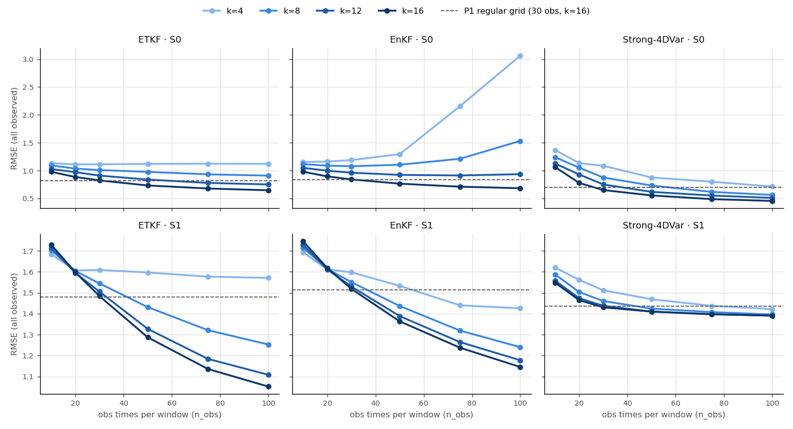
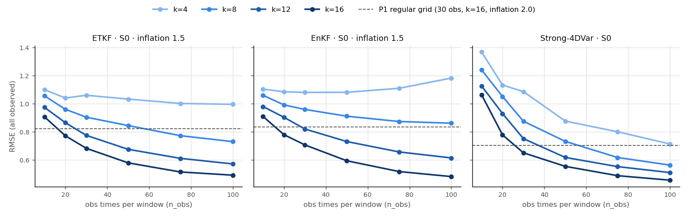

# L96 DA baselines under the random observing system

Observing system drawn with the training sampler (`data.obs_random_layout`): n_obs stratified obs times per window with the first block pinned to step 0 and at least one obs time in every 500-step DA window (draws violating it are redrawn), k of the 16 observed-space fast channels per window (subset redrawn per obs time), 8 slow channels always observed, R_var=0.5. Background from the step-0 obs, the 16-k missing fast channels filled by linear interpolation along the fast ring, the 16 never-observed fast channels as in P1. P1 DA settings (30 members, Strong-4DVar max_iter=10 lr=0.2, DA window 500) with per-window DA fast weights; metrics on the 24 observed channels, mean ± std across runs.

## Random observing system, n_obs U{6..50}: 200 windows x 1 draw

| Method | S0 RMSE | S0 P1 regular | S0 sp/RMSE | S1 RMSE | S1 P1 regular | S1 sp/RMSE |
|---|---|---|---|---|---|---|
| ETKF | 0.9866 ± 0.1730 | 0.8213 | 1.111 | 1.5539 ± 0.2894 | 1.4786 | 0.407 |
| EnKF | 1.0361 ± 0.1811 | 0.8339 | 1.191 | 1.5712 ± 0.2891 | 1.5140 | 0.373 |
| Strong-4DVar | 0.9058 ± 0.2936 | 0.7028 | – | 1.4877 ± 0.2613 | 1.4362 | – |

P1 regular = regular 30-time grid, all 16 observed fast channels, 200 windows (corrected DA-fast-weights rerun, job 54716).

### RMSE by n_obs

| Method | Case | 6–10 | 11–20 | 21–35 | 36–50 | 51–75 | 76–100 |
|---|---|---|---|---|---|---|---|
| ETKF | S0 | 1.068 (n=22) | 1.049 (n=48) | 0.972 (n=67) | 0.927 (n=63) | – | – |
| ETKF | S1 | 1.849 (n=12) | 1.762 (n=41) | 1.487 (n=68) | 1.459 (n=79) | – | – |
| EnKF | S0 | 1.075 (n=22) | 1.079 (n=48) | 1.023 (n=67) | 1.004 (n=63) | – | – |
| EnKF | S1 | 1.867 (n=12) | 1.777 (n=41) | 1.499 (n=68) | 1.481 (n=79) | – | – |
| Strong-4DVar | S0 | 1.194 (n=22) | 1.074 (n=48) | 0.861 (n=67) | 0.725 (n=63) | – | – |
| Strong-4DVar | S1 | 1.666 (n=12) | 1.645 (n=41) | 1.410 (n=68) | 1.445 (n=79) | – | – |

### RMSE by k (fast channels observed)

| Method | Case | 4–7 | 8–11 | 12–16 |
|---|---|---|---|---|
| ETKF | S0 | 1.062 (n=58) | 1.016 (n=47) | 0.926 (n=95) |
| ETKF | S1 | 1.610 (n=67) | 1.560 (n=56) | 1.501 (n=77) |
| EnKF | S0 | 1.144 (n=58) | 1.059 (n=47) | 0.959 (n=95) |
| EnKF | S1 | 1.606 (n=67) | 1.579 (n=56) | 1.535 (n=77) |
| Strong-4DVar | S0 | 1.017 (n=58) | 0.935 (n=47) | 0.824 (n=95) |
| Strong-4DVar | S1 | 1.522 (n=67) | 1.501 (n=56) | 1.448 (n=77) |

## Random observing system, n_obs U{10..100}: 200 windows x 1 draw

| Method | S0 RMSE | S0 P1 regular | S0 sp/RMSE | S1 RMSE | S1 P1 regular | S1 sp/RMSE |
|---|---|---|---|---|---|---|
| ETKF | 0.9265 ± 0.1885 | 0.8213 | 1.254 | 1.4171 ± 0.3070 | 1.4786 | 0.579 |
| EnKF | 1.1690 ± 0.4759 | 0.8339 | 1.853 | 1.4275 ± 0.2806 | 1.5140 | 0.541 |
| Strong-4DVar | 0.7425 ± 0.3101 | 0.7028 | – | 1.4439 ± 0.2463 | 1.4362 | – |

P1 regular = regular 30-time grid, all 16 observed fast channels, 200 windows (corrected DA-fast-weights rerun, job 54716).

### RMSE by n_obs

| Method | Case | 6–10 | 11–20 | 21–35 | 36–50 | 51–75 | 76–100 |
|---|---|---|---|---|---|---|---|
| ETKF | S0 | 1.024 (n=3) | 1.108 (n=19) | 1.029 (n=29) | 0.903 (n=32) | 0.879 (n=58) | 0.872 (n=59) |
| ETKF | S1 | 1.767 (n=2) | 1.721 (n=15) | 1.570 (n=30) | 1.430 (n=37) | 1.417 (n=56) | 1.246 (n=60) |
| EnKF | S0 | 1.051 (n=3) | 1.133 (n=19) | 1.073 (n=29) | 1.010 (n=32) | 1.079 (n=58) | 1.409 (n=59) |
| EnKF | S1 | 1.773 (n=2) | 1.733 (n=15) | 1.578 (n=30) | 1.437 (n=37) | 1.431 (n=56) | 1.256 (n=60) |
| Strong-4DVar | S0 | 1.261 (n=3) | 1.196 (n=19) | 0.952 (n=29) | 0.728 (n=32) | 0.634 (n=58) | 0.582 (n=59) |
| Strong-4DVar | S1 | 1.578 (n=2) | 1.608 (n=15) | 1.486 (n=30) | 1.402 (n=37) | 1.471 (n=56) | 1.378 (n=60) |

### RMSE by k (fast channels observed)

| Method | Case | 4–7 | 8–11 | 12–16 |
|---|---|---|---|---|
| ETKF | S0 | 1.054 (n=65) | 0.950 (n=61) | 0.795 (n=74) |
| ETKF | S1 | 1.583 (n=77) | 1.357 (n=57) | 1.275 (n=66) |
| EnKF | S0 | 1.573 (n=65) | 1.119 (n=61) | 0.855 (n=74) |
| EnKF | S1 | 1.534 (n=77) | 1.381 (n=57) | 1.343 (n=66) |
| Strong-4DVar | S0 | 0.866 (n=65) | 0.748 (n=61) | 0.629 (n=74) |
| Strong-4DVar | S1 | 1.516 (n=77) | 1.404 (n=57) | 1.394 (n=66) |

## Arm B: n_obs x k grid, 20 windows x 3 draws

RMSE (all observed channels), rows n_obs, columns k.

**ETKF, S0**

| n_obs | k=4 | k=8 | k=12 | k=16 |
|---|---|---|---|---|
| 10 | 1.132 | 1.093 | 1.028 | 0.979 |
| 20 | 1.112 | 1.036 | 0.973 | 0.886 |
| 30 | 1.113 | 1.010 | 0.911 | 0.825 |
| 50 | 1.121 | 0.978 | 0.840 | 0.734 |
| 75 | 1.123 | 0.933 | 0.779 | 0.679 |
| 100 | 1.121 | 0.910 | 0.752 | 0.647 |

**ETKF, S1**

| n_obs | k=4 | k=8 | k=12 | k=16 |
|---|---|---|---|---|
| 10 | 1.684 | 1.703 | 1.715 | 1.729 |
| 20 | 1.606 | 1.604 | 1.594 | 1.597 |
| 30 | 1.609 | 1.544 | 1.505 | 1.484 |
| 50 | 1.597 | 1.431 | 1.327 | 1.287 |
| 75 | 1.577 | 1.321 | 1.184 | 1.136 |
| 100 | 1.571 | 1.253 | 1.108 | 1.052 |

**EnKF, S0**

| n_obs | k=4 | k=8 | k=12 | k=16 |
|---|---|---|---|---|
| 10 | 1.155 | 1.117 | 1.051 | 0.980 |
| 20 | 1.163 | 1.089 | 0.998 | 0.897 |
| 30 | 1.189 | 1.078 | 0.963 | 0.842 |
| 50 | 1.295 | 1.106 | 0.923 | 0.766 |
| 75 | 2.156 | 1.212 | 0.913 | 0.712 |
| 100 | 3.063 | 1.533 | 0.936 | 0.684 |

**EnKF, S1**

| n_obs | k=4 | k=8 | k=12 | k=16 |
|---|---|---|---|---|
| 10 | 1.693 | 1.715 | 1.728 | 1.745 |
| 20 | 1.612 | 1.614 | 1.611 | 1.618 |
| 30 | 1.597 | 1.550 | 1.529 | 1.518 |
| 50 | 1.533 | 1.437 | 1.388 | 1.363 |
| 75 | 1.440 | 1.319 | 1.264 | 1.238 |
| 100 | 1.426 | 1.240 | 1.178 | 1.145 |

**Strong-4DVar, S0**

| n_obs | k=4 | k=8 | k=12 | k=16 |
|---|---|---|---|---|
| 10 | 1.369 | 1.241 | 1.127 | 1.064 |
| 20 | 1.134 | 1.052 | 0.931 | 0.779 |
| 30 | 1.087 | 0.876 | 0.752 | 0.651 |
| 50 | 0.877 | 0.733 | 0.618 | 0.555 |
| 75 | 0.801 | 0.618 | 0.553 | 0.488 |
| 100 | 0.714 | 0.564 | 0.510 | 0.456 |

**Strong-4DVar, S1**

| n_obs | k=4 | k=8 | k=12 | k=16 |
|---|---|---|---|---|
| 10 | 1.620 | 1.587 | 1.557 | 1.548 |
| 20 | 1.561 | 1.503 | 1.474 | 1.464 |
| 30 | 1.511 | 1.460 | 1.438 | 1.430 |
| 50 | 1.469 | 1.424 | 1.410 | 1.410 |
| 75 | 1.437 | 1.407 | 1.398 | 1.397 |
| 100 | 1.422 | 1.396 | 1.390 | 1.391 |

## Inflation check: k U{4..16}, 20 windows x 3 draws

| Method | Case | n_obs | inf=1.5 | inf=2.0 | inf=2.5 |
|---|---|---|---|---|---|
| ETKF | S0 | 10 | **0.998** | 1.048 | 1.105 |
| ETKF | S0 | 100 | **0.702** | 0.870 | 0.987 |
| ETKF | S1 | 10 | 1.786 | 1.713 | **1.683** |
| ETKF | S1 | 100 | 1.260 | **1.189** | 1.213 |
| EnKF | S0 | 10 | **1.015** | 1.062 | 1.112 |
| EnKF | S0 | 100 | **0.796** | 1.523 | 2.387 |
| EnKF | S1 | 10 | 1.799 | 1.724 | **1.691** |
| EnKF | S1 | 100 | 1.325 | **1.214** | 1.265 |

## S0 with inflation 1.5 (ETKF/EnKF)

The inflation check found 1.5 best on S0 at both n_obs 10 and 100 (2.0 is the S1-tuned P1 value). Same layouts as the inflation-2.0 runs, so rows are paired; Strong-4DVar has no inflation. The P1 regular-grid reference lines are still at inflation 2.0, so on S0 they overstate the cost of the random observing system for the filters (a regular-grid S0 rerun at 1.5 is a follow-up).

### n_obs U{6..50}, 200 windows

| Method | S0 RMSE inf 2.0 | S0 RMSE inf 1.5 | sp/RMSE inf 1.5 | n_obs 6–10 | n_obs 11–20 | n_obs 21–35 | n_obs 36–50 |
|---|---|---|---|---|---|---|---|
| ETKF | 0.9866 | **0.8814** ± 0.1985 | 0.866 | 1.014 | 0.968 | 0.860 | 0.792 |
| EnKF | 1.0361 | **0.9158** ± 0.1962 | 0.927 | 1.032 | 0.996 | 0.893 | 0.839 |
| Strong-4DVar (no inflation) | 0.9058 | 0.9058 | – |  |  |  |  |

### n_obs U{10..100}, 200 windows

| Method | S0 RMSE inf 2.0 | S0 RMSE inf 1.5 | sp/RMSE inf 1.5 | n_obs 6–10 | n_obs 11–20 | n_obs 21–35 | n_obs 36–50 | n_obs 51–75 | n_obs 76–100 |
|---|---|---|---|---|---|---|---|---|---|
| ETKF | 0.9265 | **0.7963** ± 0.2187 | 0.961 | 1.038 | 1.037 | 0.936 | 0.788 | 0.731 | 0.706 |
| EnKF | 1.1690 | **0.8498** ± 0.2207 | 1.077 | 1.004 | 1.058 | 0.946 | 0.843 | 0.786 | 0.794 |
| Strong-4DVar (no inflation) | 0.7425 | 0.7425 | – |  |  |  |  |  |  |

**ETKF, S0, inflation 1.5** (grid, RMSE)

| n_obs | k=4 | k=8 | k=12 | k=16 |
|---|---|---|---|---|
| 10 | 1.101 | 1.057 | 0.975 | 0.908 |
| 20 | 1.041 | 0.961 | 0.866 | 0.773 |
| 30 | 1.061 | 0.905 | 0.776 | 0.683 |
| 50 | 1.034 | 0.845 | 0.676 | 0.580 |
| 75 | 1.003 | 0.773 | 0.612 | 0.515 |
| 100 | 0.996 | 0.731 | 0.572 | 0.492 |

**EnKF, S0, inflation 1.5** (grid, RMSE)

| n_obs | k=4 | k=8 | k=12 | k=16 |
|---|---|---|---|---|
| 10 | 1.105 | 1.061 | 0.981 | 0.910 |
| 20 | 1.086 | 0.992 | 0.904 | 0.780 |
| 30 | 1.081 | 0.960 | 0.821 | 0.708 |
| 50 | 1.082 | 0.912 | 0.731 | 0.595 |
| 75 | 1.110 | 0.874 | 0.658 | 0.518 |
| 100 | 1.183 | 0.862 | 0.615 | 0.482 |

