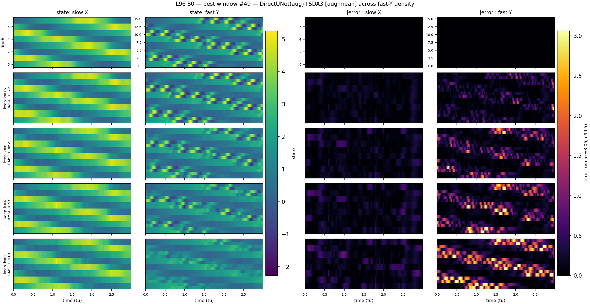
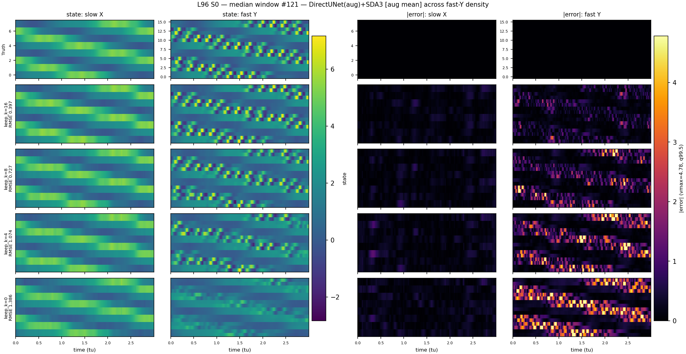
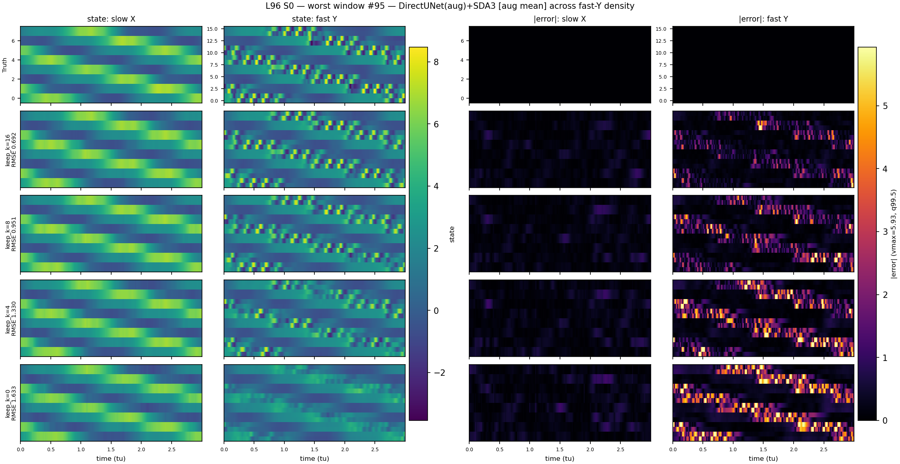

# L96 Fast-Y Observation-Density: Training-Augmentation Study

## 1. Experiments

**Motivation.** The original fast-Y observation-density generalization sweep
(PR #180) found that DirectUNet-L(cos)
and CFM-M(flat) -- which consume `obs` only via `torch.nan_to_num(obs,
nan=0.0)`, with no separate mask channel -- degrade steeply under randomly
reduced fast-Y observation density (RMSE ~1.9x at half density, ~2.7x at
zero fast-Y density) because a dropped channel is indistinguishable from a
genuine near-zero observation: this is out-of-distribution for them, never
seen at training time. SDA3, whose prior network never conditions on raw
obs at all (only its guided-sampling cost reads it, cleanly excluding
dropped channels), degrades far more gracefully (~2.0x) with no retraining
needed.

**Training-time fix (PR #182).** Added a training-time counterpart:
`data/obs_density.py::sample_training_density_mask` mixes full-density and
randomly-reduced-density observation events within every training batch
(`full_prob=0.4`: 40% chance of full density, else `keep_k` drawn uniformly
from `{0,...,15}`), wired through `data/dataloader.py::make_collate_fm` and
applied to the train loader only (val/test always stay at full density).

**Tier investigation.** The first attempt (DirectUNet-L, cosine LR)
converged fine on `val_loss` but collapsed toward the fast-Y conditional
mean at eval time even at full density (predicted/true fast-Y variance
ratio ~35%, per-channel correlation ~0.55-0.64) -- CFM-M's *identical*
augmentation pipeline instead reconstructed fast-Y almost fully (variance
ratio ~96%, correlation ~0.94-0.95), ruling out a data-generation or
eval-framework bug and pointing at an L-tier-specific training pathology
(consistent with L-tier's pre-existing flat-LR instability documented in
`l96_consolidated_benchmark.md`). Retraining at **M-tier with cosine
annealing** (adopted as the default for all obs-density-augmented training
going forward, not just L) fully avoided the collapse: variance ratio 99%,
correlation 0.94, matching CFM's healthy behavior.

**Checkpoints compared in this report:**

| Label | Checkpoint | Augmented? |
|---|---|---|
| DirectUNet-L(cos) [non-aug] | `L1b_monai_unet_s0s1_norm_l_cosine` | no |
| DirectUNet-M(cos) [augmented] | `L1b_monai_unet_s0s1_norm_obsdensity` | yes (M-tier, cosine) |
| CFM-M(flat) [non-aug] | `L2b_monai_vanilla_cfm_s0s1_norm` | no |
| CFM-M(flat) [augmented] | `L2b_monai_vanilla_cfm_s0s1_norm_obsdensity` | yes |
| SDA3(monai) | `SDA3_monai_cond_noisy_l96_norm` | no (architecturally robust already) |
| DirectUNet+SDA3 [non-aug mean] | `L1b_monai_unet_s0s1_norm` warm-starting SDA3 | no |
| DirectUNet(aug)+SDA3 [aug mean] | `L1b_monai_unet_s0s1_norm_obsdensity` warm-starting SDA3 | yes (mean model only) |

**Protocol (unchanged from PR #180):** same 200-window cached S0/S1 test
set; `keep_k in {16, 8, 4, 0}` of the 16 canonical fast-Y channels kept,
**redrawn independently at every observation time** within each window
(harder than a fixed-per-window mask); `n_repeats=3` independent seed
reruns per (method, case, keep_k) cell (fresh mask redraw, and fresh
sampling noise for the stochastic methods); `n_outer=10`, `n_members=30`,
`r_var=0.5` for the ensemble/guided methods; SDA3 `guidance_weight=40.0`;
hybrid `tau0=0.3`, `guidance_weight=2.0`.

## 2. Summary: RMSE / EV(all_obs) vs. fast-Y density (all methods, S0; S1 tracks within noise)

| Method | keep_k=16 | keep_k=8 | keep_k=4 | keep_k=0 |
|---|---|---|---|---|
| DirectUNet-L(cos) [non-aug] | 0.486±0.000 / EV 0.907±0.000 | 0.906±0.002 / EV 0.666±0.002 | 1.104±0.003 / EV 0.516±0.003 | 1.292±0.000 / EV 0.370±0.000 |
| DirectUNet-M(cos) [augmented] | 0.473±0.000 / EV 0.914±0.000 | 0.704±0.003 / EV 0.789±0.002 | 0.898±0.002 / EV 0.644±0.002 | 1.081±0.000 / EV 0.472±0.000 |
| CFM-M(flat) [non-aug] | 0.481±0.000 / EV 0.910±0.000 | 0.922±0.003 / EV 0.662±0.003 | 1.131±0.002 / EV 0.506±0.002 | 1.321±0.000 / EV 0.354±0.000 |
| CFM-M(flat) [augmented] | 0.462±0.000 / EV 0.917±0.000 | 0.690±0.001 / EV 0.799±0.001 | 0.899±0.005 / EV 0.644±0.004 | 1.108±0.000 / EV 0.450±0.000 |
| SDA3(monai) | 0.537±0.000 / EV 0.887±0.000 | 0.781±0.002 / EV 0.742±0.001 | 0.921±0.003 / EV 0.629±0.003 | 1.082±0.001 / EV 0.479±0.001 |
| DirectUNet+SDA3 [non-aug mean] | 0.420±0.000 / EV 0.927±0.000 | 0.800±0.003 / EV 0.717±0.002 | 0.976±0.003 / EV 0.575±0.003 | 1.138±0.000 / EV 0.423±0.000 |
| DirectUNet(aug)+SDA3 [aug mean] | 0.389±0.000 / EV 0.939±0.000 | 0.633±0.001 / EV 0.823±0.000 | 0.848±0.006 / EV 0.672±0.005 | 1.065±0.000 / EV 0.472±0.000 |

### RMSE degradation vs. own full-density baseline (keep_k=16)

| Method | keep_k=16 | keep_k=8 | keep_k=4 | keep_k=0 |
|---|---|---|---|---|
| DirectUNet-L(cos) [non-aug] | 1.000x | 1.863x | 2.271x | 2.656x |
| DirectUNet-M(cos) [augmented] | 1.000x | 1.490x | 1.900x | 2.286x |
| CFM-M(flat) [non-aug] | 1.000x | 1.918x | 2.352x | 2.746x |
| CFM-M(flat) [augmented] | 1.000x | 1.492x | 1.943x | 2.396x |
| SDA3(monai) | 1.000x | 1.454x | 1.715x | 2.015x |
| DirectUNet+SDA3 [non-aug mean] | 1.000x | 1.903x | 2.321x | 2.708x |
| DirectUNet(aug)+SDA3 [aug mean] | 1.000x | 1.627x | 2.180x | 2.739x |

**Reading this table:** the augmented DirectUNet-M and CFM-M rows keep a *better* full-density baseline than their non-augmented counterparts while degrading far less (~1.5x vs ~1.9x at keep_k=8). The augmented hybrid combines the best full-density score of any row here with the best absolute worst-case RMSE (keep_k=0), edging out even SDA3 -- though SDA3 still has the flattest *relative* degradation curve, since the hybrid's much lower starting point means even a larger relative drop still lands ahead in absolute terms.

## 3. Best/median/worst-window impact of fast-Y density

Windows selected by full-density (`keep_k=16`) reconstruction RMSE of the best overall scheme (**DirectUNet(aug)+SDA3 [aug mean]**, S0), mirroring `generate_l96_consolidated_report.py`'s `select_windows` convention -- but here the varying axis across the figure/table is `keep_k`, not method.

### Best window #49 (reference RMSE 0.272)

| Method | keep_k=16 | keep_k=8 | keep_k=4 | keep_k=0 |
|---|---|---|---|---|
| DirectUNet-M(cos) [augmented] | 0.354 | 0.546 | 0.747 | 0.926 |
| CFM-M(flat) [augmented] | 0.366 | 0.555 | 0.692 | 0.938 |
| SDA3(monai) | 0.384 | 0.623 | 0.742 | 0.918 |
| DirectUNet(aug)+SDA3 [aug mean] | 0.272 | 0.462 | 0.633 | 0.919 |

### Median window #121 (reference RMSE 0.397)

| Method | keep_k=16 | keep_k=8 | keep_k=4 | keep_k=0 |
|---|---|---|---|---|
| DirectUNet-M(cos) [augmented] | 0.516 | 0.795 | 1.096 | 1.382 |
| CFM-M(flat) [augmented] | 0.470 | 0.815 | 1.141 | 1.389 |
| SDA3(monai) | 0.574 | 0.911 | 1.109 | 1.342 |
| DirectUNet(aug)+SDA3 [aug mean] | 0.397 | 0.727 | 1.074 | 1.386 |

### Worst window #95 (reference RMSE 0.692)

| Method | keep_k=16 | keep_k=8 | keep_k=4 | keep_k=0 |
|---|---|---|---|---|
| DirectUNet-M(cos) [augmented] | 0.769 | 1.070 | 1.258 | 1.588 |
| CFM-M(flat) [augmented] | 0.780 | 0.975 | 1.310 | 1.604 |
| SDA3(monai) | 0.766 | 1.086 | 1.340 | 1.562 |
| DirectUNet(aug)+SDA3 [aug mean] | 0.692 | 0.951 | 1.330 | 1.633 |

