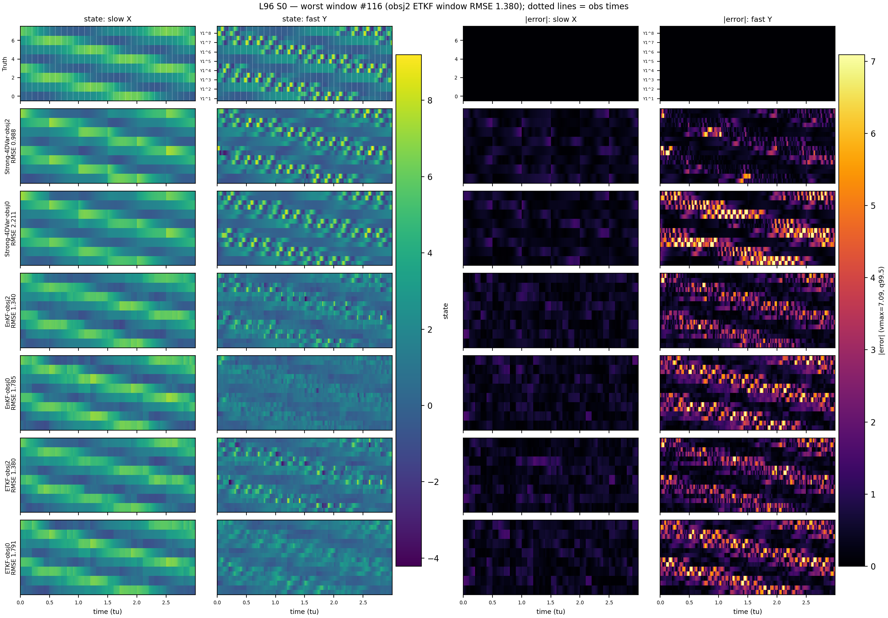
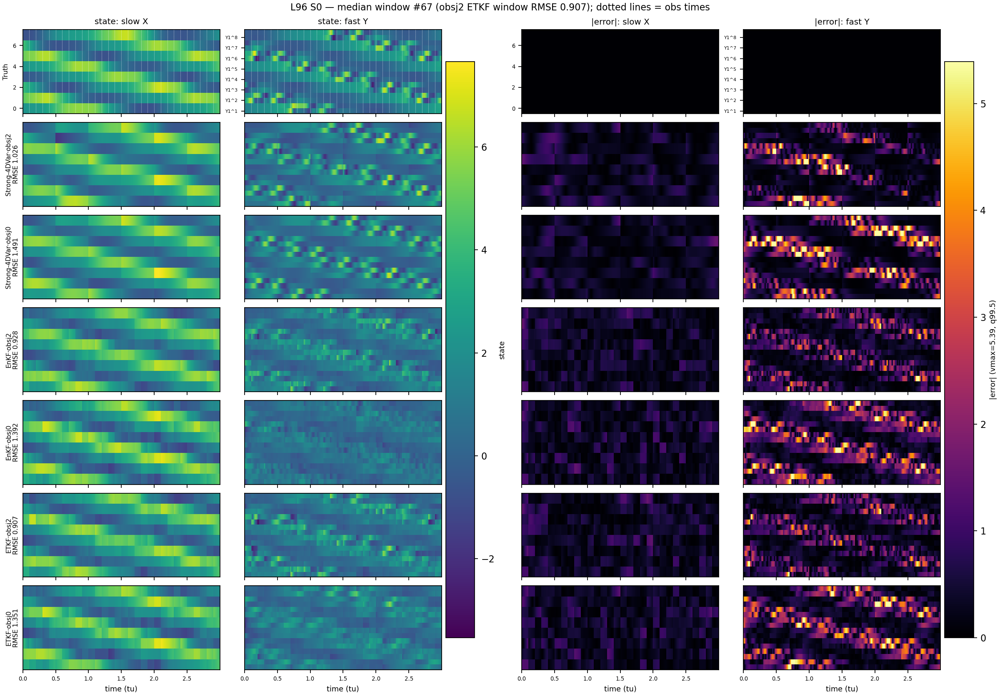
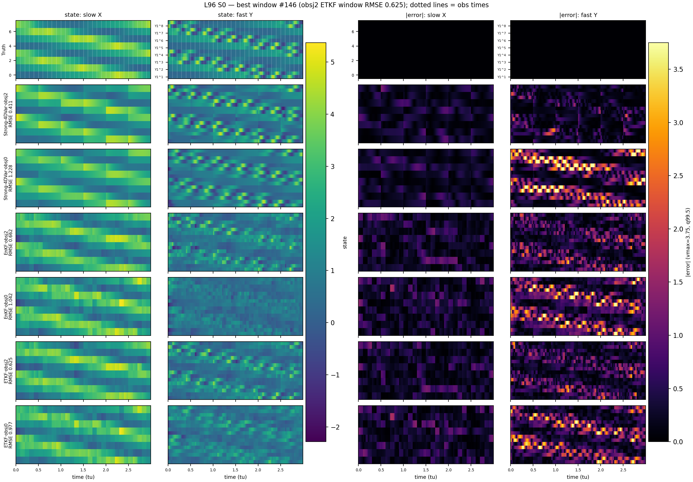
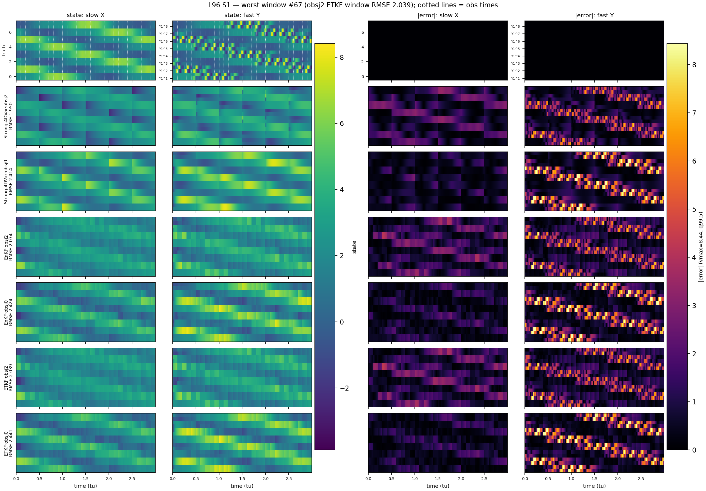
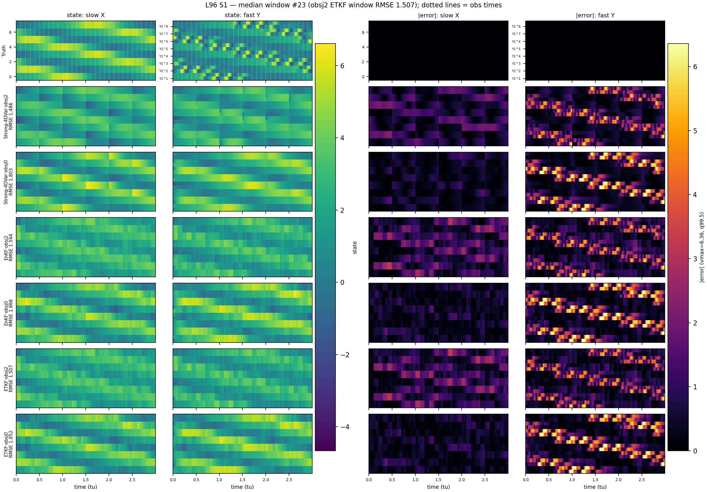
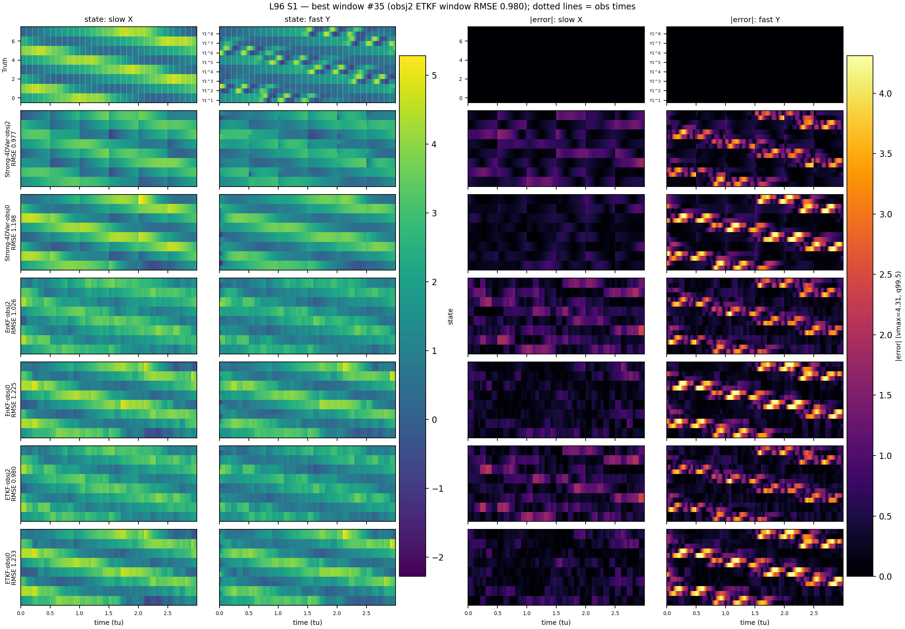

# L96 DA-Baseline Observation Density: obsj2 (24D) vs slow-only obsj0 (8D)

**System:** Lorenz-96 two-scale (NO=8, J=4), 200 shared cached S0/S1 test windows, Obs30 (obs_interval=100). Same dynamics/truth/params; only the observation changes.

**Configurations:**
* **obsj2 (canonical):** 24D observed = 8 slow X + 16 fast Y1,Y2 per node.
* **slow-only obsj0:** only the **8 slow X** observed (no fast Y); S1 reduced dynamics kept at J=2 (24D state).

**Eval subspace:** both are scored on the identical 24D group (slow + first-2-fast), so the metrics are directly comparable. On obsj0 the `obs_fast` group reflects fast variables **not observed** by the DA (slow-only stress test).

**S1 forcings:** all rows use the corrected `case=2` config, i.e. the DA is fed the **corrupted** forcing `forcing_corrupted` on S1 (and `forcing_true` on S0).

---

## State-only DA baselines (S0/S1)

| Case | Method | obsj2 mean | obsj0 mean | Δ mean | obsj2 slow | obsj0 slow | obsj2 obs_fast | obsj0 obs_fast |
|---|---|---|---|---|---|---|---|---|
| S0 | Strong-4DVar | 0.7383 | 1.4382 | 0.6998 | 0.4539 | 0.4131 | 0.8805 | 1.9507 |
| S0 | EnKF | 0.8943 | 1.2735 | 0.3792 | 0.4892 | 0.4491 | 1.0968 | 1.6858 |
| S0 | ETKF | 0.8662 | 1.2481 | 0.3819 | 0.4677 | 0.4607 | 1.0655 | 1.6418 |
| S1 | Strong-4DVar | 1.4369 | 1.6165 | 0.1796 | 1.0522 | 0.5262 | 1.6293 | 2.1616 |
| S1 | EnKF | 1.5123 | 1.6978 | 0.1855 | 1.2298 | 0.5958 | 1.6535 | 2.2488 |
| S1 | ETKF | 1.4748 | 1.7073 | 0.2325 | 1.2202 | 0.6229 | 1.6021 | 2.2495 |

---

## Joint state-parameter DA baselines (S0/S1)

| Case | Method | obsj2 mean | obsj0 mean | Δ mean | obsj2 EV | obsj0 EV | obsj2 param* | obsj0 param* |
|---|---|---|---|---|---|---|---|---|
| S0 | Joint-EnKF | 0.7237 | 1.2079 | 0.4843 | 0.7760 | 0.3517 | 0.0544 | 0.0464 |
| S0 | Joint-ETKF | 0.6414 | 1.1865 | 0.5451 | 0.8157 | 0.3523 | 0.0545 | 0.0449 |
| S0 | Joint-Strong-4DVar | 0.7100 | 1.5805 | 0.8705 | 0.7578 | -0.2244 | 0.2282 | 0.2900 |
| S1 | Joint-EnKF | 1.4646 | 1.6687 | 0.2042 | 0.2229 | -0.2292 | 0.1481 | 0.1570 |
| S1 | Joint-ETKF | 1.5125 | 1.6008 | 0.0883 | 0.1623 | -0.0966 | 0.1296 | 0.1579 |
| S1 | Joint-Strong-4DVar | 1.1997 | 1.3187 | 0.1190 | 0.4131 | 0.1867 | 0.3142 | 0.2725 |
*param = mean of the (identifiable) per-parameter RMSE (8 on S0, 6 on S1 — w3/w4 pinned to the reference prior at J=2).*

---

## Joint-DA per-parameter RMSE (S0/S1)

### S0 — per-parameter RMSE

| Method / config | mean | F | c1 | hx | eps | w1 | w2 | w3 | w4 |
|---|---|---|---|---|---|---|---|---|---|
| Joint-EnKF / obsj2 | 0.0544 | 0.1368 | 0.0174 | 0.0163 | 0.0017 | 0.1167 | 0.1226 | 0.0120 | 0.0117 |
| Joint-EnKF / obsj0 | 0.0464 | 0.0897 | 0.0103 | 0.0096 | 0.0009 | 0.1143 | 0.1230 | 0.0118 | 0.0114 |
| Joint-ETKF / obsj2 | 0.0545 | 0.1370 | 0.0163 | 0.0175 | 0.0017 | 0.1164 | 0.1240 | 0.0121 | 0.0113 |
| Joint-ETKF / obsj0 | 0.0449 | 0.0806 | 0.0096 | 0.0101 | 0.0011 | 0.1124 | 0.1227 | 0.0118 | 0.0113 |
| Joint-Strong-4DVar / obsj2 | 0.2282 | 0.8606 | 0.0026 | 0.1182 | 0.0116 | 0.2534 | 0.2122 | 0.1633 | 0.2038 |
| Joint-Strong-4DVar / obsj0 | 0.2900 | 1.1494 | 0.0016 | 0.3046 | 0.0254 | 0.2685 | 0.2651 | 0.1528 | 0.1526 |

### S1 — per-parameter RMSE

| Method / config | mean | F | c1 | hx | eps | w1 | w2 | w3 | w4 |
|---|---|---|---|---|---|---|---|---|---|
| Joint-EnKF / obsj2 | 0.1481 | 0.7683 | 0.1025 | 0.0668 | 0.0111 | 0.1176 | 0.1185 | 0.0000 | 0.0000 |
| Joint-EnKF / obsj0 | 0.1570 | 0.8162 | 0.1014 | 0.1004 | 0.0100 | 0.1145 | 0.1137 | 0.0000 | 0.0000 |
| Joint-ETKF / obsj2 | 0.1296 | 0.6177 | 0.1047 | 0.0675 | 0.0110 | 0.1182 | 0.1182 | 0.0000 | 0.0000 |
| Joint-ETKF / obsj0 | 0.1579 | 0.8244 | 0.1007 | 0.1002 | 0.0102 | 0.1134 | 0.1141 | 0.0000 | 0.0000 |
| Joint-Strong-4DVar / obsj2 | 0.3142 | 1.5396 | 0.1418 | 0.2674 | 0.0415 | 0.2624 | 0.2608 | 0.0000 | 0.0000 |
| Joint-Strong-4DVar / obsj0 | 0.2725 | 1.1585 | 0.1106 | 0.2232 | 0.0254 | 0.3336 | 0.3285 | 0.0000 | 0.0000 |

---

## Reconstruction examples (Hovmöller): obsj2 vs slow-only obsj0

Per case/rank, state and |error| maps for the slow X (8D) and fast Y (16D) blocks, with rows = Truth + {EnKF, ETKF, Strong-4DVar} × {obsj2, obsj0}. Windows are ranked by the **obsj2** (reference) per-window 24D RMSE so both observation configurations are shown on the identical windows. State colors share one scale per figure; error maps share one scale across all rows (99.5th-percentile cap). Dotted vertical lines on the truth row mark observation times. The slow-only obsj0 rows make visible the degradation concentrated in the **unobserved** obs_fast (fast Y) block.

| Case | Rank | Window# | obsj2 RMSE* | Strong-4DVar·obsj2/Strong-4DVar·obsj0 | EnKF·obsj2/EnKF·obsj0 | ETKF·obsj2/ETKF·obsj0 |
|---|---|---|---|---|---|---|
| S0 | worst | 116 | 1.380 | 0.988/2.211 | 1.340/1.785 | 1.380/1.791 |

| S0 | median | 67 | 0.907 | 1.026/1.491 | 0.928/1.392 | 0.907/1.351 |

| S0 | best | 146 | 0.625 | 0.411/1.228 | 0.662/1.042 | 0.625/0.977 |

| S1 | worst | 67 | 2.039 | 1.950/2.414 | 2.074/2.424 | 2.039/2.441 |

| S1 | median | 23 | 1.507 | 1.486/1.803 | 1.544/1.866 | 1.507/1.852 |

| S1 | best | 35 | 0.980 | 0.977/1.198 | 1.026/1.225 | 0.980/1.233 |

*obsj2 RMSE = ETKF per-window 24D RMSE (window ranking reference). Cells are `method·obsj2/method·obsj0` per-window RMSE.*

