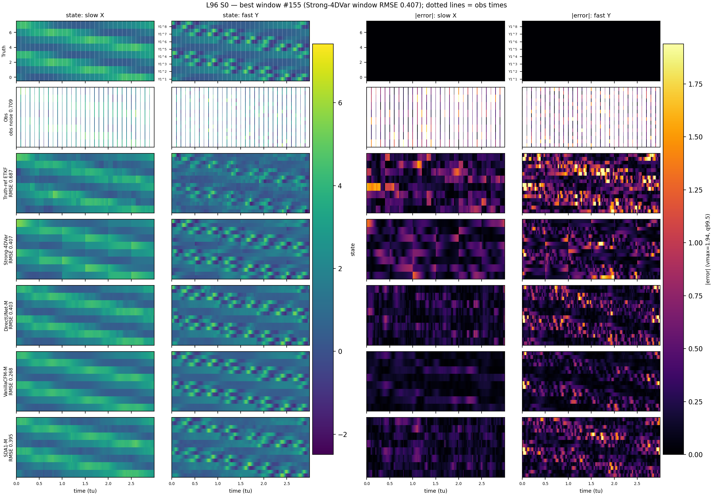
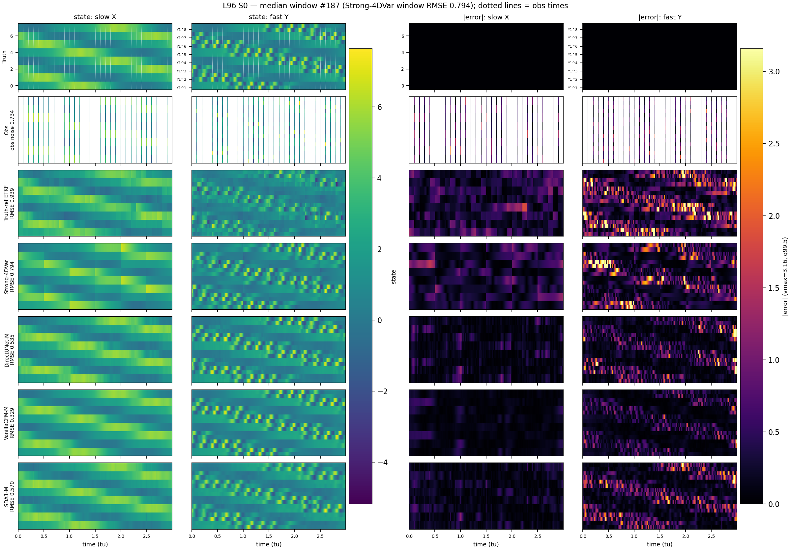
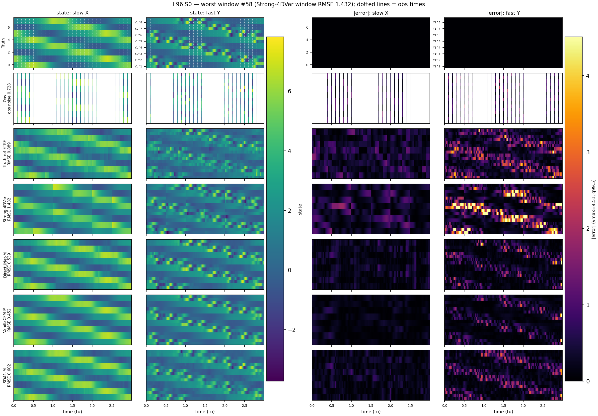
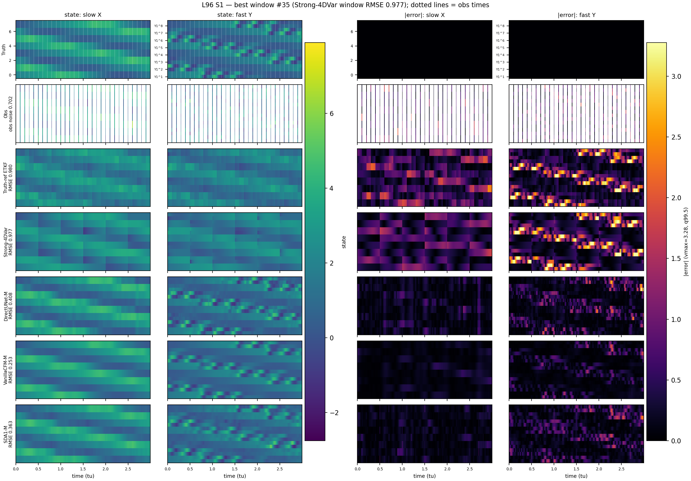
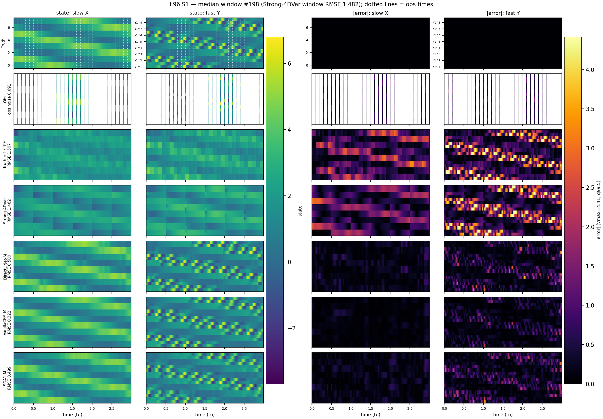
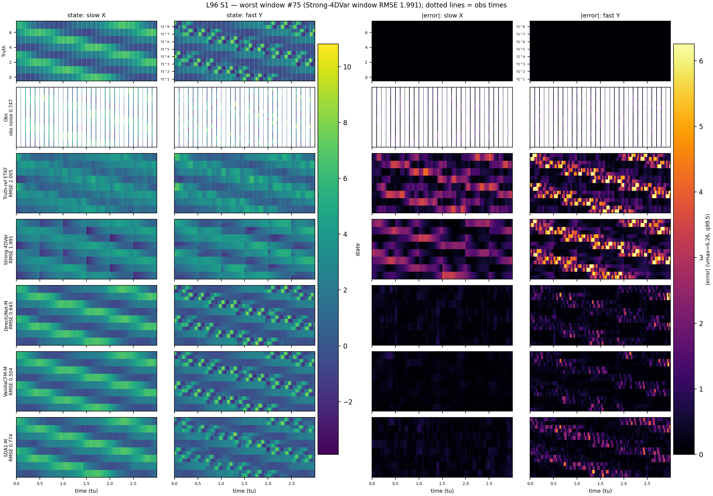

# P1 L96 benchmark — DA baselines, deterministic, flow-matching and SDA

Two-scale L96, `obs_interval=100`, `obs_j=2` (24D observed space), 200 shared cached test windows. Group `all_obs`; every cell is **mean ± std across windows**, in **physical units**. **S0** = true parameters; **S1** = ±20% parameter perturbation with ±10% bias (the DA forward model uses the biased `*_da` values), so `S1/S0` is a robustness-to-model-error ratio: 1.0 means untouched.

**One recipe for every learned row**: monai backbone, `data.normalize: true`, cosine annealing, 400 epochs, `batch_size: 16`, lr 1e-3, grad clip 10.0, **no obs-density augmentation**. Deviations are called out per row. Unrolled/4DVarNet schemes are out of P1 scope.

## Protocol

| family | protocol | columns |
|---|---|---|
| DA baselines | per-window assimilation over dws=500 | RMSE/MAE; spread where an ensemble variance is cached (EnKF/ETKF). No members are stored, so no ensemble CRPS |
| Deterministic | single forward pass | RMSE/MAE; `var ratio` = predicted/true variance (1.0 calibrated, ~0.35 collapsed) |
| Flow matching | `ens30_no10` (30 members, N_outer=10) | ensemble-mean RMSE; proper ensemble CRPS; `spread/RMSE` (1.0 calibrated) |
| SDA | guided `ens30`, `gw=20`, `r_var=0.5` | as above. **Must** use `eval_sda_l96.py`: SDA1 is an unconditional prior and the unguided sampler returns climatological spread |
| tau=0 mean | `mu(x0, 0, y)` over 30 draws | the flow's implied posterior mean as a point estimator; MAE (= CRPS of a point forecast), NOT comparable to ensemble CRPS |

A single draw from a generative model is a strictly worse estimator than its ensemble mean, so the two never share a column.

## 1. DA baselines

| scheme | params | S0 RMSE | S1 RMSE | S1/S0 | S0 MAE | S1 MAE | sp/RMSE (S0) | note |
|---|---|---|---|---|---|---|---|---|
| ETKF | — | 0.8662 ± 0.1455 | 1.4748 ± 0.2415 | 1.703 | 0.6124 | 1.0322 | 1.127 |  |
| EnKF | — | 0.8943 ± 0.1350 | 1.5123 ± 0.2487 | 1.691 | 0.6369 | 1.0842 | 1.089 |  |
| **Strong-4DVar** | — | **0.7383 ± 0.1915** | 1.4369 ± 0.2331 | 1.946 | 0.4850 | 0.9892 | — |  |

Source: `l96_baselines_trajectories_dws500_s0c_inf2.0_etkf_inf2.0_obsj2_int100_fw.npz`. S0 trajectories are stored in the full 40D state and indexed to the 24D observed subspace; S1 is already reduced.

## 2. Deterministic point estimators

| scheme | params | S0 RMSE | S1 RMSE | S1/S0 | S0 MAE | S1 MAE | var ratio | note |
|---|---|---|---|---|---|---|---|---|
| DirectUNet-S+ | 1.48 M | 0.4899 ± 0.0773 | 0.4894 ± 0.0751 | 0.999 | 0.3130 | 0.3138 | 1.000 |  |
| **DirectUNet-M** | 5.89 M | **0.4699 ± 0.0731** | 0.4706 ± 0.0716 | 1.002 | 0.2947 | 0.2948 | 0.978 |  |
| DirectUNet-L | 23.5 M | 0.8579 ± 0.1277 | 0.8590 ± 0.1296 | 1.001 | 0.5777 | 0.5792 | 0.724 | single unreliable run — an identical config gave 0.4705 on another seed |

### The flows' tau=0 mean components, as deterministic estimators (S0)

| scheme | RMSE | MAE | draw dispersion |
|---|---|---|---|
| PredictStateCFM-L (tau=0) | 0.4072 ± 0.0658 | 0.2555 | 0.0497 |
| PredictStateCFM-M (tau=0) | 0.4081 ± 0.0669 | 0.2582 | 0.0546 |
| VanillaCFM-M (tau=0) | 0.4101 ± 0.0689 | 0.2637 | 0.0919 |
| VanillaCFM-L (tau=0) | 0.4183 ± 0.0672 | 0.2654 | 0.0739 |
| PredictStateCFM-S+ (tau=0) | 0.4481 ± 0.0740 | 0.2922 | 0.0732 |
| VanillaCFM-S+ (tau=0) | 0.4726 ± 0.0849 | 0.3244 | 0.1227 |

`draw dispersion` is the across-draw scatter of `m` itself; 0 would mean fully deterministic in `y`. These rows cost 30 model calls against DirectUNet's 1.

## 3. Flow matching

| scheme | params | S0 RMSE | S1 RMSE | S1/S0 | S0 CRPS | S1 CRPS | sp/RMSE (S0) | note |
|---|---|---|---|---|---|---|---|---|
| VanillaCFM-S+ | 1.48 M | 0.4124 ± 0.0913 | 0.4100 ± 0.0864 | 0.994 | 0.2067 ± 0.0505 | 0.2071 ± 0.0479 | 0.555 |  |
| **VanillaCFM-M** | 5.89 M | **0.3445 ± 0.0732** | 0.3391 ± 0.0720 | 0.984 | 0.1568 ± 0.0331 | 0.1550 ± 0.0326 | 0.535 |  |
| VanillaCFM-L | 23.5 M | 0.3563 ± 0.0683 | 0.3530 ± 0.0649 | 0.991 | 0.1627 ± 0.0308 | 0.1615 ± 0.0292 | 0.509 |  |
| PredictStateCFM-S+ | 1.48 M | 0.4124 ± 0.0794 | 0.4120 ± 0.0814 | 0.999 | 0.2083 ± 0.0377 | 0.2093 ± 0.0402 | 0.395 |  |
| PredictStateCFM-M | 5.89 M | 0.3584 ± 0.0722 | 0.3554 ± 0.0738 | 0.992 | 0.1733 ± 0.0335 | 0.1727 ± 0.0348 | 0.400 |  |
| PredictStateCFM-L(lr3e-4) | 23.5 M | 0.3508 ± 0.0707 | 0.3459 ± 0.0714 | 0.986 | 0.1677 ± 0.0326 | 0.1660 ± 0.0334 | 0.390 | lr 3e-4 — the standard 1e-3 diverged at this tier |
| PredictStateCFM-L(lr5e-4) | 23.5 M | 0.3685 ± 0.0691 | 0.3637 ± 0.0666 | 0.987 | 0.1737 ± 0.0314 | 0.1722 ± 0.0312 | 0.400 | lr 5e-4 — the standard 1e-3 diverged at this tier |

## 4. SDA (score-based prior + guidance)

| scheme | params | S0 RMSE | S1 RMSE | S1/S0 | S0 CRPS | S1 CRPS | sp/RMSE (S0) | note |
|---|---|---|---|---|---|---|---|---|
| SDA1-S+ | 1.48 M | 0.6260 ± 0.1132 | 0.6253 ± 0.1118 | 0.999 | 0.3178 ± 0.0525 | 0.3174 ± 0.0518 | 0.520 |  |
| **SDA1-M** | 5.89 M | **0.5063 ± 0.0912** | 0.5049 ± 0.0906 | 0.997 | 0.2579 ± 0.0415 | 0.2577 ± 0.0407 | 0.416 |  |
| SDA1-L | 23.5 M | 0.5342 ± 0.0951 | 0.5332 ± 0.0948 | 0.998 | 0.2732 ± 0.0454 | 0.2727 ± 0.0446 | 0.399 |  |
| SDA2-M | 5.89 M | 0.5129 ± 0.0969 | 0.5130 ± 0.0973 | 1.000 | 0.2424 ± 0.0349 | 0.2420 ± 0.0352 | 0.550 |  |
| SDA3-M | 5.89 M | 0.5228 ± 0.1004 | 0.5229 ± 0.1006 | 1.000 | 0.2505 ± 0.0372 | 0.2503 ± 0.0376 | 0.532 |  |

## Cross-family reading

Best S0 of each family: **flow matching 0.3445**, deterministic 0.4699, SDA 0.5063, DA baselines 0.7383 — flow matching is 27% better than the deterministic baseline and 32% better than SDA, at matched tier, parameter count, schedule and data.

- **The S1/S0 ratio separates the two worlds.** Every learned scheme is essentially flat under model error (ratio ~1.00) because it never uses a forward model; the DA baselines degrade by ~1.7x, since their forward operator carries the bias. That makes the S1 column the strongest argument for the learned schemes, and it is a structural difference rather than a tuning one.
- **M is the right tier for every learned family.** S+ -> M is a large gain everywhere; M -> L gains nothing and is actively unreliable (2 of 5 L-tier runs failed to train).
- **The CFM parameterization is irrelevant.** VanillaCFM (velocity target) and PredictStateCFM (endpoint target) are statistically identical at S+ (paired t = 0.0) despite a 3x gap in training val_loss — val_loss is not comparable across objectives.
- **SDA's conditioning buys ~1-2% RMSE**, while its guidance weight is worth ~4x more (8% from tuning alone) — consistent with observations entering SDA only through the guidance term.
- **Every flow's tau=0 mean beats DirectUNet as a point estimator**, so the advantage is not only about sampling.

## Caveats

- DA baselines receive the same per-window parameters as truth generation (S0) or their biased `*_da` counterparts (S1); the learned schemes see observations only. This is what makes the comparison apples-to-apples, and also why their S1 behaviour differs so much.
- No ensemble members are cached for the DA baselines, so their MAE column is a point proxy and is not comparable to the generative families' ensemble CRPS.
- SDA is the only learned family with a tuned inference hyper-parameter (`gw`).
- The two PredictStateCFM-L rows use a non-standard lr, forced by an optimization failure at 1e-3 (val_loss jumped 6x at epoch 10 and never recovered).
- L-tier numbers are single runs with large measured seed sensitivity (DirectUNet-L: 0.4705 vs 0.8579 on two seeds of one config). Treat any single L cell as indicative.
- Checkpoint-selection noise on this family was measured at 15-21%; smaller differences need the paired within-window tests, not these point estimates.

## Reconstruction examples

Best / median / worst windows, ranked by Strong-4DVar per-window RMSE (the same convention as the consolidated benchmark, so window choices are comparable across reports). Rows are Truth / Obs / one best scheme per subcategory; columns are the state and |error| maps for the slow X (8D) and fast Y (16D) blocks. Generative rows are plotted as their **ensemble mean** — the estimator their RMSE column scores.

| case | rank | window | 4DVar win-RMSE | Truth-ref ETKF | Strong-4DVar | DirectUNet-M | VanillaCFM-M | SDA1-M |
|---|---|---|---|---|---|---|---|---|
| S0 | best | 155 | 0.407 | 0.687 | 0.407 | 0.403 | 0.268 | 0.395 |
| S0 | median | 187 | 0.794 | 0.939 | 0.794 | 0.535 | 0.329 | 0.570 |
| S0 | worst | 58 | 1.432 | 0.889 | 1.432 | 0.539 | 0.452 | 0.602 |
| S1 | best | 35 | 0.977 | 0.980 | 0.977 | 0.408 | 0.253 | 0.363 |
| S1 | median | 198 | 1.482 | 1.507 | 1.482 | 0.500 | 0.322 | 0.499 |
| S1 | worst | 75 | 1.991 | 2.005 | 1.991 | 0.645 | 0.504 | 0.774 |

**Observing system.** `obs_mask` is a single 1-D mask over time shared by every dimension, so slow and fast are observed at exactly the same instants: **30 observed timesteps per window** (`obs_interval=100` over T=3000). What differs between them is spatial, not temporal — all 8 slow X are observed, but only 16 of the 32 fast Y (`obs_j=2` of `J=4`), which is why the fast block is 16 rows.

Each observation is drawn as a 11-column band rather than a single 1/3000 column, which would be ~0.15 px and mostly vanish under rasterization. That is display-only and inflates the Obs row's |error| column (labelled 'obs noise') by ~1.7%; the undistorted values are S0/best 0.7067, S0/median 0.7216, S0/worst 0.7199, S1/best 0.7013, S1/median 0.6845, S1/worst 0.7327.

