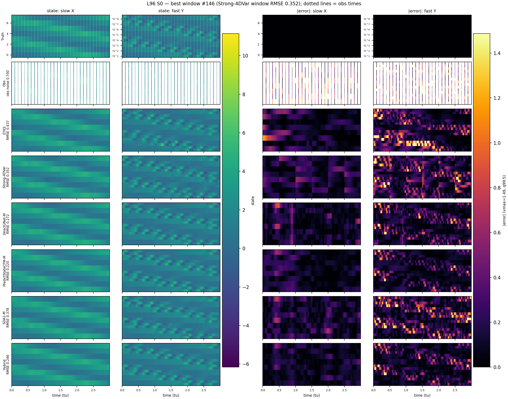
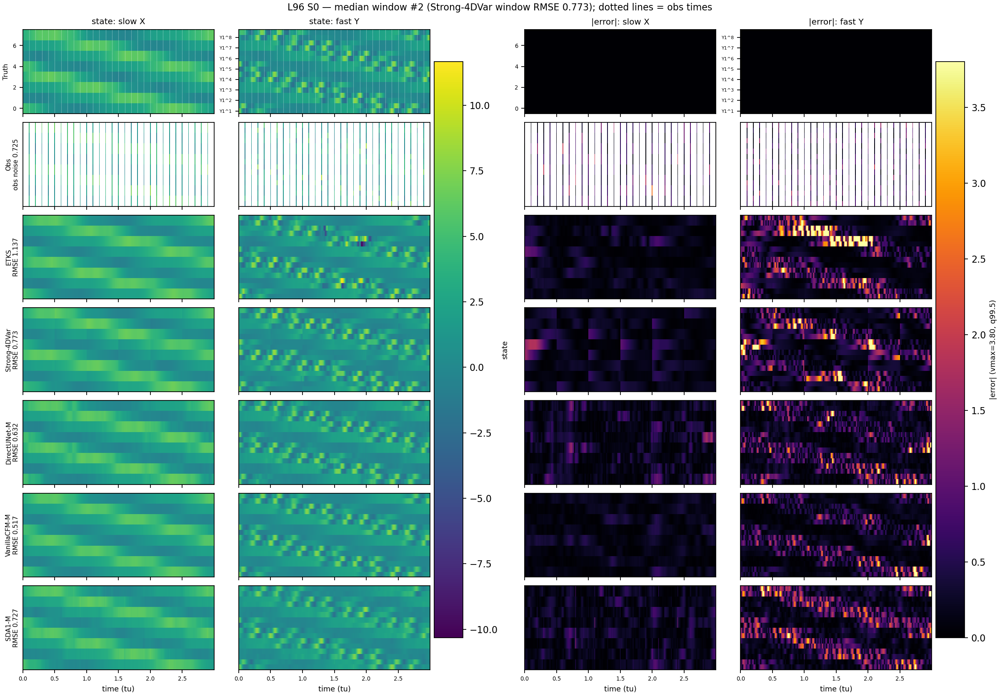
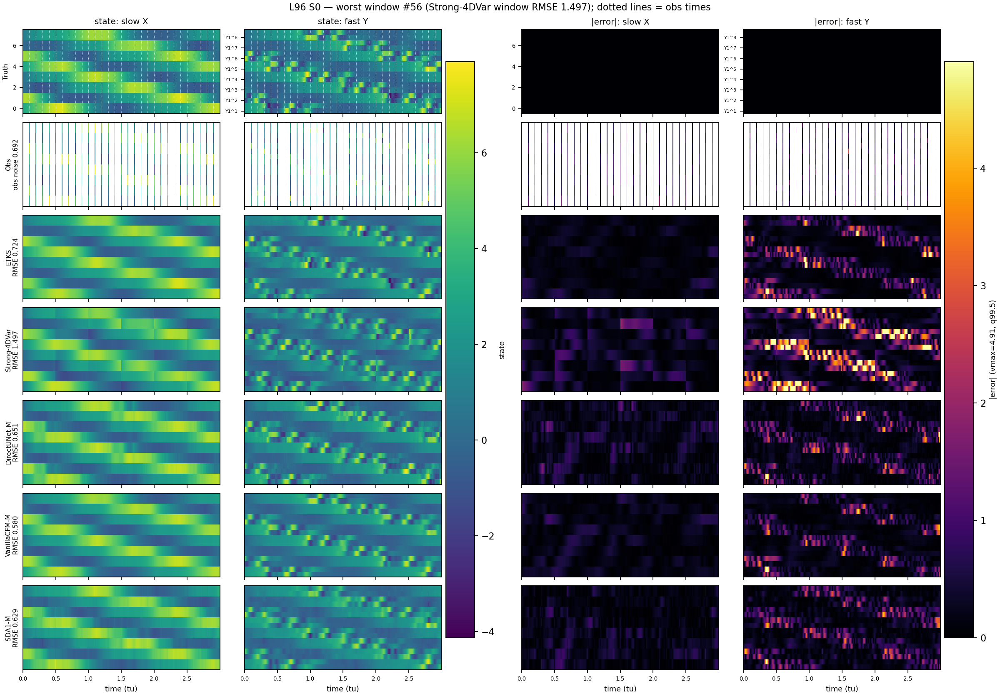
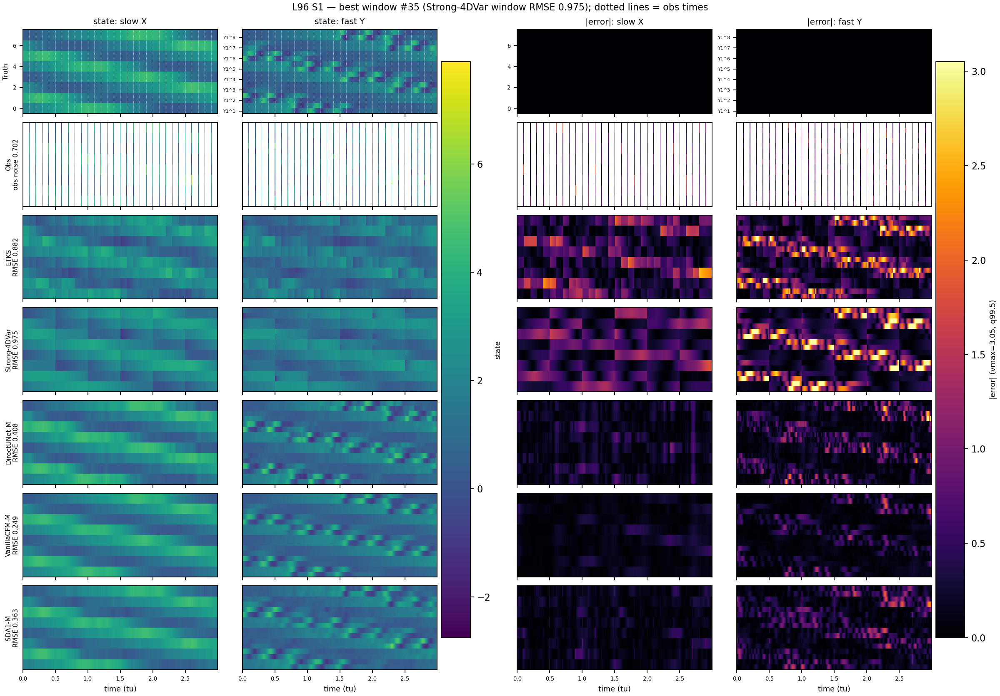
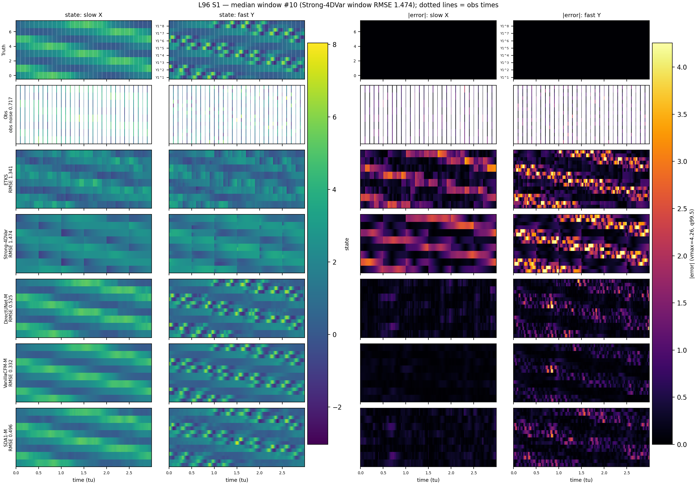
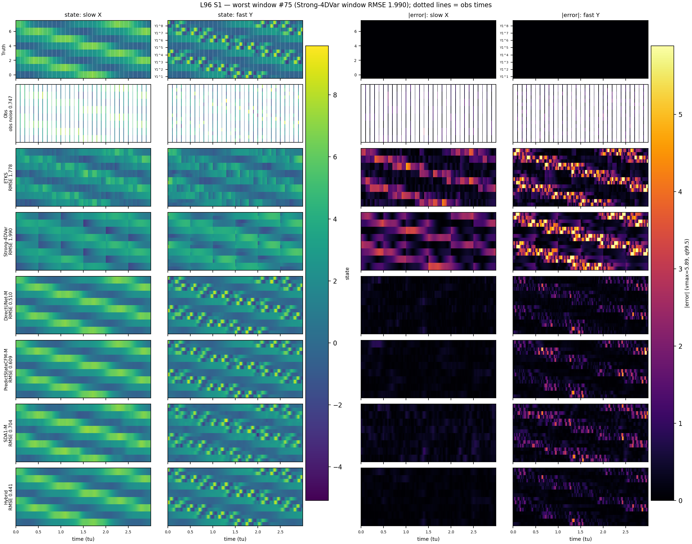

# P1 L96 benchmark — DA baselines, deterministic, flow-matching and SDA

Two-scale L96, `obs_interval=100`, `obs_j=2` (24D observed space), 200 shared cached test windows. Group `all_obs`; every cell is **mean ± std across windows**, in **physical units**. **S0** = true parameters; **S1** = ±20% parameter perturbation with ±10% bias (the DA forward model uses the biased `*_da` values), so `S1/S0` is a robustness-to-model-error ratio: 1.0 means untouched.

**One recipe for every learned row**: monai backbone, `data.normalize: true`, cosine annealing, 400 epochs, `batch_size: 16`, lr 1e-3, grad clip 10.0, **no obs-density augmentation**. Deviations are called out per row. Unrolled/4DVarNet schemes are out of P1 scope.

**Status (2026-09-27): superseded as the L96 benchmark by `l96_benchmark_extended.md`; kept as the P1-protocol record.** Every learned row here, SDA included, is trained for 400 epochs, so the families are budget-matched *within this report*. The benchmark default has since moved DirectUNet and the CFMs to 1200 epochs, and the SDA priors have since been retrained at 1200 epochs too: section 4 adds those rows (seed 1, the validation-tuned guidance weight 25), flagged because they sit outside this report's 400-epoch budget match; they do not enter the cross-family bests. The 400-epoch SDA rows use guidance weight 20 (validation-tuned: 25). **The DA baselines (section 1) are the current benchmark rows (updated 2026-09-29)**, on the same 200 regular-grid windows as every learned row: DA fast weights, the fixed ETKF square root (#291), the per-method inflation retuned on validation windows (#295: ETKF 1.15 / 2.5, EnKF 1.2 / 3.0), and the ETKS smoother (#299). They replace the P1-protocol DA rows (inflation 2.0, no DA fast weights, so S0 was not a perfect model). A flagged `ETKS, 100 members` row (2026-10-02) shows what a larger DA ensemble buys; it is a sensitivity row, outside the bests.

## Protocol

| family | protocol | columns |
|---|---|---|
| DA baselines | per-window assimilation (dws=500, DA fast weights); ETKS = the ETKF plus a full-window smoother | RMSE; analysis-ensemble CRPS and spread for ETKF/EnKF/ETKS; MAE (the CRPS of a point forecast) for Strong-4DVar |
| Deterministic | single forward pass | RMSE/MAE; `var ratio` = predicted/true variance (1.0 calibrated, ~0.35 collapsed) |
| Flow matching | `ens30_no20` (30 members, 20 early-fine steps; `ens30_no10` before 2026-09-24) | ensemble-mean RMSE; proper ensemble CRPS; `spread/RMSE` (1.0 calibrated) |
| SDA | guided `ens30`, `gw=20`, `r_var=0.5` | as above. **Must** use `eval_sda_l96.py`: SDA1 is an unconditional prior and the unguided sampler returns climatological spread |
| tau=0 mean | `mu(x0, 0, y)` over 30 draws | the flow's implied posterior mean as a point estimator; MAE (= CRPS of a point forecast), NOT comparable to ensemble CRPS |

A single draw from a generative model is a strictly worse estimator than its ensemble mean, so the two never share a column.

## 1. DA baselines

| scheme | params | S0 RMSE | S1 RMSE | S1/S0 | S0 CRPS (MAE for 4D-Var) | S1 CRPS (MAE for 4D-Var) | sp/RMSE (S0) | note |
|---|---|---|---|---|---|---|---|---|
| ETKF | λ 1.15 / 2.5 | 0.6102 ± 0.1480 | 1.4093 ± 0.2300 | 2.310 | 0.2704 | 0.7580 | 0.607 |  |
| EnKF | λ 1.2 / 3.0 | 0.6414 ± 0.1434 | 1.4159 ± 0.2287 | 2.207 | 0.2866 | 0.7634 | 0.647 |  |
| **ETKS** | λ 1.15 / 2.5 | **0.4969 ± 0.1644** | 1.3380 ± 0.2237 | 2.692 | 0.2382 | 0.7706 | 0.412 |  |
| Strong-4DVar | — | 0.7028 ± 0.1991 | 1.4362 ± 0.2325 | 2.044 | 0.4464 | 0.9879 | — |  |
| ETKS, 100 members | λ 1.05 / 2.5 | 0.3927 ± 0.1065 | 1.3384 ± 0.2215 | 3.408 | 0.1794 | 0.7690 | 0.462 | sensitivity, not the benchmark: 100 members (the benchmark and the learned ensembles use 30), inflation re-selected on the validation windows at N=100 |

Sources (report bundle `da_current_2026-09-29/`, the 100-member row `etks100_2026-10-02/`): `etks100_2026-10-02/etks100_test_regular_s0_lam1.05_per_window.npz`, `etks100_2026-10-02/etks100_test_regular_s1_lam2.5_per_window.npz`, `l96_baselines_trajectories_dws500_s0c_crps_infs0-1.2_s1-3.0_etkf_infs0-1.15_s1-2.5_obsj2_int100_fw_dafw.npz`, `l96_baselines_trajectories_dws500_s0c_inf2.0_etkf_inf2.0_obsj2_int100_fw_dafw.npz`, `l96_baselines_trajectories_dws500_s0c_test_etks-correct-Lfull-infs0-1.15_s1-2.5_infs0-1.2_s1-3.0_etkf_infs0-1.15_s1-2.5_obsj2_int100_fw_dafw.npz`. S0 trajectories are stored in the full 40D state and indexed to the 24D observed subspace; S1 is already reduced. Rows and protocol: `l96_benchmark_extended.md`.

## 2. Deterministic point estimators

| scheme | params | S0 RMSE | S1 RMSE | S1/S0 | S0 MAE | S1 MAE | var ratio | note |
|---|---|---|---|---|---|---|---|---|
| DirectUNet-S+ | 1.48 M | 0.4899 ± 0.0773 | 0.4894 ± 0.0751 | 0.999 | 0.3130 | 0.3138 | 1.000 |  |
| **DirectUNet-M** | 5.89 M | **0.4699 ± 0.0731** | 0.4706 ± 0.0716 | 1.002 | 0.2947 | 0.2948 | 0.978 |  |
| DirectUNet-L | 23.5 M | 0.8579 ± 0.1277 | 0.8590 ± 0.1296 | 1.001 | 0.5777 | 0.5792 | 0.724 | single unreliable run — an identical config gave 0.4705 on another seed |

### The flows' tau=0 mean components, as deterministic estimators (S0)

| scheme | RMSE | MAE | draw dispersion |
|---|---|---|---|
| PredictStateCFM-L (tau=0) | 0.4072 ± 0.0658 | 0.2555 | 0.0497 |
| PredictStateCFM-M (tau=0) | 0.4081 ± 0.0669 | 0.2582 | 0.0546 |
| VanillaCFM-M (tau=0) | 0.4101 ± 0.0689 | 0.2637 | 0.0919 |
| VanillaCFM-L (tau=0) | 0.4183 ± 0.0672 | 0.2654 | 0.0739 |
| PredictStateCFM-S+ (tau=0) | 0.4481 ± 0.0740 | 0.2922 | 0.0732 |
| VanillaCFM-S+ (tau=0) | 0.4726 ± 0.0849 | 0.3244 | 0.1227 |

`draw dispersion` is the across-draw scatter of `m` itself; 0 would mean fully deterministic in `y`. These rows cost 30 model calls against DirectUNet's 1.

## 3. Flow matching

| scheme | params | S0 RMSE | S1 RMSE | S1/S0 | S0 CRPS | S1 CRPS | sp/RMSE (S0) | note |
|---|---|---|---|---|---|---|---|---|
| VanillaCFM-S+ | 1.48 M | 0.4096 ± 0.0917 | 0.4070 ± 0.0870 | 0.994 | 0.2020 ± 0.0495 | 0.2023 ± 0.0469 | 0.639 |  |
| **VanillaCFM-M** | 5.89 M | **0.3412 ± 0.0734** | 0.3358 ± 0.0727 | 0.984 | 0.1527 ± 0.0320 | 0.1509 ± 0.0318 | 0.614 |  |
| VanillaCFM-L | 23.5 M | 0.3522 ± 0.0678 | 0.3488 ± 0.0649 | 0.990 | 0.1578 ± 0.0294 | 0.1565 ± 0.0281 | 0.595 |  |
| PredictStateCFM-S+ | 1.48 M | 0.4079 ± 0.0793 | 0.4073 ± 0.0808 | 0.998 | 0.1986 ± 0.0361 | 0.1994 ± 0.0382 | 0.485 |  |
| PredictStateCFM-M | 5.89 M | 0.3536 ± 0.0716 | 0.3504 ± 0.0734 | 0.991 | 0.1656 ± 0.0320 | 0.1650 ± 0.0334 | 0.487 |  |
| PredictStateCFM-L(lr3e-4) | 23.5 M | 0.3459 ± 0.0702 | 0.3412 ± 0.0708 | 0.987 | 0.1605 ± 0.0312 | 0.1589 ± 0.0320 | 0.470 | lr 3e-4 — the standard 1e-3 diverged at this tier |
| PredictStateCFM-L(lr5e-4) | 23.5 M | 0.3641 ± 0.0685 | 0.3594 ± 0.0662 | 0.987 | 0.1664 ± 0.0299 | 0.1650 ± 0.0298 | 0.488 | lr 5e-4 — the standard 1e-3 diverged at this tier |

## 4. SDA (score-based prior + guidance)

| scheme | params | S0 RMSE | S1 RMSE | S1/S0 | S0 CRPS | S1 CRPS | sp/RMSE (S0) | note |
|---|---|---|---|---|---|---|---|---|
| SDA1-S+ | 1.48 M | 0.6260 ± 0.1132 | 0.6253 ± 0.1118 | 0.999 | 0.3178 ± 0.0525 | 0.3174 ± 0.0518 | 0.520 |  |
| **SDA1-M** | 5.89 M | **0.5063 ± 0.0912** | 0.5049 ± 0.0906 | 0.997 | 0.2579 ± 0.0415 | 0.2577 ± 0.0407 | 0.416 |  |
| SDA1-L | 23.5 M | 0.5342 ± 0.0951 | 0.5332 ± 0.0948 | 0.998 | 0.2732 ± 0.0454 | 0.2727 ± 0.0446 | 0.399 |  |
| SDA2-M | 5.89 M | 0.5125 ± 0.0966 | 0.5226 ± 0.1005 | 1.020 | 0.2423 ± 0.0349 | 0.2431 ± 0.0362 | 0.549 |  |
| SDA3-M | 5.89 M | 0.5228 ± 0.1002 | 0.5295 ± 0.1035 | 1.013 | 0.2504 ± 0.0372 | 0.2474 ± 0.0373 | 0.533 | bias never active in training (DA params = truth): identical to SDA2 by construction |
| SDA3-fix-M | 5.89 M | 0.4984 ± 0.0930 | 0.5065 ± 0.0964 | 1.016 | 0.2469 ± 0.0397 | 0.2503 ± 0.0412 | 0.454 | SDA3 with the noisy-DA-bias conditioning active (added 2026-09-26) |
| SDA1-M, 1200 ep | 5.89 M | 0.4577 ± 0.0816 | 0.4564 ± 0.0812 | 0.997 | 0.2321 ± 0.0365 | 0.2309 ± 0.0353 | 0.408 | 1200-epoch prior, gw 25 (validation-tuned) -- outside this report's 400-epoch budget match |
| SDA2-M, 1200 ep | 5.89 M | 0.4506 ± 0.0820 | 0.4612 ± 0.0844 | 1.023 | 0.2139 ± 0.0302 | 0.2171 ± 0.0300 | 0.532 | 1200-epoch prior, gw 25 (validation-tuned) -- outside this report's 400-epoch budget match |
| SDA3-fix-M, 1200 ep | 5.89 M | 0.4564 ± 0.0861 | 0.4586 ± 0.0856 | 1.005 | 0.2207 ± 0.0362 | 0.2216 ± 0.0350 | 0.480 | 1200-epoch prior, gw 25 (validation-tuned) -- outside this report's 400-epoch budget match |

## Cross-family reading

Best S0 of each family: **flow matching 0.3412**, deterministic 0.4699, SDA 0.5063, DA baselines 0.4969 — flow matching is 27% better than the deterministic baseline and 33% better than SDA, at matched tier, parameter count, schedule and data.

- **The S1/S0 ratio separates the two worlds.** Every learned scheme is essentially flat under model error (ratio ~1.00) because it never uses a forward model; the DA baselines degrade by 2.0-2.7x, since their forward operator carries the bias. That makes the S1 column the strongest argument for the learned schemes, and it is a structural difference rather than a tuning one.
- **M is the right tier for every learned family.** S+ -> M is a large gain everywhere; M -> L gains nothing and is actively unreliable (2 of 5 L-tier runs failed to train).
- **The CFM parameterization is irrelevant.** VanillaCFM (velocity target) and PredictStateCFM (endpoint target) are statistically identical at S+ (paired t = 0.7, p = 0.48) despite a 3x gap in training val_loss — val_loss is not comparable across objectives.
- **SDA's params conditioning buys nothing here**: SDA2/SDA3 never beat SDA1-M, and with the biased DA params at S1 (fixed 2026-09-25; S1 previously fed them the true params) both lose 1-2%, since both were trained with DA params equal to the true ones. The guidance weight is worth far more (8% from tuning alone); an SDA3 trained on noisy DA params is robust at S1 at the tuned gw 25 (`l96_benchmark_extended.md`) -- at this report's gw 20 its SDA3-fix-M row still loses 1.6%, and on the random observing system it degrades about as much as the unconditional SDA1 (1.5% vs 2.0% at gw 25). At 1200 epochs (flagged rows) every SDA prior gains 7-9% at S0 and the pattern holds: SDA2 still loses at S1, SDA3-fix does not.
- **Every flow's tau=0 mean beats DirectUNet as a point estimator**, so the advantage is not only about sampling.

## Per-window RMSE / EV / CRPS summary (current benchmark)

Common to `l96_benchmark_extended.md` and `p1_l96_benchmark.md`, and generated from the `benchmark_extended` inputs by `reports/l96/per_window_summary.py`. The DA rows use the #295 inflation (#298), the ETKS is the #299 row, and DirectUNet / CFM / the SDA priors are at 1200 epochs (SDA retrained in #307; the hybrid uses the 1200-epoch SDA3-fix prior, seed 1). The hybrid is shown for reference.

Per window, on the 24 observed channels of the 200 P1 test windows: **RMSE** is the per-channel RMSE over time; **EV** is per-channel 1 - SSE/SST over time, with SST about the window's own mean, so it is lower than the pooled EV of the benchmark JSONs; **CRPS** is taken on the analysis ensemble (DA) or the members (flows, SDA). Each is averaged over channels. Seeds are averaged per window; cells are mean ± sd over the 200 windows. Per column, the best value is in **bold** and the second best in *italics*. Deterministic schemes have no CRPS. The random-layout Strong-4DVar trajectories were not kept, so that cell has no EV.

**RMSE** (lower is better)

| family | scheme | seeds | regular S0 | regular S1 | random S0 | random S1 |
|---|---|---|---|---|---|---|
| DA | ETKF (inflation 1.15 / 2.5) | — | 0.610 ± 0.148 | 1.409 ± 0.230 | 0.679 ± 0.243 | 1.407 ± 0.308 |
| DA | EnKF (inflation 1.2 / 3.0) | — | 0.641 ± 0.143 | 1.416 ± 0.229 | 0.706 ± 0.236 | 1.484 ± 0.370 |
| DA | ETKS (inflation 1.15 / 2.5) | — | 0.497 ± 0.164 | 1.338 ± 0.224 | 0.572 ± 0.258 | 1.347 ± 0.298 |
| DA | Strong-4DVar | — | 0.703 ± 0.199 | 1.436 ± 0.232 | 0.742 ± 0.310 | 1.444 ± 0.246 |
| SDA (gw 25, 1200 ep) | SDA1-M | 3 | 0.464 ± 0.083 | 0.462 ± 0.081 | 0.572 ± 0.230 | 0.585 ± 0.228 |
| SDA (gw 25, 1200 ep) | SDA2-M | 3 | 0.453 ± 0.085 | 0.465 ± 0.088 | 0.550 ± 0.220 | 0.575 ± 0.218 |
| SDA (gw 25, 1200 ep) | SDA3-fix-M | 3 | 0.455 ± 0.081 | 0.455 ± 0.079 | 0.562 ± 0.228 | 0.573 ± 0.221 |
| DirectUNet (1200 ep) | DirectUNet-M | 3 | *0.340* ± 0.062 | 0.339 ± 0.063 | 0.450 ± 0.315 | *0.444* ± 0.269 |
| CFM (1200 ep) | PredictStateCFM-M | 3 | 0.341 ± 0.078 | *0.338* ± 0.079 | *0.443* ± 0.260 | 0.447 ± 0.233 |
| CFM (1200 ep) | VanillaCFM-M | 3 | 0.351 ± 0.079 | 0.349 ± 0.080 | 0.462 ± 0.277 | 0.468 ± 0.250 |
| *reference* | *Hybrid DirectUNet-M(1200 ep) -> SDA3-fix-M(1200 ep)* | 3 | **0.293** ± 0.060 | **0.289** ± 0.060 | **0.367** ± 0.221 | **0.367** ± 0.201 |

**EV** (higher is better)

| family | scheme | seeds | regular S0 | regular S1 | random S0 | random S1 |
|---|---|---|---|---|---|---|
| DA | ETKF (inflation 1.15 / 2.5) | — | 0.821 ± 0.067 | 0.265 ± 0.076 | 0.766 ± 0.143 | 0.152 ± 0.303 |
| DA | EnKF (inflation 1.2 / 3.0) | — | 0.802 ± 0.070 | 0.258 ± 0.076 | 0.754 ± 0.135 | 0.028 ± 0.564 |
| DA | ETKS (inflation 1.15 / 2.5) | — | 0.872 ± 0.077 | 0.350 ± 0.084 | 0.818 ± 0.143 | 0.222 ± 0.259 |
| DA | Strong-4DVar | — | 0.745 ± 0.124 | 0.229 ± 0.072 | — | — |
| SDA (gw 25, 1200 ep) | SDA1-M | 3 | 0.908 ± 0.013 | 0.908 ± 0.012 | 0.842 ± 0.114 | 0.833 ± 0.115 |
| SDA (gw 25, 1200 ep) | SDA2-M | 3 | 0.912 ± 0.013 | 0.906 ± 0.013 | 0.853 ± 0.104 | 0.839 ± 0.105 |
| SDA (gw 25, 1200 ep) | SDA3-fix-M | 3 | 0.911 ± 0.013 | 0.911 ± 0.011 | 0.847 ± 0.111 | 0.839 ± 0.109 |
| DirectUNet (1200 ep) | DirectUNet-M | 3 | *0.950* ± 0.011 | *0.950* ± 0.011 | 0.889 ± 0.142 | *0.892* ± 0.124 |
| CFM (1200 ep) | PredictStateCFM-M | 3 | 0.947 ± 0.016 | 0.947 ± 0.016 | *0.890* ± 0.116 | 0.889 ± 0.108 |
| CFM (1200 ep) | VanillaCFM-M | 3 | 0.944 ± 0.016 | 0.944 ± 0.016 | 0.882 ± 0.123 | 0.879 ± 0.116 |
| *reference* | *Hybrid DirectUNet-M(1200 ep) -> SDA3-fix-M(1200 ep)* | 3 | **0.961** ± 0.011 | **0.961** ± 0.011 | **0.921** ± 0.092 | **0.922** ± 0.087 |

**CRPS** (lower is better)

| family | scheme | seeds | regular S0 | regular S1 | random S0 | random S1 |
|---|---|---|---|---|---|---|
| DA | ETKF (inflation 1.15 / 2.5) | — | 0.270 ± 0.071 | 0.758 ± 0.132 | 0.306 ± 0.111 | 0.786 ± 0.173 |
| DA | EnKF (inflation 1.2 / 3.0) | — | 0.287 ± 0.069 | 0.763 ± 0.124 | 0.320 ± 0.109 | 0.837 ± 0.186 |
| DA | ETKS (inflation 1.15 / 2.5) | — | 0.238 ± 0.085 | 0.771 ± 0.142 | 0.269 ± 0.122 | 0.744 ± 0.179 |
| DA | Strong-4DVar | — | — | — | — | — |
| SDA (gw 25, 1200 ep) | SDA1-M | 3 | 0.235 ± 0.037 | 0.234 ± 0.035 | 0.294 ± 0.107 | 0.302 ± 0.107 |
| SDA (gw 25, 1200 ep) | SDA2-M | 3 | 0.213 ± 0.031 | 0.218 ± 0.032 | 0.258 ± 0.080 | 0.266 ± 0.076 |
| SDA (gw 25, 1200 ep) | SDA3-fix-M | 3 | 0.223 ± 0.033 | 0.223 ± 0.032 | 0.278 ± 0.098 | 0.282 ± 0.092 |
| DirectUNet (1200 ep) | DirectUNet-M | 3 | — | — | — | — |
| CFM (1200 ep) | PredictStateCFM-M | 3 | *0.150* ± 0.033 | *0.148* ± 0.034 | *0.194* ± 0.115 | *0.196* ± 0.102 |
| CFM (1200 ep) | VanillaCFM-M | 3 | 0.152 ± 0.033 | 0.151 ± 0.034 | 0.202 ± 0.129 | 0.205 ± 0.115 |
| *reference* | *Hybrid DirectUNet-M(1200 ep) -> SDA3-fix-M(1200 ep)* | 3 | **0.137** ± 0.026 | **0.136** ± 0.026 | **0.175** ± 0.112 | **0.173** ± 0.098 |

## Distributional score FMS_τ (current benchmark)

FMS_τ(q) = E‖E_q[x₁ | x_τ] − x₁*‖² on the path x_τ = τ x₁ + (1−τ) x₀ (x₀ ~ N(0, I) in the z-scored space), reported in **physical units²** (σ_c²-weighted over the 24 observed channels). τ = 0 is the MSE of the ensemble mean; each τ ∈ (0, 1) is strictly proper; for a Gaussian forecast it is minimised at spread² = MSE at every τ, so τ > 0 rewards calibration; a point estimate scores its MSE at every τ. All rows use the Gaussian form (per-element N(mean, var)), so DA, flows and SDA are scored alike. Seeds are averaged per window; every cell is the value on the 200 test windows with its **95% window-bootstrap interval** (2000 replicates). Per column, best **bold**, second *italic*. τ = 0.95 is omitted (dominated by the universal 1/snr floor). Code: `reports/l96/probe_fm_score*.py`, `reports/l96/summarise_fm_score_current.py`; notes: `docs/results/l96_p1_fm_score.md`.

**FMS at τ = 0.0** (lower is better; = MSE)

| family | scheme | seeds | regular S0 | regular S1 | random S0 | random S1 |
|---|---|---|---|---|---|---|
| DA | ETKF (λ 1.15 / 2.5) | — | 0.5100 [0.4714, 0.5508] | 2.1192 [2.0288, 2.2118] | 0.6666 [0.6026, 0.7354] | 2.3820 [2.2391, 2.5291] |
| DA | EnKF (λ 1.2 / 3.0) | — | 0.5595 [0.5234, 0.5991] | 2.1385 [2.0469, 2.2316] | 0.6972 [0.6350, 0.7650] | 2.7193 [2.5066, 2.9459] |
| DA | ETKS (λ 1.15 / 2.5) | — | 0.3765 [0.3366, 0.4238] | 1.8843 [1.8023, 1.9671] | 0.5245 [0.4572, 0.5959] | 2.1807 [2.0502, 2.3160] |
| DA | Strong-4DVar | — | 0.7282 [0.6697, 0.7928] | 2.1992 [2.1028, 2.2932] | — | — |
| DirectUNet (1200 ep) | DirectUNet-M | 3 | *0.1407 [0.1330, 0.1483]* | *0.1400 [0.1324, 0.1479]* | 0.3367 [0.2744, 0.4035] | *0.3136 [0.2645, 0.3694]* |
| CFM (1200 ep) | PredictStateCFM-M | 3 | 0.1531 [0.1431, 0.1636] | 0.1502 [0.1401, 0.1605] | *0.3232 [0.2723, 0.3772]* | 0.3207 [0.2780, 0.3681] |
| CFM (1200 ep) | VanillaCFM-M | 3 | 0.1623 [0.1518, 0.1731] | 0.1599 [0.1496, 0.1704] | 0.3477 [0.2939, 0.4061] | 0.3489 [0.3018, 0.4001] |
| SDA (1200 ep, gw 25) | SDA1-M | 3 | 0.2610 [0.2482, 0.2755] | 0.2592 [0.2461, 0.2728] | 0.4540 [0.4016, 0.5099] | 0.4807 [0.4295, 0.5345] |
| SDA (1200 ep, gw 25) | SDA2-M | 3 | 0.2530 [0.2399, 0.2671] | 0.2657 [0.2518, 0.2801] | 0.4245 [0.3753, 0.4763] | 0.4659 [0.4175, 0.5167] |
| SDA (1200 ep, gw 25) | SDA3-fix-M | 3 | 0.2525 [0.2401, 0.2664] | 0.2516 [0.2391, 0.2646] | 0.4414 [0.3895, 0.4964] | 0.4598 [0.4111, 0.5112] |
| *reference* | Hybrid DirectUNet-M → SDA3-fix-M | 3 | **0.1109 [0.1042, 0.1179]** | **0.1088 [0.1019, 0.1160]** | **0.2293 [0.1905, 0.2728]** | **0.2275 [0.1931, 0.2661]** |

**FMS at τ = 0.25** (lower is better)

| family | scheme | seeds | regular S0 | regular S1 | random S0 | random S1 |
|---|---|---|---|---|---|---|
| DA | ETKF (λ 1.15 / 2.5) | — | 0.4749 [0.4402, 0.5119] | 2.0264 [1.9405, 2.1135] | 0.5937 [0.5419, 0.6497] | 2.1548 [2.0419, 2.2689] |
| DA | EnKF (λ 1.2 / 3.0) | — | 0.5215 [0.4889, 0.5571] | 2.0195 [1.9351, 2.1051] | 0.6223 [0.5710, 0.6775] | 2.3219 [2.2009, 2.4424] |
| DA | ETKS (λ 1.15 / 2.5) | — | 0.3663 [0.3276, 0.4120] | 1.8539 [1.7731, 1.9357] | 0.4834 [0.4247, 0.5453] | 2.0421 [1.9256, 2.1574] |
| DA | Strong-4DVar | — | 0.7282 [0.6697, 0.7928] | 2.1992 [2.1028, 2.2932] | — | — |
| DirectUNet (1200 ep) | DirectUNet-M | 3 | *0.1407 [0.1330, 0.1483]* | *0.1400 [0.1324, 0.1479]* | 0.3367 [0.2744, 0.4035] | 0.3136 [0.2645, 0.3694] |
| CFM (1200 ep) | PredictStateCFM-M | 3 | 0.1465 [0.1372, 0.1560] | 0.1439 [0.1346, 0.1533] | *0.2936 [0.2496, 0.3404]* | *0.2915 [0.2542, 0.3328]* |
| CFM (1200 ep) | VanillaCFM-M | 3 | 0.1546 [0.1451, 0.1644] | 0.1527 [0.1432, 0.1623] | 0.3160 [0.2690, 0.3666] | 0.3171 [0.2762, 0.3616] |
| SDA (1200 ep, gw 25) | SDA1-M | 3 | 0.2510 [0.2392, 0.2643] | 0.2494 [0.2374, 0.2619] | 0.4249 [0.3773, 0.4756] | 0.4495 [0.4026, 0.4981] |
| SDA (1200 ep, gw 25) | SDA2-M | 3 | 0.2402 [0.2285, 0.2529] | 0.2527 [0.2401, 0.2657] | 0.3822 [0.3413, 0.4252] | 0.4132 [0.3739, 0.4544] |
| SDA (1200 ep, gw 25) | SDA3-fix-M | 3 | 0.2417 [0.2304, 0.2545] | 0.2409 [0.2297, 0.2527] | 0.4074 [0.3617, 0.4553] | 0.4218 [0.3793, 0.4667] |
| *reference* | Hybrid DirectUNet-M → SDA3-fix-M | 3 | **0.1088 [0.1024, 0.1156]** | **0.1067 [0.1001, 0.1136]** | **0.2207 [0.1840, 0.2621]** | **0.2191 [0.1868, 0.2554]** |

**FMS at τ = 0.5** (lower is better)

| family | scheme | seeds | regular S0 | regular S1 | random S0 | random S1 |
|---|---|---|---|---|---|---|
| DA | ETKF (λ 1.15 / 2.5) | — | 0.3393 [0.3163, 0.3634] | 1.4858 [1.4284, 1.5445] | 0.3632 [0.3402, 0.3885] | 1.3868 [1.3217, 1.4533] |
| DA | EnKF (λ 1.2 / 3.0) | — | 0.3716 [0.3493, 0.3957] | 1.3914 [1.3425, 1.4411] | 0.3826 [0.3591, 0.4069] | 1.4088 [1.3565, 1.4612] |
| DA | ETKS (λ 1.15 / 2.5) | — | 0.3129 [0.2811, 0.3512] | 1.6426 [1.5723, 1.7143] | 0.3344 [0.3023, 0.3661] | 1.5315 [1.4459, 1.6191] |
| DA | Strong-4DVar | — | 0.7282 [0.6697, 0.7928] | 2.1992 [2.1028, 2.2932] | — | — |
| DirectUNet (1200 ep) | DirectUNet-M | 3 | 0.1407 [0.1330, 0.1483] | 0.1400 [0.1324, 0.1479] | 0.3367 [0.2744, 0.4035] | 0.3136 [0.2645, 0.3694] |
| CFM (1200 ep) | PredictStateCFM-M | 3 | *0.1156 [0.1094, 0.1220]* | *0.1139 [0.1079, 0.1201]* | *0.1913 [0.1678, 0.2161]* | *0.1907 [0.1702, 0.2124]* |
| CFM (1200 ep) | VanillaCFM-M | 3 | 0.1202 [0.1141, 0.1263] | 0.1194 [0.1132, 0.1254] | 0.2045 [0.1786, 0.2321] | 0.2058 [0.1823, 0.2300] |
| SDA (1200 ep, gw 25) | SDA1-M | 3 | 0.2028 [0.1950, 0.2112] | 0.2020 [0.1942, 0.2101] | 0.3037 [0.2754, 0.3343] | 0.3206 [0.2921, 0.3496] |
| SDA (1200 ep, gw 25) | SDA2-M | 3 | 0.1836 [0.1769, 0.1906] | 0.1924 [0.1852, 0.1995] | 0.2441 [0.2258, 0.2630] | 0.2541 [0.2368, 0.2718] |
| SDA (1200 ep, gw 25) | SDA3-fix-M | 3 | 0.1911 [0.1840, 0.1988] | 0.1904 [0.1835, 0.1974] | 0.2775 [0.2535, 0.3029] | 0.2811 [0.2580, 0.3044] |
| *reference* | Hybrid DirectUNet-M → SDA3-fix-M | 3 | **0.0963 [0.0911, 0.1018]** | **0.0944 [0.0892, 0.0997]** | **0.1765 [0.1497, 0.2060]** | **0.1757 [0.1524, 0.2018]** |

**FMS at τ = 0.75** (lower is better)

| family | scheme | seeds | regular S0 | regular S1 | random S0 | random S1 |
|---|---|---|---|---|---|---|
| DA | ETKF (λ 1.15 / 2.5) | — | 0.1342 [0.1245, 0.1445] | 0.3866 [0.3768, 0.3971] | 0.1181 [0.1134, 0.1232] | 0.3667 [0.3433, 0.3918] |
| DA | EnKF (λ 1.2 / 3.0) | — | 0.1493 [0.1386, 0.1610] | 0.3464 [0.3401, 0.3528] | 0.1288 [0.1221, 0.1358] | 0.3461 [0.3313, 0.3621] |
| DA | ETKS (λ 1.15 / 2.5) | — | 0.1708 [0.1526, 0.1919] | 0.7807 [0.7481, 0.8145] | 0.1303 [0.1208, 0.1394] | 0.5480 [0.5030, 0.5954] |
| DA | Strong-4DVar | — | 0.7282 [0.6697, 0.7928] | 2.1992 [2.1028, 2.2932] | — | — |
| DirectUNet (1200 ep) | DirectUNet-M | 3 | 0.1407 [0.1330, 0.1483] | 0.1400 [0.1324, 0.1479] | 0.3367 [0.2744, 0.4035] | 0.3136 [0.2645, 0.3694] |
| CFM (1200 ep) | PredictStateCFM-M | 3 | **0.0565 [0.0545, 0.0587]** | **0.0558 [0.0537, 0.0580]** | **0.0722 [0.0664, 0.0782]** | **0.0725 [0.0672, 0.0778]** |
| CFM (1200 ep) | VanillaCFM-M | 3 | *0.0571 [0.0552, 0.0591]* | 0.0570 [0.0549, 0.0592] | *0.0746 [0.0683, 0.0814]* | *0.0757 [0.0698, 0.0817]* |
| SDA (1200 ep, gw 25) | SDA1-M | 3 | 0.1097 [0.1074, 0.1122] | 0.1096 [0.1073, 0.1118] | 0.1359 [0.1294, 0.1432] | 0.1433 [0.1358, 0.1507] |
| SDA (1200 ep, gw 25) | SDA2-M | 3 | 0.0910 [0.0896, 0.0925] | 0.0935 [0.0920, 0.0950] | 0.1034 [0.1008, 0.1063] | 0.1047 [0.1022, 0.1072] |
| SDA (1200 ep, gw 25) | SDA3-fix-M | 3 | 0.0997 [0.0979, 0.1015] | 0.0992 [0.0975, 0.1009] | 0.1192 [0.1150, 0.1238] | 0.1181 [0.1141, 0.1221] |
| *reference* | Hybrid DirectUNet-M → SDA3-fix-M | 3 | 0.0577 [0.0555, 0.0601] | *0.0565 [0.0542, 0.0587]* | 0.0839 [0.0742, 0.0943] | 0.0833 [0.0746, 0.0924] |

**Calibration**: pooled spread/skill (physical units; calibrated √(N/(N+1)) = 0.984 for N = 30) and calibration loss = share of FMS removed by the best scalar rescaling c·var (c* in brackets; refitted in every bootstrap replicate). Point estimates have no spread.

| scheme | metric | regular S0 | regular S1 | random S0 | random S1 |
|---|---|---|---|---|---|
| ETKF (λ 1.15 / 2.5) | spread/skill | 0.78 [0.76, 0.80] | 0.60 [0.58, 0.61] | 0.88 [0.87, 0.90] | 0.99 [0.94, 1.03] |
| ETKF (λ 1.15 / 2.5) | cal. loss τ=0.5 (%) | 3 [2, 4] (c* 1.7) | 15 [14, 16] (c* 2.8) | 2 [1, 2] (c* 1.4) | 1 [0, 2] (c* 1.2) |
| ETKF (λ 1.15 / 2.5) | cal. loss τ=0.75 (%) | 11 [9, 14] (c* 2.5) | 22 [21, 24] (c* 3.1) | 3 [2, 4] (c* 1.5) | 12 [8, 17] (c* 3.5) |
| EnKF (λ 1.2 / 3.0) | spread/skill | 0.84 [0.82, 0.86] | 0.73 [0.71, 0.75] | 0.96 [0.94, 0.98] | 1.11 [1.07, 1.14] |
| EnKF (λ 1.2 / 3.0) | cal. loss τ=0.5 (%) | 1 [1, 1] (c* 1.4) | 7 [6, 8] (c* 1.9) | 0 [0, 0] (c* 1.1) | 0 [0, 0] (c* 1.0) |
| EnKF (λ 1.2 / 3.0) | cal. loss τ=0.75 (%) | 11 [9, 14] (c* 2.8) | 12 [10, 13] (c* 2.5) | 2 [1, 3] (c* 1.5) | 7 [4, 10] (c* 2.8) |
| ETKS (λ 1.15 / 2.5) | spread/skill | 0.47 [0.45, 0.49] | 0.34 [0.33, 0.35] | 0.64 [0.62, 0.65] | 0.61 [0.57, 0.65] |
| ETKS (λ 1.15 / 2.5) | cal. loss τ=0.5 (%) | 13 [11, 15] (c* 4.3) | 28 [27, 29] (c* 8.0) | 10 [9, 12] (c* 2.8) | 18 [16, 20] (c* 4.8) |
| ETKS (λ 1.15 / 2.5) | cal. loss τ=0.75 (%) | 35 [32, 38] (c* 6.5) | 62 [61, 63] (c* 8.0) | 19 [17, 21] (c* 3.1) | 45 [41, 49] (c* 7.2) |
| PredictStateCFM-M | spread/skill | 0.85 [0.83, 0.87] | 0.86 [0.85, 0.88] | 0.86 [0.84, 0.88] | 0.84 [0.82, 0.86] |
| PredictStateCFM-M | cal. loss τ=0.5 (%) | 1 [1, 1] (c* 1.4) | 1 [1, 1] (c* 1.4) | 1 [1, 2] (c* 1.4) | 2 [1, 2] (c* 1.4) |
| PredictStateCFM-M | cal. loss τ=0.75 (%) | 2 [1, 2] (c* 1.4) | 2 [1, 2] (c* 1.4) | 2 [1, 3] (c* 1.5) | 3 [2, 4] (c* 1.5) |
| VanillaCFM-M | spread/skill | 0.93 [0.91, 0.95] | 0.94 [0.92, 0.96] | 0.86 [0.85, 0.88] | 0.85 [0.83, 0.87] |
| VanillaCFM-M | cal. loss τ=0.5 (%) | 0 [0, 0] (c* 1.1) | 0 [0, 0] (c* 1.1) | 1 [1, 2] (c* 1.4) | 2 [1, 2] (c* 1.4) |
| VanillaCFM-M | cal. loss τ=0.75 (%) | 0 [0, 1] (c* 1.1) | 0 [0, 0] (c* 1.1) | 1 [1, 2] (c* 1.4) | 2 [1, 2] (c* 1.4) |
| SDA1-M | spread/skill | 0.61 [0.60, 0.61] | 0.61 [0.60, 0.61] | 0.55 [0.54, 0.56] | 0.53 [0.52, 0.54] |
| SDA1-M | cal. loss τ=0.5 (%) | 6 [5, 6] (c* 2.5) | 6 [5, 6] (c* 2.3) | 13 [12, 15] (c* 3.1) | 15 [13, 16] (c* 3.5) |
| SDA1-M | cal. loss τ=0.75 (%) | 18 [17, 18] (c* 4.8) | 18 [17, 18] (c* 4.8) | 21 [20, 23] (c* 5.9) | 25 [23, 26] (c* 6.5) |
| SDA2-M | spread/skill | 0.81 [0.80, 0.82] | 0.95 [0.94, 0.97] | 0.79 [0.78, 0.80] | 0.91 [0.90, 0.92] |
| SDA2-M | cal. loss τ=0.5 (%) | 1 [1, 1] (c* 1.4) | 0 [0, 0] (c* 1.0) | 2 [2, 3] (c* 1.5) | 0 [0, 0] (c* 1.1) |
| SDA2-M | cal. loss τ=0.75 (%) | 7 [6, 7] (c* 2.3) | 3 [2, 3] (c* 1.7) | 5 [4, 6] (c* 2.3) | 2 [1, 2] (c* 1.7) |
| SDA3-fix-M | spread/skill | 0.67 [0.66, 0.68] | 0.69 [0.68, 0.69] | 0.62 [0.62, 0.63] | 0.63 [0.63, 0.64] |
| SDA3-fix-M | cal. loss τ=0.5 (%) | 4 [4, 4] (c* 2.1) | 4 [3, 4] (c* 1.9) | 9 [8, 10] (c* 2.5) | 9 [8, 10] (c* 2.5) |
| SDA3-fix-M | cal. loss τ=0.75 (%) | 14 [13, 14] (c* 3.5) | 13 [12, 13] (c* 3.5) | 15 [14, 16] (c* 4.3) | 15 [14, 16] (c* 4.3) |
| Hybrid DirectUNet-M → SDA3-fix-M | spread/skill | 0.56 [0.56, 0.57] | 0.58 [0.57, 0.59] | 0.47 [0.46, 0.49] | 0.47 [0.46, 0.49] |
| Hybrid DirectUNet-M → SDA3-fix-M | cal. loss τ=0.5 (%) | 8 [7, 8] (c* 3.1) | 7 [7, 8] (c* 3.1) | 18 [16, 21] (c* 4.8) | 19 [16, 21] (c* 4.8) |
| Hybrid DirectUNet-M → SDA3-fix-M | cal. loss τ=0.75 (%) | 16 [15, 17] (c* 3.1) | 15 [14, 16] (c* 2.8) | 27 [24, 30] (c* 4.3) | 28 [25, 30] (c* 4.3) |

**Paired differences vs PredictStateCFM-M** (Δ = scheme − reference, physical units²; negative = better than the reference; wins = windows out of 200 where the scheme scores lower).

| scheme | τ | regular S0 | regular S1 | random S0 | random S1 |
|---|---|---|---|---|---|
| ETKF (λ 1.15 / 2.5) | 0.0 | 0.3569 [0.3245, 0.3919]; 0/200 | 1.9690 [1.8844, 2.0552]; 0/200 | 0.3434 [0.3096, 0.3798]; 5/200 | 2.0612 [1.9381, 2.1939]; 0/200 |
| ETKF (λ 1.15 / 2.5) | 0.75 | 0.0777 [0.0684, 0.0876]; 1/200 | 0.3308 [0.3220, 0.3403]; 0/200 | 0.0459 [0.0414, 0.0506]; 16/200 | 0.2941 [0.2743, 0.3165]; 0/200 |
| EnKF (λ 1.2 / 3.0) | 0.0 | 0.4064 [0.3749, 0.4402]; 0/200 | 1.9883 [1.9029, 2.0749]; 0/200 | 0.3740 [0.3365, 0.4124]; 8/200 | 2.3985 [2.1946, 2.6080]; 0/200 |
| EnKF (λ 1.2 / 3.0) | 0.75 | 0.0928 [0.0822, 0.1048]; 1/200 | 0.2906 [0.2853, 0.2960]; 0/200 | 0.0566 [0.0499, 0.0638]; 14/200 | 0.2735 [0.2624, 0.2867]; 0/200 |
| ETKS (λ 1.15 / 2.5) | 0.0 | 0.2234 [0.1888, 0.2659]; 7/200 | 1.7341 [1.6575, 1.8135]; 0/200 | 0.2013 [0.1698, 0.2375]; 14/200 | 1.8600 [1.7596, 1.9688]; 0/200 |
| ETKS (λ 1.15 / 2.5) | 0.75 | 0.1143 [0.0970, 0.1345]; 0/200 | 0.7249 [0.6931, 0.7567]; 0/200 | 0.0582 [0.0512, 0.0657]; 2/200 | 0.4755 [0.4349, 0.5197]; 0/200 |
| Strong-4DVar | 0.0 | 0.5751 [0.5224, 0.6346]; 0/200 | 2.0490 [1.9594, 2.1381]; 0/200 | — | — |
| Strong-4DVar | 0.75 | 0.6717 [0.6136, 0.7354]; 0/200 | 2.1434 [2.0485, 2.2365]; 0/200 | — | — |
| DirectUNet-M | 0.0 | -0.0125 [-0.0166, -0.0087]; 126/200 | -0.0102 [-0.0138, -0.0064]; 112/200 | 0.0135 [-0.0062, 0.0346]; 145/200 | -0.0071 [-0.0221, 0.0091]; 149/200 |
| DirectUNet-M | 0.75 | 0.0841 [0.0784, 0.0900]; 0/200 | 0.0842 [0.0783, 0.0904]; 0/200 | 0.2645 [0.2077, 0.3265]; 0/200 | 0.2410 [0.1965, 0.2923]; 0/200 |
| VanillaCFM-M | 0.0 | 0.0092 [0.0076, 0.0107]; 35/200 | 0.0097 [0.0081, 0.0114]; 34/200 | 0.0245 [0.0193, 0.0302]; 45/200 | 0.0282 [0.0231, 0.0335]; 36/200 |
| VanillaCFM-M | 0.75 | 0.0005 [-0.0001, 0.0011]; 90/200 | 0.0011 [0.0006, 0.0017]; 87/200 | 0.0024 [0.0013, 0.0036]; 90/200 | 0.0032 [0.0022, 0.0043]; 74/200 |
| SDA1-M | 0.0 | 0.1078 [0.0993, 0.1170]; 3/200 | 0.1090 [0.1013, 0.1173]; 1/200 | 0.1308 [0.1131, 0.1489]; 11/200 | 0.1600 [0.1428, 0.1794]; 7/200 |
| SDA1-M | 0.75 | 0.0532 [0.0515, 0.0549]; 0/200 | 0.0537 [0.0521, 0.0553]; 0/200 | 0.0638 [0.0604, 0.0674]; 3/200 | 0.0707 [0.0667, 0.0750]; 0/200 |
| SDA2-M | 0.0 | 0.0998 [0.0921, 0.1081]; 2/200 | 0.1155 [0.1076, 0.1235]; 1/200 | 0.1013 [0.0840, 0.1182]; 18/200 | 0.1452 [0.1276, 0.1643]; 9/200 |
| SDA2-M | 0.75 | 0.0345 [0.0332, 0.0358]; 2/200 | 0.0377 [0.0364, 0.0390]; 2/200 | 0.0313 [0.0275, 0.0350]; 25/200 | 0.0321 [0.0288, 0.0355]; 23/200 |
| SDA3-fix-M | 0.0 | 0.0993 [0.0920, 0.1074]; 4/200 | 0.1014 [0.0947, 0.1087]; 1/200 | 0.1182 [0.1018, 0.1349]; 12/200 | 0.1391 [0.1235, 0.1562]; 7/200 |
| SDA3-fix-M | 0.75 | 0.0431 [0.0417, 0.0445]; 1/200 | 0.0434 [0.0421, 0.0446]; 2/200 | 0.0470 [0.0444, 0.0496]; 7/200 | 0.0456 [0.0431, 0.0479]; 3/200 |
| Hybrid DirectUNet-M → SDA3-fix-M | 0.0 | -0.0423 [-0.0469, -0.0381]; 192/200 | -0.0414 [-0.0455, -0.0371]; 193/200 | -0.0939 [-0.1092, -0.0795]; 200/200 | -0.0932 [-0.1056, -0.0814]; 197/200 |
| Hybrid DirectUNet-M → SDA3-fix-M | 0.75 | 0.0012 [0.0003, 0.0021]; 79/200 | 0.0006 [-0.0002, 0.0014]; 87/200 | 0.0118 [0.0072, 0.0168]; 108/200 | 0.0107 [0.0063, 0.0156]; 113/200 |

**Non-Gaussian check** (ensemble rows): KDE-smoothed ensemble FMS relative to the Gaussian at the KDE's inflated variance, in %; negative = the ensemble's shape beats a Gaussian of the same variance. DA rows are the re-run with stored members (a fresh ensemble realisation).

| scheme | τ | regular S0 | regular S1 | random S0 | random S1 |
|---|---|---|---|---|---|
| PredictStateCFM-M | 0.5 | -1.4 [-1.5, -1.3] | -1.4 [-1.5, -1.2] | -3.5 [-3.8, -3.1] | -3.2 [-3.5, -2.8] |
| PredictStateCFM-M | 0.75 | -1.9 [-2.1, -1.7] | -2.0 [-2.1, -1.7] | -3.4 [-3.9, -2.8] | -3.1 [-3.6, -2.6] |
| VanillaCFM-M | 0.5 | -1.7 [-1.8, -1.6] | -1.7 [-1.9, -1.6] | -3.1 [-3.4, -2.8] | -3.0 [-3.3, -2.7] |
| VanillaCFM-M | 0.75 | -2.6 [-2.8, -2.5] | -2.6 [-2.8, -2.4] | -3.4 [-3.8, -3.1] | -3.1 [-3.5, -2.7] |
| SDA1-M | 0.5 | -0.5 [-0.6, -0.5] | -0.6 [-0.6, -0.5] | -0.3 [-0.4, -0.2] | -0.4 [-0.5, -0.2] |
| SDA1-M | 0.75 | +0.8 [+0.7, +1.0] | +0.8 [+0.7, +0.9] | +2.7 [+2.2, +3.2] | +2.9 [+2.4, +3.5] |
| SDA2-M | 0.5 | -2.6 [-2.9, -2.3] | -4.0 [-4.2, -3.6] | -3.1 [-3.4, -2.8] | -4.6 [-4.8, -4.3] |
| SDA2-M | 0.75 | -1.8 [-1.9, -1.6] | -2.8 [-2.9, -2.6] | -2.1 [-2.5, -1.8] | -2.9 [-3.3, -2.6] |
| SDA3-fix-M | 0.5 | -1.0 [-1.2, -0.9] | -1.2 [-1.3, -1.0] | -0.9 [-1.1, -0.8] | -1.2 [-1.4, -1.1] |
| SDA3-fix-M | 0.75 | -0.0 [-0.1, +0.1] | -0.2 [-0.3, -0.1] | +0.9 [+0.6, +1.1] | +0.6 [+0.4, +0.9] |
| Hybrid DirectUNet-M → SDA3-fix-M | 0.5 | -0.1 [-0.2, -0.0] | -0.2 [-0.3, -0.1] | -0.6 [-0.8, -0.4] | -0.7 [-0.9, -0.5] |
| Hybrid DirectUNet-M → SDA3-fix-M | 0.75 | +1.5 [+1.2, +1.9] | +1.4 [+1.1, +1.8] | +6.0 [+4.8, +7.2] | +6.0 [+4.7, +7.4] |
| ETKF (members) | 0.5 | -1.9 [-2.2, -1.7] | +1.3 [+1.2, +1.4] | -1.8 [-2.0, -1.5] | +1.2 [+0.9, +1.4] |
| ETKF (members) | 0.75 | +4.2 [+3.1, +5.3] | +26.5 [+24.9, +28.1] | +3.6 [+2.8, +4.3] | +16.5 [+14.6, +18.6] |
| ETKS (members) | 0.5 | -0.3 [-0.4, -0.1] | +0.5 [+0.5, +0.6] | -0.4 [-0.7, -0.1] | +1.4 [+1.2, +1.7] |
| ETKS (members) | 0.75 | +6.1 [+5.1, +7.0] | +20.7 [+19.8, +21.5] | +8.1 [+7.1, +9.1] | +29.5 [+27.7, +31.3] |

**Reading** (columns regular S0 / regular S1 / random S0 / random S1):

- **Accuracy and distributional skill rank differently.** The hybrid has the lowest FMS at τ = 0 (its MSE) in every column, but the best FMS at τ = 0.75 is PredictStateCFM-M / PredictStateCFM-M / PredictStateCFM-M / PredictStateCFM-M; the paired table tests the crossover window by window. Its sampler is over-confident (calibration loss at τ = 0.75: 16 / 15 / 27 / 28%).
- **Model error shows up as calibration loss for the DA schemes only.** Calibration loss at τ = 0.75 (%): ETKF 11 / 22 / 3 / 12, ETKS 35 / 62 / 19 / 45; PredictStateCFM-M 2 / 2 / 2 / 3, SDA3-fix-M 14 / 13 / 15 / 15, SDA2-M 7 / 3 / 5 / 2 (SDA2's falls under model error: conditioning on the biased parameters widens its prior).
- **Aggregate spread/skill is not calibration.** A pooled spread/skill near 1 can coexist with a calibration loss at τ = 0.75 (random S1: ETKF spread/skill 0.99, loss 12%): large τ weights the elements where the spread is small relative to the error, so a scalar inflation can match the total error but not where it occurs.

**Caveats.**

- DA rows are the benchmark files in the Gaussian form; their member re-runs (non-Gaussian table) are a fresh, unseeded ensemble realisation: two realisations of the ETKS differ by ~2% in RMSE at S0 (agree within 0.2% at S1). This realisation noise is not in the window bootstrap.
- EnKF and Strong-4DVar have no stored ensemble (Gaussian / point only); the random-layout Strong-4DVar trajectories were not kept.
- The window bootstrap does not include seed variability (seeds are averaged per window); seed ranges are in `docs/results/l96_p1_fm_score.md`.

## Caveats

- DA baselines receive the same per-window parameters as truth generation (S0) or their biased `*_da` counterparts (S1); the learned schemes see observations only. This is what makes the comparison apples-to-apples, and also why their S1 behaviour differs so much.
- DA CRPS is the per-window analysis-ensemble CRPS stored by the runs (30 members), comparable to the generative families' ensemble CRPS; Strong-4DVar's column is its MAE.
- SDA is the only learned family with a tuned inference hyper-parameter (`gw`).
- SDA budget: the unflagged SDA rows are 400-epoch priors, like every other row here; the flagged `1200 ep` rows are the benchmark-budget priors (seed 1; 3-seed rows in `l96_benchmark_extended.md`) and are not budget-matched with this report's other families.
- The two PredictStateCFM-L rows use a non-standard lr, forced by an optimization failure at 1e-3 (val_loss jumped 6x at epoch 10 and never recovered).
- L-tier numbers are single runs with large measured seed sensitivity (DirectUNet-L: 0.4705 vs 0.8579 on two seeds of one config). Treat any single L cell as indicative.
- Checkpoint-selection noise on this family was measured at 15-21%; smaller differences need the paired within-window tests, not these point estimates.

## Reconstruction examples

Best / median / worst windows, ranked by Strong-4DVar per-window RMSE (the same convention as the consolidated benchmark, so window choices are comparable across reports). Rows are Truth / Obs / one best scheme per subcategory; columns are the state and |error| maps for the slow X (8D) and fast Y (16D) blocks. Generative rows are plotted as their **ensemble mean** — the estimator their RMSE column scores.

| case | rank | window | 4DVar win-RMSE | ETKS | Strong-4DVar | DirectUNet-M | VanillaCFM-M | SDA1-M |
|---|---|---|---|---|---|---|---|---|
| S0 | best | 146 | 0.352 | 0.437 | 0.352 | 0.391 | 0.277 | 0.405 |
| S0 | median | 2 | 0.773 | 1.137 | 0.773 | 0.632 | 0.517 | 0.727 |
| S0 | worst | 56 | 1.497 | 0.724 | 1.497 | 0.651 | 0.580 | 0.629 |
| S1 | best | 35 | 0.975 | 0.882 | 0.975 | 0.408 | 0.249 | 0.363 |
| S1 | median | 10 | 1.474 | 1.341 | 1.474 | 0.525 | 0.332 | 0.496 |
| S1 | worst | 75 | 1.990 | 1.778 | 1.990 | 0.645 | 0.497 | 0.774 |

**Observing system.** `obs_mask` is a single 1-D mask over time shared by every dimension, so slow and fast are observed at exactly the same instants: **30 observed timesteps per window** (`obs_interval=100` over T=3000). What differs between them is spatial, not temporal — all 8 slow X are observed, but only 16 of the 32 fast Y (`obs_j=2` of `J=4`), which is why the fast block is 16 rows.

Each observation is drawn as a 11-column band rather than a single 1/3000 column, which would be ~0.15 px and mostly vanish under rasterization. That is display-only and inflates the Obs row's |error| column (labelled 'obs noise') by ~1.7%; the undistorted values are S0/best 0.7003, S0/median 0.7113, S0/worst 0.6836, S1/best 0.7013, S1/median 0.7116, S1/worst 0.7327.

