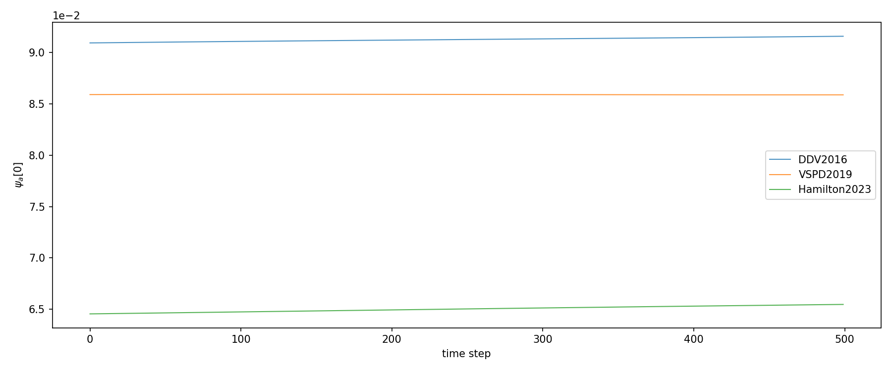
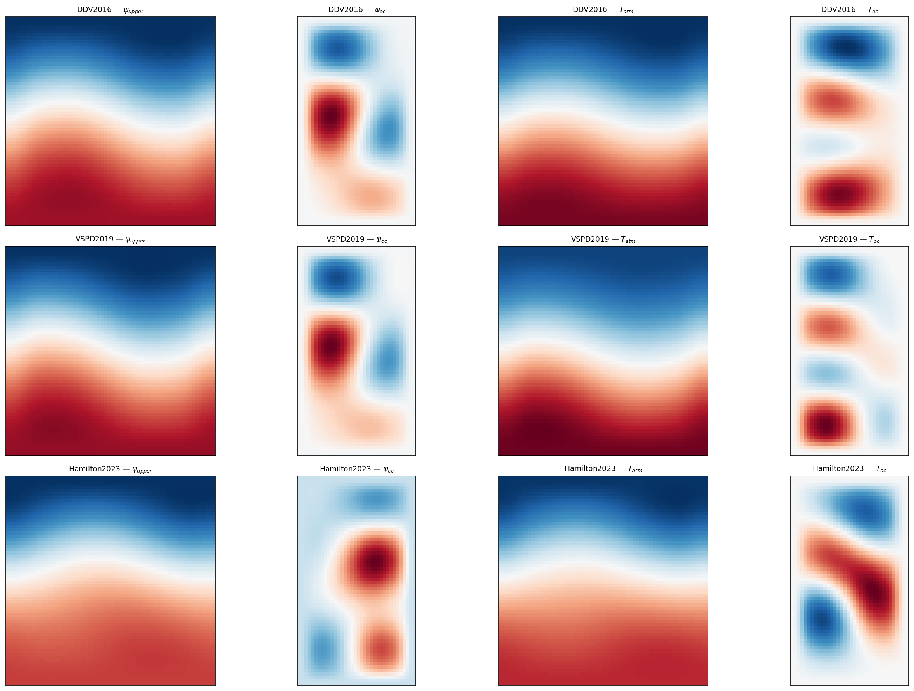
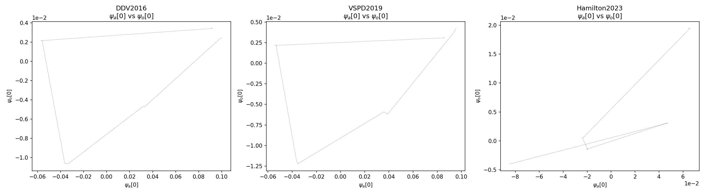
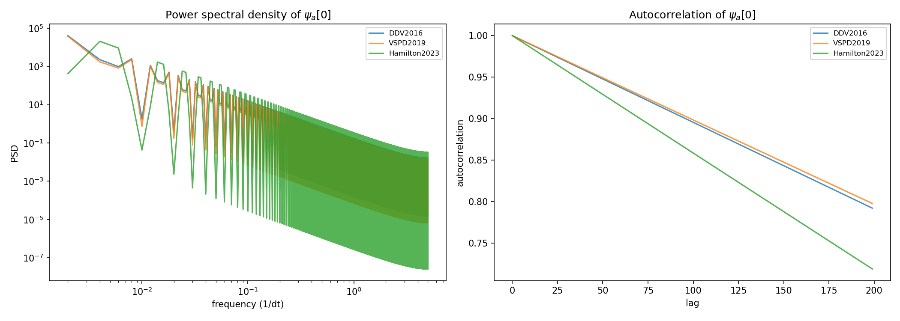

# MAOOAM Configuration Comparison

This report compares three published MAOOAM configurations:

- **DDV2016**: De Cruz, Demaeyer, & Vannitsem (2016) — standard configuration
- **VSPD2019**: Vannitsem, Stiperski, & Demaeyer (2019) — deep ocean, weak coupling
- **Hamilton2023**: Hamilton, de Bodt, & Vannitsem (2023) — dynamic temperature modes

## Configuration Details

| Parameter | DDV2016 | VSPD2019 | Hamilton2023 |
|---|---|---|---|
| atm truncation | (2, 2) | (2, 2) | (2, 2) |
| ocn truncation | (2, 4) | (2, 4) | (2, 4) |
| state_dim | 36 | 36 | 36 |
| dynamic_T | False | False | True |
| h (ocean depth, m) | 136.5 | 1000.0 | 136.5 |
| r (ocean friction) | 1e-7 | 1e-8 | 1e-7 |
| d (coupling) | 1.1e-7 | 1.6e-8 | 1.1e-7 |
| sigma (static stability) | 0.2 | 0.149 | 0.2 |
| gamma_oc (heat capacity) | 5.6e8 | 4.0e9 | 5.6e8 |

The VSPD2019 deep ocean (h=1000m) increases the ocean thermal inertia by a factor ~7,
while the reduced coupling (d=1.6e-8) weakens the ocean-atmosphere interaction.
Hamilton2023 adds the 0th-order temperature modes as prognostic variables (+2 DOF).

## Figures

### Timeseries Comparison

Leading atmospheric mode psi_a[0] for each configuration.

### Physical Field Snapshots

### Phase-Space Attractors

### Temporal Variability

### Ocean Streamfunction Animations

- [DDV2016 psi_oc](outputs/figs/maooam_comparison/maooam_psi_oc_ddv2016.gif)
- [VSPD2019 psi_oc](outputs/figs/maooam_comparison/maooam_psi_oc_vspd2019.gif)
- [Hamilton2023 psi_oc](outputs/figs/maooam_comparison/maooam_psi_oc_hamilton2023.gif)

### Multi-Panel Animation

qgs-style multi-panel animation: timeseries, phase space, psi_upper, psi_oc, T_atm, T_oc.

## Physical Interpretation

**DDV2016** is the standard MAOOAM configuration with moderate ocean depth (136.5 m) and
strong atmosphere-ocean coupling. The system shows typical mid-latitude atmospheric
variability with oceanic response on similar timescales.

**VSPD2019** uses a deep ocean (1000 m) with weaker coupling. The increased ocean thermal
mass slows the oceanic response, while reduced mechanical coupling allows the atmosphere
to evolve more independently. This creates greater time-scale separation between the
fast atmosphere and slow ocean dynamics.

**Hamilton2023** adds the 0th-order temperature modes T_a0 and T_o0 as prognostic variables,
allowing the mean temperature of each layer to evolve freely rather than being fixed by
radiative equilibrium. This adds two additional degrees of freedom and permits longer-term
temperature drift.

## Data Files

- `experiments/maooam_comparison_ddv2016.pt` — 5 trajectories × 200 windows
- `experiments/maooam_comparison_vspd2019.pt` — 5 trajectories × 200 windows
- `experiments/maooam_comparison_hamilton2023.pt` — 5 trajectories × 200 windows