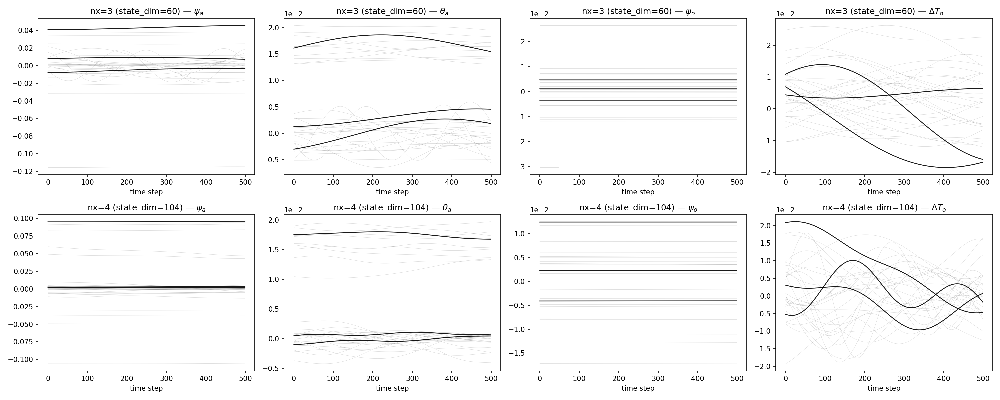
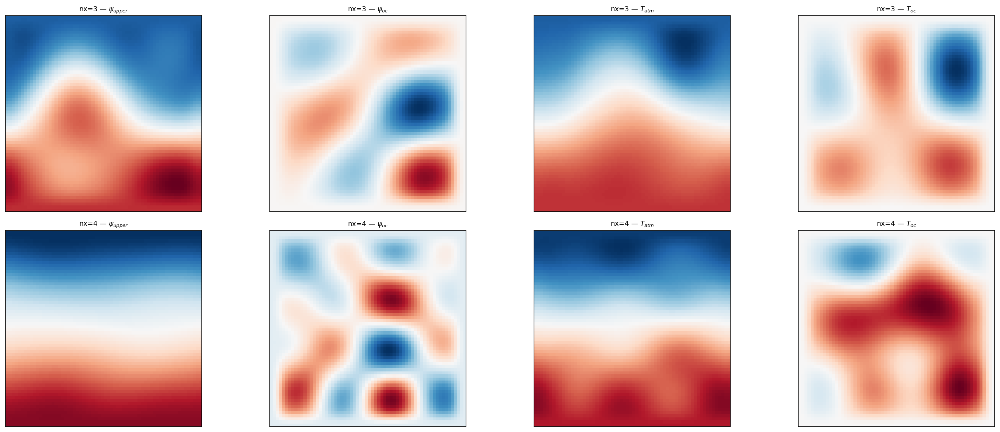
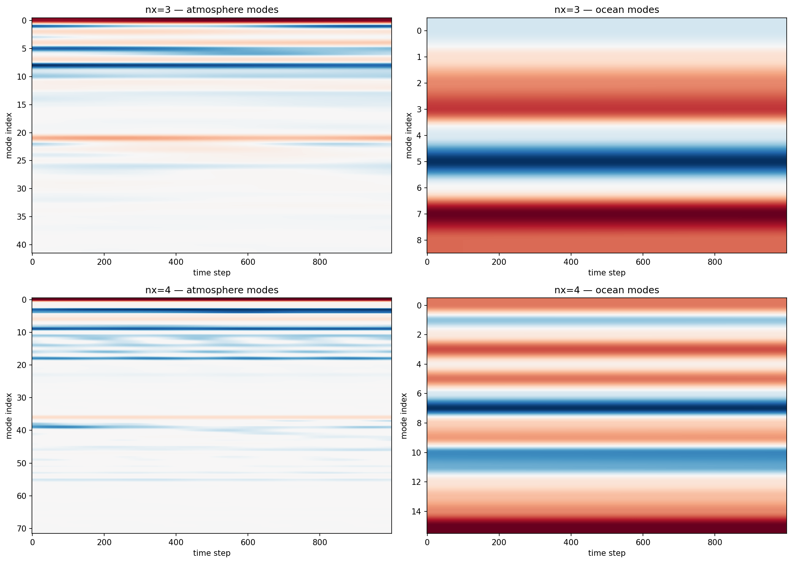
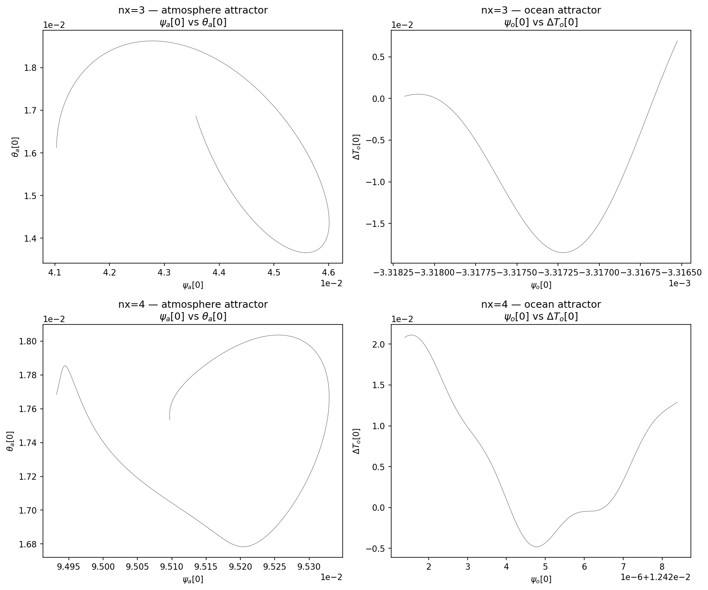
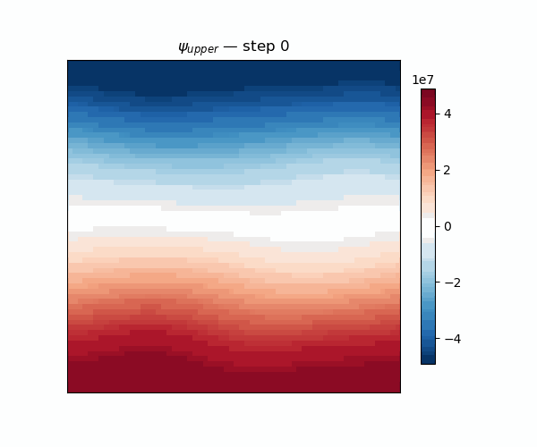

# MAOOAM Dataset Report

**Date:** Fri Jul 17 08:29 CEST 2026
**Branch:** `exp/maooam-torch` (commit `d25fb53`)
**Environment:** PyTorch 2.4.1, CUDA 11.8, Quadro RTX 8000 (48GB), `torch.compile` available

## Overview

Two pre-computed MAOOAM datasets generated via `batch/gen_maooam_dataset.py`, using the PyTorch-native RHS (`MaooamTorchDynamics`) with `torch.compile` on the RK4 integrator. A single dynamics instance (including the expensive qgs tensor extraction) is shared across all trajectories to avoid redundant computation.

| Property | nx=3 | nx=4 |
|---|---|---|
| state_dim | 60 | 104 |
| atm modes | 21 | 36 |
| ocean modes | 9 | 16 |
| interp grid | 32×32 | 64×64 |
| trajectories | 10 | 10 |
| windows/trajectory | 200 | 200 |
| total windows | 2000 | 2000 |
| file size | 7.1 MB | 10.7 MB |

## Configuration

All parameters (except truncation nx) are shared across both datasets:

| Parameter | Value | Description |
|---|---|---|
| `dt` | 0.1 | timestep (days) |
| `K` | 5 | steps per DA window |
| `window_steps` | 500 | timesteps per window |
| `spinup_steps` | 5000 | burn-in before collection |
| `kd` | 0.0290 | atm bottom friction |
| `kdp` | 0.0290 | atm internal friction |
| `sigma` | 0.2 | static stability |
| `r` | 1e-7 | ocean bottom friction |
| `h` | 136.5 | ocean layer depth (m) |
| `d` | 1.1e-7 | ocean-atm coupling |
| `eps` | 0.7 | emissivity |
| `T0_atm` | 289.3 | atm ref temp (K) |
| `hlambda` | 15.06 | heat exchange (W/m2/K) |
| `gamma_oc` | 5.6e8 | ocean heat capacity (J/m2/K) |
| `T0_oc` | 301.46 | ocean ref temp (K) |
| `C_atm` / `C_oc` | 103.33 / 310.0 | insolation |
| `scale` | 5e6 | meridional scale (m) |
| `f0` | 1.032e-4 | Coriolis (s-1) |
| `n_ratio` | 1.5 | aspect ratio 2Ly/Lx |
| `T4` | False | nonlinear radiation |
| `dynamic_T` | False | evolve 0th-order T |
| `device` | `cuda` | GPU enabled |
| `compile` | True | `torch.compile` on `_rk4_step` |

## Benchmark: RK4 Step Time

| Backend | nx=3 | nx=4 |
|---|---|---|
| Numba CPU | ~2.0 ms | ~4.5 ms |
| PyTorch CPU (no compile) | ~2.0 ms | ~4.2 ms |
| PyTorch CPU (compile) | ~0.22 ms (9×) | ~0.45 ms (10×) |
| PyTorch GPU (compile) | **~0.085 ms (24×)** | **~0.12 ms (35×)** |
| Full 10k-step trajectory (GPU) | ~3 s | ~9 s |

## Metrics Comparison

```
Metric                                      nx=3         nx=4
------------------------------------------------------------
max_value                               0.046011     0.095329
stationarity_ratio                      1.345305     1.091675
temporal_autocorrelation                0.999985     0.999871
slow_mode_variance_fraction             0.966084     1.182601
var_psi_a                               0.000107     0.000249
var_theta_a                             0.000013     0.000008
var_psi_o                               0.000060     0.000079
var_dT_o                                0.000071     0.000043
amp_psi_a                               0.055647     0.097896
amp_theta_a                             0.021628     0.019750
amp_psi_o                               0.027787     0.033988
amp_dT_o                                0.037306     0.038345
------------------------------------------------------------
```

Both datasets show realistic chaotic behavior: high temporal autocorrelation (~0.9999 at dt=0.1), stationary dynamics (ratio ≈1), and increasing spectral amplitude from nx=3 to nx=4 (more energy captured at higher resolution).

## Figures

### Timeseries — 10 trajectories overlaid



Four variable blocks: `psi_a`, `theta_a`, `psi_o`, `dT_o`. Each panel shows mode-index vs time over one trajectory, with trajectories superposed in different colors.

### Physical Field Snapshots



Spectral-to-physical reconstruction on a 64×64 grid (nx=3 interpolated, nx=4 native). Fields: upper atm streamfunction, ocean streamfunction, atm temperature, ocean temperature. Both datasets exhibit coherent large-scale structures.

### Hovmöller Diagrams



Time vs mode-index diagrams for atmosphere (psi_a + theta_a) and ocean (psi_o + dT_o). Modes are ordered by zonal wavenumber, revealing the dominant spectral scales in each subsystem.

### Phase-Space Attractors



2D projections: `psi_a[0]` vs `theta_a[0]` (atmosphere) and `psi_o[0]` vs `dT_o[0]` (ocean). Both datasets exhibit bounded chaotic attractors typical of the MAOOAM coupled system.

### Psi Upper Animation (nx=4)



1000-frame animation of the upper-atmosphere streamfunction field at nx=4 resolution (64×64 grid), showing Rossby-wave propagation and large-scale circulation patterns over ~1000 model days.

## Implementation Notes

- **PyTorch RHS:** The MAOOAM right-hand side is implemented via `scatter_add_` for sparse bilinear contraction over the qgs tensor. This avoids materializing the full Jacobian and keeps memory O(state_dim^2) instead of O(state_dim^3).
- **torch.compile:** Wraps `_rk4_step` with `torch.compile(fullgraph=False)` because `scatter_add_` is not `fullgraph`-compatible. Achieves 9-35× speedup depending on device.
- **CUDA generator fix:** `torch.Generator(device=tensor.device)` ensures observation noise is generated on the correct device, fixing a device-mismatch crash.
- **Shared dynamics:** The `dynamics=None` parameter in `MaooamDataset.__init__` allows passing a pre-built `MaooamTorchDynamics` instance, avoiding repeated qgs tensor extraction (~53s for nx=3, ~201s for nx=4) when generating multiple trajectories.
- **Scalability limit:** qgs tensor construction times out beyond state_dim ≈ 160 (nx=ny=5). The bilinear tensor has shape `(state_dim, state_dim, state_dim)`, which exceeds memory for higher resolutions.