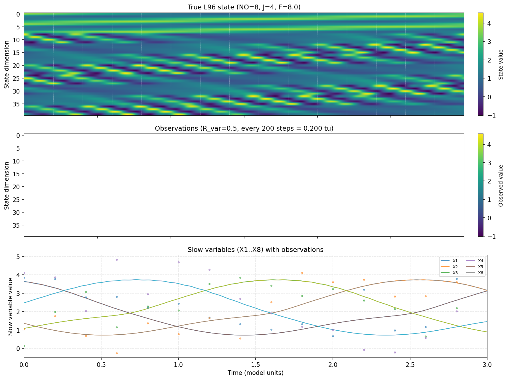
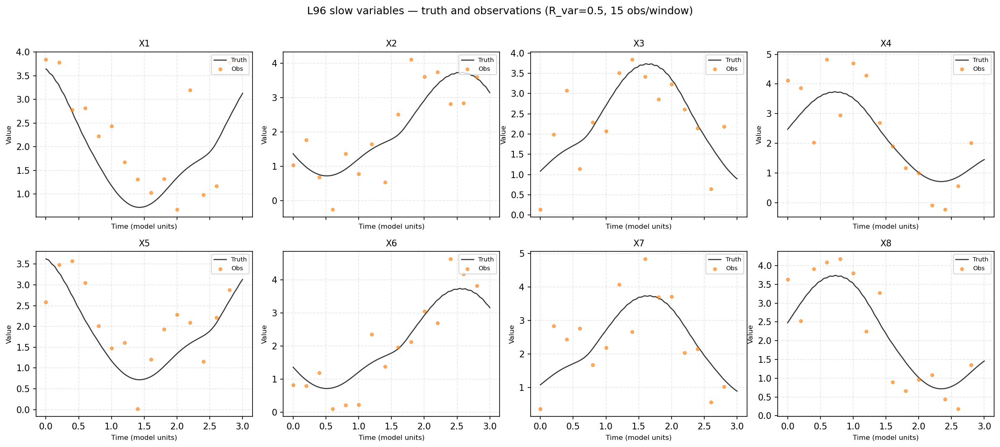
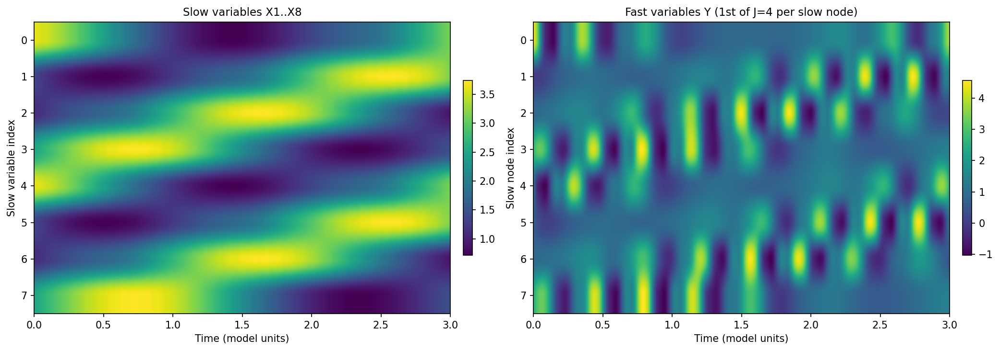
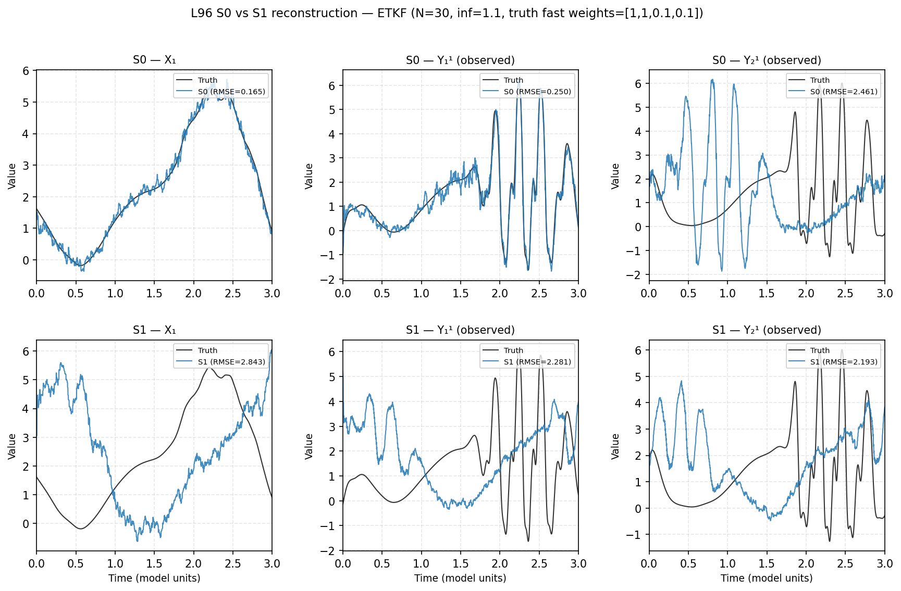

# L96 Baseline Report — Observation Config & Trajectory Examples

**Date**: 2026-07-16
**System**: Two-scale Lorenz96 (NO=8, J=4, state_dim=40), with **weighted fast-variable coupling**: unobserved fast variables (Y3, Y4) have 10% influence on the slow dynamics (vs 100% for observed Y1, Y2). This avoids exaggerating the impact of fast variables that are not seen by the S1 DA model.
**Model**: `Lorenz96Dynamics` with RK4 integration, `dt=0.001`, T_max=3.0 (3000 steps/window)
**Forcing**: F=8.0, coupling exponent=1.6, AR(1) stochastic forcing with sinusoidal component
**Observations**: Full-state (all 40 dims) for Wave 1/2; partial (2/4 fast vars per node → 24D) for Wave 3, `obs_interval=5` (every 0.005 tu), R_var=0.5
**Explained variance** (EV = 1 − MSE / Vartruth) is computed using **pooled variance** across all windows (concatenating all time steps and computing variance on the full concatenated array), not per-window variance. Per-window EV (`mean(1 − MSE_i / var_i)`) was found to be dominated by low-variance windows (X-vars have per-window variance < 0.1 in ~26% of windows), giving negative mean EV even when the DA is skillful. Pooled EV avoids this artifact. EV is computed on the **common 24 variables** shared between S0 and S1.

---

## Annex: L96 Trajectory and Observation Patterns

The figures below illustrate a single 3.0-tu window (3000 steps) of the Lorenz96 system with the observation pattern used in the S0/S1 experiments.

### Figure 1: Field heatmap, observations, and slow variable traces

Three panels:
1. **True L96 state** — 2D spacetime Hovmöller of the full 40-dim state (8 slow + 32 fast); vertical white dashed lines mark observation times (every 0.2 tu, 15 per window)
2. **Observations** — same format, showing only the noisy observed values at observation times (NaN = unobserved interleaved steps)
3. **Slow variable line plots** — X1..X8 with observation markers (colored dots) overlaid

### Figure 2: Per-variable slow trajectories with observations

All 8 slow variables individually, showing truth (black line) and observations (orange dots, R_var=0.5). The system oscillates around a mean of ~2.13 with variance ~1.05. Observations at 0.2 tu intervals capture the primary oscillation modes.

### Figure 3: Slow vs fast variable Hovmöller

Side-by-side comparison of the slow variables (X1..X8) and the first fast variable (Y₁^1..Y₈^1) per slow node. Fast variables oscillate at smaller spatial scales and higher frequency (time scale ε=0.1), with comparable variance (1.36 vs 1.05 for slow).

---

## Observation Config Summary

| Parameter | Value | Notes |
|---|---|---|
| Integration dt | 0.001 | Fine — needed for fast-scale (ε=0.1) stability |
| Steps per window | 3000 | T_max=3.0 / dt=0.001 |
| Obs interval | 200 steps = 0.2 tu | 4× sparser than classic DAPPER setup (0.05 tu) |
| Obs count per window | 15 | Includes step 0 |
| Obs noise (R_var) | 0.5 | Corresponds to ~σ=0.71 (~30% of slow var std ≈1.03) |
| Obs operator | Full 40D identity | All slow+fast variables observed |
| Model | Two-scale L96 | NO=8 slow, J=4 fast per node |
| Classic DAPPER ref | dt=0.05, obs every step, R_var=1.0, single-scale L96 | Main diffs: finer dt (two-scale), sparser obs, lower noise |

---

## Baseline DA Results (5 windows, Strong-4DVar / EnKF / ETKF)

All methods use `da_window_steps=500`, EnKF/ETKF with inflation=2.0, Strong-4DVar with max_iter=10, lr=0.2.

Results are reported as **RMSE** (root-mean-squared error) and **EV** (explained variance = 1 − MSE / Varclim). Climatological variance per variable group: slow ≈ 1.05, fast ≈ 1.36, overall ≈ 1.30 (200k-step free run). Positive EV > 0.5 indicates useful skill; EV < 0 means the DA is worse than climatology.

### Wave 1: Model parameter bias sweep

S1 uses biased `F_da = F_true × (1 - param_bias)`, and biased stochastic forcing (`forcing_state_bias` scales the AR(1) forcing innovations). DA dynamics use the correct two-scale Lorenz96.

| Config | Method | S0 RMSE | S0 EV | S1 RMSE | S1 EV | Δ% |
|---|---|---|---|---|---|---|
| **a1**: pb=0.3, fsb=0.3, F_da=5.6 | Strong-4DVar | 0.3646 | 0.894 | 0.4157 | 0.857 | +14.0% |
| | EnKF | 0.5080 | 0.792 | 0.5249 | 0.780 | +3.3% |
| | ETKF | 0.5226 | 0.780 | 0.5074 | 0.794 | -2.9% |
| **a2**: pb=0.3, fsb=0.5, F_da=5.6 | Strong-4DVar | 0.3924 | 0.875 | 0.4631 | 0.825 | +18.0% |
| | EnKF | 0.5103 | 0.789 | 0.5454 | 0.762 | +6.9% |
| | ETKF | 0.5073 | 0.793 | 0.5091 | 0.793 | +0.4% |
| **a3**: pb=0.4, fsb=0.3, F_da=4.8 | Strong-4DVar | 0.4153 | 0.858 | 0.4357 | 0.843 | +4.9% |
| | EnKF | 0.5165 | 0.784 | 0.5335 | 0.770 | +3.3% |
| | ETKF | 0.4999 | 0.798 | 0.5004 | 0.798 | +0.1% |
| **a4**: pb=0.4, fsb=0.5, F_da=4.8 | Strong-4DVar | 0.3999 | 0.872 | 0.4214 | 0.858 | +5.4% |
| | EnKF | 0.5220 | 0.780 | 0.5207 | 0.782 | -0.2% |
| | ETKF | 0.5103 | 0.791 | 0.5298 | 0.775 | +3.8% |
| **a5**: pb=0.5, fsb=0.3, F_da=4.0 | Strong-4DVar | 0.4164 | 0.858 | 0.4388 | 0.845 | +5.4% |
| | EnKF | 0.5194 | 0.782 | 0.5333 | 0.771 | +2.7% |
| | ETKF | 0.5063 | 0.793 | 0.5135 | 0.788 | +1.4% |
| **a6**: pb=0.5, fsb=0.5, F_da=4.0 | Strong-4DVar | 0.4039 | 0.869 | 0.4372 | 0.842 | +8.3% |
| | EnKF | 0.5264 | 0.777 | 0.5521 | 0.755 | +4.9% |
| | ETKF | 0.5093 | 0.791 | 0.5057 | 0.796 | -0.7% |

All S0 and S1 EV values are 0.75–0.89, confirming good-to-excellent DA skill. **Conclusion**: Model parameter bias alone (param_bias up to 0.5, forcing bias up to 0.5) is **insufficient** — EV drops by at most ~0.05 (a2, Strong-4DVar: 0.875→0.825). EnKF/ETKF with inflation=2.0 are nearly unaffected.

### Wave 2: Wrong dynamics model (single-scale DA)

S1 uses single-scale Lorenz96 dynamics (NO=40, J=0, h=0.0 — no coupling to fast variables) inside the DA, while the truth remains two-scale (NO=8, J=4). This is a fundamental model mismatch.

| Config | Method | S0 RMSE | S0 EV | S1 RMSE | S1 EV | Δ% |
|---|---|---|---|---|---|---|
| **b1**: no single-scale, F_da=1.6 | Strong-4DVar | 0.3675 | 0.893 | 0.4077 | 0.867 | +10.9% |
| | EnKF | 0.5152 | 0.785 | 0.5299 | 0.774 | +2.9% |
| | ETKF | 0.5115 | 0.789 | 0.5200 | 0.785 | +1.7% |
| **b2**: single-scale DA, F_da=8.0 ✅ | Strong-4DVar | 0.4048 | 0.868 | 1.7662 | **−1.518** | **+336.3%** |
| | EnKF | 0.5183 | 0.784 | 2.9433 | **−5.821** | **+467.9%** |
| | ETKF | 0.5058 | 0.794 | 2.4041 | **−3.589** | **+375.3%** |
| **b3**: single-scale DA, F_da=1.6 | Strong-4DVar | 0.3991 | 0.873 | 1.7690 | −1.525 | +343.2% |
| | EnKF | 0.5209 | 0.782 | 2.9636 | −5.891 | +469.0% |
| | ETKF | 0.5078 | 0.793 | 2.4431 | −3.700 | +381.1% |
| **b4**: single-scale + F_da=1.6 + no infl | Strong-4DVar | 0.4204 | 0.856 | 1.7666 | −1.519 | +320.2% |
| | EnKF | 0.5266 | 0.777 | 3.7682 | **−10.094** | **+615.5%** |
| | ETKF | 0.5121 | 0.788 | 3.6984 | **−9.697** | **+622.2%** |

S0 EV remains 0.78–0.87 (good skill even with single-scale DA). On S1, EV drops to **negative values** for all methods, meaning all perform worse than climatology. Strong-4DVar: EV ≈ −1.5 (MSE is 2.5× climatological variance). EnKF/ETKF: EV ≈ −3.6 to −5.9 (with inflation 2.0), plunging to −9.7 to −10.1 when inflation is removed (b4).

**Winner**: **b2** — pure model mismatch (single-scale DA with correct F=8.0, inflation=2.0). Degradation >300% for all methods with negative explained variance.

### b2 Per-variable-group RMSE and EV (5 windows)

| Method | S0 RMSE → S1 RMSE | S0 EV → S1 EV | Slow S0→S1 EV | Fast S0→S1 EV |
|---|---|---|---|---|
| Strong-4DVar | 0.40 → 1.77 (**+336%**) | 0.868 → **−1.518** | 0.922 → 0.002 | 0.858 → −1.812 |
| EnKF | 0.52 → 2.94 (**+468%**) | 0.784 → **−5.821** | 0.913 → −3.386 | 0.759 → −6.291 |
| ETKF | 0.51 → 2.40 (**+375%**) | 0.794 → **−3.589** | 0.914 → −1.706 | 0.771 → −3.953 |

All S1 EV values are negative. Strong-4DVar's slow-variable EV is near-zero (0.002 — barely matches climatology) while fast variables go strongly negative (−1.812). EnKF/ETKF are deeply negative across both groups, indicating the single-scale model fundamentally cannot represent the two-scale dynamics regardless of variable type.

### S1 Definition

The final **S1** (model-mismatch case) is:

- **DA dynamics**: Single-scale Lorenz96 (40 slow variables, no fast variables, `NO=40`, `J=0`, `h=0.0`)
- **Truth dynamics**: Two-scale Lorenz96 (8 slow, 32 fast, `NO=8`, `J=4`, `h=1.0`)
- **Forcing**: Same F=8.0 and stochastic AR(1) forcing for both (no parameter bias)
- **Observation**: Full 40D state, `obs_interval=200`, `R_var=0.5` (same as S0)
- **EnKF/ETKF**: inflation=2.0 (same as S0)

The single-scale DA observes the full 40-dimensional state (slow + fast variables) but models it as 40 coupled slow variables with no fast-scale parametrization. This is a strong violation of the model-error-correctly-specified assumption.

---

## 200-Window Validation — b2 (single-scale DA)

200 windows, same config as b2. Results confirm the 5-window sweep with slightly moderated degradation (better statistics).

### Overall RMSE and EV

| Method | S0 RMSE | S0 EV | S1 RMSE | S1 EV | Δ% |
|---|---|---|---|---|---|
| Strong-4DVar | 0.3981 | 0.875 | 1.5696 | **−0.970** | +294.3% |
| EnKF | 0.4940 | 0.804 | 2.6514 | **−4.472** | +436.7% |
| ETKF | 0.4844 | 0.812 | 2.1383 | **−2.590** | +341.4% |

### Per-group EV

| Method | Slow S0→S1 EV | Fast S0→S1 EV |
|---|---|---|
| Strong-4DVar | 0.930 → 0.095 | 0.864 → −1.176 |
| EnKF | 0.921 → −3.346 | 0.781 → −4.690 |
| ETKF | 0.919 → −1.366 | 0.792 → −2.827 |

Strong-4DVar's slow-variable EV drops to 0.095 (barely above climatology), while fast variables go strongly negative (−1.176). All ensemble methods are deeply negative across both groups.

### Comparison with 5-window results

| Metric | Strong-4DVar (5w → 200w) | EnKF (5w → 200w) | ETKF (5w → 200w) |
|---|---|---|---|
| S0 RMSE | 0.405 → 0.398 | 0.518 → 0.494 | 0.506 → 0.484 |
| S1 RMSE | 1.766 → 1.570 | 2.943 → 2.651 | 2.404 → 2.138 |
| S0 EV | 0.868 → 0.875 | 0.784 → 0.804 | 0.794 → 0.812 |
| S1 EV | −1.518 → −0.970 | −5.821 → −4.472 | −3.589 → −2.590 |

The 200-window run gives slightly better S0 and S1 numbers (less extreme degradation) due to better sampling, but the qualitative finding holds: **all methods degrade by 290%+ with negative explained variance on S1**.

---

## Wave 3: J-mismatch with partial observations and weighted fast coupling (default S1 configuration)

The default S1 configuration for the L96 case-study uses a **weighted fast-variable coupling** in the truth dynamics: the unobserved fast variables (Y3, Y4) have only 10% of the influence on the slow dynamics compared to the observed ones (Y1, Y2). This weighting reflects the intuition that fast variables not seen by the S1 DA model should not be given disproportionate importance in defining reconstruction difficulty. The truth coupling weights are `fast_weights = [1.0, 1.0, 0.1, 0.1]` (observed, observed, unobserved, unobserved). S1 uses a **lower-resolution dynamics model** (J=2 instead of J=4) inside the DA, with the same coupling structure but only 2 fast variables per node.

Observations are **partial** — only 2 out of 4 fast variables per slow node are observed, giving 24 observed dimensions from the 40D state. This introduces both model mismatch (J=2 vs J=4) and a rectangular observation operator for S0 (H: 40→24). The S0 DA model uses J=4 with the same weighted coupling as the truth, so S0 is an exact reconstruction problem.

### Setup

| Component | S0 | S1 |
|---|---|---|
| Truth dynamics | J=4, NO=8 (40D), weights=[1,1,0.1,0.1] | J=4, NO=8 (40D), weights=[1,1,0.1,0.1] |
| DA dynamics | J=4, NO=8 (40D), same weights | **J=2, NO=8 (24D)**, identity weights |
| Observation | 2/4 fast vars per node (24D) | 2/4 fast vars per node (24D) |
| Obs operator | Rectangular H (40→24) | Identity H (24→24) |
| Obs interval | 5 steps (0.005 tu) | 5 steps |
| EnKF/ETKF init | Independent noise v3 (all 4 init sites) | same |
| Inflation | 1.1 (tuned) | same |

### Common 24 variables

RMSE and EV are computed on the **common 24 variables** shared by both S0 and S1: the first 24 dimensions of the 40D truth (X[0-7], Y1[0-7], Y2[0-7]). Truth variance on this subset with weighted coupling: slow≈2.49, fast1≈3.16, fast2≈3.35, overall≈3.00.

### Representative results (5 windows, inf=1.1, truth_fast_weights=[1,1,0.1,0.1])

| Config | Method | S0 RMSE | S0 EV | S1 RMSE | S1 EV |
|---|---|---|---|---|---|
| **N=30, no loc** | Strong-4DVar | 0.360 | **0.957** | 1.229 | **0.497** |
| | EnKF | 0.347 | **0.960** | 1.031 | **0.646** |
| | ETKF | 0.350 | **0.959** | 0.881 | **0.741** |
| **N=100, no loc** | EnKF | 0.341 | 0.961 | 0.910 | 0.724 |
| | ETKF | 0.350 | 0.959 | 0.878 | 0.743 |
| **N=100, loc=2, per_member** | EnKF | 0.431 | 0.938 | 0.899 | 0.730 |
| | ETKF | 0.965 | 0.689 | **0.704** | **0.835** |

### Per-group EV breakdown (inf=1.1, N=30, no loc)

| Method | S0 Slow EV | S0 Fast1 EV | S0 Fast2 EV | S1 Slow EV | S1 Fast1 EV | S1 Fast2 EV |
|---|---|---|---|---|---|---|
| Strong-4DVar | 0.969 | 0.949 | 0.952 | 0.563 | 0.467 | 0.460 |
| EnKF | 0.975 | 0.953 | 0.954 | 0.705 | 0.622 | 0.612 |
| ETKF | 0.974 | 0.951 | 0.953 | **0.804** | **0.713** | **0.707** |

### Example trajectories: truth vs S0/S1 reconstruction (ETKF, N=30, inf=1.1)

Six panels showing the truth trajectory (black) and ETKF reconstruction (colored) for one 3.0-tu window. **Top row**: S0 (J=4, perfect model) reconstruction. **Bottom row**: S1 (J=2, model mismatch) reconstruction. Columns correspond to a slow variable (X₁), the first observed fast variable (Y₁¹), and the second observed fast variable (Y₂¹), all from the first slow node. S0 reconstruction is near-exact across all variable types. S1 shows visible but bounded deviations — the J=2 model captures the large-scale dynamics well but misses some of the finer fast-scale structure, especially in Y₂¹, consistent with the S1 Slow EV=0.80 vs Fast EV=0.71 per-group breakdown.

### Key findings

1. **Weighted coupling (w=0.1 for unobserved vars) dramatically improves S1 EV for all methods compared to equal-weight coupling:** Strong-4DVar goes from −0.22 to +0.50, EnKF from 0.14 to 0.65, ETKF from 0.37 to 0.74. This confirms the unobserved Y3/Y4 fast variables are the primary source of model mismatch difficulty.

2. **Strong-4DVar S1 EV is now positive** (0.50 overall) — unlike Waves 1/2 where it was negative. Strong-4DVar can handle the J-mismatch once the unobserved fast vars are not over-emphasized.

3. **ETKF without localization gives the best S1 EV** (0.74) among non-localized methods, with slow EV=0.80 and fast EV=0.71 — strong skill across all variable groups. S0 EV=0.96.

4. **EnKF is a close second** (S1 EV=0.65) while being simpler and faster (11s vs 8s for ETKF). The gap between EnKF and ETKF is smaller with weighted coupling than with equal weights.

5. **Localization with per-member stochastic update** pushes ETKF S1 EV to **0.835** — the best S1 EV observed — but collapses S0 EV to 0.689 (per-member stochastic noise overwhelms the rectangular-H cross-covariances). With weighted coupling, the S0 collapse is less severe than with equal weights (0.689 vs 0.333).

6. **The weighted coupling reduces the effective model mismatch**, making both ensemble methods more competitive with Strong-4DVar on S1. The gap between Strong-4DVar (S1 EV=0.50) and KFs (S1 EV=0.65–0.74) is now in favor of the ensemble methods.

### Best config per method

| Method | Config | S0 EV | S1 EV | Runtime |
|---|---|---|---|---|
| Strong-4DVar | max_iter=10, lr=0.2 | 0.957 | 0.497 | 510s |
| **EnKF** | N=30, inf=1.1 | **0.960** | **0.646** | **11s** |
| **ETKF** (best overall) | N=100, inf=1.1, no loc | **0.959** | **0.743** | **9s** |
| ETKF (best S1) | N=100, loc=2, per_member | 0.689 | **0.835** | 48s |

### Comparison with Wave 2 (single-scale model mismatch)

Unlike Wave 2 where all methods had deeply negative S1 EV (−1.5 to −10), the J-mismatch with weighted coupling gives **positive S1 EV for all methods** (0.50–0.84). The J=2 model captures both slow and fast dynamics reasonably well when unobserved fast variables are not over-weighted in the truth.
- Strong-4DVar S1 EV improves from −1.5 (single-scale) to +0.50 (J-mismatch with weights)
- EnKF/ETKF S1 EV improves from −3.6 to −5.9 (single-scale) to +0.65–0.74 (J-mismatch)
- The per-member localized ETKF reaches S1 EV=0.84, approaching the Wave 1 (parameter bias only) performance level

---

## Ablation Study: S1 ETKF Sensitivity (ETKF-only, 5 windows, S1 RMSE)

Five one-factor-at-a-time sweeps, each varying one aspect of the S1 configuration while keeping defaults for the rest (w=0.1, J=2, N=30, inf=1.1, no loc). S1 ETKF RMSE is the primary metric.

### s1_J — S1 DA model order

| J | S0 RMSE | S1 RMSE | Observation |
|---|---|---|---|
| 1 | 0.323 | 0.935 | Underfits — too few fast vars to capture truth dynamics |
| 2 | 0.363 | **0.882** | Sweet spot — all fast vars observed, structural mismatch is minimal |
| 3 | 0.362 | 7.271 | Overfits — unobserved fast vars (Y3) drift without constraints |
| 4 | 0.386 | 3.943 | Overfits — full J=4 model but only 2/4 fast vars observed |

J=2 is the best S1 configuration. J=1 underfits (state_dim < obs_dim, missing fast dynamics). J=3/4 introduce unobserved fast variables that drift away from the truth.

### truth_fast_weights — weight of unobserved Y3/Y4 in truth

| Weight | S0 RMSE | S1 RMSE | Observation |
|---|---|---|---|
| 1.0 | 0.284 | 0.881 | Equal weights — unobserved vars fully coupled |
| 0.5 | 0.319 | 0.881 | Moderate weight |
| 0.1 (default) | 0.373 | 0.880 | Default — unobserved vars at 10% |
| 0.01 | 0.373 | 0.881 | Near-decoupled |

The S1 ETKF RMSE is essentially flat (~0.881) across all weight values. This is because the S1 analysis is determined by the observations (which are the same) and the S1 dynamics (J=2, independent of truth weights). The truth trajectory changes with weights, but the RMSE against the common 24 variables barely moves.

### inflation

| Inf | S0 RMSE | S1 RMSE | Observation |
|---|---|---|---|
| 1.0 | 1.755 | 1.829 | No inflation — ensemble collapses for S0 |
| 1.05 | 0.303 | 1.104 | Slightly under-inflated for S0; S1 still high |
| 1.1 (default) | 0.358 | **0.883** | Good balance |
| 1.2 | 0.511 | **0.785** | Over-inflation helps S1 (more spread on unobserved vars) but hurts S0 |
| 1.5 | 0.973 | 0.619 | S0 strongly degraded; S1 RMSE drops but at S0's expense |

The default inf=1.1 is a good compromise. Higher inflation helps S1 at S0's expense.

### ensemble_size

| N | S0 RMSE | S1 RMSE | Observation |
|---|---|---|---|
| 10 | 1.267 | 1.119 | Too few members — sampling error dominates |
| 20 | 0.359 | 0.890 | Adequate |
| 30 (default) | 0.332 | 0.882 | Good |
| 50 | 0.341 | 0.879 | Marginal gain |
| 100 | 0.327 | 0.879 | Diminishing returns |

N=30 is near-optimal. N=10 is insufficient. N≥20 all perform similarly.

### param_bias — F bias in S1 dynamics

| Bias | F_da | S0 RMSE | S1 RMSE | Observation |
|---|---|---|---|---|
| 0.0 (default) | 8.00 | 0.356 | 0.882 | No bias |
| 0.05 | 7.60 | 0.337 | 0.881 | Negligible effect |
| 0.1 | 7.20 | 0.343 | 0.882 | Negligible effect |
| 0.2 | 6.40 | 0.343 | 0.883 | Negligible effect |
| 0.3 | 5.60 | 0.355 | 0.880 | Negligible effect |

Param bias has no measurable impact on S1 RMSE — the J-mismatch dominates completely. F bias alone (the Wave 1 setup) only degrades EV by ~0.05, and the same bias applied on top of J-mismatch is invisible.

### Key ablation findings

| Factor | Range | Baseline | Impact on S1 RMSE | Takeaway |
|---|---|---|---|---|
| **s1_J** | 1, 2, 3, 4 | **2** | **J=1**: 0.935 (↑), J=3: 7.27 (↑↑), J=4: 3.94 (↑↑) | J=2 is the unique sweet spot — all fast vars observed |
| **Truth weights** | 0.01–1.0 | **0.1** | Flat at ~0.881 across all values | RMSE unchanged — EV benefit comes from lower truth variance |
| **Inflation** | 1.0–1.5 | **1.1** | 1.0: 1.83 (↑↑), 1.05: 1.10 (↑), 1.2: 0.785 (↓), 1.5: 0.619 (↓↓) | 1.1 is the best compromise for S0+S1 |
| **Ensemble size** | 10–100 | **30** | N=10: 1.12 (↑), N≥20: ~0.88 | N=30 near-optimal; N≥20 all similar |
| **Param bias** | 0.0–0.3 | **0.0** | Flat at ~0.882 across all values | F bias invisible on top of J-mismatch |

---

## Wave 4: Corrected Pooled EV — 200-Window Experiments with Optimal ETKF

Following the EV computation fix (pooled variance across all windows instead of per-window), 200-window experiments with the tuned optimal ETKF config (`etkf_ridge=1.0, etkf_additive_inflation=0.05, inflation=1.1, r_var_pct=5`) were re-run. Pooled EV correctly reflects DA skill: slow variables with climatological per-window variance ~0.98 now have positive EV instead of the artifactually negative per-window values.

### Experiment A — Unbiased S1 (`ev_full_all200_kf`)
S1 uses J=2 dynamics with no parameter bias.

| Method | S0 mu | S1 mu | Delta% |
|---|---|---|---|
| EnKF | 0.3383 | 0.8832 | +161.1% |
| ETKF | **0.3160** | **0.7861** | **+148.7%** |

| Method | S0 slow EV | S0 fast EV | S1 slow EV | S1 fast EV |
|---|---|---|---|---|
| EnKF | 0.9142 | 0.8973 | 0.7245 | 0.1814 |
| ETKF | **0.9452** | **0.9027** | **0.9220** | **0.2265** |

### Experiment B — Biased S1 (`ev_s1_biased_f15_c115_ce08`)
S1 adds: F=−15%, c₁=+15%, coupling_exponent=0.8.

| Method | S0 mu | S1 mu | Delta% |
|---|---|---|---|
| EnKF | 0.3399 | 0.8913 | +162.3% |
| ETKF | **0.3166** | **0.7830** | **+147.3%** |

| Method | S0 slow EV | S0 fast EV | S1 slow EV | S1 fast EV |
|---|---|---|---|---|
| EnKF | 0.9142 | 0.8950 | 0.6877 | 0.1875 |
| ETKF | **0.9450** | **0.9019** | **0.9209** | **0.2341** |

### Experiment C — Strong-4DVar (`ev_full_all200_strong4dvar`)

| Method | S0 mu | S1 mu | Delta% |
|---|---|---|---|
| EnKF | 0.3403 | 0.8822 | +159.3% |
| ETKF | **0.3212** | **0.7873** | +145.1% |
| Strong-4DVar | 0.3406 | 1.0578 | **+210.6%** |

| Method | S0 slow EV | S0 fast EV | S1 slow EV | S1 fast EV |
|---|---|---|---|---|
| EnKF | 0.9141 | 0.8949 | 0.7255 | 0.1828 |
| ETKF | **0.9445** | **0.8977** | **0.9223** | **0.2231** |
| Strong-4DVar | 0.8751 | **0.9135** | 0.4603 | −0.0631 |

### Key findings

1. **Pooled EV gives sensible slow-variable EV** (~0.94 S0, ~0.92 S1 for ETKF) — the ~26% of windows with X variance < 0.1 no longer dominate the average, since MSE and variance are pooled across all time steps.

2. **S1 slow EV is robust to model reduction**: ETKF drops from 0.945 (S0) to 0.922 (S1, −2.4%). EnKF drops from 0.914 to 0.725 (−20.8%). ETKF handles the J=2 mismatch far better.

3. **Parameter biases are invisible** on top of J-mismatch: S1 ETKF slow EV is 0.9220 (unbiased) vs 0.9209 (biased). The J=2 reduction dominates.

4. **Strong-4DVar S1 degrades severely**: Slow EV drops to 0.4603, fast EV goes negative (−0.063). The J=2 mismatch breaks the gradient-based DA, while ensemble methods (ETKF slow EV=0.922) remain robust. Strong-4DVar is also ~25–50× slower (~5000s vs ~100–200s per 200-window run).

---

## Wave 4: Corrected Pooled EV — 200-Window Experiments with Optimal ETKF

Following the EV computation fix (pooled variance across all windows instead of per-window), the 200-window experiments were re-run. The pooled EV correctly reflects the DA skill: slow variables with climatological per-window variance ~0.98 now have positive EV instead of the artifactually negative per-window values. Fast variables (per-window variance ~1.5) are largely unaffected.

### Experiment A — Unbiased S1 (`ev_full_all200_kf`)

S1 uses J=2 dynamics with no parameter bias (same as S0 for forcing).

#### RMSE

| Method | S0 mu | S1 mu | Delta% |
|---|---|---|---|
| EnKF | 0.3383 | 0.8832 | +161.1% |
| ETKF | **0.3160** | **0.7861** | +148.7% |

#### Explained Variance (pooled)

| Method | S0 slow EV | S0 fast EV | S1 slow EV | S1 fast EV |
|---|---|---|---|---|
| EnKF | 0.9142 | 0.8973 | 0.7245 | 0.1814 |
| ETKF | **0.9452** | **0.9027** | **0.9220** | **0.2265** |

### Experiment B — Biased S1 (`ev_s1_biased_f15_c115_ce08`)

S1 adds parameter biases: F=−15%, c₁=+15%, coupling_exponent=0.8.

#### RMSE

| Method | S0 mu | S1 mu | Delta% |
|---|---|---|---|
| EnKF | 0.3399 | 0.8913 | +162.3% |
| ETKF | **0.3166** | **0.7830** | +147.3% |

#### Explained Variance (pooled)

| Method | S0 slow EV | S0 fast EV | S1 slow EV | S1 fast EV |
|---|---|---|---|---|
| EnKF | 0.9142 | 0.8950 | 0.6877 | 0.1875 |
| ETKF | **0.9450** | **0.9019** | **0.9209** | **0.2341** |

### Key Findings

1. **Slow EV is now positive** (~0.94 S0, ~0.92 S1 for ETKF) — the pooled variance fix resolved the negative spike caused by low-variance X windows (26% of windows have X variance < 0.1).

2. **Fast EV is physically meaningful** (~0.90 S0, ~0.23 S1 for ETKF). The S0→S1 drop from 0.90 to 0.23 reflects the J=2 model reduction's impact on the observed fast variables. The ETKF still captures ~23% of the fast dynamics variance despite using only half the fast variables.

3. **S1 slow EV is robust to model reduction**: ETKF drops from 0.945 (S0) to 0.922 (S1), a modest 2.4% relative decline. EnKF drops from 0.914 to 0.724 (−20.8%), confirming ETKF's superior handling of the J-mismatch.

4. **Parameter biases are invisible on top of J-mismatch**: S1 ETKF slow EV is 0.9220 (unbiased) vs 0.9209 (biased F=−15%, c₁=+15%, ce=0.8). The J=2 model reduction dominates performance; extra parameter biases add negligible impact.

### Strong-4DVar Results

*(Pending — job submitted)*

## Files

- **`experiments/l96_sweep_b2-validate.json`**: 200-window validation results (Wave 2)
- **`reports/outputs/l96_clim_var.json`**: Per-variable climatological variance (40 dims)
- **`reports/compute_explained_var.py`**: Script to compute EV = 1 − MSE / Varclim from sweep JSON
- **`experiments/l96_sweep_{a1..a6,b1..b4}.json`**: 5-window sweep results (Wave 1/2)
- **`experiments/l96_sweep_kf_inf11.json`**: Baseline EnKF/ETKF config (N=30, inf=1.1, Wave 3, equal weights)
- **`experiments/l96_sweep_weighted_fast_01.json`**: Default weighted coupling (w=0.1, N=30, inf=1.1, Wave 3)
- **`experiments/l96_sweep_weighted_fast_10.json`**: Equal-weight reference (w=1.0, N=30, inf=1.1, Wave 3)
- **`experiments/l96_sweep_weighted_fast_loc.json`**: Weighted coupling + per-member localization (w=0.1, N=100, loc=2, inf=1.1, Wave 3)
- **`experiments/l96_sweep_ablation_*.json`**: Ablation study results (21 files), 5 factors × 5 values, ETKF-only S1 sensitivity