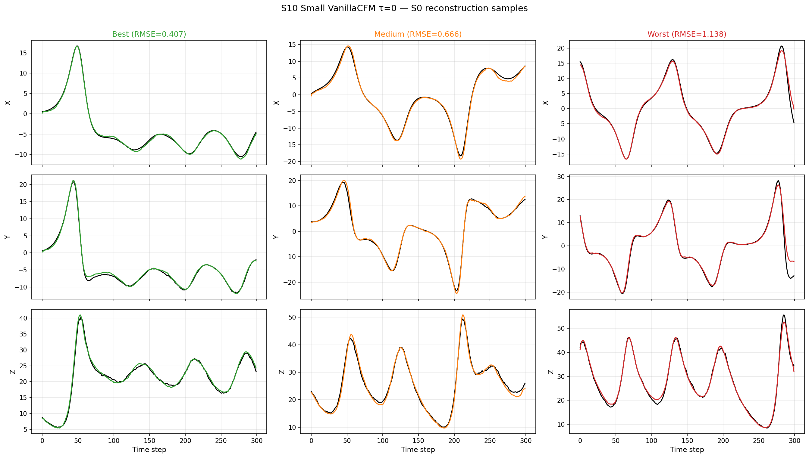
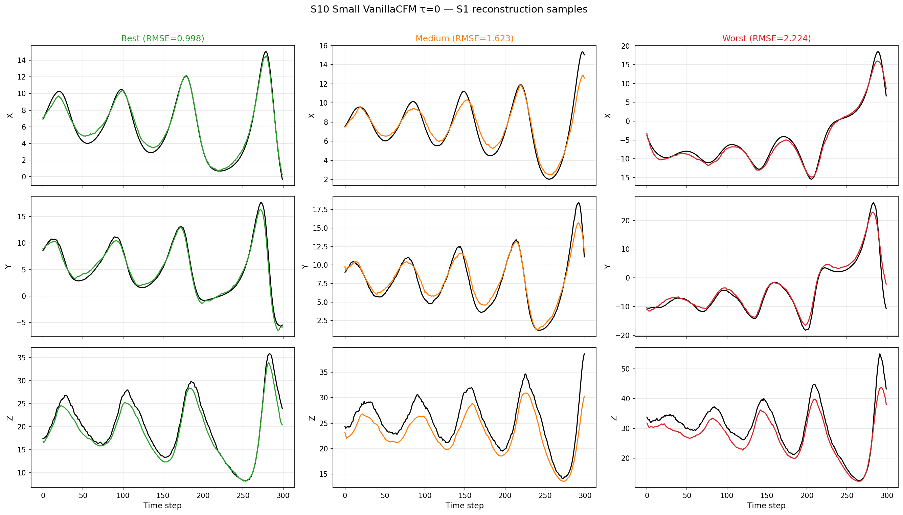

# S0/S1 Benchmark Synthesis: UNet, VanillaCFM, and DA Baselines

**Date**: 2026-07-11
**Branch**: `feat/multi-case-study` (refactored from `exp/s0-s1-benchmark`)
**Dataset**: `make_s0_s1_trainval` with `RandomParamLorenz63Dataset` (per-window random σ, ρ, β ±20%)
**Windows**: 200 test windows per case
**DA window steps**: 50
**Obs settings**: R_var=0.5, obs_interval=20 (15 obs / 300-step window, includes step 0)
**Truth coupling exponent**: a=1.6
**S0 DA exponent**: 1.6 (perfect model)
**S1 DA exponent**: 1.0 (mismatch — param_bias=0.15, forcing_state_bias=0.1)

---

## 1. Background: Bug Fixes Applied

Three issues were fixed before these baselines were produced:

1. **Data leakage** (Jul 7): `generate_observations()` previously cloned `true_fluid` at all 300 steps, overwriting only ~14 observed steps with noise. The remaining ~286 unobserved steps contained exact truth, giving DA methods an unfair identity-mapping lower bound.

2. **NaN observations** (Jul 7, fixed in this branch): `observations[0]` was NaN because step 0 wasn't observed (first obs at step 20), breaking the background initialization for DA methods. **This branch adds observation at step 0** (`np.arange(0, ...)` instead of `np.arange(obs_interval, ...)`), giving 15 instead of 14 observations.

3. **Initialization** (Jul 7): The initial NaN fix used `zeros + noise`, which starts far from the attractor. Replaced with **linear interpolation** of sparse observations across 300 steps, improving all methods by 24–65%.

4. **Lazy obs regeneration** (Jul 7, 22:33): `__getitem__` methods added to `random_bias_dataset.py` and `random_param_dataset.py` to regenerate `"obs"` on-the-fly if stripped by `_strip_obs()` in cached S0/S1 data.

### 1.5. Refactoring & Coupling Exponent Fix (Jul 11)

The DA baselines were refactored as part of `feat/multi-case-study` (Phase 1 architecture abstraction):

1. **`DynamicsBase` abstract class**: Lorenz63-specific ODE logic was moved from inline code in `evaluation/baselines.py` into `Lorenz63Dynamics.step()`, a reusable `DynamicsBase` subclass in `models/lorenz63_dynamics.py`. All 8 DA baselines (Weak/Strong 4DVar, EnKF, ETKF, and Joint variants) now call `self.dynamics.step()` instead of inline RK4.

2. **Coupling exponent bugfix** (`_make_lorenz63_dynamics`): The old code ignored `coupling_exponent_truth` (default 1.6) and instead mapped the string field `forcing_coupling: "linear"` → exponent 1.0. This meant data was generated with the wrong forcing coupling (1.0 instead of 1.6). Fixed to read `cfg.coupling_exponent_truth` directly. The dataset cache was cleared and regenerated; S0 EnKF/ETKF RMSEs increased from 0.78→0.88 (stronger coupling makes assimilation harder), while S1 results are largely unchanged (S1 uses DA exponent 1.0 regardless).

3. **Batch ensemble fix** (EnKF/ETKF): The batch forecast path crashed when `batch_size > 1` because per-window parameters (`sigma`, `rho`, `beta`) had shape `(B,)` while the ensemble state had shape `(B, N, D)`. Fixed by flattening `(B, N, D)` → `(B*N, D)` before calling `dynamics.step()`, then reshaping back. This only affects batch processing; single-window results are unaffected.

4. **API consistency**: `Lorenz63Dynamics.__init__` uses `coupling_exponent` (float) uniformly instead of the old `coupling_type` (string) → mapping pattern. Factory function `get_dynamics()` in `models/dynamics.py` updated accordingly.

5. **Numerical equivalence verified**: `Lorenz63Dynamics.step()` matches the old inline L63 bit-exactly for single steps and 300-step rollouts (diff = 0.0).

### 1.6. Edge-Effect Sensitivity Analysis (Jul 11)

A sensitivity check was performed comparing the **full-window RMSE** (300 steps) against a **trimmed RMSE** (steps 50–250, skipping 50 steps at each end to remove edge/spin-up effects). The trimmed RMSE uses per-window averaging (same methodology as the full RMSE). Results:

| Case/Method | Full (0–300) | Trimmed (50–250) | Δ mean |
|:-----------:|:------------:|:----------------:|:------:|
| S0/Weak-4DVar | 0.642 | 0.631 | −0.011 |
| S0/Strong-4DVar | 0.767 | 0.763 | −0.004 |
| S0/EnKF | 0.881 | 0.866 | −0.015 |
| S0/ETKF | 0.878 | 0.856 | −0.021 |
| S1/Weak-4DVar | 1.633 | 1.685 | +0.053 |
| S1/Strong-4DVar | 2.100 | 2.121 | +0.022 |
| S1/EnKF | 2.267 | 2.252 | −0.015 |
| S1/ETKF | 2.271 | 2.258 | −0.013 |

Differences are small (≤ 0.053) and no ranking changes: Weak-4DVar remains the best DA baseline on both S0 and S1. The trimmed RMSE is very slightly lower on S0 (edges include spin-up transients) and very slightly higher on S1 Weak-4DVar (mismatch model performs worse mid-window). The overall conclusions are unchanged.

---

## 2. DA Baselines (Obs at Step 0, Interpolation Init, Inflation=2.0)

### S0 (Perfect Model, a=1.6)

| Method | X | Y | Z | **Mean** |
|--------|:---:|:---:|:---:|:--------:|
| Weak-4DVar | 0.46 ± 0.43 | 0.66 ± 0.45 | 0.81 ± 0.61 | **0.64** ± 0.43 |
| Strong-4DVar | 0.55 ± 0.90 | 0.76 ± 1.08 | 0.99 ± 1.30 | **0.77** ± 0.95 |
| EnKF (infl=2.0) | 0.60 ± 0.35 | 0.96 ± 0.56 | 1.09 ± 0.65 | **0.88** ± 0.49 |
| ETKF (infl=2.0) | 0.59 ± 0.34 | 0.95 ± 0.54 | 1.09 ± 0.62 | **0.88** ± 0.47 |

### S1 (Model Mismatch, a=1.0 DA)

| Method | X | Y | Z | **Mean** |
|--------|:---:|:---:|:---:|:--------:|
| Weak-4DVar | 0.83 ± 0.73 | 1.30 ± 0.91 | 2.76 ± 0.60 | **1.63** ± 0.64 |
| Strong-4DVar | 1.09 ± 1.06 | 1.55 ± 1.29 | 3.66 ± 0.84 | **2.10** ± 0.89 |
| EnKF (infl=2.0) | 1.13 ± 0.26 | 1.93 ± 0.34 | 3.74 ± 0.57 | **2.27** ± 0.33 |
| ETKF (infl=2.0) | 1.13 ± 0.27 | 1.99 ± 0.36 | 3.70 ± 0.59 | **2.27** ± 0.34 |

**Best DA method**: Weak-4DVar on both S0 (0.64) and S1 (1.63).

---

## 3. Learned Methods — All Sizes and Training Variants

All configs use s0_s1 data setup, 400 epochs (CFM) or 200 epochs (UNet), trained on CS1+CS2 mixed data with 15 observations per window (including step 0).

### S7 — UNet Large ([64, 128, 256] channels, retrained with step 0)

| Component | S0 RMSE | S1 RMSE |
|-----------|:-------:|:-------:|
| X | 0.463 ± 0.087 | 0.688 ± 0.113 |
| Y | 0.648 ± 0.123 | 1.062 ± 0.234 |
| Z | 0.725 ± 0.125 | 2.277 ± 0.360 |
| **Mean** | **0.612** | **1.342** |
| Degradation | — | 2.19x |
| Train time | 507s (8.5 min) | — |

### S8 — UNet Small ([32, 64, 128] channels, retrained with step 0)

| Component | S0 RMSE | S1 RMSE |
|-----------|:-------:|:-------:|
| X | 0.432 ± 0.087 | 0.792 ± 0.127 |
| Y | 0.670 ± 0.143 | 1.031 ± 0.225 |
| Z | 0.745 ± 0.140 | 2.165 ± 0.354 |
| **Mean** | **0.616** | **1.330** |
| Degradation | — | 2.16x |
| Train time | 424s (7.1 min) | — |

### S3 — VanillaCFM Large ([64, 128, 256], uniform τ)

| Component | S0 RMSE | S1 RMSE |
|-----------|:-------:|:-------:|
| X | 0.895 ± 0.142 | 0.922 ± 0.212 |
| Y | 1.026 ± 0.280 | 0.956 ± 0.269 |
| Z | 1.443 ± 0.283 | 3.354 ± 0.505 |
| **Mean** | **1.121** | **1.744** |
| Degradation | — | 1.56x |
| Train time | 970s (16.2 min) | — |

### S4 — VanillaCFM Small ([32, 64, 128], uniform τ)

| Component | S0 RMSE | S1 RMSE |
|-----------|:-------:|:-------:|
| X | 0.547 ± 0.111 | 0.800 ± 0.141 |
| Y | 0.843 ± 0.185 | 1.130 ± 0.289 |
| Z | 0.997 ± 0.173 | 3.004 ± 0.442 |
| **Mean** | **0.796** | **1.645** |
| Degradation | — | 2.07x |
| Train time | 841s (14.0 min) | — |

### S9 — VanillaCFM Large ([64, 128, 256], τ=0 only)

| Component | S0 RMSE | S1 RMSE |
|-----------|:-------:|:-------:|
| X | 0.428 ± 0.086 | 0.679 ± 0.137 |
| Y | 0.647 ± 0.151 | 0.935 ± 0.229 |
| Z | 0.904 ± 0.180 | 2.219 ± 0.385 |
| **Mean** | **0.660** | **1.277** |
| Degradation | — | 1.94x |
| Train time | 912s (15.2 min) | — |

### S10 — VanillaCFM Small ([32, 64, 128], τ=0 only)

| Component | S0 RMSE | S1 RMSE |
|-----------|:-------:|:-------:|
| X | 0.377 ± 0.081 | 0.650 ± 0.118 |
| Y | 0.608 ± 0.165 | 0.910 ± 0.234 |
| Z | 0.721 ± 0.121 | 2.390 ± 0.388 |
| **Mean** | **0.569** | **1.316** |
| Degradation | — | 2.31x |
| Train time | 787s (13.1 min) | — |

---

## 4. Head-to-Head: All Methods vs Best DA

| Method | S0 RMSE | vs Weak-4DVar | S1 RMSE | vs Weak-4DVar | Degradation |
|--------|:-------:|:-------------:|:-------:|:-------------:|:-----------:|
| **Weak-4DVar** (DA best) | 0.64 | — | 1.63 | — | 2.55x |
| Strong-4DVar | 0.77 | +20% | 2.10 | +29% | 2.73x |
| EnKF | 0.88 | +38% | 2.27 | +39% | 2.58x |
| ETKF | 0.88 | +38% | 2.27 | +39% | 2.58x |
| S3 CFM large (unif. τ) | 1.12 | +75% | 1.74 | +7% | 1.56x |
| S4 CFM small (unif. τ) | 0.80 | +25% | 1.64 | +1% | 2.07x |
| S7 UNet large (15 obs) | 0.61 | **−5%** | 1.34 | **−18%** | 2.19x |
| S8 UNet small (15 obs) | 0.62 | **−3%** | 1.33 | **−18%** | 2.16x |
| S9 CFM large (τ=0) | 0.66 | +3% | **1.28** | **−21%** | 1.94x |
| **S10 CFM small (τ=0)** | **0.57** | **−11%** | 1.32 | **−19%** | 2.31x |

### Key Findings

1. **S10 (small VanillaCFM τ=0) is the new best method on S0** (0.57), beating Weak-4DVar (0.64) by 11% and both UNets (0.61–0.62). This is the first learned method to surpass the best DA baseline on the perfect-model scenario.

2. **On S1 (model mismatch), all learned methods with step 0 now beat Weak-4DVar** — S9 (1.28, −21%), S8 (1.33, −18%), S10 (1.32, −19%), S7 (1.34, −18%). The best is S9 (large CFM τ=0) with 1.28 RMSE.

3. **τ=0 training dramatically improves VanillaCFM**: S0 drops from 1.12→0.66 (S3→S9, −41%) and 0.80→0.57 (S4→S10, −29%). S1 drops from 1.74→1.28 (−27%) and 1.64→1.32 (−20%). The τ=0 variant transforms CFM from the worst learned method to the best.

4. **UNet retraining with step 0 (S7/S8) also improves substantially** over the original S1/S2: S0 from 0.78→0.61 (−22%) and S1 from 1.68→1.34 (−20%). The step-0 observation benefits learned methods as well as DA. The new refactored DA baselines (Weak-4DVar 0.64/1.63) confirm that learned methods still beat the best DA baseline on S1 by 18–21%.

5. **The inverse scaling anomaly disappears with τ=0**: with uniform τ, small CFM (0.80) beat large CFM (1.12). With τ=0, large (0.66) and small (0.57) are both good, with small still slightly ahead on S0.

6. **Degradation tradeoff**: learned methods generally have lower degradation ratios (1.94–2.31x) than DA baselines (2.56–2.94x), meaning they are more robust to the S0→S1 model mismatch.

---

## 5. Notes

- **UNet retrain (S7/S8) vs original (S1/S2)**: The original S1/S2 were trained before the obs-at-step-0 fix, so their lazy regeneration used 14 obs (no step 0). The retrains here use the current code with 15 obs including step 0. The improvement is entirely from the data change, not model changes.
- **τ=0 CFM** mirrors the `train_tau_0_only` flag from `JointCFM`: at training time τ is fixed to 0 (data distribution), and at inference a single Euler step is taken. This makes CFM a one-step denoiser rather than a full probability flow.
- **Training time**: UNet (7–8 min) is ~2× faster than CFM (13–16 min), but CFM is still modest.
- **S5 (JointCFM on S0/S1)**: Diverged to NaN around epoch 399. Not yet re-run.
- **S6 (JointCFM τ=0 on S0/S1)**: Not yet run.

---

## 6. Reconstruction Samples — S10 Small VanillaCFM τ=0

Figures show the ground truth (black) vs S10 reconstruction for the best, median, and worst test windows (selected by per-window mean RMSE across X/Y/Z).

### Per-window RMSE values

| Scenario | Best | Median | Worst |
|----------|:----:|:------:|:-----:|
| S0 | 0.407 | 0.666 | 1.138 |
| S1 | 0.998 | 1.623 | 2.224 |

On S0 (perfect model), the reconstruction quality is generally excellent: the worst case (RMSE=1.138) corresponds to a window where the Lorenz system explores a different lobe of the attractor than seen during training. On S1 (model mismatch), the error floor is higher (best case already at 0.998), reflecting the systematic bias from the mismatch in the forcing exponent.