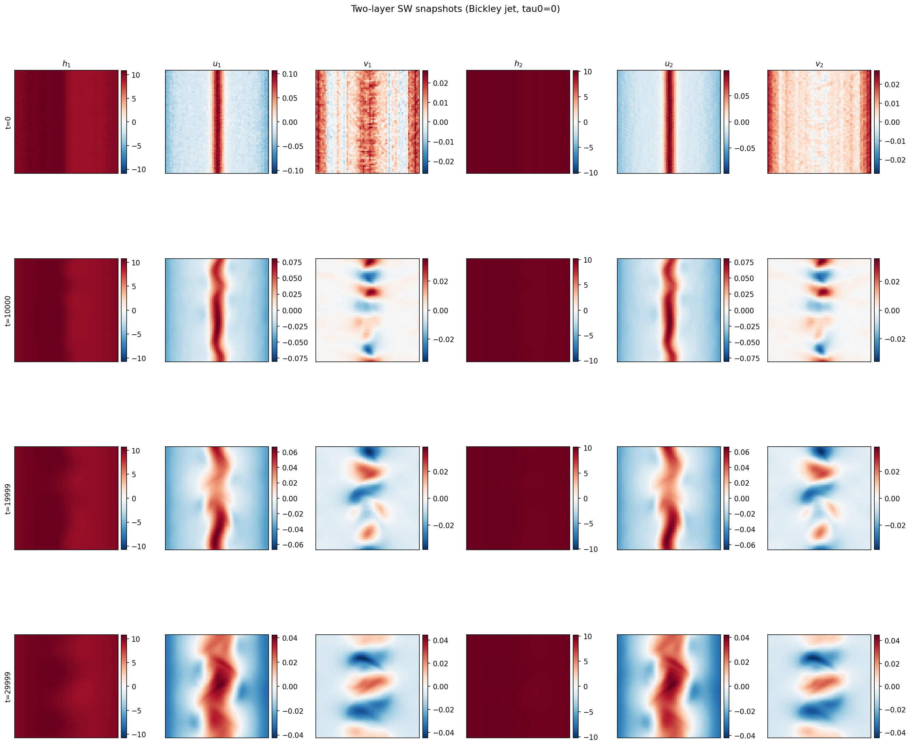
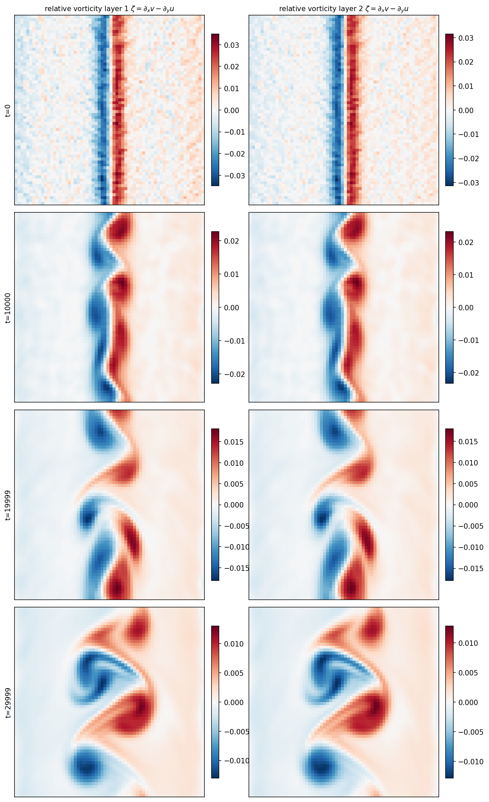
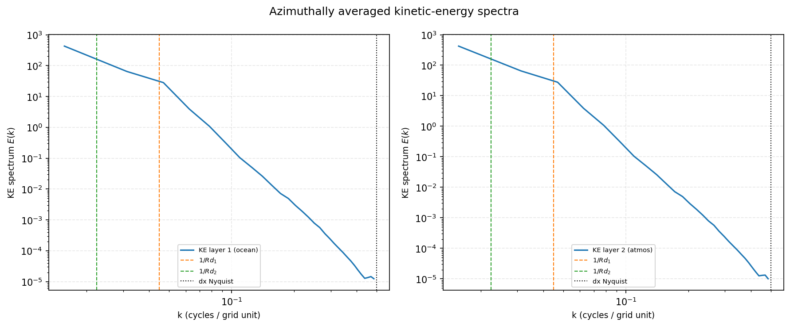
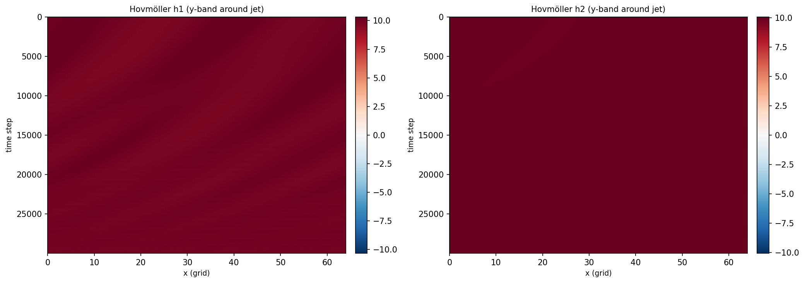
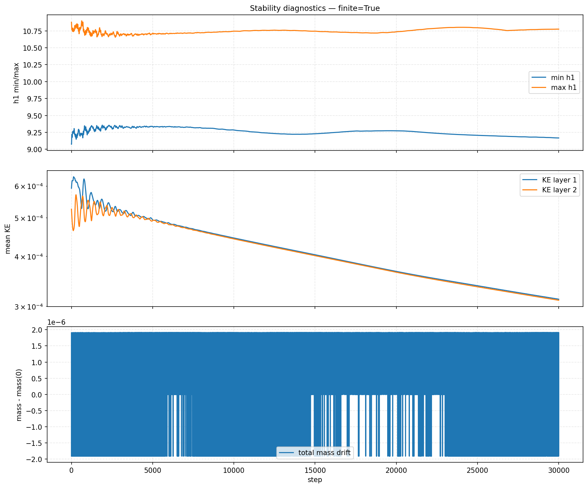
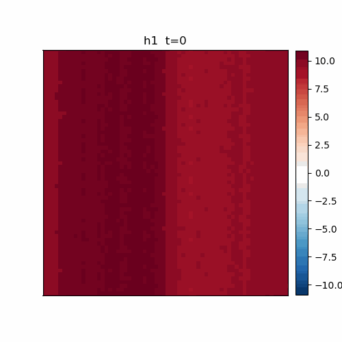
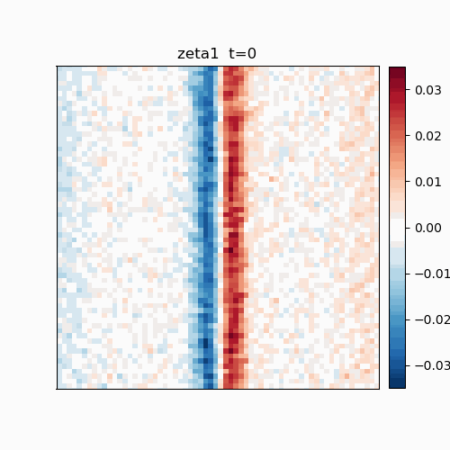
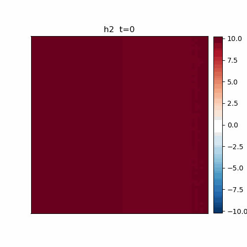

# SW trajectory-quality diagnostics

## Configuration

```
  system: shallow_water
  bickley_jet: True
  tau0: 0.0
  Nx: 64
  Ny: 64
  dt: 0.1
  g1: 0.5
  g2: 2.0
  f_cor: 0.1
  coupling: 0.01
  friction: 0.0001
  viscosity: 0.001
  steps: 30000
  spinup: 1000
  seed: 42
  H_ref: 10.0
```

## Characteristic scales

  c1 = sqrt(g1*H) = 2.236   c2 = sqrt(g2*H) = 4.472
  Rd1 = c1/f = 22.4 dx   Rd2 = c2/f = 44.7 dx
  Rd2/Rd1 = 2.00
  inertial period T_f = 62.8

## Figures










## Auto-generated checklist

- [x] stable over 30000 steps (no NaN/blowup): PASS
    - h1 range: 9.073 .. 10.898
    - total mass drift: 1.907e-06
    - KE layer1 last: 3.124e-04, layer2 last: 3.105e-04
- [x] two-layer scale separation (Rd2/Rd1=2.0)
- [ ] jet present (meandering) — inspect snapshots.h1 / animation_h1.gif
- [ ] ring shedding visible — inspect vorticity / animation_zeta1.gif
- [ ] spectra slope near k^-3 in inertial band — inspect spectra.png
