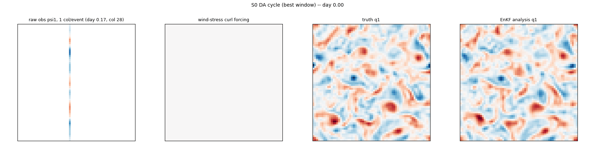
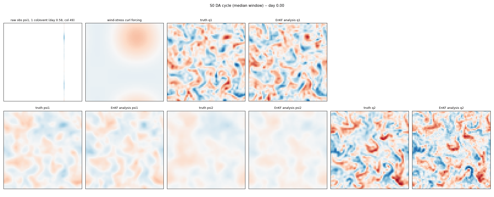
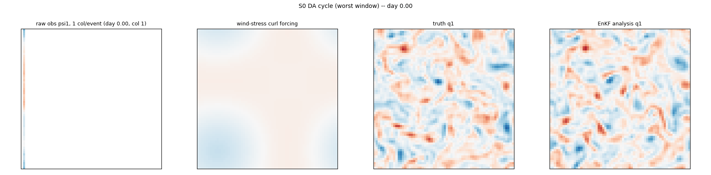

# QG DA Baselines (S0 reference case + S1 model-error case)

Reference case (2026-09-08): **lag=5.0d, noise_frac=0.05, N=100 test windows** (S0). Supersedes the earlier lag=1.0d/noise=0.01 case, which was found to be unrealistically favorable -- at that setting the background (free forecast, no assimilation) alone already reached psi full EV≈0.98, so DA's high score there was mostly inherited from the background rather than earned from the observational update. See `PLAN.md`'s "DA reference-case realism" section for the full lag/noise sensitivity analysis behind this choice.

**S1** (revised 2026-09-10): shares S0's initial-uncertainty setup exactly (lag=5.0d, noise_frac=0.05) and adds three independent model-error sources on top -- param bias (`rd`/`rek` scaled by `1-0.1`), corrupted wind (amplitude bias + storm-location jitter), and structural resolution mismatch (`da_nx=32`, half the truth grid). Obs are always drawn from the true, unbiased, full-res trajectory -- only the DA method's own model sees the corruption.

**ETKF default changed 2026-09-12**: `etkf_ridge=1.0` (was the implicit ~1e-4 floor at `etkf_ridge<=0`) -- see the "Hyperparameter sensitivity analysis" section below. All ETKF numbers in this report use the new default.

## DA baselines (S0, PV-q and ψ)

CRPS is computed per-window on the q-state: ensemble methods (ETKF/EnKF) score their real per-member spread; deterministic methods (4DVar) have no ensemble, so CRPS degenerates exactly to the mean absolute error (marked `*`) -- lower is better for both. CRPS (norm.) divides by the pooled truth PV std over the whole test set (not per-window -- avoids the distortion a low-variance window would introduce), giving a dimensionless, cross-method-comparable score.

| method | PV RMSE | improv | CRPS | CRPS (norm.) | PV EV | PV q1 EV | PV q2 EV | ψ EV |
|---|---|---|---|---|---|---|---|---|
| _free forecast_ | 1.93e-05 | 1.0 | -- | -- | -0.0312 | -0.0443 | -0.0180 | 0.8854 |
| EnKF | **1.25e-05** | **1.5417** | **5.69e-06** | **0.2802** | **0.4812** | **0.5686** | *0.3938* | 0.9474 |
| ETKF | *1.29e-05* | *1.4935* | *5.87e-06* | *0.2891* | *0.4760* | *0.5419* | **0.4100** | 0.9570 |
| Weak-4DVar | 1.41e-05 | 1.3691 | 9.19e-06* | 0.4524* | -0.0345 | 0.4677 | -0.5367 | *0.9660* |
| Strong-4DVar | 1.40e-05 | 1.3793 | 9.22e-06* | 0.4538* | -0.1257 | 0.4830 | -0.7344 | **0.9714** |

(Best per column **bolded**, second-best *italicized*, ranked among the 4 DA methods -- the free-forecast reference row above is excluded.)

> **Caveat:** Weak-4DVar, Strong-4DVar collapse on PV q layer2 (the unobserved lower layer) at this reference case -- their PV EV is negative there despite psi EV being competitive or the best of all 4 methods. This is consistent with PV being a Laplacian-like operator on psi (q ≈ ∇²ψ): small high-wavenumber errors in an otherwise excellent psi analysis get amplified when inverted to PV, especially in the layer with no direct observations.

Computed on N=100 test windows, lag=5.0, noise_frac=0.05 (should match the reference case above -- if not, these JSONs are stale, regenerate them).

## DA baselines (S1, PV-q and ψ)

CRPS is computed per-window on the q-state: ensemble methods (ETKF/EnKF) score their real per-member spread; deterministic methods (4DVar) have no ensemble, so CRPS degenerates exactly to the mean absolute error (marked `*`) -- lower is better for both. CRPS (norm.) divides by the pooled truth PV std over the whole test set (not per-window -- avoids the distortion a low-variance window would introduce), giving a dimensionless, cross-method-comparable score.

| method | PV RMSE | improv | CRPS | CRPS (norm.) | PV EV | PV q1 EV | PV q2 EV | ψ EV |
|---|---|---|---|---|---|---|---|---|
| _free forecast_ | 2.20e-05 | 1.0 | -- | -- | -0.3822 | -0.3091 | -0.4554 | 0.6760 |
| EnKF | *1.44e-05* | *1.5255* | *6.74e-06* | *0.3318* | *0.3308* | *0.4402* | *0.2214* | 0.8957 |
| ETKF | **1.43e-05** | **1.5351** | **6.65e-06** | **0.3270** | **0.3570** | **0.4481** | **0.2660** | 0.9261 |
| Weak-4DVar | 1.62e-05 | 1.3587 | 1.09e-05* | 0.5378* | -0.5008 | 0.3214 | -1.3229 | **0.9468** |
| Strong-4DVar | 1.68e-05 | 1.3097 | 1.15e-05* | 0.5648* | -0.8573 | 0.2819 | -1.9966 | *0.9314* |

(Best per column **bolded**, second-best *italicized*, ranked among the 4 DA methods -- the free-forecast reference row above is excluded.)

> **Caveat:** Weak-4DVar, Strong-4DVar collapse on PV q layer2 (the unobserved lower layer) at this reference case -- their PV EV is negative there despite psi EV being competitive or the best of all 4 methods. This is consistent with PV being a Laplacian-like operator on psi (q ≈ ∇²ψ): small high-wavenumber errors in an otherwise excellent psi analysis get amplified when inverted to PV, especially in the layer with no direct observations.

Computed on N=100 test windows, lag=5.0, noise_frac=0.05 (should match the reference case above -- if not, these JSONs are stale, regenerate them).

## Hyperparameter sensitivity analysis

Condensed summary of the 2026-09-11/12 sensitivity study -- full sweep tables (finer inflation grids, additive inflation, the full ridge grid, EnKF's own inflation sensitivity) are in the dedicated `reports/qg/outputs/da_sensitivity_s0_s1_report.md` (`reports/qg/generate_da_sensitivity_report.py`); `PLAN.md` has the full narrative trail.

**Motivation**: EnKF consistently beat ETKF on S1 with no known cause (N=100: ETKF q EV 0.307 vs EnKF 0.331, at ETKF's *old* default). The natural first hypothesis -- ETKF is under/over-inflated -- turned out not to explain it.

**ETKF/EnKF inflation (multiplicative)**: both methods collapse in near-lockstep under any inflation above 1.0 -- e.g. S0 q EV at inflation={1.00,...,1.05}: ETKF {0.402,0.402,0.296,0.147,-40.4,-123.5} vs EnKF {0.463,0.435,0.313,0.156,-43.0,-124.3} (N=10), virtually the same curve, same catastrophic threshold. This rules out "ETKF's deterministic transform is uniquely fragile to over-inflation" as an explanation -- both ensemble methods share the fragility equally, so it cannot explain the EnKF>ETKF gap. **Additive inflation** (never exercised before this study) also only ever hurts, though gracefully (no catastrophic divergence).

**`etkf_ridge` (Kalman-gain transform-matrix regularization) is the real lever** -- a mechanism EnKF has no equivalent of. Monotonically helps up to a peak (S1 peaks around ridge=2.0, S0 plateaus 0.1-1.0), then mildly declines. `ridge=1.0` was picked as near-optimal on both scenarios. **Confirmed at full N=100** (not just the N=10 sweep):

| | ETKF (old default) | EnKF | **ETKF + ridge=1.0 (new default)** |
|---|---|---|---|
| S0 psi EV | 0.921 | 0.947 | **0.957** |
| S0 q EV | 0.405 | **0.481** | 0.476 |
| S1 psi EV | 0.874 | 0.896 | **0.926** |
| S1 q EV | 0.307 | 0.331 | **0.357** |

ETKF+ridge=1.0 beats EnKF outright on **both** fields on S1, and ties/beats it on S0 -- no trade-off on the unobserved PV layer either. This is why `etkf_ridge=1.0` was promoted to the default (2026-09-12): the previously "unexplained" EnKF>ETKF gap was largely an artifact of ETKF running with an under-regularized transform-matrix inversion, not a fundamental method limitation.

**4DVar (Strong/Weak) covariance-weighting sweep -- negative result**: motivated by the same logic (both 4DVar variants collapse on PV q layer2 under S1: Strong -0.857, Weak -0.501 vs ETKF/EnKF staying positive), swept Strong-4DVar's `b_var_scale` (background-covariance whitening scale) and Weak-4DVar's `q_var_scale` (per-step model-error weight) on S1, N=5 (4DVar is ~15-20x more expensive per window than ETKF/EnKF). Unlike ETKF's ridge, **neither lever helps**: `b_var_scale` is essentially flat across 0.3-3.0 (q EV -1.06/-1.07/-1.11); `q_var_scale` is monotonically *worse* the higher it's pushed above the existing default 0.1 (q EV -0.91/-0.99/-1.09/-1.11 at 0.1/0.3/1.0/3.0) -- giving the model-error controls more freedom actively hurts rather than helping. Both methods' existing defaults (`b_var_scale=1.0`, `q_var_scale=0.1`) were already at or near the best point found. This is consistent with the 4DVar q-layer2 collapse being a more structural limitation (a single optimized trajectory has no ensemble spread to exploit on the unobserved layer) rather than a fixable covariance-tuning gap, unlike ETKF's case.

## Synthesis: best configuration per method (S0 vs S1)

Following the sensitivity study above, every method's *best known* config is now also its *shipped default* -- ETKF's default was the one that changed (`etkf_ridge=1.0`); EnKF, Strong-4DVar, and Weak-4DVar were already at their best tested configuration.

| method | best config | S0 ψ EV | S0 PV EV | S1 ψ EV | S1 PV EV |
|---|---|---|---|---|---|
| EnKF | N=80, inflation=1.0, loc_radius=6.0 (default, unchanged -- own inflation sweep found no improvement over this) | 0.9474 | 0.4812 | 0.8957 | 0.3308 |
| ETKF | N=80, inflation=1.0, loc_radius=6.0, **etkf_ridge=1.0** (default since 2026-09-12; was the implicit ~1e-4 floor) | 0.9570 | 0.4760 | 0.9261 | 0.3570 |
| Weak-4DVar | b_var_scale=1.0, q_var_scale=0.1 (default, unchanged -- sweep over 0.1-3.0 found 0.1 already best, higher values monotonically worse) | 0.9660 | -0.0345 | 0.9468 | -0.5008 |
| Strong-4DVar | b_var_scale=1.0 (default, unchanged -- sweep over 0.3-3.0 found no improvement, roughly flat) | 0.9714 | -0.1257 | 0.9314 | -0.8573 |

(PV-q and ψ full-field EV, N=100 both scenarios. Not rank-marked here -- see the per-scenario tables above for bold/italic ranking; this table's purpose is the config-per-method mapping, not re-ranking.)

## Reconstruction examples

3 example test windows (best/median/worst by ETKF's per-window pooled PV-q RMSE) x all 4 methods, showing truth | free-forecast | analysis for streamfunction (ψ, both layers) and PV (q, both layers), plus an animated DA cycle (raw obs | wind-stress curl forcing | truth | EnKF analysis, PV q1) over the 30-day window. Generated by `generate_qg_reconstruction_figs.py`. S0 only.

### Best window

### Median window

### Worst window

