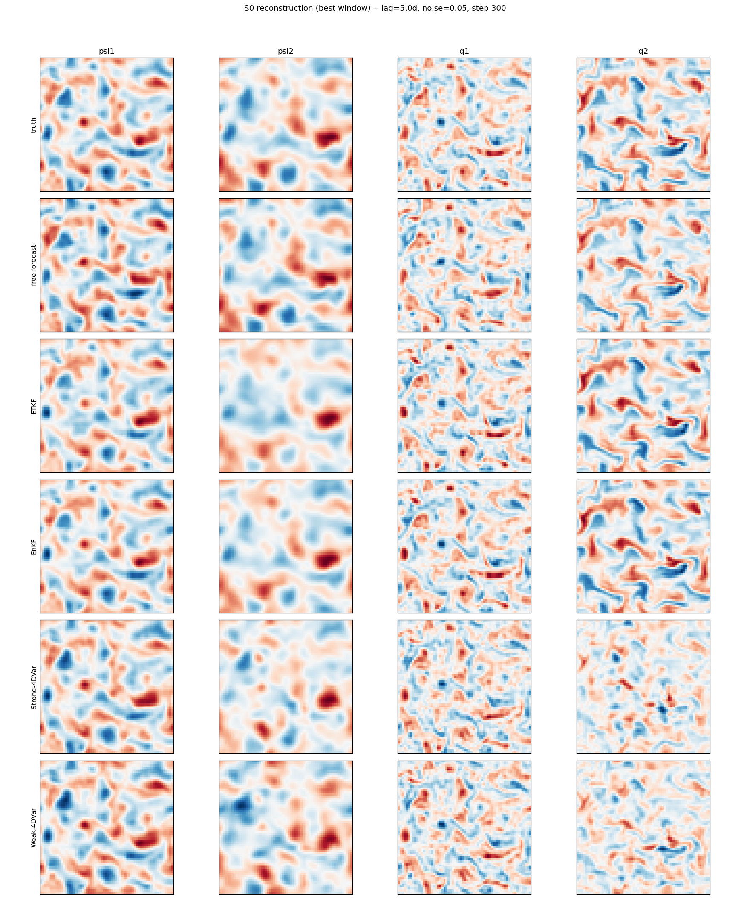
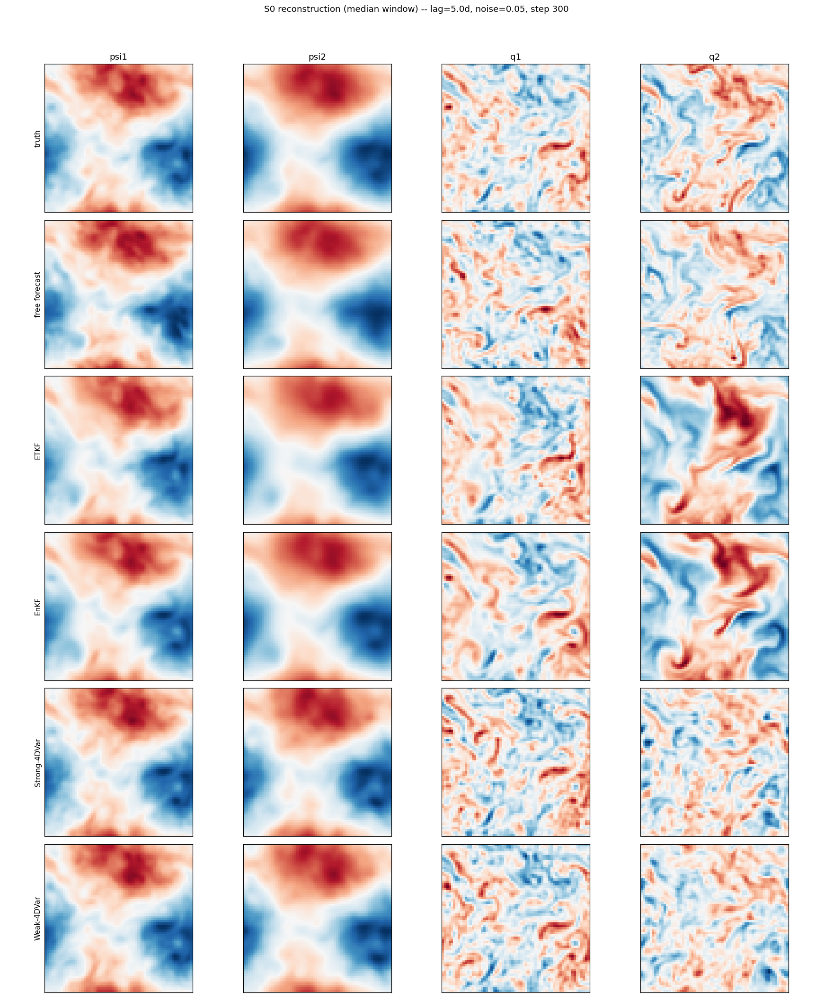
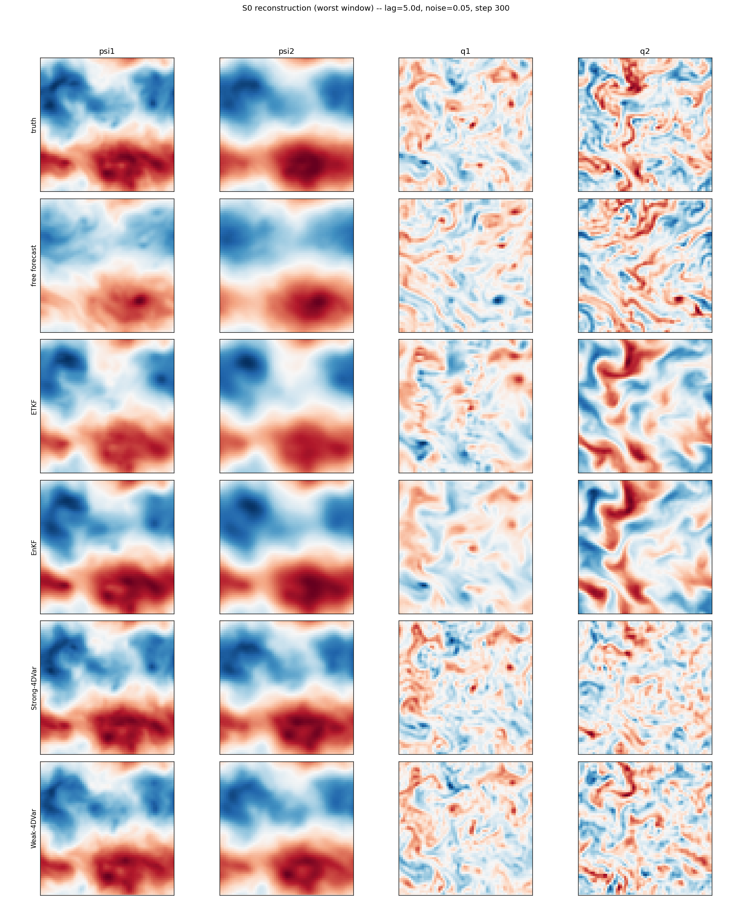

# QG DA Baselines (S0 reference case)

Reference case (2026-09-08): **lag=5.0d, noise_frac=0.05, N=100 test windows**. Supersedes the earlier lag=1.0d/noise=0.01 case, which was found to be unrealistically favorable -- at that setting the background (free forecast, no assimilation) alone already reached psi full EV≈0.98, so DA's high score there was mostly inherited from the background rather than earned from the observational update. See `PLAN.md`'s "DA reference-case realism" section for the full lag/noise sensitivity analysis behind this choice.

## DA baselines (S0, PV-q and ψ)

CRPS is computed per-window on the q-state: ensemble methods (ETKF/EnKF) score their real per-member spread; deterministic methods (4DVar) have no ensemble, so CRPS degenerates exactly to the mean absolute error (marked `*`) -- lower is better for both. CRPS (norm.) divides by the pooled truth PV std over the whole test set (not per-window -- avoids the distortion a low-variance window would introduce), giving a dimensionless, cross-method-comparable score.

| method | PV RMSE | free RMSE | improv | CRPS | CRPS (norm.) | PV EV | PV EV (free) | PV q1 EV | PV q2 EV | ψ EV | ψ EV (free) |
|---|---|---|---|---|---|---|---|---|---|---|---|
| EnKF | 1.25e-05 | 1.93e-05 | 1.5417 | 5.69e-06 | 0.2802 | 0.4812 | -0.0312 | 0.5686 | 0.3938 | 0.9474 | 0.8854 |
| ETKF | 1.39e-05 | 1.93e-05 | 1.3863 | 6.50e-06 | 0.3200 | 0.4050 | -0.0312 | 0.4694 | 0.3406 | 0.9212 | 0.8854 |
| Weak-4DVar | 1.41e-05 | 1.93e-05 | 1.3691 | 9.19e-06* | 0.4524* | -0.0345 | -0.0312 | 0.4677 | -0.5367 | 0.9660 | 0.8854 |
| Strong-4DVar | 1.40e-05 | 1.93e-05 | 1.3793 | 9.22e-06* | 0.4538* | -0.1257 | -0.0312 | 0.4830 | -0.7344 | 0.9714 | 0.8854 |
| _free forecast_ | 1.93e-05 | — | 1.0 | -- | -- | -- | -- | -- | -- | -- | -- |

> **Caveat:** Weak-4DVar, Strong-4DVar collapse on PV q layer2 (the unobserved lower layer) at this reference case -- their PV EV is negative there despite psi EV being the best of all 4 methods. This is consistent with PV being a Laplacian-like operator on psi (q ≈ ∇²ψ): small high-wavenumber errors in an otherwise excellent psi analysis get amplified when inverted to PV, especially in the layer with no direct observations. EnKF is the only method strongly positive on **both** psi and PV q at this setting.

Computed on N=100 test windows, lag=5.0, noise_frac=0.05 (should match the reference case above -- if not, these JSONs are stale, regenerate them).

## Reconstruction examples

3 example test windows (best/median/worst by ETKF's per-window pooled PV-q RMSE) x all 4 methods, showing truth | free-forecast | analysis for streamfunction (ψ, both layers) and PV (q, both layers). Generated by `generate_qg_reconstruction_figs.py`.

### Best window

### Median window

### Worst window

