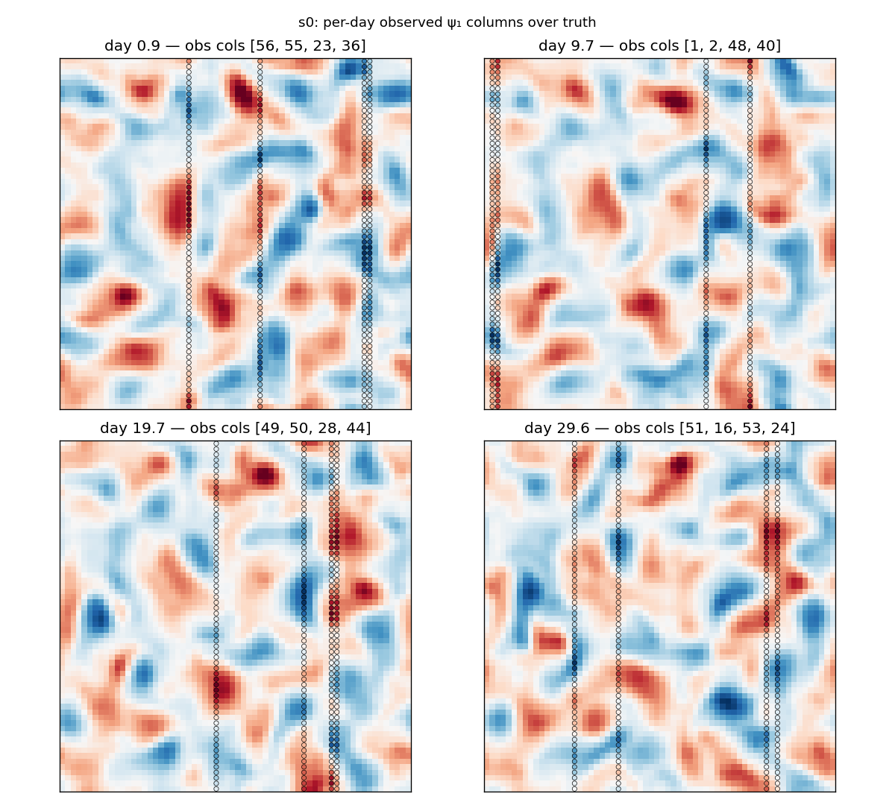
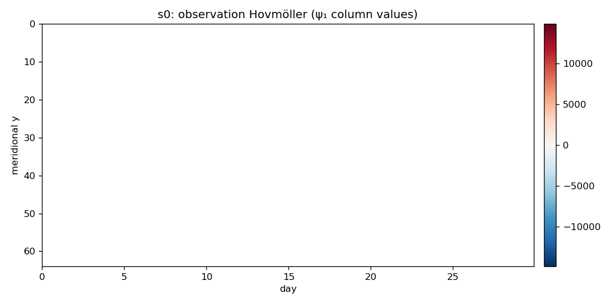
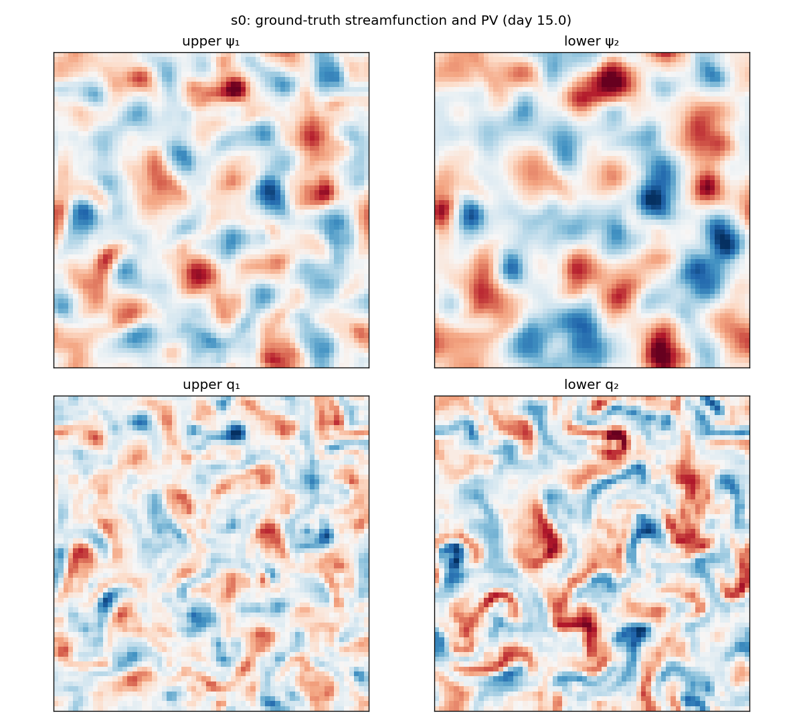
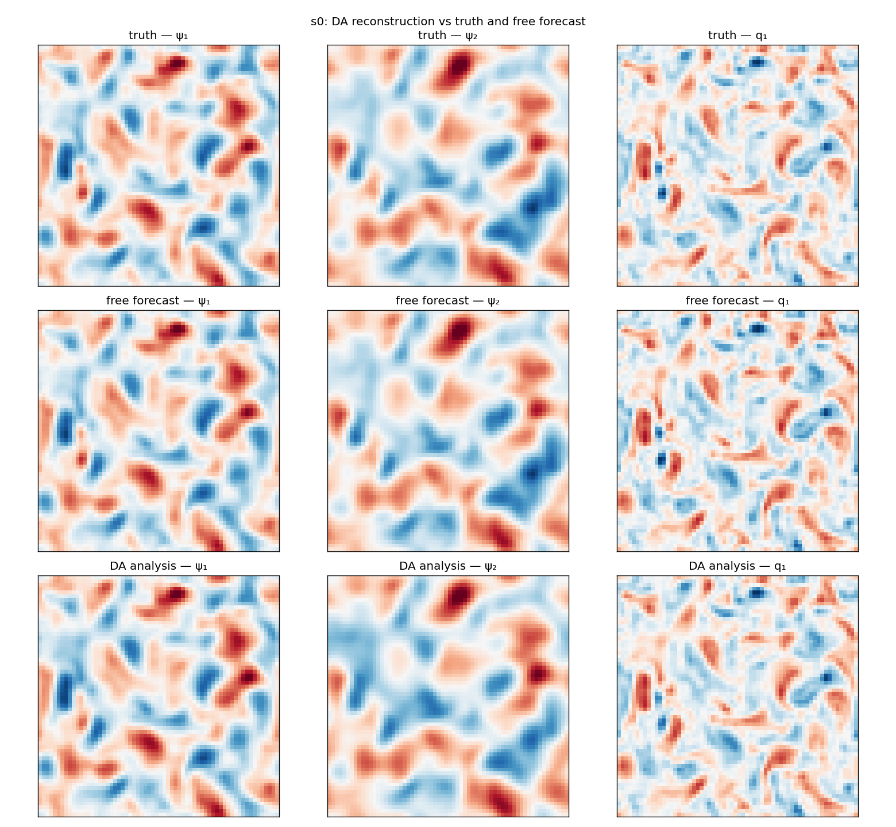
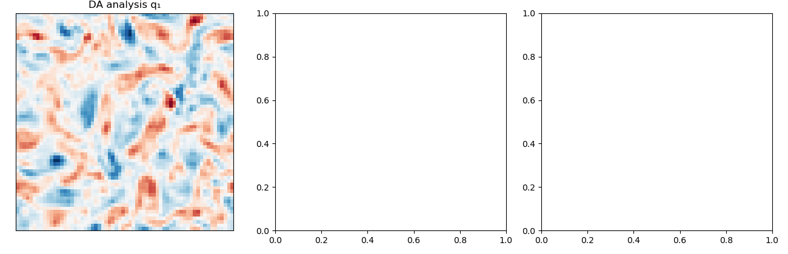
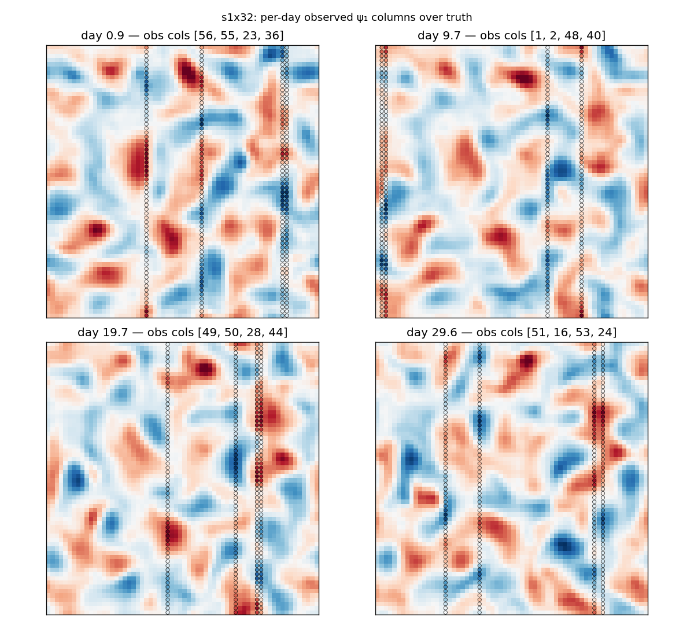
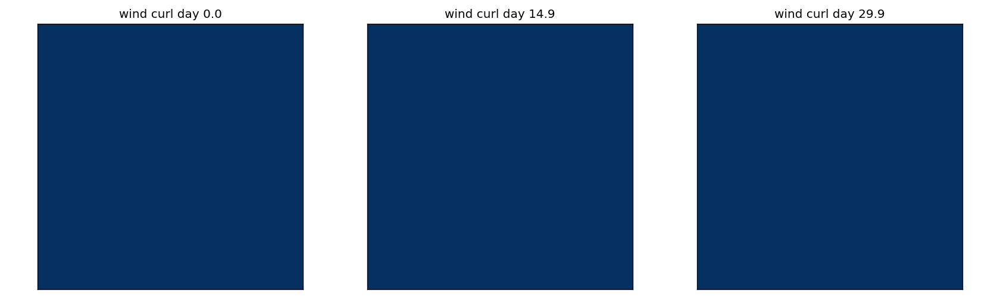
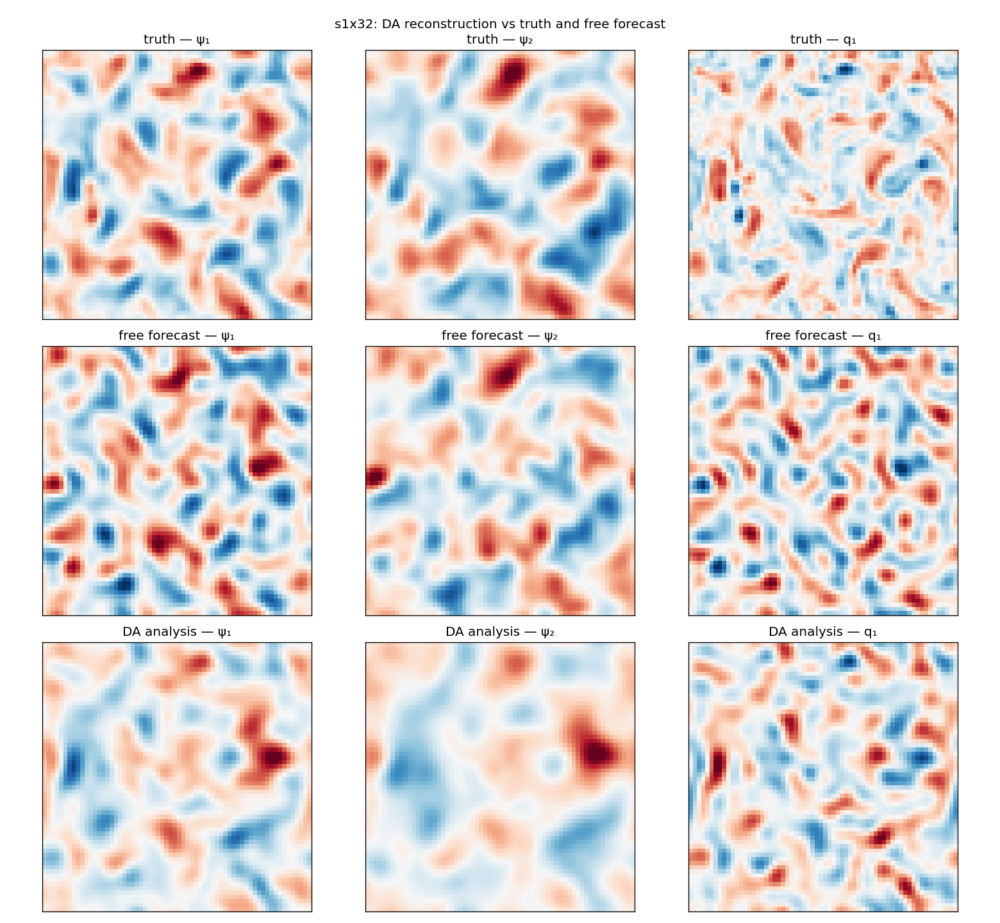

# QG DA Baselines — Consolidated Report (psi-obs focus)

**Date:** 2026-09-02
**Branch (report):** master
**Scope:** psi-obs configurations (upper-layer streamfunction) only; S0 (error-free), S1-QG2L (param + forcing + cross-resolution error) and S1-QG1L (structural 1-layer error).
**Provenance (jobs, A40 `sl-mee-br-205`):** S0 1%-noise matrix (`qg_matrix_c{4,8}_psi`, lags 1/2); S1 @ da_nx=16 (`qg_s1`), da_nx=32 (`qg_s1_da32`), da_nx=64 (`qg_s1_nores`, lag 1.0); S1-QG1L r-scale probe (`qg_s1_qg1l_rscale`).

## 1. System and governing equations

### 1.1 Two-layer quasi-geostrophic (Philips) model

The truth dynamics are the two-layer Phillips-channel QG equations
(double-periodic β-plane) solved by `QGDynamics` (native torch port of pyqg
v0.4.0, flux-form advection, `-J(ψ, q)`). Potential vorticity and evolution:

$$ q_1 = \nabla^2 \psi_1 + F_1(\psi_2 - \psi_1), \qquad
    q_2 = \nabla^2 \psi_2 + F_2(\psi_1 - \psi_2) $$

$$ \frac{d q_1}{dt} = -J(\psi_1,\, q_1) - Q_{y1}\,\partial_x \psi_1
    + \mathrm{curl}\,\tau $$

$$ \frac{d q_2}{dt} = -J(\psi_2,\, q_2) - Q_{y2}\,\partial_x \psi_2
    + r_{\mathrm{ek}}\,\nabla^2 \psi_2 $$

with the PV gradients and layer Froude numbers

$$ Q_{y1} = \beta + F_1\,(U_1 - U_2), \qquad
    Q_{y2} = \beta - F_2\,(U_1 - U_2), \qquad
    F_1 = \frac{r_d^{-2}}{1+\delta}, \qquad
    F_2 = \delta\, F_1 . $$

Here $\beta$ is the planetary vorticity gradient, $r_d$ the deformation
radius, $\delta$ the layer-depth ratio and $U_1,U_2$ the imposed mean zonal
flows. Time stepping is RK4 with the pyqg exponential spectral filter applied
once per step. State layout is flattened `[2·ny·nx]` (layer-major).

### 1.2 Wind forcing (upper-layer PV source)

A moving-storm wind-stress curl $\mathrm{curl}\,\tau$ drives the upper-layer
PV. It is a localized Gaussian storm (Witch-of-Agnesi profile) whose centre
follows a storm track $x_c(t) = x_0 + c_x t + w_x(t)$ (mod $L$),
$y_c(t) = y_0 + c_y t + w_y(t)$ (mod $W$) with OU position jitter
$w_x,w_y$ and OU amplitude $A(t)$ (`wind_amp`). For each window the storm
start, track drift and amplitude are randomized (see case-study table).

### 1.3 Reduced-gravity single-layer model (S1-QG1L)

The structural-error DA model is a reduced-gravity 1-layer QG (`QG1LDynamics`):
one active upper layer over a motionless deep layer,

$$ q = \nabla^2 \psi - \frac{\psi}{r_d^2}, \qquad
    \psi = -\left(\nabla^2 + r_d^{-2}\right)^{-1} q $$

$$ \frac{d q}{dt} = -J(\psi,\, q + \beta y) - r_{\mathrm{ek}}\,\nabla^2 \psi
    + \mathrm{curl}\,\tau . $$

`param_names = [β, rd, rek, U1]`. The truth remains the two-layer model; the
DA filter uses the single-layer PV structure as a mistaken forecast model.

## 2. Case studies

The observation configuration is **psi-obs** (upper-layer streamfunction at random meridional columns, 1% obs noise) throughout. Three case studies are benchmarked:

| Config | Dynamics / DA model | Observed field | Obs geometry | Model error | DA resolution |
|---|---|---|---|---|---|
| **S0** | truth = 2-layer QG; DA = `qg2l` (exact) | upper-layer ψ (psi-obs) | random columns, `cols_per_day` ∈ {4, 8} | none (error-free; obs noise only 1%) | full res (da_nx = nx = 64) |
| **S1-QG2L** | truth = 2-layer QG; DA = `qg2l_lores` (2-layer, honest) | upper-layer ψ (psi-obs) | random columns, `cols_per_day` = 4 | param bias (`rd,rek` ×0.85) + corrupted wind (OU jitter + amplitude bias) + cross-resolution da_nx ∈ {16, 32, 64} | da_nx = 16 / 32 / 64 |
| **S1-QG1L** | truth = 2-layer QG; DA = `qg1l` (reduced-gravity 1-layer) | upper-layer ψ (psi-obs; q-obs reference) | random columns, `cols_per_day` = 4 | structural error (1-layer vs 2-layer mismatch); `obs_var_r_scale` ∈ {1, 100, 1e4} | full res (da_nx = 64) |

Observed field is the upper-layer streamfunction ψ₁ for every configuration
(psi-obs; the `ObsOperator` inverts ψ to PV after spectral upsampling on the
DA grid). The q-obs (upper-layer PV) runs are included only as local-VP
reference in the QG1L section. All scenarios share the ETKF (N = 80,
inflation 1.0, Gaspari–Cohn localization radius 6) and lagged-truth
initialization (lags 1.0 and 2.0 d in S0/S1-QG2L; 1.0 d in S1-QG1L).

## 3. Base configuration

### 3.1 QGConfig snapshot

| Parameter | Value |
|---|---|
| Domain length L | 1000000 m |
| Grid | nx = ny = 64, state_dim = 8192 (2×64×64, layer-major) |
| Time step | dt = 7200 s, steps_per_day = 12 |
| Assimilation window | 30 days (360 steps) |
| Spinup | 2 years |
| Windows | 5 |
| Physics β | 1.5e-11 |
| Physics rd | 15000 m |
| Physics δ (layer-depth ratio) | 0.25 |
| Physics U₁ | 0.05 |
| Physics U₂ | 0.0 |
| Physics rek (linear drag) | 5.787e-07 |
| Spectral filter | filterfac = 23.6 |
| Seed | 7 |

### 3.2 Moving-storm wind forcing (upper-layer PV source)

- Wind-stress-curl amplitude `wind_amp = 1e-11` (Ornstein–Uhlenbeck, `wind_tau_days = 15` d; storm width `wind_sigma = 250` km).
- Storm-track drift `wind_cx = 0.5`, `wind_cy = 0.03` m/s; position OU jitter `wind_drift_tau_days = 10` d, `wind_drift_sigma = 50` km.

### 3.3 Per-window truth randomization

- U₁, rd, rek drawn once per window as `U[1 ± param_range]` (`param_range = 0.15`); β/δ fixed.
- Independent storm per window: start `(x0,y0) ~ U(0,L)²`, track `cx ~ U[0.25, 0.75]`, `cy ~ U[−0.06, 0.06]`.
- Wind amplitude drawn from discrete levels `{0, 3e-12, 1e-11, 2e-11, 3e-11}` round-robin `i % 5`.
- Initial state at `t₀ − U(0, init_lag_days)` (lagged-truth first guess).

### 3.4 Observations

- Geometry `random_columns`: `cols_per_day` distinct meridional columns of the upper-layer field, one simultaneous event/day at a random step.
- Observed field: upper-layer streamfunction ψ₁ (psi-obs) — the baseline `ObsOperator` inverts ψ to PV after spectral upsampling on the DA grid.
- Noise: `sigma = obs_noise_std_frac × std(field)`, `frac = 0.01` (1%).
- Coverage (production): cols = 4 → ~0.52% of space-time gridpoints.

### 3.5 DA filter

- **ETKF**, ensemble N = 80, inflation 1.0, Gaspari–Cohn localization radius 6 (physical coords on the DA grid).
- Init: lagged-truth shared by the DA ensemble and the free-forecast reference; `disp_frac = 1.0` (background-error-scaled), band ±0.25 d.
- Lags: 1.0 d and 2.0 d (S0, S1-QG2L); 1.0 d (S1-QG1L).

## 4. S0 metrics (error-free, psi-obs)

Error-free benchmark: `da_params = true_params`, DA at full resolution (`da_nx = nx = 64`). psi-obs matrix, cols ∈ {4, 8}, lags 1.0/2.0, 1% noise. RMSE on the upper-layer ψ field; `improv` = forecast improvement (DA-RMSE / free-RMSE, >1 means the DA beats the free forecast); EV = pooled explained variance.

### 4.1 Headline (psi-obs)

| obs | cols | lag | DA RMSE | Free RMSE | improv | EV_full | EV_free |
|---|---|---|---|---|---|---|---|
| psi | 4 | 1.0 | 6.32e-06 | 7.33e-06 | 1.16 | +0.752 | +0.727 |
| psi | 4 | 2.0 | 8.11e-06 | 1.30e-05 | 1.61 | +0.652 | +0.301 |
| psi | 8 | 1.0 | 5.18e-06 | 7.33e-06 | 1.42 | +0.777 | +0.727 |
| psi | 8 | 2.0 | 6.89e-06 | 1.30e-05 | 1.89 | +0.689 | +0.301 |

### 4.2 Per-field (psi-obs, cols=4, lag 1.0)

| field | layer | DA RMSE | Free RMSE | improv | EV | EV_free |
|---|---|---|---|---|---|---|
| PV q | upper (layer 1) | 1.09e-05 | 1.37e-05 | 1.25 | +0.815 | +0.706 |
| PV q | lower (layer 2) | 2.19e-06 | 1.96e-06 | 0.90 | +0.688 | +0.748 |
| PV q | full state | 7.87e-06 | 9.76e-06 | 1.24 | +0.752 | +0.727 |
| streamfunction ψ | upper (layer 1) | 2.52e+03 | 2.4e+03 | 0.96 | +0.966 | +0.970 |
| streamfunction ψ | lower (layer 2) | 2e+03 | 1.13e+03 | 0.56 | +0.971 | +0.991 |
| streamfunction ψ | full state | 2.27e+03 | 1.88e+03 | 0.83 | +0.968 | +0.980 |

## 5. S1-QG2L metrics (param + forcing + cross-resolution error)

Model-error S1 with the **2-layer** DA model (`qg2l_lores`): parameter bias (`rd,rek ← rd,rek × 0.85`) + corrupted wind (OU location jitter + amplitude bias) + cross-resolution da_nx. Ternary `da_nx` = cross-resolution ratio vs the 64×64 truth: 16 (4:1), 32 (2:1), 64 (1:1, no resolution mismatch). psi-obs, cols = 4, 1% noise.

### 5.1 Headline across da_nx (psi-obs, cols=4, lag 1.0)

| da_nx | ratio | DA RMSE | Free RMSE | improv | EV_full | EV_free |
|---|---|---|---|---|---|---|
| 16 | 4:1 | 1.71e-05 | 1.88e-05 | 1.10 | -0.106 | -0.456 |
| 32 | 2:1 | 1.24e-05 | 1.83e-05 | 1.47 | +0.340 | -0.348 |
| 64 | 1:1 | 1.10e-05 | 1.70e-05 | 1.55 | +0.428 | -0.232 |

### 5.2 S1-QG2L lag trend (da_nx=16)

| lag | DA RMSE | Free RMSE | improv | EV_full | EV_free |
|---|---|---|---|---|---|
| 1.0 | 1.71e-05 | 1.88e-05 | 1.10 | -0.106 | -0.456 |
| 2.0 | 1.74e-05 | 1.93e-05 | 1.11 | -0.135 | -0.542 |

### 5.3 Per-field — S1-QG2L @ da_nx=16 (lag 1.0)

| field | layer | DA RMSE | Free RMSE | improv | EV | EV_free |
|---|---|---|---|---|---|---|
| PV q | upper (layer 1) | 2.49e-05 | 2.84e-05 | 1.14 | +0.026 | -0.267 |
| PV q | lower (layer 2) | 4.30e-06 | 4.90e-06 | 1.14 | -0.237 | -0.644 |
| PV q | full state | 1.79e-05 | 2.04e-05 | 1.14 | -0.106 | -0.456 |
| streamfunction ψ | upper (layer 1) | 1.01e+04 | 1.11e+04 | 1.11 | +0.479 | +0.334 |
| streamfunction ψ | lower (layer 2) | 8.14e+03 | 7.88e+03 | 0.97 | +0.496 | +0.502 |
| streamfunction ψ | full state | 9.15e+03 | 9.65e+03 | 1.05 | +0.488 | +0.418 |

### 5.4 Per-field — S1-QG2L @ da_nx=32 (lag 1.0)

| field | layer | DA RMSE | Free RMSE | improv | EV | EV_free |
|---|---|---|---|---|---|---|
| PV q | upper (layer 1) | 1.86e-05 | 2.78e-05 | 1.49 | +0.458 | -0.221 |
| PV q | lower (layer 2) | 3.41e-06 | 4.68e-06 | 1.37 | +0.221 | -0.476 |
| PV q | full state | 1.34e-05 | 1.99e-05 | 1.49 | +0.340 | -0.348 |
| streamfunction ψ | upper (layer 1) | 6.24e+03 | 1.05e+04 | 1.69 | +0.801 | +0.406 |
| streamfunction ψ | lower (layer 2) | 5.13e+03 | 7.96e+03 | 1.55 | +0.806 | +0.493 |
| streamfunction ψ | full state | 5.71e+03 | 9.34e+03 | 1.63 | +0.804 | +0.449 |

### 5.5 Per-field — S1-QG2L @ da_nx=64 (nores) (lag 1.0)

| field | layer | DA RMSE | Free RMSE | improv | EV | EV_free |
|---|---|---|---|---|---|---|
| PV q | upper (layer 1) | 1.68e-05 | 2.68e-05 | 1.60 | +0.552 | -0.155 |
| PV q | lower (layer 2) | 3.20e-06 | 4.37e-06 | 1.36 | +0.304 | -0.310 |
| PV q | full state | 1.21e-05 | 1.92e-05 | 1.59 | +0.428 | -0.232 |
| streamfunction ψ | upper (layer 1) | 1.05e+04 | 1.04e+04 | 0.99 | +0.435 | +0.413 |
| streamfunction ψ | lower (layer 2) | 1.02e+04 | 8.1e+03 | 0.79 | +0.222 | +0.467 |
| streamfunction ψ | full state | 1.04e+04 | 9.33e+03 | 0.90 | +0.328 | +0.440 |

## 6. S1-QG1L metrics (structural error, r-scale sweep)

Cross-model structural-error S1: the DA filter uses the **reduced-gravity 1-layer** model (`qg1l`) against the 2-layer truth, at full resolution (da_nx = 64). Under this mismatch the nonlocal psi observations are over-trusted (DA worse than the free forecast, improv ~0.39 at default R). `obs_var_r_scale` inflates the observation-noise variance to model the unmodelled structural error: 1 → 100 → 1e4. psi-obs, cols=4, lag 1.0.

### 6.1 Headline (psi obs, r-scale sweep)

| r_scale | DA RMSE | Free RMSE | improv | EV_full | EV_free |
|---|---|---|---|---|---|
| 1 | 7.49e-05 | 2.93e-05 | 0.39 | -11.220 | -0.496 |
| 100 | 6.91e-05 | 2.93e-05 | 0.42 | -9.782 | -0.496 |
| 10000 | 3.61e-05 | 2.93e-05 | 0.81 | -1.694 | -0.496 |

### 6.2 Per-field (psi obs, r-scale sweep)

**r_scale = 1**

| field | layer | DA RMSE | Free RMSE | improv | EV | EV_free |
|---|---|---|---|---|---|---|
| PV q | upper (layer 1) | 8.64e-05 | 3.13e-05 | 0.36 | -11.220 | -0.496 |
| PV q | full state | 8.64e-05 | 3.13e-05 | 0.36 | -11.220 | -0.496 |
| streamfunction ψ | upper (layer 1) | 1.28e+04 | 5.89e+03 | 0.46 | -6.828 | -0.517 |
| streamfunction ψ | full state | 1.28e+04 | 5.89e+03 | 0.46 | -6.828 | -0.517 |

**r_scale = 100**

| field | layer | DA RMSE | Free RMSE | improv | EV | EV_free |
|---|---|---|---|---|---|---|
| PV q | upper (layer 1) | 8.10e-05 | 3.13e-05 | 0.39 | -9.782 | -0.496 |
| PV q | full state | 8.10e-05 | 3.13e-05 | 0.39 | -9.782 | -0.496 |
| streamfunction ψ | upper (layer 1) | 1.28e+04 | 5.89e+03 | 0.46 | -6.735 | -0.517 |
| streamfunction ψ | full state | 1.28e+04 | 5.89e+03 | 0.46 | -6.735 | -0.517 |

**r_scale = 10000**

| field | layer | DA RMSE | Free RMSE | improv | EV | EV_free |
|---|---|---|---|---|---|---|
| PV q | upper (layer 1) | 4.09e-05 | 3.13e-05 | 0.76 | -1.694 | -0.496 |
| PV q | full state | 4.09e-05 | 3.13e-05 | 0.76 | -1.694 | -0.496 |
| streamfunction ψ | upper (layer 1) | 8.53e+03 | 5.89e+03 | 0.69 | -2.424 | -0.517 |
| streamfunction ψ | full state | 8.53e+03 | 5.89e+03 | 0.69 | -2.424 | -0.517 |

### 6.3 Local PV (q-obs) reference (r_scale = 1)

| field | layer | DA RMSE | Free RMSE | improv | EV | EV_free |
|---|---|---|---|---|---|---|
| PV q | upper (layer 1) | 3.24e-05 | 3.13e-05 | 0.96 | -0.632 | -0.496 |
| PV q | full state | 3.24e-05 | 3.13e-05 | 0.96 | -0.632 | -0.496 |
| streamfunction ψ | upper (layer 1) | 4.95e+03 | 5.89e+03 | 1.19 | -0.083 | -0.517 |
| streamfunction ψ | full state | 4.95e+03 | 5.89e+03 | 1.19 | -0.083 | -0.517 |

## 7. Interpretation

- **S0 (error-free, psi-obs):** increasing columns (4 → 8) and shorter lag (2.0 → 1.0) both improve skill; psi-obs at cols=8/lag 1.0 is the best S0 DA (improv ~1.42, EV_full ~+0.78). EV remains positive for the psi-obs matrix.
- **S1-QG2L resolution trend (16 → 32 → 64):** forecast-improv rises monotonically (~1.10 → ~1.48 → ~1.55) and pooled EV flips from negative at da_nx=16 (-0.11) to strongly positive at da_nx=64 (+0.43) — the milder the cross-resolution mismatch, the easier the DA. At da_nx=32/64 the PV q field improves across layers (q₁ improv ~1.49–1.60).
- **S1-QG2L lag trend (da_nx=16):** lag 2.0 is slightly worse than lag 1.0 (improv 1.10 vs 1.11) — longer window broadens the free forecast without adding DA skill, so the shortest assimilated lag is preferred.
- **S1-QG1L structural error:** at default R the 1-layer filter is worse than the free forecast (improv ~0.39, negative EV) because the nonlocal psi observations are mutually inconsistent with the 1-layer model and over-trusted. Inflating the observation variance `obs_var_r_scale` 1 → 100 → 1e4 recovers skill monotonically toward the free-forecast limit (improv 0.39 → 0.42 → 0.81, for the PV-q field) but does not cross 1.0. The local PV (q-obs) reference at r_scale=1 is the closest well-posed observation for the 1-layer model: it nearly reaches the free-forecast skill for q (improv ~0.96) and even beats it for the streamfunction (improv ~1.19) — a spatially-local observation is far more robust to the unresolved lower layer than the nonlocal psi columns.

## 8. Illustrations (S0 and S1-QG2L, da_nx=32)

Single-window ETKF reconstruction figures (production cfg: nx=64, N=80, psi-obs, cols=4, 1% noise, lag 1.0; S1 additionally at da_nx=32 cross-resolution). Generated by `reports/qg/generate_qg_s0s1_figs.py` (no DA-cache dependency): `obs_days` (aggregated per-day obs, 2×2 panel), `obs_hovmoller` (full-window obs Hovmöller), `forcing` (moving-storm wind curl), `truth_psi_q` (ground-truth streamfunction/PV), `analysis` (truth vs free forecast vs DA analysis) and a `dacycle.gif`.

### 8.1 S0

| panel | figure |
|---|---|
| aggregated per-day observations (upper-layer ψ) |  |
| full-window observation Hovmöller |  |
| moving-storm wind-stress curl |  |
| ground-truth streamfunction and PV |  |
| DA reconstruction vs truth and free forecast |  |
| DA-cycle animation |  |

### 8.2 S1-QG2L da_nx=32

| panel | figure |
|---|---|
| aggregated per-day observations (upper-layer ψ) |  |
| full-window observation Hovmöller |  |
| moving-storm wind-stress curl |  |
| ground-truth streamfunction and PV |  |
| DA reconstruction vs truth and free forecast |  |
| DA-cycle animation |  |

