# QG ocean under spectral (Option B) wind forcing — first simulations

Generated by `reports/qg/simulate_qg_spectral_wind.py`. Four runs start from one
shared, unforced 2-year spin-up of the two-layer QG ocean (nominal
benchmark parameters, nx=64), then run 120 days forced by:

| run | driver | forcing |
|---|---|---|
| E0 | `ou` | the current moving Mexican-hat storm (OU amplitude, 15-day memory; the wind series starts after a 4-memory-time lead-in, since the OU amplitude is initialized at zero) |
| E0b | `spectral_ou` | 12 Fourier amplitudes (`|k| ≤ 2`), independent OU, same per-mode variance and memory as the storm |
| E1 | `gyrostat` | the same amplitudes driven by `l63ring4` (four Lorenz-63 gyrostats on a ring, energy-conserving coupling 0.5) |
| E2 | `gyrostat_surrogate` | multivariate phase-randomized surrogate of E1's gyrostat series (same auto- and cross-spectra, Gaussian) |

All spectral drivers share the storm's spatial spectrum (variance per mode, analytic from the
Mexican-hat Fourier transform) and its drift (cx=0.5 m/s, cy=0.03 m/s, applied as a rotation
of each cos/sin pair). Wind amplitude level 1e-11 s⁻².

## Calibration

| quantity | value |
|---|---|
| gyrostat preset | `l63ring4`, 12 modes |
| e-folding of the x modes (gyrostat units) | 0.241 |
| time unit | 62.2 days per gyrostat unit (matches the 15-day storm memory) |

Amplitude statistics from 40-year amplitude-only series (no ocean):

| run | e-folding of the (1,0) cos amplitude (days) | kurtosis | rms per wavevector / storm target |
|---|---|---|---|
| E0: moving storm (current) | 14.8 | 2.95 | 1.00, 1.00, 1.00, 1.00, 1.00, 1.00 |
| E0b: spectral OU | 14.8 | 3.20 | 1.00, 1.02, 1.01, 1.01, 1.03, 1.01 |
| E1: gyrostat (l63ring4) | 15.8 | 1.98 | 1.00, 0.98, 0.99, 0.99, 1.00, 0.99 |
| E2: phase-randomized surrogate | 15.0 | 2.93 | 1.01, 1.00, 1.01, 1.02, 1.02, 1.01 |

## Ocean response over the simulated window

| run | mean KE, last half (m² s⁻²) | max KE (m² s⁻²) | rms curl (s⁻²) | GPU time (s) |
|---|---|---|---|---|
| E0: moving storm (current) | 5.899e-03 | 8.669e-03 | 2.21e-12 | 18 |
| E0b: spectral OU | 5.471e-03 | 1.447e-02 | 2.91e-12 | 6 |
| E1: gyrostat (l63ring4) | 5.830e-03 | 7.522e-03 | 3.04e-12 | 5 |
| E2: phase-randomized surrogate | 4.994e-03 | 7.224e-03 | 3.38e-12 | 5 |

A single realization per driver over 120 days: these runs show the forcing and the response, they do not
support statistical conclusions. The response analysis (long forced runs, ensembles,
surrogate comparison) is a later work package.

Two structural differences are visible even in one realization, because they
follow from how each driver is built rather than from sampling:

- **Intermittent vs steady energy input.** The current storm is one coherent blob
  whose signed amplitude crosses zero, so its domain-rms curl repeatedly drops to
  about 0. The spectral drivers sum 12 partly independent amplitudes and keep a
  steady rms curl at the same mean variance. E0 vs E0b isolates this effect.
- **Regimes and long memory.** The gyrostat amplitude is bimodal and keeps an
  autocorrelation of about 0.3 at 60–90 days. Its surrogate shares the memory but
  is Gaussian. E1 vs E2 isolates the bimodality.

## Cross-driver comparison

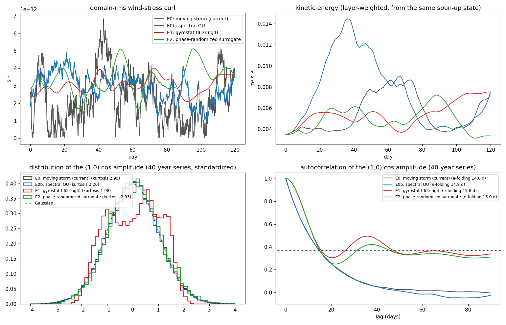

## E0: moving storm (current)

| figure | |
|---|---|
| animation (ψ₁, q₁, q₂, wind curl) | 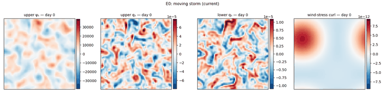 |
| wind forcing | 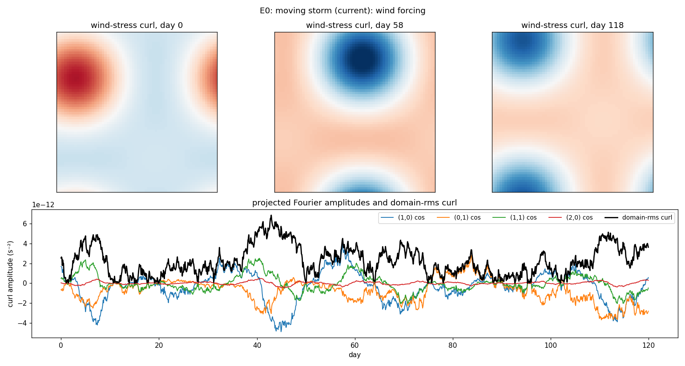 |
| streamfunction and PV | 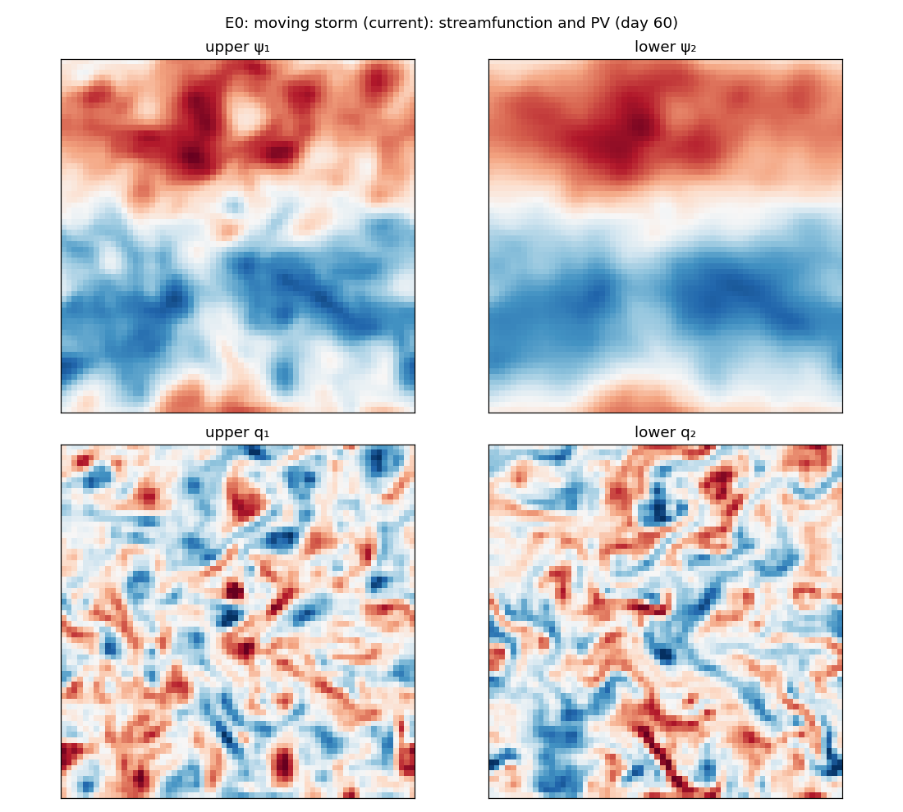 |

## E0b: spectral OU

| figure | |
|---|---|
| animation (ψ₁, q₁, q₂, wind curl) | 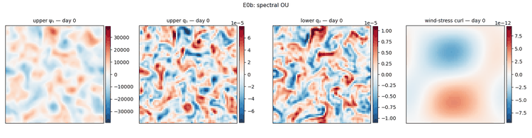 |
| wind forcing | 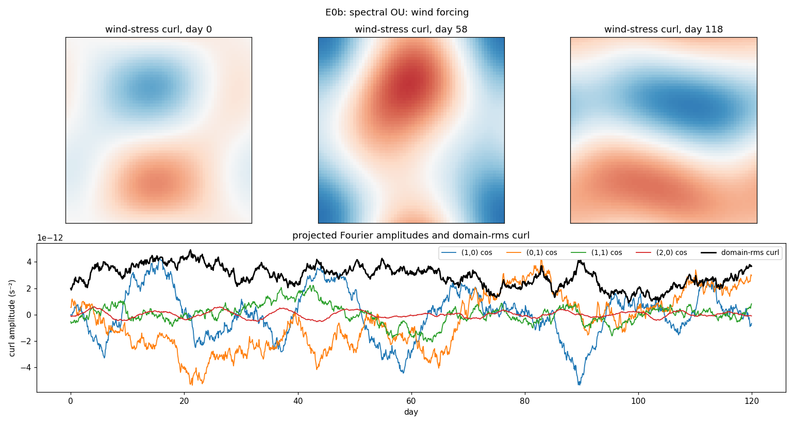 |
| streamfunction and PV | 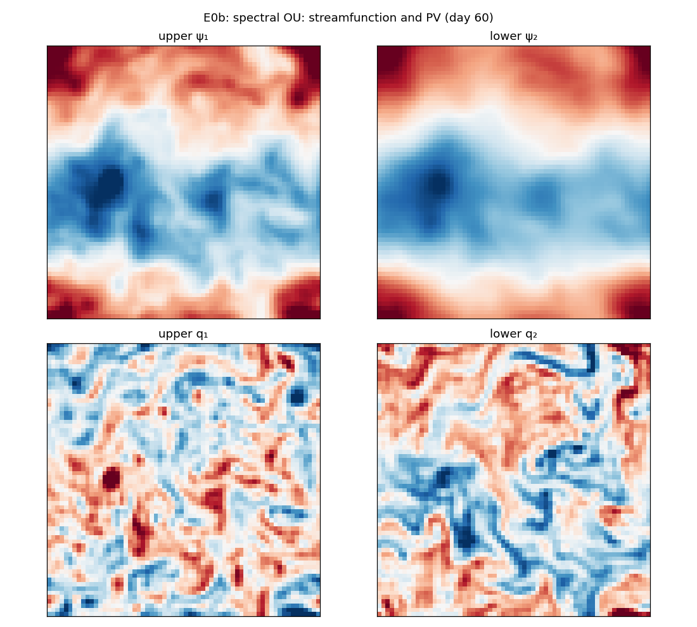 |

## E1: gyrostat (l63ring4)

| figure | |
|---|---|
| animation (ψ₁, q₁, q₂, wind curl) | 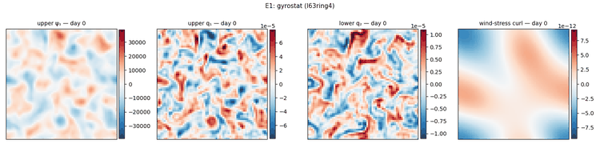 |
| wind forcing | 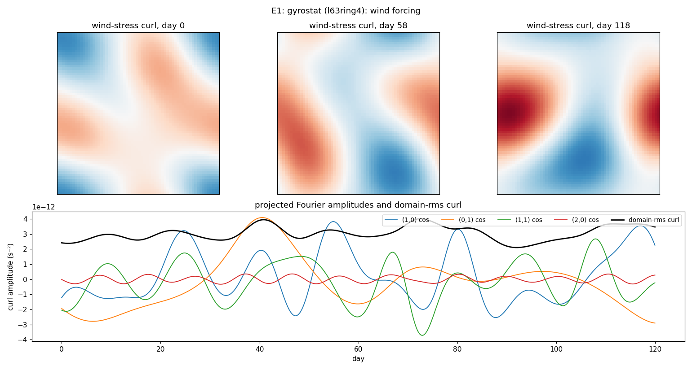 |
| streamfunction and PV | 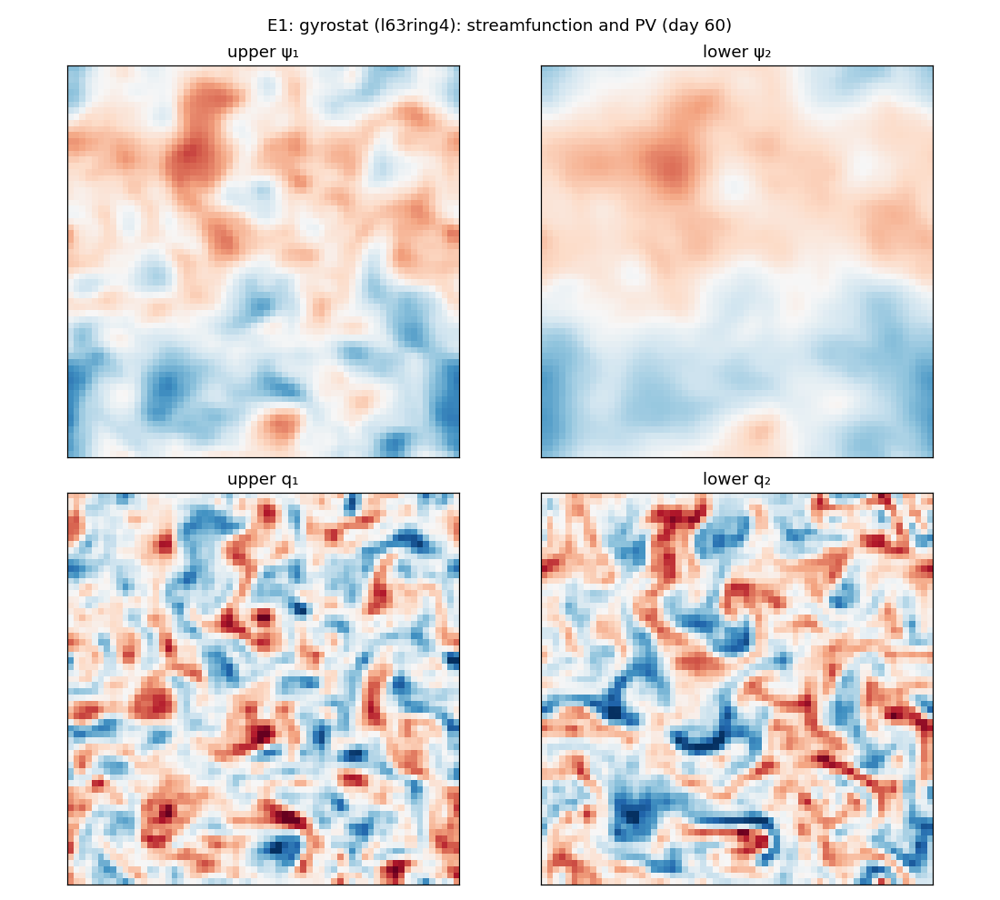 |

## E2: phase-randomized surrogate

| figure | |
|---|---|
| animation (ψ₁, q₁, q₂, wind curl) | 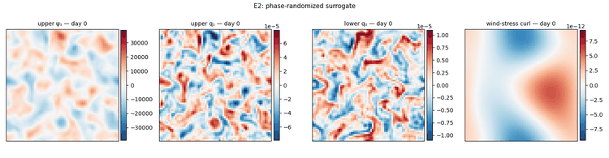 |
| wind forcing | 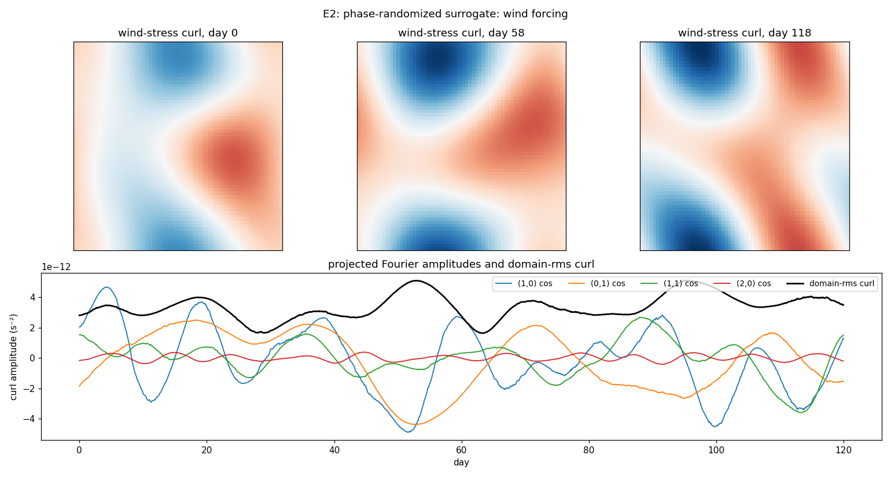 |
| streamfunction and PV | 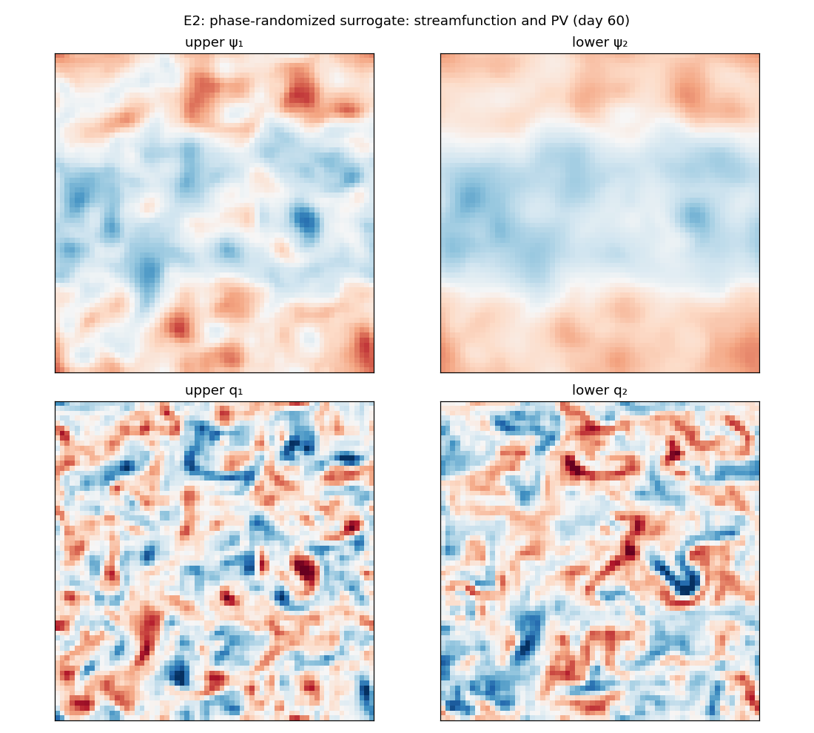 |
