# QG gyrostat case study: DA baselines (S0 + realistic S1)

Two-layer QG ocean (64×64, 1000 km, dt 2 h) forced by the wind-stress curl of a gyrostat atmosphere (`l63ring4`, 12 Fourier modes |k| ≤ 2) plus relative-wind eddy drag. Test sets: 100 windows of 30 days of the **forced** dataset `qg_specwind_gyrostat_v1` and of the paired two-way **coupled** dataset `qg_coupled_gyrostat_v1` (κ_fb = 1). Design: `docs/plans/analysis/qg_specwind_da_s0.md`, `docs/plans/analysis/qg_specwind_da_s1.md`; written findings: `docs/results/qg_specwind_da_s0_s1_test.md`.

**Reference case (S0):** upper-layer ψ₁ observed on 3 random meridional columns per day (4.7% of the grid), each once per day, 5% noise; initial state = truth lagged about 5 days with a bred 80-member ensemble; the DA model is exact and gets the true wind.

**Filters:** ETKF with the exact localized EnSRF update (radius 8, ridge 0.1; since 2026-09-28, `docs/results/qg_specwind_etkf_loc_update.md` — earlier renders used a localized update with unnormalized covariances and a full-gain anomaly update, radius 8 / ridge 1); EnKF radius 6; both with cross-layer localization weight 1 and N = 80, inflation 1.0.

**S1 (realistic base, model error):** wind amplitude +15%, random wind error 25% of each mode's RMS, wind position error 50 km; rd −10%; bottom drag −50%; altimetry error 15% white + 15% correlated per pass (the filter's R = total variance, white); DA model on a 32×32 grid (rd unresolved). Calibrated on val: `docs/results/qg_specwind_da_s1_calibration.md`.

**Metrics:** EV = 1 − MSE / Var(truth) per window over its 30 days, averaged over windows; ψ inverted with each window's own parameters; score = mean of the four EVs; 95% intervals by bootstrap over windows. Generated by `reports/qg/generate_qg_specwind_da_report.py` (figures: `reports/qg/generate_qg_specwind_da_figs.py`).

## 1. Case study

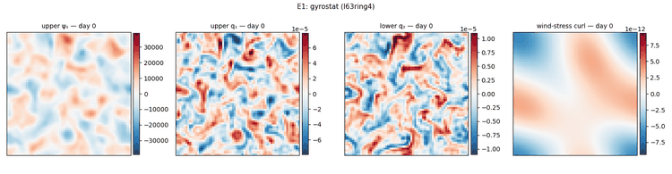

The gyrostat drives domain-scale wind-stress-curl patterns with regime changes; the ocean responds with a forced large-scale circulation on top of its own baroclinic eddies. Windows differ in ocean parameters (rd, U1, drag), wind level (21% of the test windows are calm, level 0) and gyrostat time unit.

## 2. DA baselines — S0 (perfect model, true wind), 3 columns per day

**Forced dataset**

| method | ψ₁ | ψ₂ | q₁ | q₂ | score | score 95% CI |
|---|---|---|---|---|---|---|
| _free forecast_ | 0.759 | 0.848 | -0.057 | 0.043 | 0.398 |  |
| ETKF (radius 8) | *0.937* | *0.933* | *0.647* | *0.578* | *0.774* | [0.762, 0.786] |
| EnKF (radius 6) | 0.929 | 0.918 | 0.635 | 0.562 | 0.761 | [0.749, 0.773] |
| EnKS (ETKF smoother) (radius 8, lag 12) | **0.961** | **0.948** | **0.717** | **0.588** | **0.804** | [0.793, 0.815] |

**Coupled dataset**

| method | ψ₁ | ψ₂ | q₁ | q₂ | score | score 95% CI |
|---|---|---|---|---|---|---|
| _free forecast_ | 0.745 | 0.838 | -0.044 | 0.068 | 0.402 |  |
| ETKF (radius 8) | *0.936* | *0.933* | *0.651* | *0.595* | *0.779* | [0.767, 0.791] |
| EnKF (radius 6) | 0.929 | 0.919 | 0.643 | 0.580 | 0.768 | [0.755, 0.780] |
| EnKS (ETKF smoother) (radius 8, lag 12) | **0.962** | **0.951** | **0.726** | **0.611** | **0.813** | [0.802, 0.823] |

(Best per column **bolded**, second-best *italicized*, among the DA methods; the free forecast is a reference row. The EnKS is the localized ensemble Kalman smoother on the ETKF: it also uses observations after each time, so it is a reanalysis-type estimate, not a filter.)

## 3. DA baselines — S1 (realistic base), 3 columns per day

**Forced dataset**

| method | ψ₁ | ψ₂ | q₁ | q₂ | score | score 95% CI |
|---|---|---|---|---|---|---|
| _free forecast_ | 0.127 | -0.934 | -0.254 | -0.363 | -0.356 |  |
| ETKF (radius 8) | *0.848* | *0.757* | 0.433 | 0.277 | 0.579 | [0.560, 0.598] |
| EnKF (radius 6) | 0.847 | **0.762** | *0.450* | **0.326** | *0.596* | [0.578, 0.615] |
| EnKS (ETKF smoother) (radius 8, lag 12) | **0.872** | 0.741 | **0.504** | *0.290* | **0.602** | [0.581, 0.621] |

**Coupled dataset**

| method | ψ₁ | ψ₂ | q₁ | q₂ | score | score 95% CI |
|---|---|---|---|---|---|---|
| _free forecast_ | 0.113 | -0.914 | -0.260 | -0.352 | -0.353 |  |
| ETKF (radius 8) | *0.848* | *0.766* | 0.437 | 0.295 | 0.586 | [0.568, 0.605] |
| EnKF (radius 6) | 0.847 | **0.771** | *0.454* | **0.343** | *0.604* | [0.586, 0.622] |
| EnKS (ETKF smoother) (radius 8, lag 12) | **0.872** | 0.746 | **0.512** | *0.311* | **0.610** | [0.590, 0.630] |

(Best per column **bolded**, second-best *italicized*, among the DA methods; the free forecast is a reference row. The EnKS is the localized ensemble Kalman smoother on the ETKF: it also uses observations after each time, so it is a reanalysis-type estimate, not a filter.)

### S1-tuned filters (observation-error variance × 6), 3 columns per day

Same S1, with the filters' R scaled on val to absorb the model error (`docs/results/qg_specwind_s1_tuning.md`); inflation > 1 diverges here. The rows above use the S0-tuned filters.

**Forced dataset**

| method | ψ₁ | ψ₂ | q₁ | q₂ | score | score 95% CI |
|---|---|---|---|---|---|---|
| _free forecast_ | 0.127 | -0.934 | -0.254 | -0.363 | -0.356 |  |
| ETKF (radius 8) | *0.865* | 0.791 | *0.473* | 0.402 | 0.633 | [0.615, 0.650] |
| EnKF (radius 6) | 0.861 | *0.798* | 0.468 | *0.409* | *0.634* | [0.617, 0.650] |
| EnKS (ETKF smoother) (radius 8, lag 12) | **0.891** | **0.800** | **0.537** | **0.429** | **0.664** | [0.648, 0.680] |

**Coupled dataset**

| method | ψ₁ | ψ₂ | q₁ | q₂ | score | score 95% CI |
|---|---|---|---|---|---|---|
| _free forecast_ | 0.113 | -0.914 | -0.260 | -0.352 | -0.353 |  |
| ETKF (radius 8) | *0.865* | 0.799 | *0.481* | 0.421 | *0.642* | [0.624, 0.659] |
| EnKF (radius 6) | 0.860 | **0.805** | 0.474 | *0.428* | *0.642* | [0.626, 0.658] |
| EnKS (ETKF smoother) (radius 8, lag 12) | **0.891** | *0.804* | **0.545** | **0.448** | **0.672** | [0.655, 0.688] |

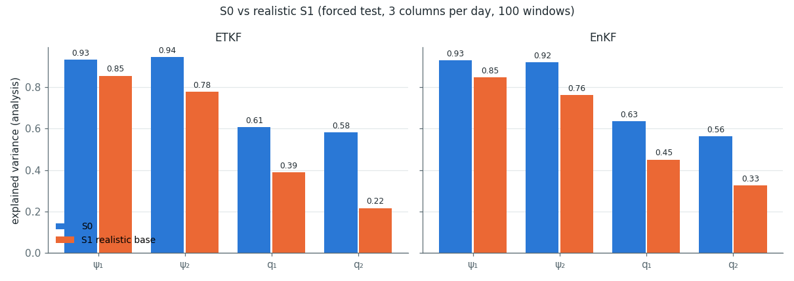

## 4. Configuration synthesis and S1 error budget

Both filters were tuned on val (`docs/results/qg_specwind_da2_val_tuning.md`): vertical localization (cross-layer weight 1, so the unobserved layer is updated) and the bred initial ensemble are the two gains; with both, a much weaker localization is optimal.

| method | tuned configuration (val, DA-2) | S0 ψ₁ / q₁ | S0 score | S1 ψ₁ / q₁ | S1 score |
|---|---|---|---|---|---|
| ETKF | N = 80, inflation 1.0, **exact localized EnSRF update, radius 8, ridge 0.1**, cross-layer weight 1, bred init | 0.937 / 0.647 | 0.774 | 0.848 / 0.433 | 0.579 |
| EnKF | N = 80, inflation 1.0, **radius 6**, cross-layer weight 1, bred init | 0.929 / 0.635 | 0.761 | 0.847 / 0.450 | 0.596 |

**S1 error budget** — Shapley share of the S0 → S1 EV loss per error group (ETKF, val, 20 windows, all 32 on/off combinations; largest share in bold):

| metric (S0 → S1) | forcing | rd | drag | obs | res | interaction |
|---|---|---|---|---|---|---|
| score (0.764 → 0.580) | 9% | 18% | 16% | **31%** | 25% | -0.000 |
| ψ₁ (0.939 → 0.862) | 11% | 13% | 10% | **40%** | 26% | +0.004 |
| ψ₂ (0.950 → 0.838) | 18% | 7% | 24% | **27%** | 25% | +0.011 |
| q₁ (0.615 → 0.389) | 6% | 19% | 4% | **46%** | 26% | -0.026 |
| q₂ (0.552 → 0.229) | 7% | 23% | 24% | 21% | **25%** | +0.009 |

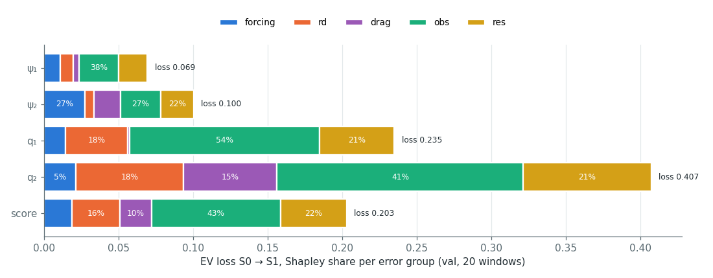

## 5. Observation density (S0, forced, ETKF)

| columns per day | ψ₁ | ψ₂ | q₁ | q₂ | score |
|---|---|---|---|---|---|
| 1 (1.6% of columns) | 0.863 | 0.877 | 0.459 | 0.474 | 0.668 |
| 2 (3.1% of columns) | 0.910 | 0.912 | 0.572 | 0.541 | 0.734 |
| 3 (4.7% of columns) | 0.937 | 0.933 | 0.647 | 0.578 | 0.774 |
| 4 (6.2% of columns) | *0.950* | *0.943* | *0.695* | *0.589* | *0.794* |
| 6 (9.4% of columns) | **0.966** | **0.954** | **0.757** | **0.592** | **0.817** |

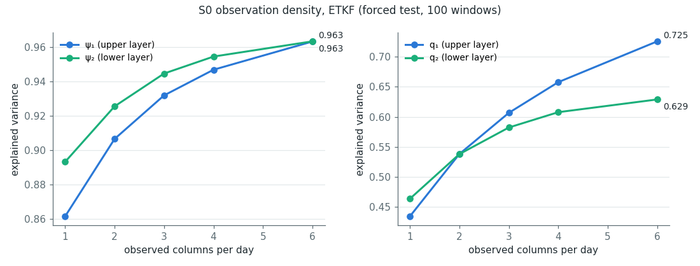

**Bridge density (4 columns per day), both datasets:**

*forced*

| method | ψ₁ | ψ₂ | q₁ | q₂ | score | score 95% CI |
|---|---|---|---|---|---|---|
| _free forecast_ | 0.759 | 0.848 | -0.057 | 0.043 | 0.398 |  |
| ETKF (radius 8) | **0.950** | **0.943** | **0.695** | **0.589** | **0.794** | [0.783, 0.805] |
| EnKF (radius 6) | *0.945* | *0.932* | *0.688* | *0.580* | *0.786* | [0.775, 0.798] |

*coupled*

| method | ψ₁ | ψ₂ | q₁ | q₂ | score | score 95% CI |
|---|---|---|---|---|---|---|
| _free forecast_ | 0.745 | 0.838 | -0.044 | 0.068 | 0.402 |  |
| ETKF (radius 8) | **0.951** | **0.945** | **0.702** | **0.610** | **0.802** | [0.791, 0.813] |
| EnKF (radius 6) | *0.945* | *0.933* | *0.695* | *0.598* | *0.793* | [0.782, 0.804] |

## 6. Forced vs coupled

Independent samples (paired windows share seeds but not trajectories), two-sample bootstrap.

**S0**

| method | field | forced | coupled | forced − coupled [95% CI] |
|---|---|---|---|---|
| ETKF | ψ₁ | 0.937 | 0.936 | +0.001 [-0.011, +0.013] |
| ETKF | ψ₂ | 0.933 | 0.933 | -0.001 [-0.018, +0.017] |
| ETKF | q₁ | 0.647 | 0.651 | -0.004 [-0.033, +0.025] |
| ETKF | q₂ | 0.578 | 0.595 | -0.016 [-0.058, +0.024] |
| ETKF | score | 0.774 | 0.779 | -0.005 [-0.022, +0.012] |
| EnKF | ψ₁ | 0.929 | 0.929 | +0.000 [-0.013, +0.013] |
| EnKF | ψ₂ | 0.918 | 0.919 | -0.002 [-0.024, +0.020] |
| EnKF | q₁ | 0.635 | 0.643 | -0.009 [-0.039, +0.023] |
| EnKF | q₂ | 0.562 | 0.580 | -0.019 [-0.060, +0.022] |
| EnKF | score | 0.761 | 0.768 | -0.007 [-0.025, +0.010] |
| EnKS (ETKF smoother) | ψ₁ | 0.961 | 0.962 | -0.001 [-0.008, +0.007] |
| EnKS (ETKF smoother) | ψ₂ | 0.948 | 0.951 | -0.003 [-0.018, +0.012] |
| EnKS (ETKF smoother) | q₁ | 0.717 | 0.726 | -0.010 [-0.035, +0.016] |
| EnKS (ETKF smoother) | q₂ | 0.588 | 0.611 | -0.022 [-0.064, +0.018] |
| EnKS (ETKF smoother) | score | 0.804 | 0.813 | -0.009 [-0.024, +0.006] |

**S1 (realistic base)**

| method | field | forced | coupled | forced − coupled [95% CI] |
|---|---|---|---|---|
| ETKF | ψ₁ | 0.848 | 0.848 | +0.000 [-0.027, +0.028] |
| ETKF | ψ₂ | 0.757 | 0.766 | -0.009 [-0.089, +0.071] |
| ETKF | q₁ | 0.433 | 0.437 | -0.004 [-0.031, +0.024] |
| ETKF | q₂ | 0.277 | 0.295 | -0.017 [-0.056, +0.020] |
| ETKF | score | 0.579 | 0.586 | -0.008 [-0.034, +0.019] |
| EnKF | ψ₁ | 0.847 | 0.847 | +0.000 [-0.026, +0.028] |
| EnKF | ψ₂ | 0.762 | 0.771 | -0.009 [-0.081, +0.063] |
| EnKF | q₁ | 0.450 | 0.454 | -0.004 [-0.030, +0.023] |
| EnKF | q₂ | 0.326 | 0.343 | -0.017 [-0.052, +0.017] |
| EnKF | score | 0.596 | 0.604 | -0.007 [-0.033, +0.018] |
| EnKS (ETKF smoother) | ψ₁ | 0.872 | 0.872 | -0.000 [-0.025, +0.024] |
| EnKS (ETKF smoother) | ψ₂ | 0.741 | 0.746 | -0.005 [-0.105, +0.096] |
| EnKS (ETKF smoother) | q₁ | 0.504 | 0.512 | -0.008 [-0.036, +0.020] |
| EnKS (ETKF smoother) | q₂ | 0.290 | 0.311 | -0.021 [-0.059, +0.016] |
| EnKS (ETKF smoother) | score | 0.602 | 0.610 | -0.009 [-0.037, +0.020] |

## 7. Factor strata (forced, ETKF, 3 columns per day)

**S0**

| stratum | n | ψ₁ DA (free) | ψ₂ DA (free) | q₁ DA (free) | q₂ DA (free) |
|---|---|---|---|---|---|
| calm (level 0) | 21 | 0.894 (0.722) | 0.832 (0.776) | 0.745 (0.313) | 0.691 (0.347) |
| windy | 79 | 0.948 (0.769) | 0.960 (0.867) | 0.621 (-0.155) | 0.548 (-0.038) |
| windy, level tercile 1 | 27 | 0.925 (0.749) | 0.929 (0.857) | 0.709 (0.147) | 0.667 (0.239) |
| windy, level tercile 2 | 26 | 0.954 (0.761) | 0.972 (0.870) | 0.582 (-0.295) | 0.511 (-0.140) |
| windy, level tercile 3 | 26 | 0.967 (0.798) | 0.978 (0.875) | 0.567 (-0.327) | 0.462 (-0.225) |
| time unit tercile 1 (fast) | 34 | 0.932 (0.726) | 0.939 (0.830) | 0.626 (-0.131) | 0.558 (-0.023) |
| time unit tercile 2 | 33 | 0.936 (0.755) | 0.933 (0.845) | 0.651 (-0.045) | 0.583 (0.054) |
| time unit tercile 3 (slow) | 33 | 0.943 (0.797) | 0.926 (0.869) | 0.664 (0.009) | 0.593 (0.098) |
| regime 0 or 15 | 39 | 0.943 (0.781) | 0.943 (0.872) | 0.641 (-0.091) | 0.570 (-0.000) |
| other regimes | 61 | 0.933 (0.745) | 0.926 (0.833) | 0.650 (-0.035) | 0.583 (0.070) |

**S1 (realistic base)**

| stratum | n | ψ₁ DA (free) | ψ₂ DA (free) | q₁ DA (free) | q₂ DA (free) |
|---|---|---|---|---|---|
| calm (level 0) | 21 | 0.720 (-0.669) | 0.345 (-4.638) | 0.500 (-0.212) | 0.298 (-0.389) |
| windy | 79 | 0.883 (0.339) | 0.866 (0.051) | 0.415 (-0.265) | 0.272 (-0.357) |
| windy, level tercile 1 | 27 | 0.807 (-0.077) | 0.724 (-1.014) | 0.474 (-0.238) | 0.312 (-0.352) |
| windy, level tercile 2 | 26 | 0.909 (0.505) | 0.933 (0.569) | 0.383 (-0.301) | 0.247 (-0.379) |
| windy, level tercile 3 | 26 | 0.934 (0.604) | 0.947 (0.639) | 0.386 (-0.257) | 0.254 (-0.339) |
| time unit tercile 1 (fast) | 34 | 0.856 (0.150) | 0.826 (-0.437) | 0.430 (-0.308) | 0.288 (-0.409) |
| time unit tercile 2 | 33 | 0.851 (0.254) | 0.794 (-0.105) | 0.432 (-0.244) | 0.275 (-0.358) |
| time unit tercile 3 (slow) | 33 | 0.838 (-0.024) | 0.648 (-2.274) | 0.437 (-0.208) | 0.268 (-0.321) |
| regime 0 or 15 | 39 | 0.867 (0.251) | 0.816 (-0.453) | 0.434 (-0.275) | 0.290 (-0.401) |
| other regimes | 61 | 0.837 (0.048) | 0.719 (-1.241) | 0.432 (-0.241) | 0.269 (-0.339) |

## 8. Reconstruction examples

3 forced test windows (best / median / worst by the ETKF's S0 per-window score), re-run with the same settings: truth | free forecast | ETKF | EnKF for ψ and q in both layers at day 27 (whole-window EV in each panel), and the ETKF DA cycle (observed columns, true and DA-model wind-stress curl, truth / analysis; one frame per day).

### S0

**Best window**

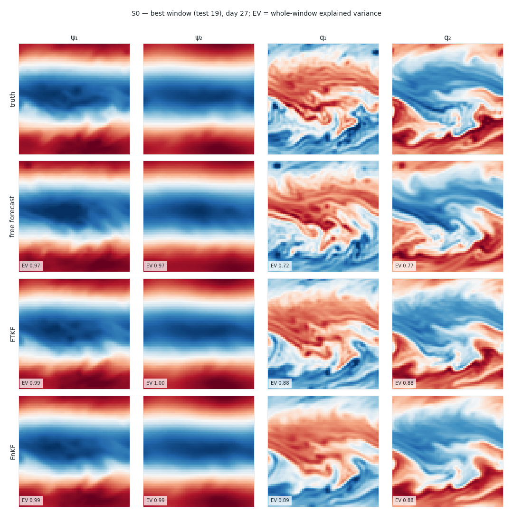

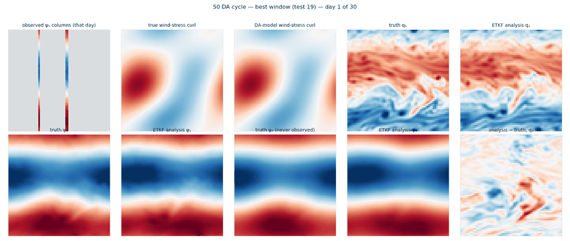

**Median window**

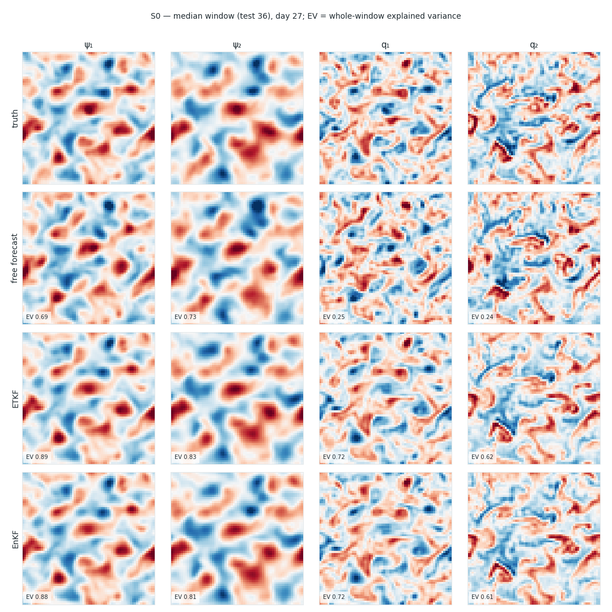

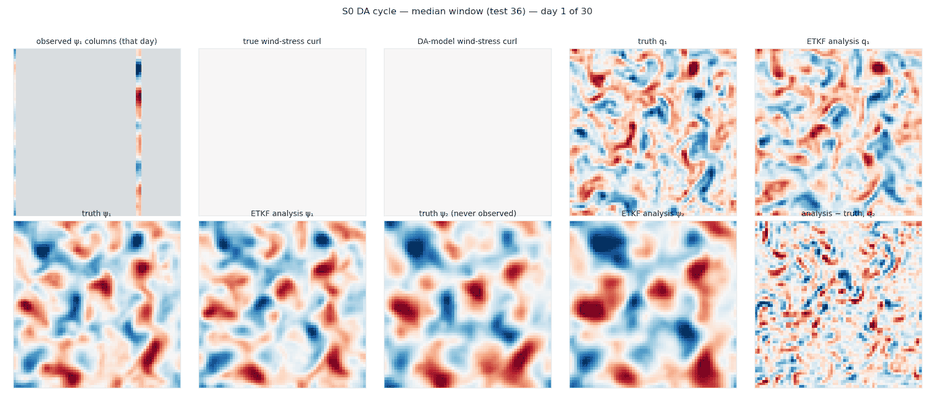

**Worst window**

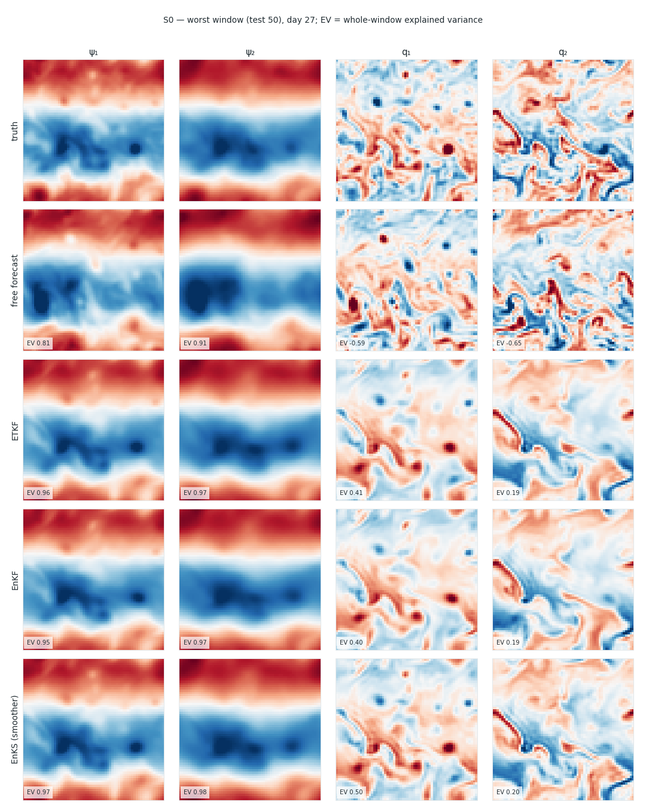

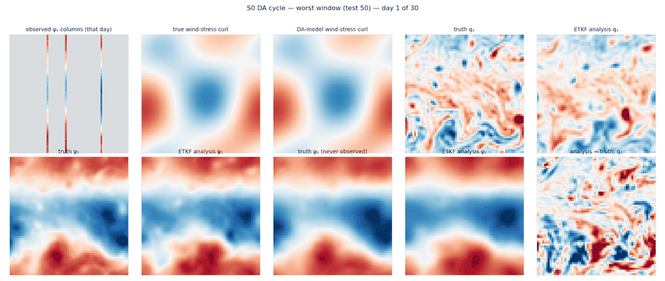

### S1 (realistic base)

**Best window**

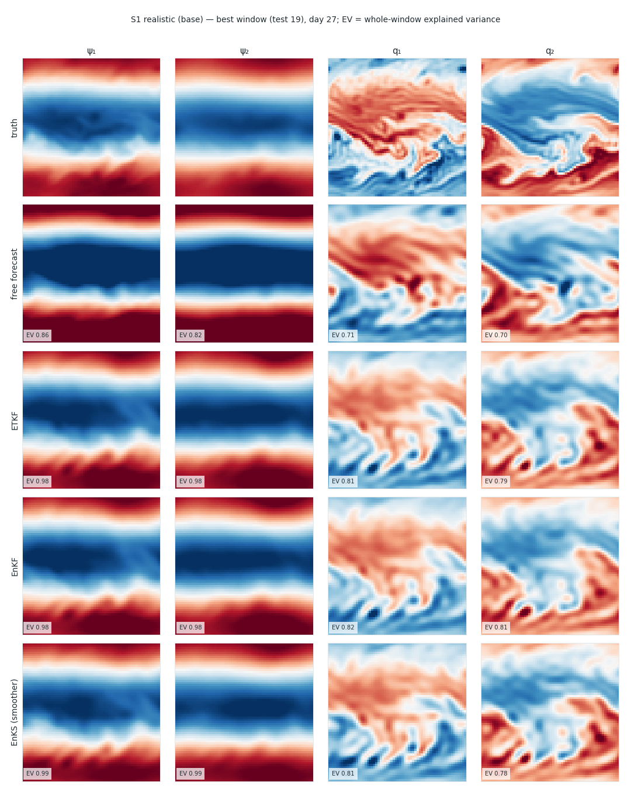

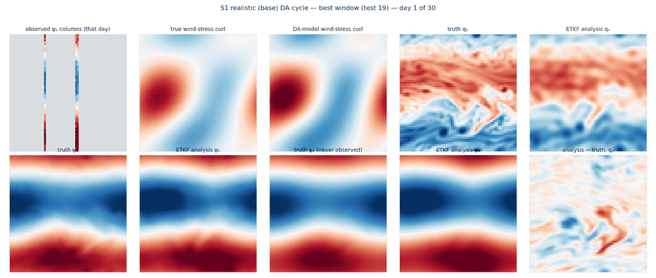

**Median window**

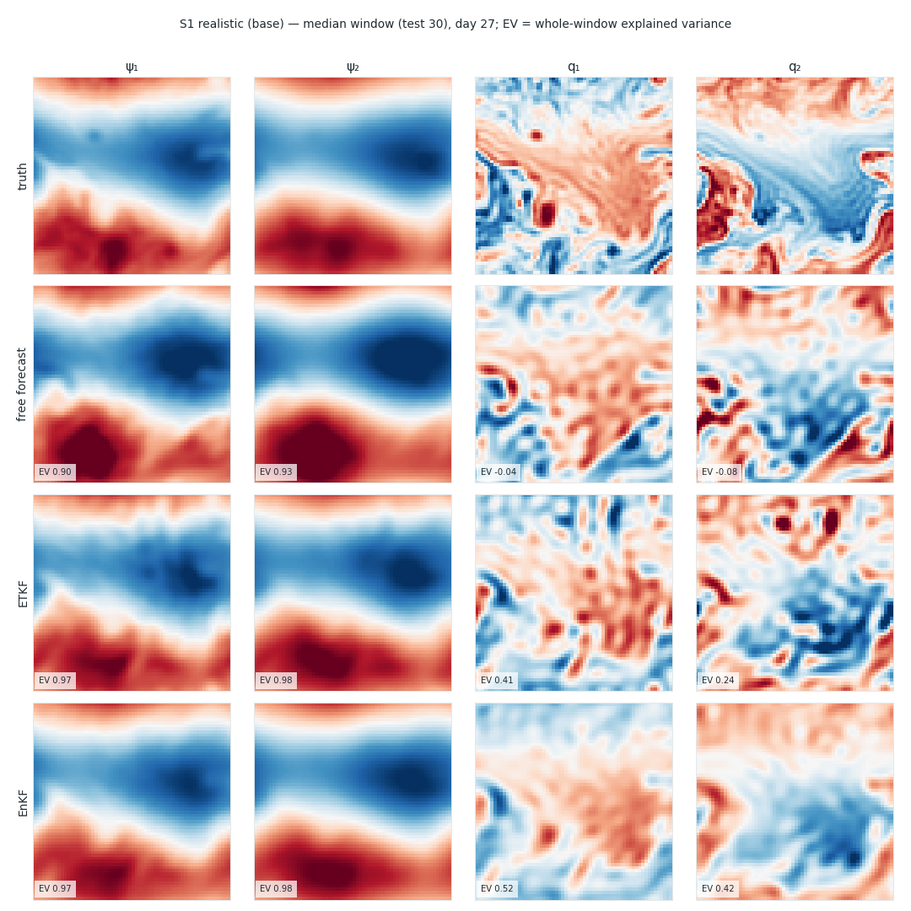

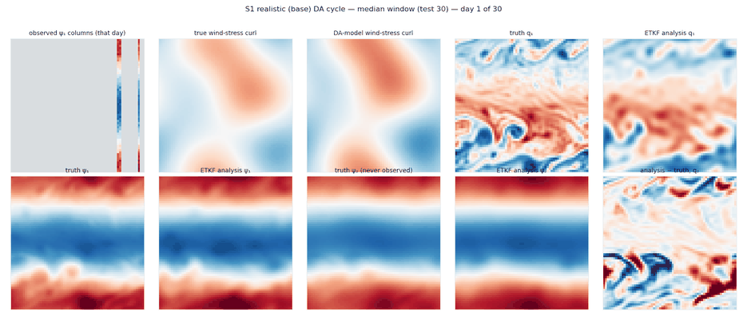

**Worst window**

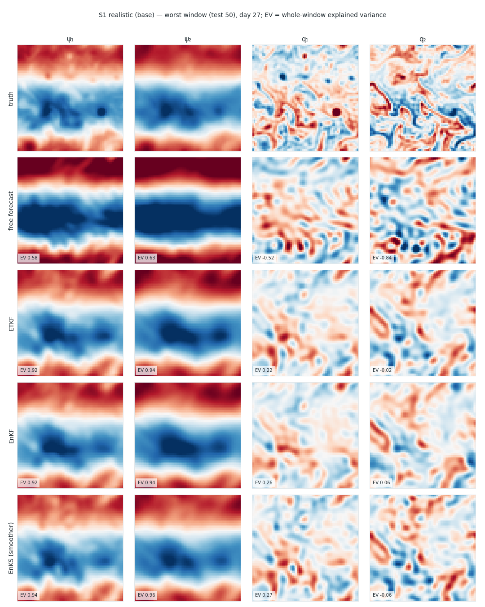

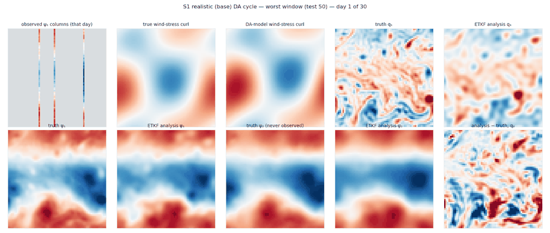

## 9. Caveats

- 100 test windows per cell; strata have 21–79 windows.
- S1 uses the S0-tuned filters; the ETKF–EnKF ranking under S1 may change with S1-specific tuning (inflation, R, radius).
- The initial state is the lagged truth in both scenarios (optimistic against an analysis-cycled first guess).
- Only S0 has the density curve; S1 was run at 3 columns per day.

